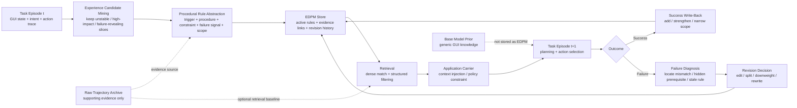

# Stage 3 Method Figure Draft

> **Status**: Draft v0.1
> **Role**: EDPM 方法图与一页说明稿
> **Parent Brief**: [method-brief.md](/Users/mac/studyspace/Knowledge-Markdown/Cross_Topic/stage3/design/method-brief.md)
> **Schema Spec**: [memory-unit-schema.md](/Users/mac/studyspace/Knowledge-Markdown/Cross_Topic/stage3/design/memory-unit-schema.md)
> **Experiment Spec**: [experiment-protocol.md](/Users/mac/studyspace/Knowledge-Markdown/Cross_Topic/stage3/design/experiment-protocol.md)

---

## 1. Figure

---

## 2. Figure Caption Draft

> **Figure X. EDPM overview.** After each task episode, the agent mines only high-value experience slices rather than storing the whole trajectory. These slices are abstracted into `experience-delta procedural memory` rules that encode trigger context, recommended procedure, constraints, failure signals, and scope. At the next episode, retrieval is separated from application: relevant rules are first matched through dense and structured filtering, then applied through either prompt-level context injection or a stronger policy constraint carrier. Crucially, task outcome does not merely affect the current run. Success can strengthen or narrow a rule, while failure triggers diagnosis and explicit memory revision through `edit`, `split`, `downweight`, or `rewrite`. This turns memory from a success-case cache into a revisable cross-task experience layer.

---

## 3. Block-by-Block Intent

### 3.1 Experience Candidate Mining

这个模块的作用是避免“什么都存”。只有以下片段应该进入 abstraction：

- base model 首次不稳定但后来被纠正的局部步骤
- 对任务 outcome 有决定性影响的分叉步骤
- 暴露 hidden prerequisite 的失败片段
- 在多个任务里反复出现的 interaction motif

### 3.2 Procedural Rule Abstraction

这里把轨迹切片压成 `EDPM unit`，而不是 workflow cache。

关键区别：

- 不是 `A -> B -> C` 的任务回放
- 而是 “什么条件下，该优先采用什么局部策略；什么信号说明它失效”

### 3.3 Retrieval and Application Separation

图里刻意把 `Retrieval` 和 `Application Carrier` 分开画，是为了强调这不是一个单一 prompt 技巧。

- `Retrieval` 负责找对经验
- `Application` 负责让经验真正影响决策

这也是后续 `C4` vs `C5` 实验的理论基础。

### 3.4 Failure-Driven Write-Back

这是整张图最关键的地方。没有这条回路，系统最多只是 success-only memory。

写回不是单一操作，而是一个 decision point：

- `edit`
- `split`
- `downweight`
- `rewrite`

这四类操作共同决定 memory 是否真的会“学”。

---

## 4. Why This Figure Is Not Just Workflow Memory

这张图需要主动防御一个最强质疑：看起来是否只是 “AWM/MAGNET + 一个更新箭头”。

不是。区别在三个地方：

- **unit 粒度不同**: 当前对象是 local procedural rule，不是 whole-workflow template
- **failure signal 被显式建模**: 失败不是被丢弃，也不是只做 rerun
- **retrieval 和 application 分离**: memory 不是只做相似性检索后丢进上下文

---

## 5. Slide / Paper Use Notes

如果用于 paper figure，建议保留：

- 主流程图
- `Base Model Prior` 虚线旁注
- `Raw Trajectory Archive` 虚线旁注
- `edit / split / downweight / rewrite` 作为 revision legend

如果用于组会或 proposal slide，建议额外口头强调：

- EDPM 不存 generic prior
- EDPM 不等于 trajectory cache
- Stage 3 只先做 offline post-task write-back

---

## 6. Immediate Companion Deliverables

- [memory-unit-schema.md](/Users/mac/studyspace/Knowledge-Markdown/Cross_Topic/stage3/design/memory-unit-schema.md)
- [experiment-protocol.md](/Users/mac/studyspace/Knowledge-Markdown/Cross_Topic/stage3/design/experiment-protocol.md)
- [webarena-task-split.md](/Users/mac/studyspace/Knowledge-Markdown/Cross_Topic/stage3/benchmark/webarena-task-split.md)
