# Grounding DINO

## Abstract

In this paper, the authors develop an open-set object detector, called Grounding DINO, by marrying the Transformer-based detector DINO with grounded pre-training, so that the model can detect arbitrary objects from human inputs such as category names or referring expressions.

The core idea is to introduce language into a closed-set detector for open-set concept generalization. To tightly fuse language and vision modalities, the paper conceptually divides a closed-set detector into three phases and proposes a corresponding fusion design: a feature enhancer, a language-guided query selection module, and a cross-modality decoder.

Grounding DINO is pre-trained on large-scale datasets, including object-detection data, grounding data, and caption data, and is evaluated on both open-set object detection and referring object detection benchmarks. The paper reports strong results on COCO, LVIS, ODinW, and RefCOCO/+/g, including `52.5` AP on the COCO zero-shot benchmark and a new zero-shot record of `26.1` mean AP on ODinW.

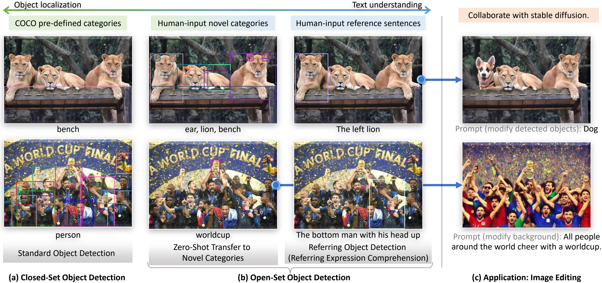
**Figure 1.** `(a)` A good open-world object detector should work well in all three settings: closed-set object detection, open-set object detection, and visual grounding. `(b)` Grounding DINO can be combined with Stable Diffusion [@rombach2021highresolution] for image editing.

## Introduction

A key indicator of an artificial general intelligence system's capability is its proficiency in handling open-world scenarios. This paper studies open-set object detection, where the goal is to detect arbitrary objects specified by human language inputs. The task has broad practical value because it can serve as a generic detector and can cooperate with generative models for editing and understanding, as illustrated in Figure 1.

Grounding DINO is built around two principles: tight modality fusion based on DINO [@zhang2022dino], and large-scale grounded pre-training for concept generalization.

**Tight modality fusion based on DINO.** The key to open-set detection is to introduce language for unseen-object generalization [@li2021grounded; @peterAnderson2017BottomUpAT; @JiajunDeng2021TransVGEV]. Most previous open-set detectors extend closed-set detectors with language information, but often fuse multimodal information only in part of the pipeline. Grounding DINO instead argues for tighter fusion through the neck, query initialization, and head phases.

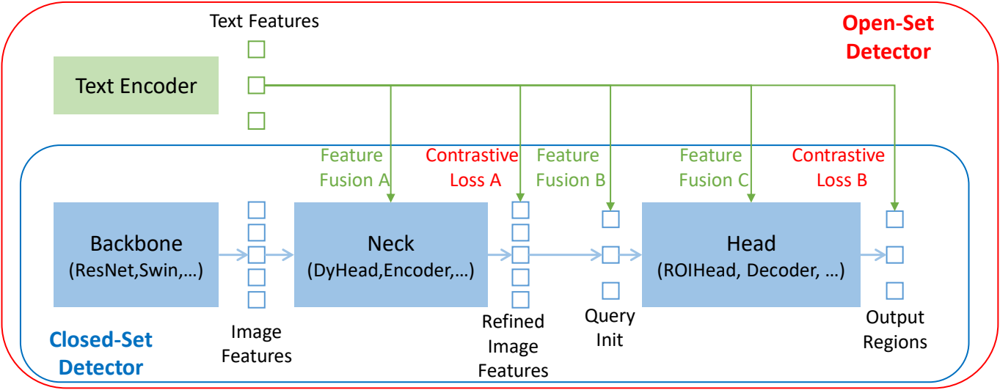
**Figure 2.** Extending closed-set detectors to open-set scenarios.

The paper summarizes object detectors into three phases and argues that feature fusion can be performed in the neck `(phase A)`, query initialization `(phase B)`, and head `(phase C)`. For example, GLIP [@li2021grounded] performs early fusion in the neck, while OV-DETR [@YuhangZang2022OpenVocabularyDW] uses language-aware queries as decoder inputs. Grounding DINO introduces fusion in all three phases by stacking self-attention, text-to-image cross-attention, and image-to-text cross-attention in a feature enhancer; by using language-guided query selection for decoder initialization; and by adding text cross-attention in the cross-modality decoder.

**Large-scale grounded pre-training for zero-shot transfer.** Most existing open-set models [@WeichengKuo2022FindItGL; @XiuyeGu2021OpenvocabularyOD] rely on CLIP-like pre-training for concept generalization. In contrast, Grounding DINO adopts and refines grounded training. A key refinement is the use of sub-sentence-level text features, which block attention among unrelated category names while preserving per-word features for fine-grained understanding.

The paper evaluates Grounding DINO on three settings: closed-set detection, open-set detection, and referring object detection. Across these settings, Grounding DINO reaches `52.5` AP on COCO minival without COCO training data and establishes a new state of the art on ODinW zero-shot with `26.1` mean AP.

<a id="table:related_work"></a>
**Table 1.** A comparison of previous open-set object detectors. The summary follows the settings reported in the original papers and uses the term `partial label` for settings where models are trained on partial data and evaluated on additional categories [@zareian2021open].

| Model | Base detector | Fusion phase | CLIP | Text prompt level | Closed-set COCO | Zero-shot COCO | Zero-shot LVIS | Zero-shot ODinW | Referring detection |
| --- | --- | --- | --- | --- | --- | --- | --- | --- | --- |
| ViLD [@XiuyeGu2021OpenvocabularyOD] | Mask R-CNN | - | ✓ | sentence | ✓ | partial label | partial label | - | - |
| RegionCLIP [@YiwuZhong2022RegionCLIPRL] | Faster R-CNN | - | ✓ | sentence | ✓ | partial label | partial label | - | - |
| FindIt [@WeichengKuo2022FindItGL] | Faster R-CNN | A | - | sentence | ✓ | partial label | - | - | fine-tune |
| MDETR [@kamath2021mdetr] | DETR | A,C | - | word | - | - | fine-tune | zero-shot | fine-tune |
| DQ-DETR [@dqdetr] | DETR | A,C | - | word | ✓ | - | zero-shot | - | fine-tune |
| GLIP [@li2021grounded] | DyHead | A | - | word | ✓ | zero-shot | zero-shot | zero-shot | - |
| GLIPv2 [@zhang2022glipv2] | DyHead | A | - | word | ✓ | zero-shot | zero-shot | zero-shot | - |
| OV-DETR [@YuhangZang2022OpenVocabularyDW] | Deformable DETR | B | ✓ | sentence | ✓ | partial label | partial label | - | - |
| OWL-ViT [@MatthiasMinderer2022SimpleOO] | - | - | ✓ | sentence | ✓ | partial label | partial label | zero-shot | - |
| DetCLIP [@LeweiYao2022DetCLIPDV] | ATSS | - | ✓ | sentence | - | - | zero-shot | zero-shot | - |
| OmDet [@TianchengZhao2022OmDetLO] | Sparse R-CNN | C | ✓ | sentence | ✓ | - | - | zero-shot | - |
| Grounding DINO (ours) | DINO | A,B,C | - | sub-sentence | ✓ | zero-shot | zero-shot | zero-shot | zero-shot |

## Related Work

Grounding DINO is built on DINO, a DETR-like model that pushes end-to-end Transformer-based detection further than earlier DETR variants [@carion2020end; @zhu2020deformable; @meng2021conditional; @gao2021fast; @dai2021dynamic; @anchordetr; @HDETR; @groupdetr]. The paper positions Grounding DINO as an open-set extension of this line, while comparing against open-set methods such as OV-DETR, ViLD, GLIP, DetCLIP, and OWL-ViT.

## Grounding DINO
<a id="sec:groundingdino"></a>

Grounding DINO outputs multiple pairs of object boxes and noun phrases for a given `(Image, Text)` pair. For example, as shown in Figure 3, the model locates a cat and a table from the input image and extracts the words `cat` and `table` from the input text as corresponding labels. Both object detection and REC tasks can be aligned with this pipeline. Following GLIP [@li2021grounded], all category names are concatenated as input text for object-detection tasks, while REC uses the highest-scoring predicted object for each input text.

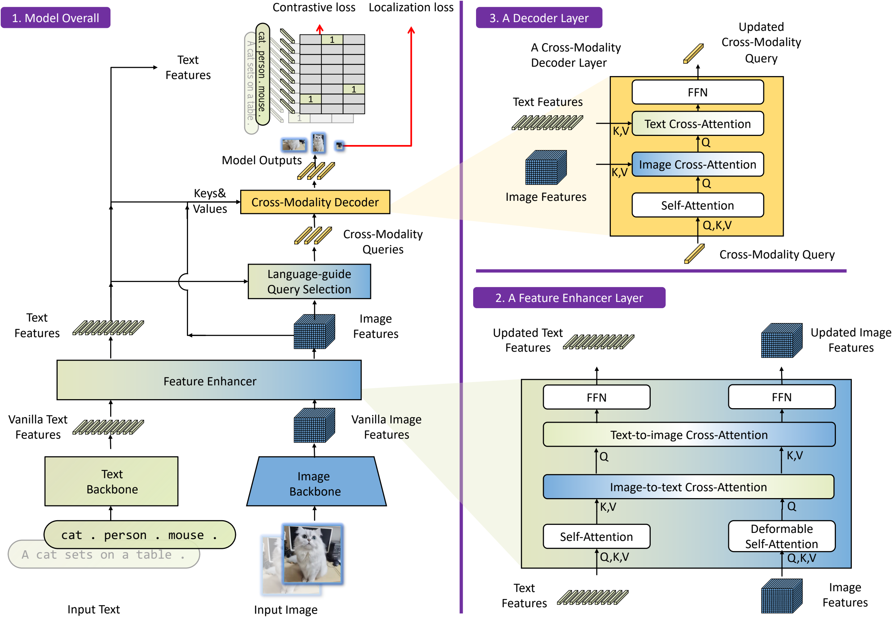
**Figure 3.** The framework of Grounding DINO. The overall framework, feature enhancer layer, and decoder layer are shown in blocks 1, 2, and 3, respectively.

Grounding DINO is a dual-encoder-single-decoder architecture. It contains an image backbone for image feature extraction, a text backbone for text feature extraction, a feature enhancer for image-text feature fusion, a language-guided query selection module for query initialization, and a cross-modality decoder for box refinement. For each `(Image, Text)` pair, the model first extracts vanilla image and text features, fuses them with the feature enhancer, selects cross-modality queries from image features, and then updates these queries through the decoder. The final decoder queries are used to predict object boxes and extract corresponding phrases.

### Feature Extraction and Enhancer
<a id="sec:feature_enhance"></a>

Given an `(Image, Text)` pair, Grounding DINO extracts multi-scale image features with an image backbone such as Swin Transformer [@liu2021swin] and text features with a text backbone such as BERT [@devlin2018bert]. After extracting vanilla image and text features, the model feeds them into a feature enhancer for cross-modality fusion. The enhancer uses Deformable self-attention for image features and vanilla self-attention for text features, together with image-to-text and text-to-image cross-attention modules. As illustrated by block 2 of Figure 3, these modules align features from different modalities.

### Language-Guided Query Selection
<a id="sec:query_selection"></a>

Grounding DINO uses the input text to guide query selection for the decoder. Let the image feature be $\mathbf{X}_I \in \mathbb{R}^{N_I \times d}$ and the text feature be $\mathbf{X}_T \in \mathbb{R}^{N_T \times d}$. Here, `d=256` in the experiments, `N_I` is usually larger than `10,000`, and `N_T` is usually smaller than `256`. The model selects `N_q=900` queries from the encoder image features according to:

$$
\mathbf{I}_{N_q} = \operatorname{Top}_{N_q}\left(\max_{-1}\left(\mathbf{X}_I \mathbf{X}_T^\top\right)\right).
$$

In this expression, `Top_{N_q}` picks the top `N_q` indices, while `max_{-1}` performs the max operation along the last dimension. The resulting indices are used to initialize the decoder queries. As in DINO [@zhang2022dino], each decoder query contains a content part and a positional part [@meng2021conditional], where the positional part is formulated as dynamic anchor boxes [@liu2022dabdetr].

**Algorithm 1.** Pseudocode of language-guided query selection in PyTorch-like style.

```python
"""
Input:
image_feat: (bs, num_img_tokens, ndim)
text_feat: (bs, num_text_tokens, ndim)
num_query: int

Output:
topk_idx: (bs, num_query)
"""
logits = torch.einsum("bic,btc->bit", image_feat, text_feat)

# bs, num_img_tokens, num_text_tokens
logits_per_img_feat = logits.max(-1)[0]

# bs, num_img_tokens
topk_idx = torch.topk(logits_per_img_feat, num_query, dim=1)[1]
```

### Cross-Modality Decoder
<a id="sec:cross_modal_decoder"></a>

The cross-modality decoder combines image and text features, as shown in block 3 of Figure 3. Each cross-modality query passes through self-attention, image cross-attention, text cross-attention, and FFN layers. Compared with the DINO decoder, each layer adds one extra text cross-attention layer so that the queries can absorb text information more effectively.

### Sub-Sentence Level Text Feature
<a id="sec:sub_sentence"></a>

The paper contrasts sentence-level and word-level text representations and introduces a sub-sentence representation to avoid unwanted interactions among unrelated category names.

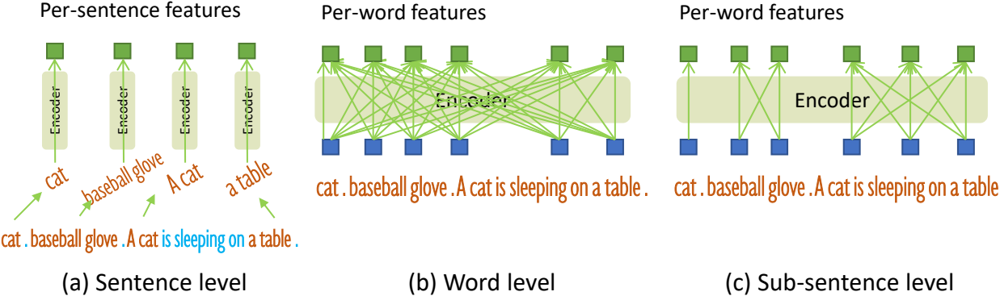
**Figure 4.** Comparisons of text representations.

Sentence-level representation [@LeweiYao2022DetCLIPDV; @MatthiasMinderer2022SimpleOO] encodes a whole sentence into one feature, while word-level representation [@gao2021clip; @kamath2021mdetr] allows a single forward pass over multiple category names but introduces unnecessary dependencies among categories. The proposed sub-sentence representation blocks attention among unrelated category names while preserving per-word features for fine-grained understanding.

### Loss Function

Following previous DETR-like works [@carion2020end; @zhu2020deformable; @meng2021conditional; @liu2022dabdetr; @li2022dn; @zhang2022dino], Grounding DINO uses L1 loss and GIoU loss [@rezatofighi2019generalized] for bounding-box regression, and a contrastive classification loss between predicted objects and language tokens following GLIP [@li2021grounded]. Box-regression and classification costs are first used for bipartite matching, and the final losses are then computed on matched predictions. Auxiliary losses are also added after each decoder layer and after encoder outputs.

## Experiments

### Implementation Details

The paper trains two model variants: Grounding DINO T with a Swin-T backbone [@liu2021swin], and Grounding DINO L with a Swin-L backbone [@liu2021swin]. BERT-base [@devlin2018bert] from Hugging Face [@wolf2019huggingface] is used as the default text encoder. By default, the model uses `900` queries, six feature-enhancer layers, six decoder layers, and a maximum text length of `256` tokens.

Grounding DINO T is trained on 16 Nvidia V100 GPUs with a total batch size of 32. Grounding DINO L is trained on 64 Nvidia A100 GPUs with a total batch size of 64.

### Zero-Shot Transfer of Grounding DINO
<a id="sec:open-set"></a>

The paper evaluates Grounding DINO under three downstream settings: COCO, LVIS, and ODinW.

<a id="table:cocomain"></a>
**Table 2.** Zero-shot domain transfer and fine-tuning on COCO. `*` indicates results trained with `1.5×` image sizes. `†` marks models that map a subset of O365 categories to COCO for zero-shot evaluation. `‡` marks a non-real zero-shot setting because COCO data is included during training.

| Model | Backbone | Pre-training data | Zero-shot 2017val | Fine-tuning 2017val / test-dev |
| --- | --- | --- | ---: | ---: |
| Faster R-CNN | RN50-FPN | - | - | 40.2 / - |
| Faster R-CNN | RN101-FPN | - | - | 42.0 / - |
| DyHead-T [@dai2021dynamic] | Swin-T | - | - | 49.7 / - |
| DyHead-L [@dai2021dynamic] | Swin-L | - | - | 58.4 / 58.7 |
| DyHead-L [@dai2021dynamic] | Swin-L | O365, ImageNet21K | - | 60.3 / 60.6 |
| SoftTeacher [@xu2021end] | Swin-L | O365, SS-COCO | - | 60.7 / 61.3 |
| DINO (Swin-L) [@zhang2022dino] | Swin-L | O365 | - | 62.5 / - |
| DyHead-T† [@dai2021dynamic] | Swin-T | O365 | 43.6 | 53.3 / - |
| GLIP-T (B) [@li2021grounded] | Swin-T | O365 | 44.9 | 53.8 / - |
| GLIP-T (C) [@li2021grounded] | Swin-T | O365, GoldG | 46.7 | 55.1 / - |
| GLIP-L [@li2021grounded] | Swin-L | FourODs, GoldG, Cap24M | 49.8 | 60.8 / 61.0 |
| DINO (Swin-T)† [@zhang2022dino] | Swin-T | O365 | 46.2 | 56.9 / - |
| Grounding DINO T (ours) | Swin-T | O365 | 46.7 | 56.9 / - |
| Grounding DINO T (ours) | Swin-T | O365, GoldG | 48.1 | 57.1 / - |
| Grounding DINO T (ours) | Swin-T | O365, GoldG, Cap4M | 48.4 | 57.2 / - |
| Grounding DINO L (ours) | Swin-L | O365, OI, GoldG | **52.5** | **62.6** / **62.7** (`63.0` / `63.0`)* |
| Grounding DINO L (ours)‡ | Swin-L | O365, OI, GoldG, Cap4M, COCO, RefC | **60.7** | **62.6** / - |

Grounding DINO outperforms previous open-set models on the COCO zero-shot transfer setting and remains competitive under COCO fine-tuning. With stronger backbones and larger data, Grounding DINO L reaches `52.5` AP without COCO training images and `62.6` AP on COCO minival after fine-tuning.

<a id="table:zslvis"></a>
**Table 3.** Model results on LVIS.

| Model | Backbone | Pre-training data | MiniVal AP | APr / APc / APf |
| --- | --- | --- | ---: | ---: |
| GLIP-T (C) | Swin-T | O365, GoldG | 24.9 | 17.7 / 19.5 / 31.0 |
| GLIP-T | Swin-T | O365, GoldG, Cap4M | 26.0 | 20.8 / 21.4 / 31.0 |
| DetCLIPv2 | Swin-T | O365, GoldG, CC15M | 40.4 | 36.0 / 41.7 / 40.0 |
| Grounding DINO T | Swin-T | O365, GoldG | 25.6 | 14.4 / 19.6 / 32.2 |
| Grounding DINO T | Swin-T | O365, GoldG, Cap4M | **27.4** | 18.1 / 23.3 / 32.7 |
| Grounding DINO L | Swin-L | O365, OI, GoldG, Cap4M, COCO, RefC | 33.9 | 22.2 / 30.7 / 38.8 |
| MDETR | RN101 | GoldG, RefC | 24.2 | 20.9 / 24.9 / 24.3 |
| DetCLIPv2 [@yao2023detclipv2] | Swin-T | O365, GoldG, CC15M | 50.7 | 44.3 / 52.4 / 50.3 |
| Grounding DINO T | Swin-T | O365, GoldG | **52.1** | 35.4 / 51.3 / 55.7 |

LVIS is used to stress-test long-tail zero-shot transfer. The paper notes two main phenomena: Grounding DINO scales more strongly than GLIP when more data is added, but rare categories remain difficult under DETR-like architectures.

<a id="tab:odinw"></a>
**Table 4.** Model results on the ODinW benchmark.

### Table 4A. Zero-shot ODinW

| Model | Language input | Backbone | Model size | Pre-training data | APavg | APmedian |
| --- | --- | --- | ---: | --- | ---: | ---: |
| MDETR [@kamath2021mdetr] | ✓ | ENB5 | 169M | GoldG, RefC | 10.7 | 3.0 |
| OWL-ViT [@MatthiasMinderer2022SimpleOO] | ✓ | ViT L/14 (CLIP) | >1243M | O365, VG | 18.8 | 9.8 |
| GLIP-T [@li2021grounded] | ✓ | Swin-T | 232M | O365, GoldG, Cap4M | 19.6 | 5.1 |
| OmDet [@TianchengZhao2022OmDetLO] | ✓ | ConvNeXt-B | 230M | COCO, O365, LVIS, PhraseCut | 19.7 | 10.8 |
| GLIPv2-T [@GLIPv2] | ✓ | Swin-T | 232M | O365, GoldG, Cap4M | 22.3 | 8.9 |
| DetCLIP [@LeweiYao2022DetCLIPDV] | ✓ | Swin-L | 267M | O365, GoldG, YFCC1M | 24.9 | 18.3 |
| Florence [@LuYuan2022FlorenceAN] | ✓ | CoSwinH | ~841M | FLD900M, O365, GoldG | 25.8 | 14.3 |
| Grounding DINO T (ours) | ✓ | Swin-T | 172M | O365, GoldG | 20.0 | 9.5 |
| Grounding DINO T (ours) | ✓ | Swin-T | 172M | O365, GoldG, Cap4M | 22.3 | **11.9** |
| Grounding DINO L (ours) | ✓ | Swin-L | 341M | O365, OI, GoldG, Cap4M, COCO, RefC | **26.1** | **18.4** |

### Table 4B. Few-shot and full-shot ODinW

| Setting | Model | Backbone | APavg | APmedian |
| --- | --- | --- | ---: | ---: |
| Few-shot | DyHead-T [@dai2021dynamic] | Swin-T | 37.5 | 36.7 |
| Few-shot | GLIP-T [@li2021grounded] | Swin-T | 38.9 | 33.7 |
| Few-shot | DINO-Swin-T [@zhang2022dino] | Swin-T | 41.2 | 41.1 |
| Few-shot | OmDet [@TianchengZhao2022OmDetLO] | ConvNeXt-B | 42.4 | 41.7 |
| Few-shot | Grounding DINO T (ours) | Swin-T | **46.4** | **51.1** |
| Full-shot | GLIP-T [@li2021grounded] | Swin-T | 62.6 | 62.1 |
| Full-shot | DyHead-T [@dai2021dynamic] | Swin-T | 63.2 | 64.9 |
| Full-shot | DINO-Swin-T [@zhang2022dino] | Swin-T | 66.7 | 68.5 |
| Full-shot | OmDet [@TianchengZhao2022OmDetLO] | ConvNeXt-B | 67.1 | 71.2 |
| Full-shot | DINO-Swin-L [@zhang2022dino] | Swin-L | 68.8 | 70.7 |
| Full-shot | Grounding DINO T (ours) | Swin-T | **70.7** | **76.2** |

Grounding DINO performs strongly on ODinW and shows particularly good median performance, indicating more consistent performance across diverse datasets.

### Referring Object Detection Settings
<a id="sec:visual_grounding"></a>

Grounding DINO is also evaluated on RefCOCO/+/g. Without RefCOCO training data, both GLIP and Grounding DINO perform poorly on REC, but injecting RefCOCO/+/g data produces a large performance jump.

<a id="table:refexp"></a>
**Table 5.** Top-1 accuracy comparison on the referring expression comprehension task.

### Table 5A. RefCOCO and RefCOCO+

| Method | Backbone | Pre-training data | Fine-tuning | RefCOCO val | testA | testB | RefCOCO+ val | testA | testB |
| --- | --- | --- | --- | ---: | ---: | ---: | ---: | ---: | ---: |
| MAttNet [@LichengYu2018MAttNetMA] | R101 | None | ✓ | 76.65 | 81.14 | 69.99 | 65.33 | 71.62 | 56.02 |
| VGTR [@YeDu2021VisualGW] | R101 | None | ✓ | 79.20 | 82.32 | 73.78 | 63.91 | 70.09 | 56.51 |
| TransVG [@JiajunDeng2021TransVGEV] | R101 | None | ✓ | 81.02 | 82.72 | 78.35 | 64.82 | 70.70 | 56.94 |
| VILLA_L [@ZheGan2020LargeScaleAT] | R101 | CC, SBU, COCO, VG | ✓ | 82.39 | 87.48 | 74.84 | 76.17 | 81.54 | 66.84 |
| RefTR [@MuchenLi2021ReferringTA] | R101 | VG | ✓ | 85.65 | 88.73 | 81.16 | 77.55 | 82.26 | 68.99 |
| MDETR [@kamath2021mdetr] | R101 | GoldG, RefC | ✓ | 86.75 | 89.58 | 81.41 | 79.52 | 84.09 | 70.62 |
| DQ-DETR [@dqdetr] | R101 | GoldG, RefC | ✓ | 88.63 | 91.04 | 83.51 | **81.66** | 86.15 | 73.21 |
| GLIP-T (B) | Swin-T | O365, GoldG | - | 49.96 | 54.69 | 43.06 | 49.01 | 53.44 | 43.42 |
| GLIP-T | Swin-T | O365, GoldG, Cap4M | - | 50.42 | 54.30 | 43.83 | 49.50 | 52.78 | 44.59 |
| Grounding DINO T (ours) | Swin-T | O365, GoldG | - | 50.41 | 57.24 | 43.21 | 51.40 | 57.59 | 45.81 |
| Grounding DINO T (ours) | Swin-T | O365, GoldG, RefC | - | 73.98 | 74.88 | 59.29 | 66.81 | 69.91 | 56.09 |
| Grounding DINO T (ours) | Swin-T | O365, GoldG, RefC | ✓ | 89.19 | 91.86 | 85.99 | 81.09 | 87.40 | 74.71 |
| Grounding DINO L (ours)* | Swin-L | O365, OI, GoldG, Cap4M, COCO, RefC | ✓ | **90.56** | **93.19** | **88.24** | **82.75** | **88.95** | **75.92** |

### Table 5B. RefCOCOg

| Method | RefCOCOg val | RefCOCOg test |
| --- | ---: | ---: |
| MAttNet [@LichengYu2018MAttNetMA] | 66.58 | 67.27 |
| VGTR [@YeDu2021VisualGW] | 65.73 | 67.23 |
| TransVG [@JiajunDeng2021TransVGEV] | 68.67 | 67.73 |
| VILLA_L [@ZheGan2020LargeScaleAT] | 76.18 | 76.71 |
| RefTR [@MuchenLi2021ReferringTA] | 79.25 | 80.01 |
| MDETR [@kamath2021mdetr] | 81.64 | 80.89 |
| DQ-DETR [@dqdetr] | 82.76 | 83.44 |
| GLIP-T (B) | 65.58 | 66.08 |
| GLIP-T | 66.09 | 66.89 |
| Grounding DINO T (ours) | 67.46 | 67.13 |
| Grounding DINO T (ours) w/ RefC | 71.06 | 72.07 |
| Grounding DINO T (ours) w/ RefC + fine-tuning | 84.15 | 84.94 |
| Grounding DINO L (ours)* | **86.13** | **87.02** |

`*` There might be a data leak because COCO includes validation images in RefC, although the annotations differ.

<a id="table:add_ref"></a>
**Table 6.** Impacts of RefC and COCO data for open-set settings. All models are trained with a Swin Transformer Tiny backbone.

| Model | Pre-train | COCO zero-shot | COCO fine-tune | LVIS zero-shot | ODinW zero-shot |
| --- | --- | ---: | ---: | ---: | ---: |
| Grounding DINO T | O365, GoldG | 48.1 | 57.1 | 25.6 | 20.0 |
| Grounding DINO T | O365, GoldG, RefC | 48.5 | 57.3 | 21.9 | 17.7 |
| Grounding DINO T | O365, GoldG, RefC, COCO | 56.1 | 57.5 | 22.3 | 17.4 |

### Ablations
<a id="sec:ablations"></a>

The paper verifies the contributions of encoder fusion, language-guided query selection, text cross-attention, and sub-sentence prompts by removing them one at a time.

<a id="table:ablation"></a>
**Table 7.** Ablations for the model design. All models are trained on O365 with a Swin-T backbone.

| ID | Model variant | COCO zero-shot | COCO fine-tune | LVIS zero-shot |
| --- | --- | ---: | ---: | ---: |
| 0 | Grounding DINO (full model) | 46.7 | 56.9 | 16.1 |
| 1 | w/o encoder fusion | 45.8 | 56.1 | 13.1 |
| 2 | static query selection | 46.3 | 56.6 | 13.6 |
| 3 | w/o text cross-attention | 46.1 | 56.3 | 14.3 |
| 4 | word-level text prompt | 46.4 | 56.6 | 15.6 |

The results show that encoder fusion is the single most important design, while language-guided query selection, text cross-attention, and sub-sentence prompts all improve zero-shot performance, especially on LVIS.

## Appendix Highlights

The numbered artifacts are organized as follows so the Markdown stays aligned with the source ordering. Figure 2 introduces the closed-set to open-set detector comparison, and Figure 4 compares sentence-level, word-level, and sub-sentence text representations. Algorithm 1 gives the PyTorch-like pseudocode for language-guided query selection.

The main tables are Table 1 for prior open-set detector comparison, Table 2 for COCO transfer, Table 3 for LVIS, Table 4 for ODinW, Table 5 for RefCOCO/+/g, Table 6 for RefC and COCO data effects, and Table 7 for ablations.

The appendix continues with Table 8 for hyper-parameters, Table 9 for DINO-to-Grounding transfer, and Table 10 for COCO `1×` results. Table 11 gives the first detailed ODinW breakdown, Table 12 gives the second detailed ODinW breakdown, and Table 13 gives the Swin-L detailed ODinW breakdown. Table 14 studies more decoder queries. Table 15 compares language encoders for REC. Table 16 reports oracle LVIS results. Table 17 compares Grounding DINO and GLIP on ODinW. Table 18 reports RefCOCO-from-scratch training. Table 19 gives the efficiency comparison.

The appendix figures follow Figure 5 for the scratch-vs-transfer training curve, Figure 6 for the DINO-vs-Grounding-DINO module comparison, Figure 7 for qualitative detections, Figure 8 for query-meaning visualizations, Figure 9 for RefCOCO-vs-grounding supervision, Figure 10 for Stable Diffusion inpainting, and Figure 11 for GLIGEN grounded generation.

<a id="tab:hyperparameters"></a>
**Table 8.** Hyper-parameters used in the pre-trained models.

| Item | Value |
| --- | --- |
| optimizer | AdamW |
| lr | 1e-4 |
| lr of image backbone | 1e-5 |
| lr of text backbone | 1e-5 |
| weight decay | 0.0001 |
| clip max norm | 0.1 |
| number of encoder layers | 6 |
| number of decoder layers | 6 |
| dim feedforward | 2048 |
| hidden dim | 256 |
| dropout | 0.0 |
| nheads | 8 |
| number of queries | 900 |
| set cost class | 1.0 |
| set cost bbox | 5.0 |
| set cost giou | 2.0 |
| ce loss coef | 2.0 |
| bbox loss coef | 5.0 |
| giou loss coef | 2.0 |

<a id="table:dino2grounding"></a>
**Table 9.** Transfer pre-trained DINO to Grounding DINO. Shared modules are frozen during grounded fine-tuning.

| Model | DINO pre-train | Grounded fine-tune | COCO zero-shot | LVIS zero-shot | ODinW zero-shot |
| --- | --- | --- | ---: | ---: | ---: |
| Grounding DINO T (from scratch) | - | O365 | 46.7 | 16.2 | 14.5 |
| Grounding DINO T (from scratch) | - | O365, GoldG | 48.1 | 25.6 | 20.0 |
| Grounding DINO T (from pre-trained DINO) | O365 | O365 | 46.5 | 17.9 | 13.6 |
| Grounding DINO T (from pre-trained DINO) | O365 | O365, GoldG | 46.4 | 26.1 | 18.5 |

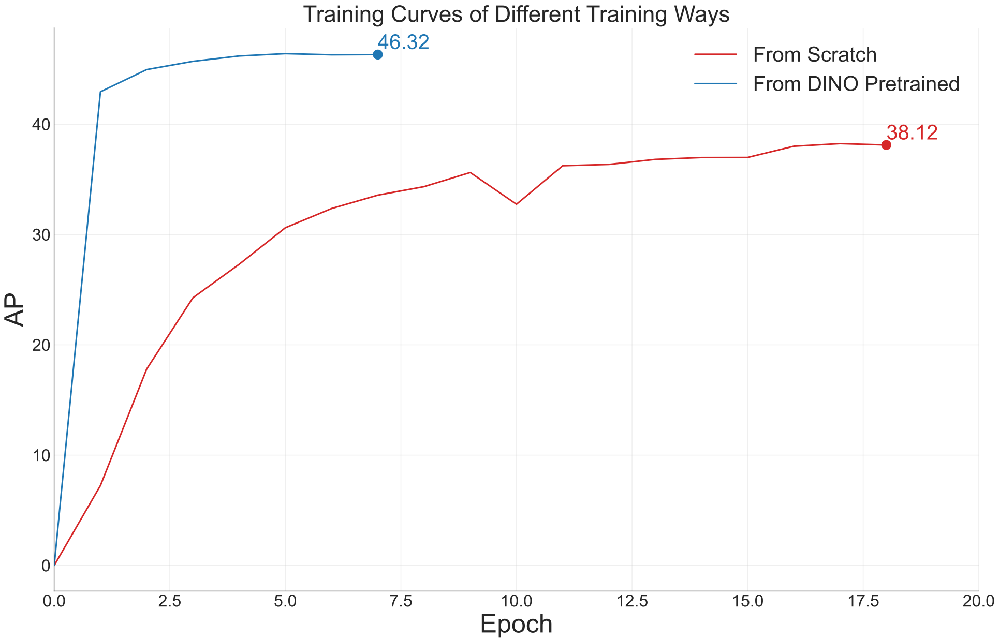
**Figure 5.** Comparison between two Grounding DINO variants: training from scratch and transfer from DINO-pretrained models. The models are trained on O365 and evaluated on COCO.

<a id="tab:12ep"></a>
**Table 10.** Results for Grounding DINO and other detection models with the ResNet-50 backbone on COCO `val2017` under the `1×` (`12`-epoch) setting.

| Model | Epochs | AP | AP50 | AP75 | APS | APM | APL |
| --- | ---: | ---: | ---: | ---: | ---: | ---: | ---: |
| Faster R-CNN (5scale) [@ren2015faster] | 12 | 37.9 | 58.8 | 41.1 | 22.4 | 41.1 | 49.1 |
| DETR (DC5) [@carion2020end] | 12 | 15.5 | 29.4 | 14.5 | 4.3 | 15.1 | 26.7 |
| Deformable DETR (4scale) [@zhu2020deformable] | 12 | 41.1 | - | - | - | - | - |
| DAB-DETR (DC5)† [@liu2022dabdetr] | 12 | 38.0 | 60.3 | 39.8 | 19.2 | 40.9 | 55.4 |
| Dynamic DETR (5scale) [@Dai_2021_ICCV] | 12 | 42.9 | 61.0 | 46.3 | 24.6 | 44.9 | 54.4 |
| Dynamic Head (5scale) [@dai2021dynamic] | 12 | 43.0 | 60.7 | 46.8 | 24.7 | 46.4 | 53.9 |
| HTC (5scale) [@chen2019hybrid] | 12 | 42.3 | - | - | - | - | - |
| DN-Deformable-DETR (4scale) [@li2022dn] | 12 | 43.4 | 61.9 | 47.2 | 24.8 | 46.8 | 59.4 |
| DINO-4scale [@zhang2022dino] | 12 | **49.0** | **66.6** | **53.5** | **32.0** | **52.3** | **63.0** |
| Grounding DINO (4scale) | 12 | 48.1 | 65.8 | 52.3 | 30.4 | 51.3 | 62.3 |

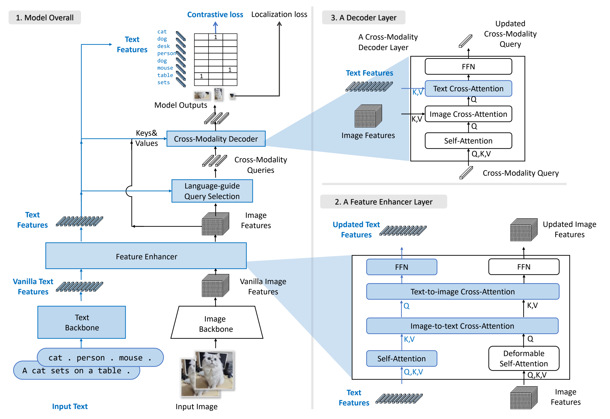
**Figure 6.** Comparison between DINO and Grounding DINO. The newly introduced modules are marked in blue.

**Table 11.** Detailed ODinW results for Grounding DINO with Swin-T pre-trained on O365 and GoldG. This source-preserved appendix table is not expanded here.

**Table 12.** Detailed ODinW results for Grounding DINO with Swin-T pre-trained on O365, GoldG, and Cap4M. This source-preserved appendix table is not expanded here.

**Table 13.** Detailed ODinW results for Grounding DINO with Swin-L pre-trained on O365, OI, GoldG, Cap4M, COCO, and RefC. This source-preserved appendix table is not expanded here.

<a id="tab:morequery"></a>
**Table 14.** Results for Grounding DINO Tiny with more decoder queries.

| Pre-train data | Query num | COCO AP | APS | APM | APL | LVIS AP | APr | APc | APf |
| --- | ---: | ---: | ---: | ---: | ---: | ---: | ---: | ---: | ---: |
| O365 | 900 | 46.7 | 32.1 | 50.0 | 61.3 | 15.8 | 9.4 | 22.9 | 28.4 |
| O365 | 1200 | 46.7 | 32.3 | 49.9 | 61.1 | 15.7 | 9.0 | 23.1 | 29.1 |
| O365 | 1500 | 46.9 | 32.7 | 50.3 | 61.3 | 15.8 | 9.2 | 23.0 | 29.0 |

**Table 15.** Results for Grounding DINO with different language encoders for REC. This appendix table is not expanded here.

**Table 16.** Oracle experiments on LVIS with Detic pseudo-labeled data. This appendix table is not expanded here.

**Table 17.** Comparison of Grounding DINO and GLIP on ODinW with Swin-T backbones. This appendix table is not expanded here.

**Table 18.** Training on RefCOCO from scratch. This appendix table is not expanded here.

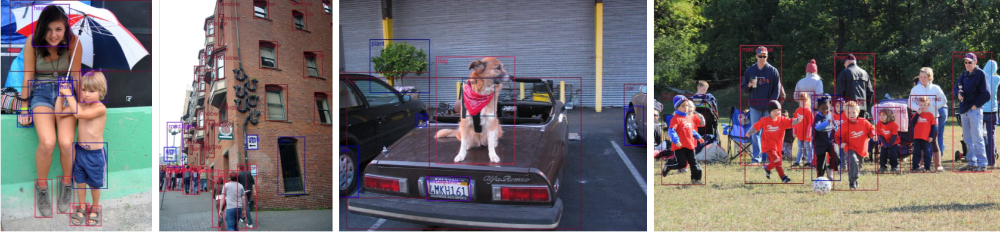
**Figure 7.** Visualizations of model outputs.

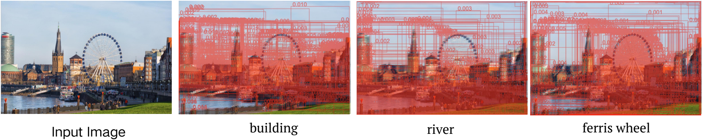
**Figure 8.** Top queries in language-guided query selection.

The top-query visualizations show that Grounding DINO can use dynamic queries during inference, rather than relying on a single static query pool.

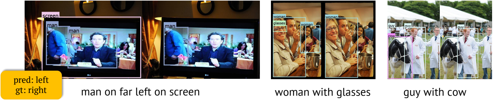
**Figure 9.** Model predictions and ground-truths in RefCOCO.

The RefCOCO setting uses one box for each text prompt, whereas Grounding DINO often predicts multiple objects under grounding-style supervision. This difference helps explain the large performance gap before RefCOCO data is injected.

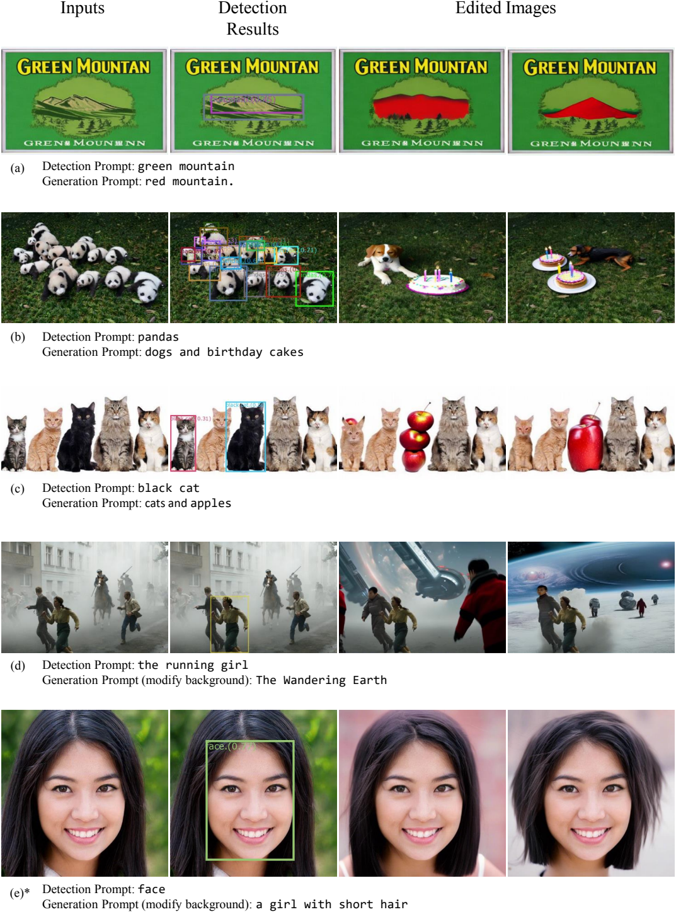
**Figure 10.** Combination of Grounding DINO and Stable Diffusion. Grounding DINO first detects objects and provides masks, after which Stable Diffusion performs inpainting. `Detection Prompt` and `Generation Prompt` are inputs for Grounding DINO and Stable Diffusion, respectively. The human face in row `(e)` is generated by StyleGAN.

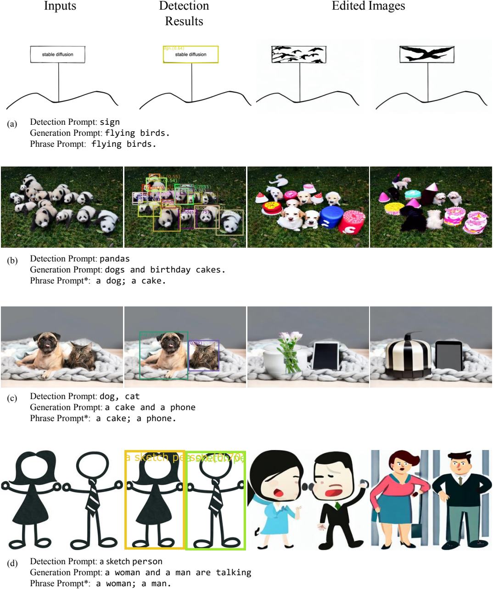
**Figure 11.** Combination of Grounding DINO and GLIGEN. Grounding DINO first detects objects and then provides grounded boxes and phrases to GLIGEN. `Detection Prompt` and `Generation Prompt` are shared with the Stable Diffusion application, while `Phrase Prompt` specifies the language input for each bounding box.

<a id="table:gflops"></a>
**Table 19.** Comparison of model size and model efficiency between GLIP and Grounding DINO.

| Model | Params | GFLOPS | FPS |
| --- | ---: | ---: | ---: |
| GLIP-T [@li2021grounded] | 232M | 488G | 6.11 |
| Grounding DINO T (ours) | 172M | 464G | 8.37 |

Grounding DINO T is smaller and more efficient than GLIP-T while still delivering stronger open-set performance on the main transfer benchmarks.
