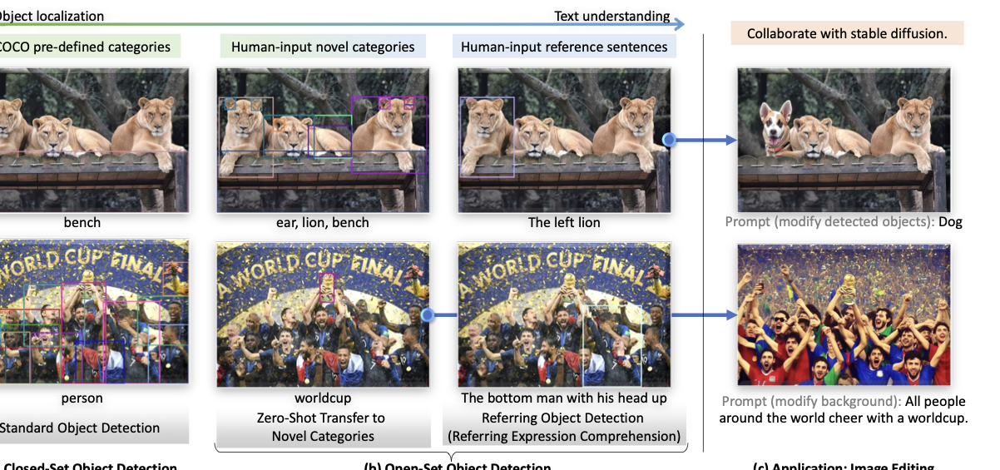
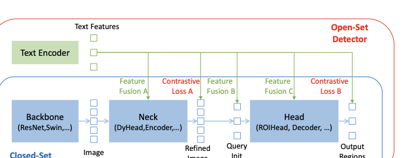
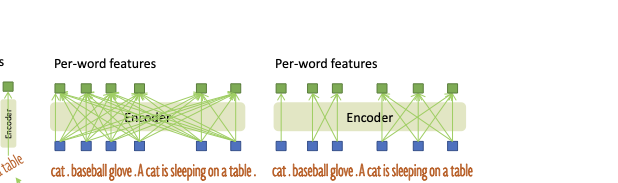
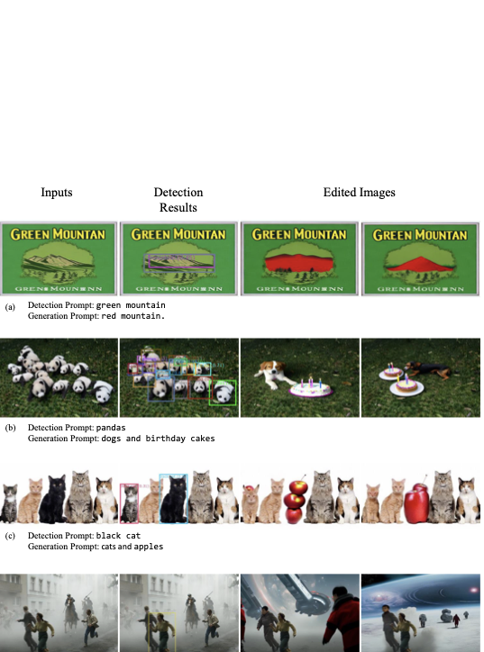
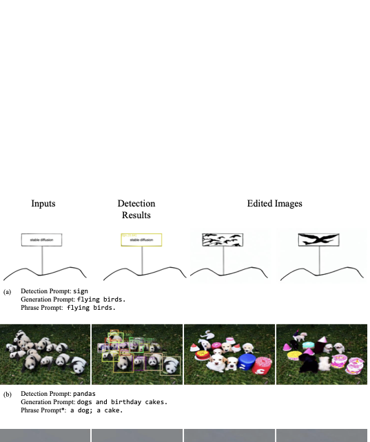

{width="80%"}
r0.7
{width="80%"}


The framework of Grounding DINO. We present the overall framework, a feature enhancer layer, and a decoder layer in block 1, block 2, and block 3, respectively.

# Grounding DINO {#sec:groundingdino} Grounding DINO outputs multiple pairs of object boxes and noun phrases for a given `(Image, Text)` pair. For example, as shown in Figure 1, the model locates a cat and a table from the input image and extracts word `cat` and `table` from the input text as corresponding labels. Both object detection and REC tasks can be aligned with the pipeline. Following GLIP [@li2021grounded], we concatenate all category names as input texts for object detection tasks. REC requires a bounding box for each text input. We use the output object with the largest scores as the output for the REC task. Grounding DINO is a dual-encoder-single-decoder architecture. It contains an image backbone for image feature extraction, a text backbone for text feature extraction, a feature enhancer for image and text feature fusion (Sec. [3.1](#sec:feature_enhance)), a language-guided query selection module for query initialization (Sec. [3.2](#sec:query_selection)), and a cross-modality decoder for box refinement (Sec. [3.3](#sec:cross_modal_decoder)). For each `(Image, Text)` pair, we first extract vanilla image features and vanilla text features using an image backbone and a text backbone, respectively. The two vanilla features are fed into a feature enhancer module for cross-modality feature fusion. After obtaining cross-modality text and image features, we use a language-guided query selection module to select cross-modality queries from image features. Like the object queries in most DETR-like models, these cross-modality queries will be fed into a cross-modality decoder to probe desired features from the two modal features and update themselves. The output queries of the last decoder layer will be used to predict object boxes and extract corresponding phrases. {#fig:text_prompts width="70%"}

# Feature Extraction and Enhancer {#sec:feature_enhance} Given an `(Image, Text)` pair, we extract multi-scale image features with an image backbone like Swin Transformer [@liu2021swin], and text features with a text backbone like BERT [@devlin2018bert]. Following previous DETR-like detectors [@zhu2020deformable; @zhang2022dino], multi-scale features are extracted from the outputs of different blocks. After extracting vanilla image and text features, we fed them into a feature enhancer for cross-modality feature fusion. The feature enhancer includes multiple feature enhancer layers. We illustrate a feature enhancer layer in Figure 1 block 2. We leverage the Deformable self-attention to enhance image features and the vanilla self-attention for text feature enhancers. Inspired by GLIP [@li2021grounded], we add an image-to-text and a text-to-image cross-attention modules for feature fusion. These modules help align features of different modalities.

# Language-Guided Query Selection {#sec:query_selection} Grounding DINO aims to detect objects from an image specified by an input text. To effectively leverage the input text to guide object detection, we design a language-guided query selection module to select features that are more relevant to the input text as decoder queries. Let's denote the image feature as ${{\bf X}}_{I} \in \textsc{R}^{N_I\times d}$ and the text features as ${{\bf X}}_{T}\in \textsc{R}^{N_T\times d}$. Here, $N_I$ represents the number of image tokens, $N_T$ indicates the number of text tokens, and $d$ corresponds to the feature dimension. In our experiments, we specifically utilize a feature dimension of $d=256$. Typically, in our models, the value of $N_I$ exceeds $10,000$, while $N_T$ remains below $256$. Our objective is to extract $N_q$ queries from the encoder's image features to be used as inputs for the decoder. In alignment with the DINO method, we set $N_q$ to be $900$. The top $N_q$ query indices for the image feature, denoted as ${\bf I}_{N_q}$, are selected using the following expression: $$\begin{equation}
{\bf I}_{N_q} = \texttt{Top}_{{N_q}}(\texttt{Max}^{(-1)}({{\bf X}}_{I}{{\bf X}}_{T}^{\intercal})).
\end{equation}$$ In this expression, $\texttt{Top}_{{N_q}}$ represents the operation to pick the top $N_q$ indices. The function $\texttt{Max}^{(-1)}$ executes the `max` operation along the $-1$ dimension, and the symbol $^{\intercal}$ denotes matrix transposition. We present the query selection process in Algorithm Code in PyTorch style. The language-guided query selection module outputs $N_q$ indices. We can extract features based on the selected indices to initialize queries. Following DINO [@zhang2022dino], we use mixed query selection to initialize decoder queries. Each decoder query contains two parts: content part and positional part [@meng2021conditional], respectively. We formulate the positional part as dynamic anchor boxes [@liu2022dabdetr], which are initialized with encoder outputs. The other part, the content queries, are set to be learnable during training.

# Cross-Modality Decoder {#sec:cross_modal_decoder} We develop a cross-modality decoder to combine image and text modality features, as shown in Figure 1 block 3. Each cross-modality query is fed into a self-attention layer, an image cross-attention layer to combine image features, a text cross-attention layer to combine text features, and an FFN layer in each cross-modality decoder layer. Each decoder layer has an extra text cross-attention layer compared with the DINO decoder layer, as we need to inject text information into queries for better modality alignment.

# Sub-Sentence Level Text Feature {#sec:sub_sentence} Two kinds of text prompts are explored in previous works, which we named as sentence level representation and word level representation, as shown in Figure 2. Sentence level representation [@LeweiYao2022DetCLIPDV; @MatthiasMinderer2022SimpleOO] encodes a whole sentence to one feature. If some sentences in phrase grounding data have multiple phrases, it extracts these phrases and discards other words. In this way, it removes the influence between words while losing fine-grained information in sentences. Word level representation [@gao2021clip; @kamath2021mdetr] enables encoding multiple category names with one forward but introduces unnecessary dependencies among categories, especially when the input text is a concatenation of multiple category names in an arbitrary order. As shown in Figure 2 (b), some unrelated words interact during attention. To avoid unwanted word interactions, we introduce attention masks to block attentions among unrelated category names, named "sub-sentence" level representation. It eliminates the influence between different category names while keeping per-word features for fine-grained understanding.

# Loss Function Following previous DETR-like works [@carion2020end; @zhu2020deformable; @meng2021conditional; @liu2022dabdetr; @li2022dn; @zhang2022dino], we use the L1 loss and the GIOU [@rezatofighi2019generalized] loss for bounding box regressions. We follow GLIP [@li2021grounded] and use contrastive loss between predicted objects and language tokens for classification. Specifically, we dot product each query with text features to predict logits for each text token and then compute focal loss [@lin2017focal] for each logit. Box regression and classification costs are first used for bipartite matching between predictions and ground truths. We then calculate final losses between ground truths and matched predictions with the same loss components. Following DETR-like models, we add auxiliary loss after each decoder layer and after the encoder outputs.


``` {.python language="Python"}
"""
Input:
image_feat: (bs, num_img_tokens, ndim)
text_feat: (bs, num_text_tokens, ndim)
num_query: int Output:
topk_idx: (bs, num_query)
""" logits = torch.einsum("bic,btc->bit", image_feat, text_feat)

# bs, num_img_tokens, num_text_tokens
logits_per_img_feat = logits.max(-1)[0]

# bs, num_img_tokens
topk_idx = torch.topk(logits_per_img_feature, num_query, dim=1)[1]

# bs, num_query
```


Comparison between DINO and our Grounding DINO. We mark the modifications in blue. Best view in color.

# Model Efficiency {#sec:efficiency} We compare the model size and efficiency between Grounding DINO T and GLIP-T in Table The results show that our model has a smaller parameter size and better efficiency than GLIP.

# Ablations for More Decoder Queries {#sec:query_number} To verify the model performance with more decoder queries, we conducted additional experiments with 1200 and 1500 queries on the COCO and LVIS datasets, detailed in Table below. The results indicate that models with 1200 and 1500 queries slightly outperform the 900-query version on LVIS rare classes, suggesting better coverage of rare classes. However, the improvement is marginal, as the 900-query model already sufficiently covers all objects in both COCO and LVIS. Additionally, introducing more queries exacerbates data imbalance during training, as the model is trained on objects from sampled categories. This imbalance could offset the benefits of additional queries.


Top queries in language-guided query selection.

# Comparison of RefCOCO and Grounding Data The RefCOCO has a different formulation with grounded training, resulting in a big performance gap without the RefCOCO dataset. As shown in Figure 6, each RefCOCO text prompt corresponds to only *one box*, while our model tends to predict *multiple objects*. {width="90.0%"}
Our model predictions and ground-truths in RefCOCO.

# Marry Grounding DINO with Stable Diffusion for Object Detection and Inpainting We present an image editing application in Figure (b). The results in Figure (b) are generated by two processes. First, we detect objects with Grounding DINO and generate masks by masking out the detected objects or backgrounds. After that, we feed original images, image masks, and generation prompts to an inpainting model (typical Stable Diffusion [@rombach2021highresolution]) to render new images. We use the released checkpoints in <https://github.com/Stability-AI/stablediffusion> for new image generation. More results are available in Figure 7. The "detection prompt" is the language input for Grounding DINO, while the "generation prompt" is for the inpainting model.

# Marry Grounding DINO with Stable Diffusion for Object Detection and Grounded Generation To enable fine-grained image editing, we combine the Grounding DINO with GLIGEN [@GLIGEN]. We use the "phrase prompt" in Figure 8 as the input phrases of each box for GLIGEN. GLIGEN supports grounding results as inputs and can generate objects on specific positions. We can assign each bounding box an object with GLIGEN, as shown in Figure 8 (c) (d). Moreover, GLIGEN can full fill each bounding box, which results in better visualization, as that in Figure 8 (a) (b). For example, we use the same generative prompt in Figure 7 (b) and Figure 8 (b). The GLIGEN results ensure each bounding box with an object and fulfills the detected regions. {width="90.0%"}
Combination of Grounding DINO and Stable Diffusion. We first detect objects with Grounding DINO and then perform image inpainting with Stable Diffusion. “Detection Prompt” and “Generation Prompt” are inputs for Grounding DINO and Stable Diffusion, respectively. *The input human face in the row (e) is generated by StyleGAN. 
Combination of Grounding DINO and GLIGEN. We first detect objects with Grounding DINO and then perform image inpainting with GLIGEN. “Detection Prompt” and “Generation Prompt” are inputs for Grounding DINO and Stable Diffusion, respectively. “Phrase Prompt” are language inputs for each bounding box. The phrase prompts are separated by semicolons. *We assign phrase prompts to bounding boxes randomly.

<a id="fig:curve_fewshot"></a>
<a id="fig:hero_image"></a>
<a id="fig:model_comparison"></a>
<a id="sec:ablations"></a>
<a id="sec:coco"></a>
<a id="sec:comparison_dino_groundingdino"></a>
<a id="sec:cross_modal_decoder"></a>
<a id="sec:dino_to_groundingdino"></a>
<a id="sec:efficiency"></a>
<a id="sec:feature_enhance"></a>
<a id="sec:open-set"></a>
<a id="sec:query_selection"></a>
<a id="sec:sub_sentence"></a>
<a id="sec:visual_grounding"></a>
<a id="tab:12ep"></a>
<a id="tab:bertl"></a>
<a id="tab:comp_odinw"></a>
<a id="tab:detic"></a>
<a id="tab:morequery"></a>
<a id="tab:odinw"></a>
<a id="tab:refcoco_scratch"></a>
<a id="table:ablation"></a>
<a id="table:add_ref"></a>
<a id="table:cocomain"></a>
<a id="table:dino2grounding"></a>
<a id="table:gflops"></a>
<a id="table:odinw_detail_swinl"></a>
<a id="table:odinw_detail_swint_og"></a>
<a id="table:odinw_detail_swint_ogc"></a>
<a id="table:refexp"></a>
<a id="table:related_work"></a>
<a id="table:zslvis"></a>

# Caption Normalization Notes

**Figure 1.** Grounding DINO overall framework and key fusion blocks.

**Figure 2.** Comparison of sentence-level, word-level, and sub-sentence text representations.

**Figure 3.** Structural comparison between DINO and Grounding DINO.

**Figure 4.** Qualitative detection visualizations under diverse prompts and scenes.

**Figure 5.** Top queries selected by language-guided query selection.

**Figure 6.** Comparison between RefCOCO-style supervision and grounding-style supervision.

**Figure 7.** Grounding DINO with Stable Diffusion for detection and inpainting.

**Figure 8.** Grounding DINO with GLIGEN for grounded generation and editing.

**Table 1.** Main experimental hyperparameters.

**Table 2.** Zero-shot transfer results on open-set detection benchmarks.

**Table 6.** REC and ablation summary under the standardized setting.

The detailed analyses additionally reference Figure 3, Figure 4, Figure 5, Table 1, Table 2, and Table 6.
