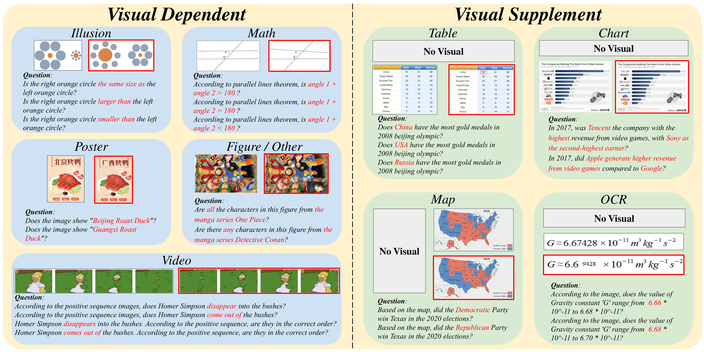
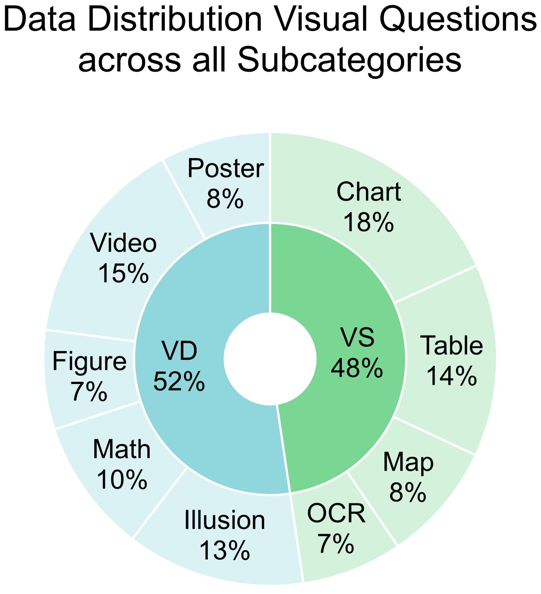
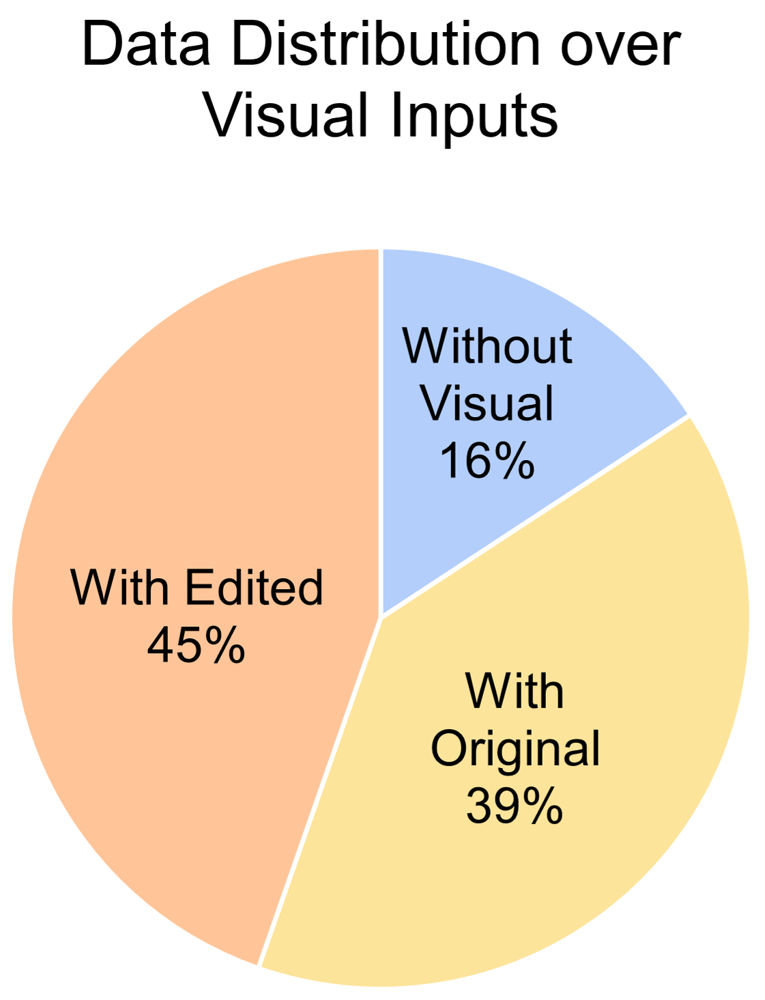
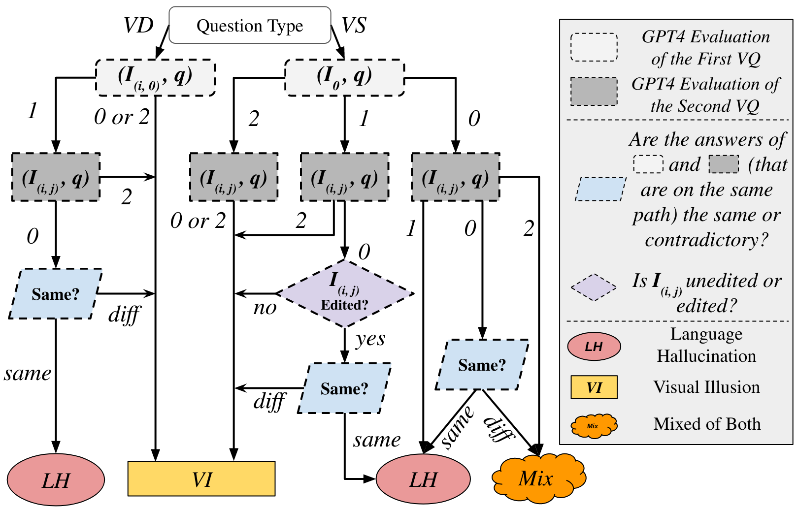
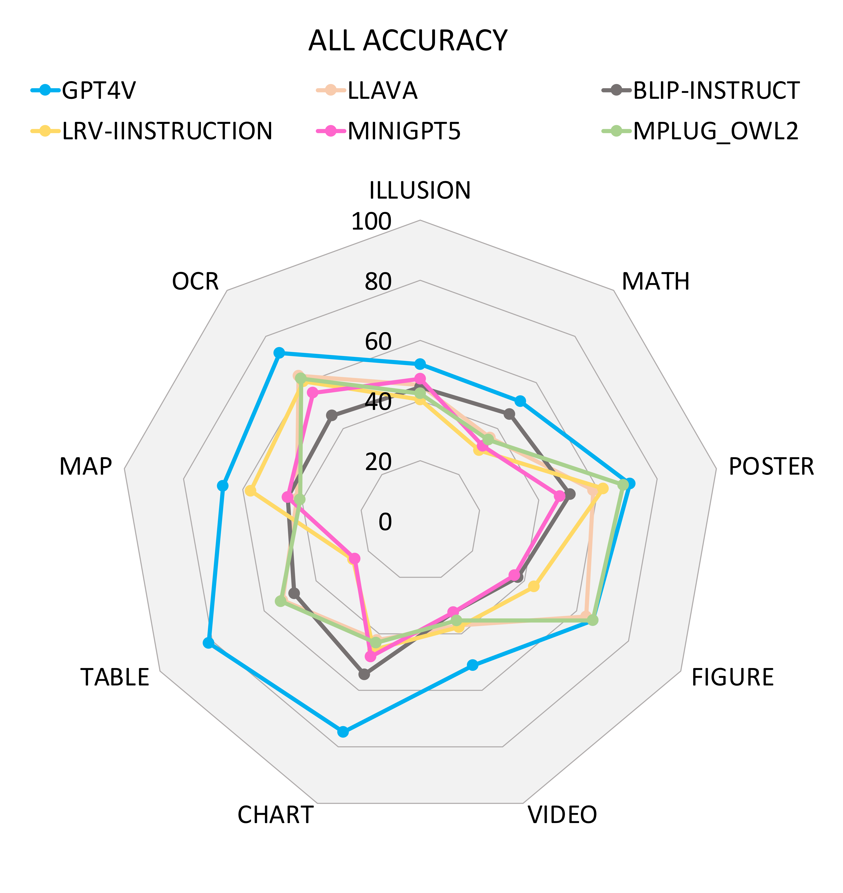
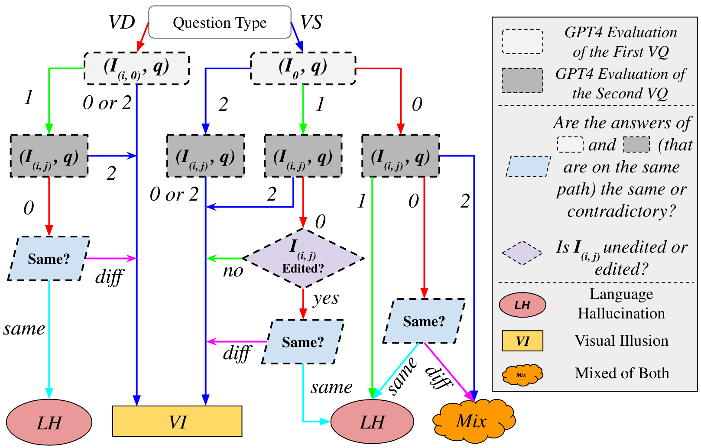

# Introduction

Data samples of HallusionBench, which contains diverse topics, visual modalities. Human-edited images are in RED, resulting in different correct answers to the questions.

In recent years, Large Language Models (LLMs)  have revolutionized the field of machine learning with the ability of language understanding and content generation, offering unprecedented capabilities and potentials across a multitude of applications. The integration of LLMs with computer vision systems has given rise to Large Vision-Language Models (LVLMs) . These models have demonstrated profound capabilities in various applications and significantly enhance the performance in image reasoning tasks . However, the hallucination issue of LLMs  is regarded as a challenging and unsolved problem, which leads to many issues when we integrate LLMs with vision techniques.

While LVLMs like GPT-4V(ision)  and LLaVA-1.5  excel in various applications, they are hindered by a pronounced language bias. This bias stems from instances where knowledge priors conflict with the visual context . Similarly, models such as LLaVA-1.5  and mPLUG-Owl  are prone to giving affirmative answers regardless of the actual content of questions . The distinct failure modes of different VLMs highlight the need for specific improvements. Recognizing and understanding these limitations and failure types is imperative for advancing these models and striking a delicate balance between knowledge priors and contextual understanding.

When exploring those LVLMs, we observe that their strong language bias often overshadows visual information, leading to an overreliance on language priors rather than the visual context. To study this phenomenon, we use the term “***Language Hallucination***,” which refers to conclusions drawn without visual input. On the other hand, the vision components within the limited ability in LVLMs can give rise to “***Visual Illusion***”, where visual inputs can be misinterpreted, leading to overconfident yet erroneous assertions by the model.

**Main Contributions:** Recognizing the need to comprehend why an LVLM fails and address these issues, we present HallusionBench, a carefully crafted benchmark designed to explore the complexities of image-context reasoning in depth and expose various problems with respect to current LVLMs, as shown in Fig. <a href="#fig:examples" data-reference-type="ref" data-reference="fig:examples">1</a>. Our design of the visual-question (VQ) pairs, unique in format, facilitates a quantitative analysis of the models’ failures, enabling a more thorough evaluation. This investigation sheds light on existing limitations and lays the groundwork for future improvements, aiming to make the next generation of LVLMs more robust, balanced, and precise. The novelties of our work include:

1.  We introduce HallusionBench, the first advanced diagnostic suite tailored to systematically dissect and analyze the diverse failure modes of LVLMs. HallusionBench consists of approximately 1129 handcrafted visual question-answer (VQA) pairs, featuring 165 original images and 181 images expertly modified by human professionals. Moving beyond the traditional metrics of correctness and accuracy, our VQA pairs are thoughtfully formulated with an innovative structure. This approach enables us to quantitatively analyze specific dimensions and aspects where current models falter.

2.  We evaluate 15 most recent methods on HallusionBench. Our benchmark presents formidable challenges to existing methods. Notably, the SoTA GPT-4V achieves merely a 31.42% Question Pair Accuracy, while the performance of all other methods falls below 16%.

3.  We explore HallusionBench and provide an in-depth analysis of examples on which the SoTA LVLMs, such as GPT-4V and LLaVA-1.5 fail. We also provide insights on different issues that existing LVLMs are facing based on the quantitative analysis enabled by HallusionBench. In our exploration of HallusionBench, we conduct a detailed analysis of instances where SoTA LVLMs, including GPT-4V and LLaVA-1.5, fall short. Additionally, our investigation leverages the quantitative capabilities of HallusionBench to shed light on various issues currently challenging existing LVLMs.

# Related Work

## Large Multi-Modal Models

Large Language Models have been a major advancement, leading to new ways to understand not just text but other things like images, all in one large system. For example, Flamingo has many capabilities, combining a vision part that doesn’t change with a big language model that has a special feature for understanding both images and words together. Another model, PaLM-E , mixes visual information directly into the already powerful PaLM model, which has $`520`$ billion parameters, making it effective in real-world uses. Most recently, researchers have been creating high-quality, diverse multi-modal datasets from GPT4 and GPT-4V to fine-tune open-source LVLMs, including LLaVA , MiniGPT4 , Mplug-Owl , LRV-Instruction , LLaVAR and other works .

## Hallucination in LVLMs

Hallucination typically refers to situations where the generated responses contain information that is not present in the visual content. Prior research primarily examines two areas: detecting and evaluating hallucinations , and methods to reduce them . Early methods include training classifiers to identify hallucinations or comparing output with accurate answers to detect inaccuracies. To mitigate hallucinations, efforts have been made to improve data gathering and training procedures. For example, LRV-Instruction creates balanced positive and negative instructions to finetune LVLMs. VIGC uses an iterative process to generate concise answers and combine them, aiming for detailed yet accurate responses. Similarly, Woodpecker introduces a training-free method to pick out and correct hallucinations from the generated text.

## Benchmarks for Large VL Models

Traditional Visual Language (VL) benchmarks are designed to assess distinct skills, including visual recognition , image description , and so on. However, with the advent of advanced LVLMs, traditional evaluation metrics often fall short of providing a detailed ability assessment. This problem is further exacerbated by their inability to match the given answer accurately, leading to significant robustness issues. To address these challenges, research communities have introduced a series of benchmarks, including MME , MMBench , MM-Vet , SEED-Bench , GAVIE , and LAMM-Bench . These benchmarks systematically structure and evaluate complex multi-modal tasks. Different from POPE and GAVIE evaluating the object hallucinations of LVLMs, HallusionBench is the first human-annotated analytical benchmark focusing on diagnosing both the visual illusion and knowledge hallucination of LVLMs.

<strong>Statistics of HallusionBench:</strong> We show the number of questions in the table (<em>left</em>), and the distribution of visual questions across each subcategory of Visual Dependent (VD) and Visual Supplement (VS) (<em>middle</em>) and visual input types categorized by no visual, original, and edited images (<em>right</em>). HallusionBench covers a diverse visual format and nearly half of the images are manually edited.

# HallusionBench Construction

We present HallusionBench, the first benchmark designed to examine visual illusion and knowledge hallucination of LVLMs and analyze the potential failure modes based on each hand-crafted example pair. HallusionBench consists of 455 visual-question control pairs, including 346 different figures and a total of 1129 questions on diverse topics (including  ***food, math, geometry, statistics, geography, sports, cartoon, famous illusions, movie, meme,** etc.*) and formats (including ***logo, poster, figure, charts, table, map, consecutive images,** etc.*). In the following sections, we first provide the guidelines for dataset construction based on different visual question types. Second, we will describe the data and annotation structure of HallusionBench. Finally, we will describe the statistics of our dataset.

## Visual Question Taxonomy

Our aim is to develop a multimodal image-context reasoning benchmark to investigate the potent language bias inherent in LVLMs, which can sometimes overshadow the visual context. We define the two categories of visual questions: ***Visual Dependent*** and ***Visual Supplement***.

### Visual Dependent Questions

The ***Visual Dependent*** questions are defined as ***questions that do not have an affirmative answer without the visual context.*** Such questions ask about the image itself or something within the image. For example, there is no clear answer to *"Is the right orange circle the same size as the left orange circle?"* without an image to provide more context.

**Guideline:** Under this setting, our benchmark is designed to evaluate visual commonsense knowledge and visual reasoning skills. Our exploration and dataset construction are guided by the following questions:

1.  *How good are the visual understanding and reasoning skills of the model?*

2.  *How does the parametric memory of the model affect its response to a question?*

3.  *Is the model able to capture the temporal relation of multiple images?*

### Visual Supplement Questions

The *Visual Supplement* questions are ***questions that can be answered without the visual input; the visual component merely provides supplemental information or corrections.*** For example, some LVLMs can answer *"Is New Mexico state larger than Texas state?"* using the prior knowledge in their parametric memory without a map of the US.

***Guideline*:** Under this setting, our benchmark is designed to evaluate visual reasoning ability and the balance between parametric memory and image context. Our exploration and dataset construction under this category is guided by the following questions:

1.  *When the model lacks the prior knowledge or answer in the parametric memory of its language module, does the model (still) hallucinate about the images?*

2.  *When the model’s language module has sufficient prior knowledge in its parametric memory or directly knows the answer, does it still enhance its response by gathering extra information from the visual supplement (especially when the prior knowledge conflicts with the visual input or the parametric memory is outdated)?*

3.  *How well can the model interpret a visual input with dense information (i.e., a graph, chart, map, etc.) for question answering? What types of image manipulation might impede or distort visual information extraction?*

## Visual, Question, and Annotation Structures

**Notations:** Let $`(I, q) \in \mathcal{V}\subseteq \mathbbm{I} \times \mathbbm{Q}`$ be the tuple of the image $`I\in \mathbbm{I}`$ and question $`q\in \mathbbm{Q}`$, where $`\mathcal{V}`$ is the set of valid VQ pairs. Let $`N`$ be the number of original images obtained from the Internet, and $`\mathbbm{I}_{o} = \{I_{(i, 0)}\}_{0 < i \leq N}`$ be the set of those original images. We define $`\mathbbm{I}'_{i} = \{I_{(i,j)}\}_{0 < j \leq N_i}`$ be the set of images modified from $`I_{(i, 0)}`$, and $`I_0`$ be an empty image. The entire images set $`\mathbbm{I} = \{ I_0 \} \bigcup \mathbbm{I}_{o} \bigcup\ (\bigcup_{0 < i \leq N} \mathbbm{I}'_{i})`$.

Let $`\mathbbm{Q}_i = \{q_{(i,k)} \}_{{0 < k \leq M_i}}`$ be the set of questions that can be applied to any image in $`\mathbbm{I}_i`$, which is defined differently for Visual Dependent (*VD*) and Visual Supplement (*VS*):
$$
\begin{equation} \mathbbm{I}_i = \begin{cases} \{ I_{(i, 0)} \} \bigcup \mathbbm{I}'_i & \text{for \textit{VD}}  \\ \{ I_0, I_{(i, 0)} \} \bigcup \mathbbm{I}'_i & \text{for \textit{VS}} \end{cases} \label{eq:vdvs_cases} \end{equation}
$$
To facilitate evaluation, all questions are formulated as Yes/No questions (Fig. <a href="#fig:examples" data-reference-type="ref" data-reference="fig:examples">1</a>). We annotate each visual-question with a binary answer $`y(I, q) \in \{\text{``yes'', ``no''}\}`$.

## Dataset Statistics

Following the annotation structure and guidelines above, we ask human experts to collect 346 images with diverse topics and types manually. As shown Fig. <a href="#fig:stats" data-reference-type="ref" data-reference="fig:stats">2</a>, *Visual Dependent* has 591 questions, including *videos, illusion, math, posters, logos, cartoons*, and *others*; *Visual Supplement* has 538 questions, including *charts, tables, maps*, and *OCR*. Furthermore, Fig. <a href="#fig:stats" data-reference-type="ref" data-reference="fig:stats">2</a> (*right*) describes the distribution of the questions without visual input (16%), with original online images (39%), and with visual input edited by human experts (45%). Our image manipulation strategies contain *image flipping, order reversing, masking, optical character editing, object editing*, and *color editing*. Additionally, each image has 3.26 questions on average. Fig. <a href="#fig:stats" data-reference-type="ref" data-reference="fig:stats">2</a> (*left*) provides more details on the number of questions in each topic and visual input category.

## Uniqueness of HallusionBench

The main comparison between HallusionBench and existing benchmarks is presented in Tab. . As it shows, there is a notable gap between existing benchmarks and HallusionBench in hallucination evaluation, as existing benchmarks primarily focus on object hallucinations, limited topics, and visual input types. Our dataset, HallusionBench, is therefore motivated to bridge this gap by providing more topics, more image types, and more visual input modalities, including both images and videos. Additionally, our human experts carefully select each image and write question-answer pairs. We are also the first work to include human-edited images to assess the robustness of current LVLMs. Additionally, unlike existing benchmarks, HallusionBench focuses on evaluating both language hallucinations and visual illusions, moving beyond the narrow scope of object hallucinations .

# HallusionBench Evaluation Suite

## Text-Only GPT4-Assisted Evaluation

**Notations:** Let $`\mathcal{M}(I, q)\in\{\text{``yes'', ``no'', ``uncertain''}\}`$ be the parsed output answer by a VLM $`\mathcal{M}`$ for an image-question pair $`(I, q)`$. GPT-4 $`GPT(\mathcal{M}(I, q),\ y(I, q))`$ then judges the answer $`\mathcal{M}(I, q)`$ based on the ground truth $`y(I, q)\in\{\text{``yes'', ``no''}\}`$ and outputs *Incorrect (0)*, *Correct (1)*, or *Uncertain (2)* if the predicted response is ambiguous. The prompt for the GPT-4 judge is designed as:

*Imagine you are an intelligent teacher. Thoroughly read the question, reference answer, and the prediction answer to ensure a clear understanding of the information provided. Assess the correctness of the predictions. If the prediction answer does not conflict with the reference answer, please generate “correct”. If the prediction answer conflicts with the reference answer, please generate “incorrect”. If the prediction answer is unclear about the answer, please generate "unclear".*

For each sample, we fill the template with its question, ground truth, and LVLM output. By taking the filled prompt into GPT-4, GPT-4 will generate "correct", "incorrect" or "unclear" for the sample. It is found that outputs of GPT-4 still exist variance, although the temperature is set as 0. Therefore, we utilize GPT-4 to evaluate the outputs of LLMs 3 times and report average scores.

**Comparison with Human Evaluation:** To demonstrate that our GPT4-Assisted evaluation is effective, we obtain the responses from GPT-4V  and LLaVA-1.5 , and manually evaluate the correctness of their responses. We label the responses with *Incorrect (0)*, *Correct (1)*, and *Uncertain (2)* if the answer is ambiguous. As shown in the first two rows of Tab.  and Tab. , the negligible difference proves that the GPT4-assisted method aligns well with human judgment.

## Correctness Evaluation Metrics

Since the focus of our benchmark is on hallucination and illusion, not the span of knowledge, we consider an *uncertain* answer acceptable when there is no visual input under the *Visual Supplement* category. For the final accuracy score, we convert the correctness into a binary value $`b_{\mathcal{M}}\in\{0, 1\}`$:
$$
\begin{equation} b_{\mathcal{M}} (I, q) = \begin{cases} GPT(\mathcal{M}(I, q),\ y(I, q)) & \text{if}\ GPT(\mathcal{M},\ y) \leq 1\\ 1& \text{else if}\ I = I_{0} \\ 0& \text{otherwise} \end{cases}, \label{eq:correctness} \end{equation}
$$
Let $`(I, q) \in \mathcal{V}\subseteq \mathbbm{I} \times \mathbbm{Q}`$ be the tuple of the image $`I\in \mathbbm{I}`$ and question $`q\in \mathbbm{Q}`$, where $`\mathcal{V}`$ is the set of valid visual-question pairs. Let $`\mathbbm{1}(\cdot)`$ be the indicator function.

**All accuracy:**
$$
\begin{equation} aAcc = \frac{\sum_{(I, q)\in \mathcal{V}} b_{\mathcal{M}} (I, q) }{|\mathcal{V}|} \label{metric:1} \end{equation}
$$
**Figure Accuracy:**
$$
\begin{equation} fAcc = \frac{\sum_{i, j}{ \mathbbm{1}( \bigwedge_{q\in \mathbbm{Q}_i} b_{\mathcal{M}} (I_{(i,j)}, q)) }}{|\mathbbm{I}|} \label{metric:2} \end{equation}
$$
**Question Pair Accuracy:**
$$
\begin{equation} qAcc = \frac{\sum_{i, k}{ \mathbbm{1}( \bigwedge_{I\in \mathbbm{I}_i} b_{\mathcal{M}} (I, q_{(i, k)})) }}{|\mathbbm{Q}|} \label{metric:3} \end{equation}
$$
## Analytical Evaluation Criteria

In addition to the accuracy metrics, we introduce three analytical criteria to measure and diagnose the failures of LVLMs, *Yes/No Bias Test*, *Consistency Test*, and *Diagnostic Test*. Instead of examining and analyzing each failed case qualitatively, we propose these novel quantitative measurements through the unique design of our question sets. These tests are listed in the order of complexity, so the latter test would not be as useful and insightful if the former basic test failed.

### Yes / No Bias Test

According to , some models  tend to respond with “yes” in most cases. No further analysis is necessary if the model has a very strong bias or tendency to answer one way regardless of the actual question, so we design two criteria to reveal such preference of the model.

**Yes Percentage Difference (Pct. Diff) $`d_{y}\in[-1, 1]`$:**
$$
\begin{equation} d_{y} = \frac{\sum\limits_{(I, q)\in\mathcal{V}}{ \left[\mathbbm{1}\big(\mathcal{M}(I, q)= \text{``yes''} \big) - \mathbbm{1}\big(y(I, q)=\text{``yes''} \big)\right]} }{ |\mathcal{V} |}, \label{test:1} \end{equation}
$$
$`d_{y}`$ represents the difference between the predicted and actual number of “Yes” in the question set. The model is more biased when $`|d_{y}|`$ is close to 1.

**False Positive Ratio (FP Ratio) $`r_{fp}\in[0, 1]`$:**
$$
\begin{equation} r_{fp} = \frac{\sum_{(I, q)\in\mathcal{W}} \mathbbm{1}\big(\mathcal{M}(I, q)= \text{``yes"} \big)}{|\mathcal{W} |}, \label{test:2} \end{equation}
$$
where $`\mathcal{W} = \{ (I, q) \in \mathcal{V}\ | \ b_{\mathcal{M}} (I, q) = 0\}`$ is the set of incorrect visual questions. $`r_{fp}`$ measures how likely the model responses with “Yes” out of all incorrect responses. The model is more robust when $`r_{fp}`$ is close to 0.5.

### Consistency Test

The goal of the consistency test is to test the logical consistency of responses and make sure questions are not answered based on random guesses. Many questions $`\mathbbm{Q}^i`$ from root $`\mathcal{R}^i`$ are logically consistent: for example, “Is the left segment longer than/shorter than/equal to the right segment?” The consistency test is implemented and measured using *fAcc* (Metrics <a href="#metric:2" data-reference-type="ref" data-reference="metric:2">[metric:2]</a>). We design the question set $`\mathbbm{Q}_i`$ to be logically correlated over a figure. Therefore, we consider the model *inconsistent* when only some of the questions in $`\mathbbm{Q}_i`$ are correct. In other cases, the model would be consistently correct or consistently wrong.

### Language Hallucination and Visual Illusion

Before we dive into the diagnostic test, we categorize the failures into two major types based on the failed cases:

**Language Hallucination** *refers to perceptions formed without relevant visual input.* In language hallucination, the model makes false prior assumptions about the input and image context based on its parametric memory. The model should respond based on how the question is framed instead of ignoring it or making false assumptions about the image.

**Visual Illusion** *denotes the misinterpretation of accurate visual information.* Visual illusion comes from the failure to recognize and understand the input image visually. The model could not obtain accurate information or reason about the image correctly.

<strong>Decision Tree to Diagnose Failure Types:</strong> Based on the correctness of two questions in a control pair, and the difference of their responses, we use this decision tree to analyze the failure. The output of <em>GPT4 Evalution</em> could be <em>Incorrect (0)</em>, <em>Correct (1)</em>, or <em>Uncertain (2)</em> if the predicted response is ambiguous.

### Diagnostic Test

To study the issue of language hallucination and language illusion, we analyze the responses and correctness of both visual questions within a *VQ Control Pairs* and divide incorrect responses into three categories: *Language Hallucination*, *Visual Illusion*, and *Mixed / Uncertain*. We measure the percentage of those failures out of all failed cases.

**Control Pair:** The control pair will always contain an original image for *visual dependent* questions or an empty image (no visual) for *visual supplement* questions. The other question in the control pair may have an edited image (or an original image for *VS* question). The response to this question would provide more information on whether the answer exists in the parametric knowledge or if the model has seen it in the training data. In addition, we can examine whether the response remains the same after editing the original image to obtain more insights into the failures, which is more informative than checking a single visual question alone. In Fig. <a href="#fig:decisiontree" data-reference-type="ref" data-reference="fig:decisiontree">3</a>, we provide a decision tree to determine the type of failure for a control pair. We consider the following principles when assigning the failure types:

1.  For *visual dependent (VD)* questions, or *visual supplement (VS)* questions that have visual inputs, if the response is incorrect or uncertain, the failure could be ***visual illusion***, since the model could not extract from the visual information correctly.

2.  For *visual supplement (VS)* questions that don’t have visual inputs, if the response gives a certain but wrong answer, we attribute it to ***language hallucination***.

3.  If the model responds to the original image (or no image) correctly and has the same response to the edited image (which is contrary to common sense), it means that the parametric knowledge overtakes the actual image input. Therefore, we also attribute the failure to ***language hallucination***.

We will include some examples in the supplemental material.

# Experimental Results

## Models

We conduct massive experiments on HallusionBench to evaluate a total of 15 LVLMs, including GPT-4V , LLaVA-1.5 , Gemini Pro Vision , Claude 3 , MiniGPT4 , MiniGPT5 , GiT , InstructBLIP , Qwen-VL , mPLUG-Owl-v1 , mPLUG-Owl-v2 , LRV-Instruction , BLIP2 , BLIP2-T5 , and Open-Flamingo . We also include *Random Chance* (i.e. randomly choose *Yes* or *No*) as a baseline.

## Result Analysis

We compare the performance of several models, including both closed-source models and open-sourced models. Results are given in Tab. , Tab.  and Fig. <a href="#fig:leidatu" data-reference-type="ref" data-reference="fig:leidatu">4</a>. Additionally, we established a human expert evaluation to assess the effectiveness of text-only GPT4-assisted evaluation.

**Correctness Evaluation.** As shown in Tab. , GPT-4V outperforms all the open-sourced LVLMs by a large margin except the *Hard Accuracy*. *Hard Accuracy* measures the models’ ability to understand human-edited images from HallusionBench. The poor accuracy demonstrates the challenges of our image manipulations for GPT-4V and other open-source LVLMs. In the open-sourced models, we investigate if expanding the size (0.8B to 13B) of the LLM backbone can mitigate object existence hallucination. As detailed in Tab. , there is a noticeable reduction in hallucination as the model size increases, like LLaVA-1.5 and BLIP2-T5. Among models with a size of less than 10B, InstructBLIP and mPLUG-Owl-v2 are the best-performing ones. InstructBLIP, leveraging the BLIP-2 architecture and enhanced through instruction fine-tuning across 26 diverse datasets, demonstrates that a broader and more extensive training set can substantially enhance performance. The boosting performance of mPLUG-Owl-v2 compared with mPLUG-Owl-v1 can be attributed to its novel module, which utilizes the language decoder acting as a universal interface for managing different modalities.

**Yes/No Bias.** Another observation is that GPT-4V, BLIP2-T5, and mPLUG-Owl-v2 outperform *Random Choice* in both question pair accuracy, figure pair accuracy, and question level accuracy. Other models, such as Qwen-VL and MiniGPT4, perform even worse than *Random Choice*. This indicates their visual reasoning abilities are still limited. However, LLaVA-1.5 outperforms *Random Choice* while achieving poor results in both question pair accuracy and figure pair accuracy. We attribute this phenomenon to the fact that LLaVA-1.5 tends to answer *Yes*. This assumption is supported by the low *Yes Percentage Difference* and *False Positive Ratio* of LLaVA-1.5 in *Yes/No Bias Test* from Tab. . Besides, we find that Open-Flamingo and mPLUG-Owl-v1 also tend to answer *Yes* with the high *Yes Percentage Difference* and *False Positive Ratio*. Inspired by , one possible reason is that these LVLMs lack balanced positive and negative instructions in their training set. We also attribute the poor performance of these LVLMs to the scarcity of human-edited images in their training set since most LVLMs only utilize original images from existing datasets.

<strong>Accuracies on each subcategories:</strong> We show six prominent LVLMs on HallusionBench across different types.

**Language and Vision Diagnosis.** We report fine-grained scores of six prominent LVLMs across different visual inputs in Fig. <a href="#fig:leidatu" data-reference-type="ref" data-reference="fig:leidatu">4</a>. Results show that *Math*, *Illusion*, and *Video* is the most challenging format for current LVLMs, including GPT-4V. From Fig. <a href="#fig:failurecase" data-reference-type="ref" data-reference="fig:failurecase">5</a> (top), we found both GPT-4V and LLaVA-1.5 are unable to correctly recognize regular triangles, meaning that geometry and math are still a challenging task for GPT-4V. From Fig. <a href="#fig:failurecase" data-reference-type="ref" data-reference="fig:failurecase">5</a> (middle), we found GPT-4V is more knowledgeable than LLaVA-1.5 in recognizing all the illusion cases and knowing their names. However, GPT-4V fails to answer the question faithfully based on the edited images. The reason behind this might be that GPT-4V tends to generate answers based on its parametric memory instead of analyzing the images. Compared to GPT-4V, LLaVA-1.5 performs badly on both the original image and edited images, indicating that the visual perception skill of LLaVA-1.5 is limited. From Fig. <a href="#fig:failurecase" data-reference-type="ref" data-reference="fig:failurecase">5</a> (bottom), we found that GPT-4V is unable to distinguish between the positive sequence and the reversed sequence of the images, indicating that there is still much room to improve the video reasoning ability.

# Conclusion, Limitations and Future Work

In this work, we introduce HallusionBench, the first advanced diagnostic suite to analyze the failure cases of 15 current LVLMs. HallusionBench presents significant challenges to existing LVLMs like GPT-4V(ision), by emphasizing nuanced understanding and interpretation of visual data. Moreover, our unique design of the visual-question pairs facilitates a quantitative analysis of the models’ failures, enabling a more thorough evaluation. We share our observations and key insights for future studies:

1.  When GPT-4V, LLaVA-1.5, and other LVLMs have prior knowledge of questions in HallusionBench, they usually suffer from Language Hallucination as they tend to prioritize their prior knowledge which leads to incorrect answers. The model should handle the trade-off between parametric memory and context.

2.  When LVLMs have not had parametric memory or prior knowledge regarding the questions in HallusionBench, they can still be prone to Visual Illusion and prefer to produce wrong answers about the given figure. The visual capability of existing LVLMs is still limited.

3.  GPT-4V and other LVLMs can be easily misled by simple image manipulations in HallusionBench, including image flipping, order reversing, masking, optical character editing, object editing, and color editing.

4.  GPT-4V and other LVLMs are unable to capture the temporal relations of multiple images and fail to answer temporal reasoning questions in HallusionBench. The existing LVLMs lack true temporal reasoning ability.

 <strong>Failure Cases in <em>Math, Illusion and Video</em>:</strong> We highlight  <mark><em>language hallucination</em></mark> and  <mark><em>visual illusion</em></mark>  .

We plan to expand this benchmark and figure out other ways to diagnose issues within LVLMs. We hope that HallusionBench can be used to identify and provide insights on the weakness of different LVLMs, to facilitate finetuning and improvement of those models based on the diagnoses.

# Acknowledgements

This research was supported by Army Cooperative Agreement W911NF2120076 and ARO W911NF2310046 and W911NF2310352. Our work is also supported in part by DARPA SemaFor Program under HR001120C0124. Zhou is supported in part by Adobe Research gift fund. Xiaoyu and Huang are supported by NSF-IIS-2147276 FAI, DOD N00014-22-1-2335 and FA9550-23-1-0048, DARPA GARD HR00112020007, Adobe, Capital One and JP Morgan.

# More Case Analysis on HallusionBench with GPT-4V and LLaVA-1.5

In this section, we give a few samples in HallusionBench and share our observations. **Each figure is self-contained for readability**, where we highlight the control pairs, the responses of GPT-4V and LLaVA-1.5, the failures of those models, and the corresponding part of the answers.

## Visual Dependent Examples

From the famous illusions in Fig.<a href="#visual_depend1" data-reference-type="ref" data-reference="visual_depend1">7</a>, Fig.<a href="#visual_depend2" data-reference-type="ref" data-reference="visual_depend2">8</a>, and Fig.<a href="#visual_depend3" data-reference-type="ref" data-reference="visual_depend3">9</a>, we found GPT-4V is more knowledgeable than LLaVA-1.5 in recognizing all the illusion cases and knowing their names. However, GPT-4V fails to answer the question faithfully based on the edited images. The reason behind this might be that GPT-4V tends to generate answers based on its parametric memory instead of analyzing the images. Compared to GPT-4V, LLaVA-1.5 performs badly on both the original image and edited images, indicating that the visual perception skill of LLaVA-1.5 is limited.

From the examples in Fig.<a href="#visual_depend4" data-reference-type="ref" data-reference="visual_depend4">10</a> and Fig.<a href="#visual_depend5" data-reference-type="ref" data-reference="visual_depend5">11</a>, we found both GPT-4V and LLaVA-1.5 are unable to correctly recognize parallel lines, regular triangles, polygons, and other math theorems, meaning that geometry and math are still a challenging task for GPT-4V.

We further explore GPT-4V’s and LLaVA-1.5’s abilities in Optical Character Recognition in Fig.<a href="#visual_depend6" data-reference-type="ref" data-reference="visual_depend6">12</a> and Figure Recognition in Fig.<a href="#visual_depend7" data-reference-type="ref" data-reference="visual_depend7">13</a>. From our observations, we found that GPT-4V and LLaVA-1.5 are easily misled by editing the characters in the images, demonstrating that GPT-4V and LLaVA-1.5 generate answers based on their parametric memory instead of visual reasoning. This is because the difference between the original images and edited images is obvious.

Inspired by , which shows the promising video understanding of GPT-4V, we also investigate more examples in Fig.<a href="#visual_depend_video1" data-reference-type="ref" data-reference="visual_depend_video1">14</a> and Fig.<a href="#visual_depend_video2" data-reference-type="ref" data-reference="visual_depend_video2">15</a>, including several frame sequence examples. The positive sequence and reversed sequence have the opposite semantic meaning, such as *"disappear or appear" and "park or leave"* in Fig.<a href="#visual_depend_video1" data-reference-type="ref" data-reference="visual_depend_video1">14</a>. From the comparison, we found that GPT-4V is unable to distinguish between the positive sequence and the reversed sequence of the images, indicating that there is still much room to improve the video reasoning ability.

## Visual Supplement Examples

In Fig.<a href="#visual_supple1" data-reference-type="ref" data-reference="visual_supple1">16</a>, Fig.<a href="#visual_supple2" data-reference-type="ref" data-reference="visual_supple2">17</a>, and Fig.<a href="#visual_supple3" data-reference-type="ref" data-reference="visual_supple3">18</a>, GPT-4V does not have an affirmative answer if no images are given. Given the image context, GPT-4V and LLaVA-1.5 are unable to understand the chart correctly, indicating that their chart reasoning ability is still limited. In the second example (bottom) of Fig.<a href="#visual_supple10" data-reference-type="ref" data-reference="visual_supple10">24</a>, the predictions of GPT-4V changed completely after we rotated the chart.

In Fig.<a href="#visual_supple4" data-reference-type="ref" data-reference="visual_supple4">19</a>, Fig.<a href="#visual_supple6" data-reference-type="ref" data-reference="visual_supple6">20</a>, Fig.<a href="#visual_supple8" data-reference-type="ref" data-reference="visual_supple8">22</a>, Fig.<a href="#visual_supple9" data-reference-type="ref" data-reference="visual_supple9">23</a>, and Fig.<a href="#visual_supple10" data-reference-type="ref" data-reference="visual_supple10">24</a>, GPT-4V and LLaVA-1.5 have an affirmative answer if no images are given. After providing the image, including charts, tables, or maps, we found that they preferred to answer the questions with their knowledge instead of analyzing the image. This might be because GPT-4V and LLaVA-1.5 demonstrate a marked dependence on textual reasoning capabilities, often prioritizing them over visual reasoning.

From Fig. <a href="#visual_supple6" data-reference-type="ref" data-reference="visual_supple6">20</a> and Fig.<a href="#visual_supple7" data-reference-type="ref" data-reference="visual_supple7">21</a>, we found the knowledge from LLaVA-1.5 is not accurate since it states "*$`\pi`$ doesn’t range from 3.1415926 and 3.1415927*" and "*North Carolina is farther north than Delaware*." This observation also supports our claim that GPT-4V is more knowledgeable than LLaVA-1.5.

# Decision Tree Logic and Examples

<strong>Decision Tree to Diagnose Failure Types:</strong> Based on the correctness of two questions in a control pair, and the difference in their responses, we use this decision tree to analyze the failure. We highlight different decision paths with Red(R), Blue(B), Green(G), Cyan(C) and Magenta(M). So a path on the decision tree can be represented as a sequence of colors, e.g., R-G-R-C. The output of <em>GPT4 Evalution</em> could be <em>Incorrect (0)</em>, <em>Correct (1)</em>, or <em>Uncertain (2)</em> if the predicted response is ambiguous.

In Fig. <a href="#fig:decisiontree_colored" data-reference-type="ref" data-reference="fig:decisiontree_colored">6</a>, we utilize the decision tree to determine the failure types. In the rest of the section, specifically Fig. <a href="#a_tree_id_1" data-reference-type="ref" data-reference="a_tree_id_1">25</a>-<a href="#a_tree_id_6" data-reference-type="ref" data-reference="a_tree_id_6">36</a>, we will provide a few examples and explain the logic that leads to different types of errors. **Each figure with its caption is self-contained for readability.**

In Fig. <a href="#a_tree_id_1" data-reference-type="ref" data-reference="a_tree_id_1">25</a> (bottom), it is a visual-dependent sample (VD). The answer regarding the original image is correct (1), but the answer to the edited image is incorrect (0), and the two answers are the same (*same*). This shows that GPT-4V knows the *"Chubb illusion"* in its parametric knowledge but can not answer according to the image. In Fig. <a href="#fig:decisiontree_colored" data-reference-type="ref" data-reference="fig:decisiontree_colored">6</a>, these correspond to the (VD) R-G-R-C route in the decision tree, leading to the diagnostic result of *Language Hallucination*.

In Fig. <a href="#a_tree_id_2" data-reference-type="ref" data-reference="a_tree_id_2">26</a> (bottom), it is a visual-dependent sample (VD). The answer regarding the original image is correct (1), but the answer to the edited image is incorrect (0), and the two answers are not the same (*same*). This shows that GPT-4V can not compare the length of the two lines correctly. In Fig. <a href="#fig:decisiontree_colored" data-reference-type="ref" data-reference="fig:decisiontree_colored">6</a>, it corresponds to the (VD) R-G-R-M-B route in the decision tree, leading to the diagnostic result of *Visual Illusion*.

In Fig. <a href="#a_tree_id_7" data-reference-type="ref" data-reference="a_tree_id_7">27</a> (bottom), it is a visual-dependent sample (VD). The answer regarding the original image is correct (1), but the answer to the edited image is uncertain (2). This shows that GPT-4V is uncertain about the length of the vertical line compared with the horizontal line. In Fig. <a href="#fig:decisiontree_colored" data-reference-type="ref" data-reference="fig:decisiontree_colored">6</a>, it corresponds to the (VD) R-G-B-B route in the decision tree, leading to the diagnostic result of *Visual Illusion*.

In Fig. <a href="#a_tree_id_11" data-reference-type="ref" data-reference="a_tree_id_11">28</a> (bottom), It is a visual-dependent sample (VD). The answer regarding the original image is incorrect (0) or uncertain (2). This shows that LLaVA-1.5 fails to determine the diameters of the three circles in the original image, but succeeds in the edited image. In Fig. <a href="#fig:decisiontree_colored" data-reference-type="ref" data-reference="fig:decisiontree_colored">6</a>, it corresponds to the (VS) R-B route in the decision tree, leading to the diagnostic result of *Visual Illusion*.

In Fig. <a href="#a_tree_id_3" data-reference-type="ref" data-reference="a_tree_id_3">29</a> (bottom), it is a visual-supplement sample (VS). The answer regarding the original image is uncertain (2), but the answer is incorrect (0) or uncertain (2) when the supplementary image is given. This shows that GPT-4V is uncertain about the answer without the visual input, and fails to answer the question with the supplementary image as well. In Fig. <a href="#fig:decisiontree_colored" data-reference-type="ref" data-reference="fig:decisiontree_colored">6</a>, it corresponds to the (VS) B-B-B route in the decision tree, leading to the diagnostic result of *Visual Illusion*.

In Fig. <a href="#a_tree_id_12" data-reference-type="ref" data-reference="a_tree_id_12">30</a> (bottom), It is a visual-supplement sample (VS). The answer is correct (1) without being given any image. However, the answer is uncertain (2) when the supplementary image is given. This shows that GPT-4V is uncertain about the answer given the supplementary image though it could make the correct answer without the image. In Fig. <a href="#fig:decisiontree_colored" data-reference-type="ref" data-reference="fig:decisiontree_colored">6</a>, it corresponds to the (VS) B-G-B-B route in the decision tree, leading to the diagnostic result of *Visual Illusion*.

In Fig. <a href="#a_tree_id_9" data-reference-type="ref" data-reference="a_tree_id_9">31</a> (bottom), it is a visual-supplement sample (VS). The answer is already correct (1) without being given any image. However, the answer is incorrect (0) given the original supplementary image. The supplementary image is not edited. This shows that GPT-4V produces the wrong answer given the supplementary image, though it could produce the correct answer without the image. In Fig. <a href="#fig:decisiontree_colored" data-reference-type="ref" data-reference="fig:decisiontree_colored">6</a>, it corresponds to the (VS) B-G-R-G-B route in the decision tree, leading to the diagnostic result of *Visual Illusion*.

In Fig. <a href="#a_tree_id_10" data-reference-type="ref" data-reference="a_tree_id_10">32</a> (bottom), it is a visual-supplement sample (VS). The answer is correct (1) without being given any image. However, the answer is incorrect (0) when a edited image is given. The supplementary image is edited and the two answers are not the same. This shows that GPT-4V produces the wrong answer based on reasons inconsistent with the edited supplementary image, though it could produce a correct answer without the image. In Fig. <a href="#fig:decisiontree_colored" data-reference-type="ref" data-reference="fig:decisiontree_colored">6</a>, it corresponds to the (VS) B-G-R-R-M-B route in the decision tree, leading to the diagnostic result of *Visual Illusion*.

In Fig. <a href="#a_tree_id_4" data-reference-type="ref" data-reference="a_tree_id_4">33</a> (bottom), it is a visual-supplement sample (VS). The answer is correct (1) without being given any image but the answer is incorrect (0) when an edited supplementary image is given. The supplementary image is edited by swapping Delaware and Arizona on the map. The two answers are the same. This indicates that GPT-4V has the prior knowledge of “Delaware is the farthest north” in its parametric knowledge but can not provide a correct answer according to the edited map. In Fig. <a href="#fig:decisiontree_colored" data-reference-type="ref" data-reference="fig:decisiontree_colored">6</a>, it corresponds to the (VS) B-G-R-R-C route in the decision tree, leading to the diagnostic result of *Language Hallucination*.

In Fig. <a href="#a_tree_id_8" data-reference-type="ref" data-reference="a_tree_id_8">34</a> (bottom), it is a visual-supplement sample (VS). The answer is incorrect (0) without being given any image. But the answer becomes correct given the original image. This indicates that LLaVA-1.5’s answer is affected by hallucinations without given image information. In Fig. <a href="#fig:decisiontree_colored" data-reference-type="ref" data-reference="fig:decisiontree_colored">6</a>, it corresponds to the (VS) B-R-G route in the decision tree, leading to the diagnostic result of *Language Hallucination*.

In Fig. <a href="#a_tree_id_5" data-reference-type="ref" data-reference="a_tree_id_5">35</a> (bottom), it is a visual-supplement sample (VS). The answer is incorrect (0) without being given any image. The answer is still incorrect (0) when the original supplementary image is given. And the two answers are the same. This shows that LLaVA-1.5 has the issue of hallucinations with and without the image information. In Fig. <a href="#fig:decisiontree_colored" data-reference-type="ref" data-reference="fig:decisiontree_colored">6</a>, it corresponds to the (VS) B-R-R-C route in the decision tree, leading to the diagnostic result of *Language Hallucination*.

In Fig. <a href="#a_tree_id_6" data-reference-type="ref" data-reference="a_tree_id_6">36</a> (bottom), it is a visual-supplement sample (VS). The answer is incorrect (0) without being given any image. The answer is still incorrect (0) when an edited supplementary image is given. However, the two answers are not the same. This indicates that the commonsense knowledge about the location of US states in LLaVA-1.5 is weak and wrong without the input image of the US map. Additionally, the visual interpretation of the map by LLaVA-1.5 is incorrect. In Fig. <a href="#fig:decisiontree_colored" data-reference-type="ref" data-reference="fig:decisiontree_colored">6</a>, it corresponds to the (VS) B-R-R-M route in the decision tree, leading to the diagnostic result of *Potentially Mixed*.

 We highlight the incorrect answer according to  <mark>visual illusion</mark>  ,  <mark>language hallucination</mark>  , or  <mark>potentially mixed</mark> . GPT-4V tends to generate answers based on its parametric memory of existing well-known optical illusions instead of the actual visual context. Even for hand-crafted examples (<strong>bottom</strong>) that <u>did not appear before</u>, the model still could not answer according to the image context.

 We highlight the incorrect answer according to  <mark>visual illusion</mark>  ,  <mark>language hallucination</mark>  , or  <mark>potentially mixed</mark> . GPT-4V can recognize many optical illusion cases but is also easily tricked by the scene and setup of the images. Both models have bad performance in recognizing and measuring length.

 We highlight the incorrect answer according to  <mark>visual illusion</mark>  ,  <mark>language hallucination</mark>  , or  <mark>potentially mixed</mark> . GPT-4V recognizes the illusion cases but fails to answer the question faithfully based on the actual image context.

 We highlight the incorrect answer according to  <mark>visual illusion</mark>  ,  <mark>language hallucination</mark>  , or  <mark>potentially mixed</mark> . <strong>Top:</strong> GPT-4V and LLaVA-1.5 can memorize famous mathematical theorems but are unable to recognize the correct parallel lines in the image. <strong>Bottom:</strong> GPT-4V is unable to distinguish whether two lines are straight. We attribute this failure to the lack of geometry recognition ability.

 We highlight the incorrect answer according to  <mark>visual illusion</mark>  ,  <mark>language hallucination</mark>  , or  <mark>potentially mixed</mark> . In these examples, we modify important geometric properties of the triangles, and neither GPT-4V nor LLaVA-1.5 can recognize those changes. For example, the edited image in the <strong>Top</strong> is obviously not a triangle, and the edited image in the <strong>Bottom</strong> is obviously not a right triangle. We attribute this failure to the lack of geometry recognition ability.

 We highlight the incorrect answer according to  <mark>visual illusion</mark>  ,  <mark>language hallucination</mark>  , or  <mark>potentially mixed</mark> . We highlight several advertisements with famous regional dishes with modifications on the regions. In both cases, GPT-4V and LLaVA-1.5 ignore the context and still reply with the well-known regions for that food.

 We highlight the incorrect answer according to  <mark>visual illusion</mark>  ,  <mark>language hallucination</mark>  , or  <mark>potentially mixed</mark> . <strong>Top:</strong> The judgments of GPT-4V and LLaVA-1.5 are affected by parametric memory and stereotyped judgment, meaning that they do not recognize that the girl is not Xuanzang’s disciple. LLaVA-1.5 detects a girl and two men in the image but still regards her as the disciple of Xuanzang. <strong>Bottom:</strong> GPT-4V uses “resembles" due to the uncertainty of the answer but still mistakenly associates it with the Air Jordan brand. We attribute this failure to the <em>Language Hallucination</em>.

 We highlight the incorrect answer according to  <mark>visual illusion</mark>  ,  <mark>language hallucination</mark>  , or  <mark>potentially mixed</mark> . From the examples, we found that GPT-4V lacks the ability of temporal reasoning and is unable to distinguish between the positive sequence and reversed sequence of the images, even though they represent different actions.

 We highlight the incorrect answer according to  <mark>visual illusion</mark>  ,  <mark>language hallucination</mark>  , or  <mark>potentially mixed</mark> . From the examples, we found that GPT-4V lacks the ability of temporal reasoning and is unable to distinguish between the positive sequence and reversed sequence of the images, even though they represent different actions.

 We highlight the incorrect answer according to  <mark>visual illusion</mark>  ,  <mark>language hallucination</mark>  , or  <mark>potentially mixed</mark> . Sometimes, the question might <strong>not have an affirmative answer without the context</strong>, which GPT-4V can handle very well by giving an uncertain answer without hallucination. However, given the chart with all information as the input, GPT-4V and LLaVA-1.5 are unable to extract correct information to give the right answer.

 We highlight the incorrect answer according to  <mark>visual illusion</mark>  ,  <mark>language hallucination</mark>  , or  <mark>potentially mixed</mark> . GPT-4V can handle uncertain queries by giving an uncertain answer without hallucination. Given a chart as the input, GPT-4V is able to answer the question correctly. In contrast, LLaVA-1.5 can answer the question well without the image context; however, with the addition of the image, confusion arises, and its answer becomes unclear and heavily guided by the way the question is framed due to limited vision capability. Additionally, hallucination appeared in LLAVa’s answer (i.e., 1,000 GBP), which is extracted from the title of the chart, and 1,000 GBP means the total number from 2001 to 2019. We attribute this failure to the lack of visual reasoning ability.

 We highlight the incorrect answer according to  <mark>visual illusion</mark>  ,  <mark>language hallucination</mark>  , or  <mark>potentially mixed</mark> . GPT-4V can handle uncertain queries by giving an uncertain answer without hallucination. However, given a chart as the input, GPT-4V is unable to understand it correctly. LLaVA-1.5 tends to generate answers based on the parametric memory since it generates the same answers with or without the image context.

 We highlight the incorrect answer according to  <mark>visual illusion</mark>  ,  <mark>language hallucination</mark>  , or  <mark>potentially mixed</mark> . Both GPT-4V and LLaVA-1.5 have an affirmative and correct answer without context. Given an edited map (contradictory to common sense), GPT-4V and LLaVA-1.5 don’t understand the map correctly. GPT-4V and LLaVA-1.5 tend to generate answers based on their parametric memory instead of the actual visual context, even though the way they answer the question indicates that the reply is based on the provided map.

 We highlight the incorrect answer according to  <mark>visual illusion</mark>  ,  <mark>language hallucination</mark>  , or  <mark>potentially mixed</mark> . When there is no image context, both GPT-4V and LLaVA-1.5 have an affirmative and correct answer, but only GPT-4V provides the correct answer. We conclude that GPT-4V is more knowledgeable than LLaVA-1.5. With an altered map as a visual input, both models fail to reason the location relationship among the four states due to strong parametric memory.

 We highlight the incorrect answer according to  <mark>visual illusion</mark>  ,  <mark>language hallucination</mark>  , or  <mark>potentially mixed</mark> . When there is no image context, GPT-4V has an affirmative answer, while LLaVA-1.5 provides an <u>irrelevant answer</u> that is technically correct due to failed text understanding. With an altered <em>π</em> value as a visual input, both models fail to interpret the value from the image.

 We highlight the incorrect answer according to  <mark>visual illusion</mark>  ,  <mark>language hallucination</mark>  , or  <mark>potentially mixed</mark> . Both GPT-4V and LLaVA-1.5 have an affirmative and correct answer without context, and the answer provided by GPT-4V is more rigorous since it also emphasizes the time-dependency of this knowledge. However, both models fail to answer the question correctly based on the data provided in the chart.

 We highlight the incorrect answer according to  <mark>visual illusion</mark>  ,  <mark>language hallucination</mark>  , or  <mark>potentially mixed</mark> . When there is no visual input, both GPT-4V and LLaVA-1.5 have an affirmative and correct answer. With the table as visual input, GPT-4V tries to answer according to the provided visual information but extracts incorrect information. To be specific, GPT-4V generates <em>"China has 36 gold medals"</em> but the chart indicates that the <em>United States has 36 gold medals</em>. LLaVA-1.5 answers the question based on the parametric memory and responds to the question and the table separately.

 We highlight the incorrect answer according to  <mark>visual illusion</mark>  ,  <mark>language hallucination</mark>  , or  <mark>potentially mixed</mark> . <strong>Top:</strong> When there is no image context, both GPT-4V and LLaVA-1.5 have an affirmative and correct answer, but only GPT-4V provides the correct and most rigorous answer. With the chart as visual input, GPT-4V can follow the information provided in the chart faithfully, while LLaVA-1.5 tries to answer the question based on the parametric memory. <strong>Bottom:</strong> We find that the predictions of GPT-4V changed completely after we flipped the chart. In contrast to the chart at the top, this failure can be attributed to the visual illusion.

 It is a visual-dependent sample (VD). The answer regarding the original image is correct (1), but the answer to the edited image is incorrect (0), and the two answers are the same. This corresponds to the RED route in the decision tree, leading to the diagnostic result of <em>Language Hallucination</em>. We highlight the incorrect answer according to  <mark>visual illusion</mark> ,  <mark>language hallucination</mark>  , or  <mark>potentially mixed</mark>  .

 It is a visual-dependent sample (VD). The answer regarding the original image is correct (1), but the answer to the edited image is incorrect (0), and the two answers are not the same. This shows that GPT-4V can not compare the length of the two lines correctly. This corresponds to the RED route in the decision tree, leading to the diagnostic result of <em>Visual Illusion</em>. We highlight the incorrect answer according to  <mark>visual illusion</mark>  ,  <mark>language hallucination</mark>  , or  <mark>potentially mixed</mark> .

 It is a visual-dependent sample (VD). The answer regarding the original image is correct (1), but the answer to the edited image is uncertain (2). This corresponds to the RED route in the decision tree, leading to the diagnostic result of <em>Visual Illusion</em>. We highlight the uncertain answer, and the incorrect answer according to  <mark>visual illusion</mark>  , <mark>language hallucination</mark> , or  <mark>potentially mixed</mark>  . In this case, our decision tree can only detect <em>visual illusion</em>; we can get additional information about the failure by examining the responses.

 It is a visual-dependent sample (VD). The answer regarding the original image is incorrect (0). This corresponds to the RED route in the decision tree, leading to the diagnostic result of <em>Visual Illusion</em>. We highlight the incorrect answer according to  <mark>visual illusion</mark>  , <mark>language hallucination</mark> , or  <mark>potentially mixed</mark>  .

 It is a visual-supplement sample (VS). Without an image, the answer is uncertain (2), but the answer to the edited image is incorrect (0), and the two answers are not the same. This shows that GPT-4V can not understand the chart correctly. This corresponds to the RED route in the decision tree, leading to the diagnostic result of <em>Visual Illusion</em>. We highlight the uncertain answer, and the incorrect answer according to  <mark>visual illusion</mark>  , <mark>language hallucination</mark> , or  <mark>potentially mixed</mark>  .

 It is a visual-supplement sample (VS). The answer is correct (1) without being given any image. However, the answer to the edited image is uncertain (2). This corresponds to the RED route in the decision tree, leading to the diagnostic result of <em>Visual Illusion</em>. We highlight the uncertain answer, and the incorrect answer according to  <mark>visual illusion</mark>  , <mark>language hallucination</mark> , or  <mark>potentially mixed</mark>  .

 It is a visual-supplement sample (VS). The answer is correct (1) without being given any image. However, the answer to the edited image is incorrect (0) and the two answers are not the same. This corresponds to the RED route in the decision tree, leading to the diagnostic result of <em>Visual Illusion</em>. We highlight the incorrect answer according to  <mark>Visual Illusion</mark>  ,  <mark>language hallucination</mark>  , or  <mark>potentially mixed</mark> .

 It is a visual-supplement sample (VS). The answer is correct (1) without being given any image. However, the answer to the edited image is incorrect (0). The image is edited and the two answers are not the same. This corresponds to the RED route in the decision tree, leading to the diagnostic result of <em>Visual Illusion</em>. We highlight the incorrect answer according to  <mark>visual illusion</mark>  , <mark>language hallucination</mark> , or  <mark>potentially mixed</mark>  . In this case, our decision tree can only detect <em>visual illusion</em>; we can get additional information about the failure by examining the responses.

 It is a visual-supplement sample (VS). The answer without an image is correct (1), but the answer to the edited image is incorrect (0), and the two answers are the same. This shows that GPT-4V knows that "Delaware is the farthest north" in its parametric knowledge but can not answer according to the edited map. This corresponds to the RED route in the decision tree, leading to the diagnostic result of <em>Language Hallucination</em>. We highlight the incorrect answer according to <mark>visual illusion</mark>  , <mark>language hallucination</mark>  , or  <mark>potentially mixed</mark> .

 It is a visual-supplement sample (VS). The answer is incorrect (0) without being given any image. However, the answer to the original image is correct (1). This corresponds to the RED route in the decision tree, leading to the diagnostic result of <em>Language Hallucination</em>. We highlight the incorrect answer according to <mark>Language Hallucination</mark> ,  <mark>language hallucination</mark>  , or  <mark>potentially mixed</mark> .

 It is a visual-supplement sample (VS). The answer is incorrect (0) without being given any image. However, the answer with a provided image is incorrect (0). And the two answers are the same. This shows that LLaVA-1.5 can not understand the rotated chart correctly. This corresponds to the RED route in the decision tree, leading to the diagnostic result of <em>Language Hallucination</em>. We highlight the incorrect answer according to  <mark>visual illusion</mark>  ,  <mark>language hallucination</mark>  , or  <mark>potentially mixed</mark> .

 It is a visual-supplement sample (VS). The answer is incorrect (0) without being given any image. The answer to the edited image is incorrect (0). But the two incorrect answers are not the same. This shows that the commonsense knowledge knowledge of LLaVA-1.5 is weak and wrong without the image input. Additionally, LLaVA-1.5 can not understand the map correctly through the visual input. This corresponds to the RED route in the decision tree, leading to the diagnostic result of <em>Potentially Mixed</em>. We highlight the incorrect answer according to  <mark>visual illusion</mark> ,  <mark>language hallucination</mark>  , or  <mark>potentially mixed</mark> .

 We highlight the incorrect answer.

[^1]: “Hallusion” is a portmanteau of “**hall**ucination” and “i**llusion**.”

[^2]: Equal contribution.
