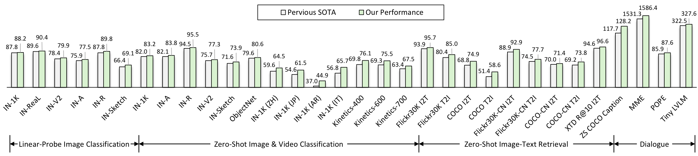
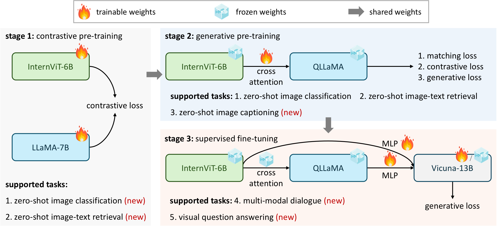
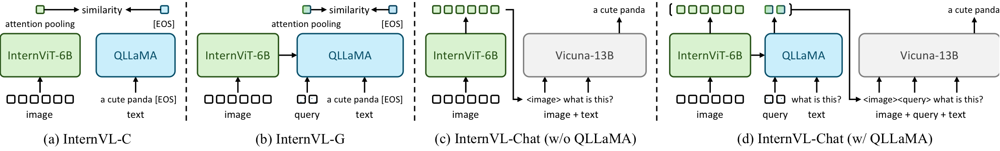
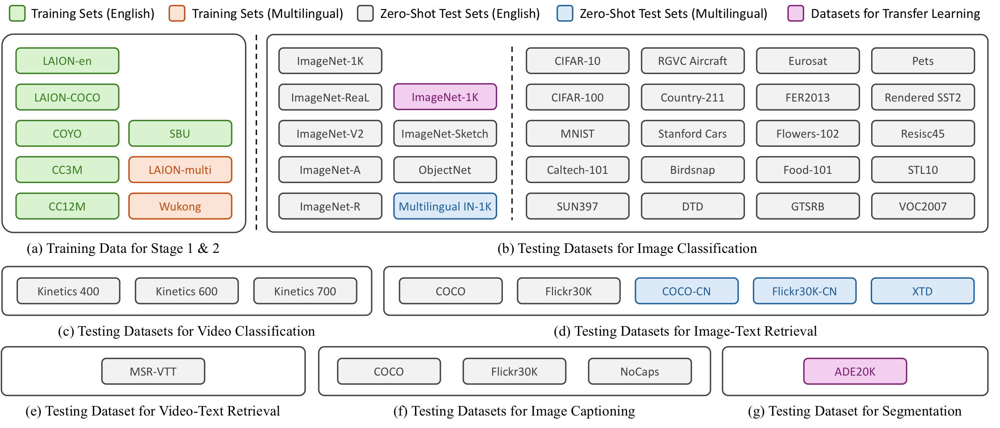

# Introduction

Large language models (LLMs) largely promote the development of artificial general intelligence (AGI) systems with their impressive capabilities in open-world language tasks, and their model scale and performance are still increasing at a fast pace. Vision large language models (VLLMs) , which leverage LLMs, have also achieved significant breakthroughs, enabling sophisticated vision-language dialogues and interactions. However, the progress of vision and vision-language foundation models, which are also crucial for VLLMs, has lagged behind the rapid growth of LLMs.

**Figure 1.** **Comparisons of different vision and vision-language foundation models.** `(a)` indicates the traditional vision foundation model, e.g. ResNet [@he2016deep] pre-trained on classification tasks. `(b)` represents vision-language foundation models such as CLIP [@radford2021clip] pre-trained on image-text pairs. `(c)` is InternVL, which aligns a large-scale vision foundation model with a large language model and supports both contrastive and generative tasks.

**Figure 2.** **Comparison results on various generic visual-linguistic tasks**, including image classification, video classification, image-text retrieval, image captioning, and multi-modal dialogue. The proposed InternVL achieves the best performance on all these tasks. Note that only the models trained on public data are included. “IN" is an abbreviation for ImageNet .

To bridge vision models with LLMs, existing VLLMs commonly employ lightweight “glue" layers, such as QFormer or linear projection , to align features of vision and language models. Such alignment contains several limitations: (1) *Disparity in parameter scales.* The large LLMs  now boosts up to 1000 billion parameters, while the widely-used vision encoders of VLLMs are still around one billion. This gap may lead to the under-use of LLM’s capacity. (2) *Inconsistent representation.* Vision models, trained on pure-vision data or aligned with the BERT series , often exhibit representation inconsistencies with LLMs. (3) *Inefficient connection.* The “glue” layers are usually lightweight and randomly initialized, which may not capture the rich cross-modal interactions and dependencies that are crucial for multi-modal understanding and generation.

These limitations reveal a large gap in both parameter scale and feature representation ability between the vision encoder and the LLM. To bridge this gap, *our inspiration lies in elevating the vision encoder to align with the parameter scale of the LLM and subsequently harmonizing their representations.* However, the training of such large-scale models necessitates a vast amount of image-text data obtained from the Internet. The significant heterogeneity and quality variations within this data pose considerable challenges to the training process. To enhance the efficacy of the training, generative supervision is considered as a complementary approach to contrastive learning, as depicted in Figure 1. This strategy aims to provide additional guidance to the model during training. Yet, the suitability of low-quality data for generative training remains a concern. Besides, how to effectively represent the users’ commands and align the representations between the vision encoder and LLM is another open question.

To address these issues, we formulate the *InternVL, a large-scale vision-language foundation model, which aligns the representation of the scaled-up vision encoder with the LLM and achieves state-of-the-art performance on various visual and vision-language tasks.* As shown in Figure 1 (c), InternVL has three key designs: (1) *Parameter-balanced vision and language components*: It includes a vision encoder scaled up to 6 billion parameters and an LLM middleware with 8 billion parameters, where the middleware functions as a substantial “glue” layer to reorganize visual features based on user commands. Unlike prior vision-only (Figure 1 (a)) or dual-tower (Figure 1 (b)) structures, our vision encoder and middleware offer flexible combinations for both contrastive and generative tasks. (2) *Consistent representations*: To maintain the consistency of representations between the vision encoder and LLM, we employ a pre-trained multilingual LLaMA , to initialize the middleware and align the vision encoder with it. (3) *Progressive image-text alignment*: We leverage image-text data from diverse sources, ensuring training stability through a progressive alignment strategy. This strategy initiates contrastive learning on large-scale noisy image-text data and subsequently transitions to generative learning on fine-grained data. This approach ensures a consistent enhancement of model performance and task scope.

These designs endow our model with several advantages: (1) *Versatile.* It functions as a standalone vision encoder for perception tasks, or collaborates with the language middleware for vision-language tasks and multi-modal dialogue systems. The language middleware bridges the gap between the vision encoder and the LLM decoder. (2) *Strong.* By leveraging the training strategy, large-scale parameters, and web-scale data, our model has a powerful representation that helps to achieve state-of-the-art results on various vision and vision-language tasks, as shown in Figure 1. (3) *LLM-friendly.* Due to the aligned feature space with LLMs, our model can smoothly integrate with existing LLMs, such as LLaMA series , Vicuna , and InternLM . These features distinguish our model from the previous approaches and establish a leading vision-language foundation model for various applications.

In summary, our contribution has three folds:

\(1\) We present a large-scale vision-language foundation model—InternVL, which aligns the large-scale vision encoder with LLMs for the first time. The model demonstrates strong performance on a wide range of generic visual-linguistic tasks, including visual perception tasks, vision-language tasks, and multi-modal dialogue.

\(2\) We introduce a progressive image-text alignment strategy for the efficient training of large-scale vision-language foundation models. This strategy maximizes the utilization of web-scale noisy image-text data for contrastive learning and fine-grained, high-quality data for generative learning.

\(3\) We extensively compare the proposed model with the current state-of-the-art vision foundation models and VLLMs. The results indicate that InternVL achieves leading performance on a broad range of generic visual-linguistic tasks, including image classification (ImageNet), semantic segmentation (ADE20K), video classification (Kinetics), image-text retrieval (Flickr30K & COCO), video-text retrieval (MSR-VTT), and image captioning (COCO & Flickr30K & NoCaps). Meanwhile, it is also effective for multi-modal dialogue (MME & POPE & Tiny LVLM).

# Related Work

**Figure 3.** **The training strategy of the proposed InternVL model.** It consists of three progressive stages, including vision-language contrastive training, vision-language generative training, and supervised fine-tuning. These stages effectively leverage public data from diverse sources, ranging from noisy image-text pairs on the web to high-quality caption, VQA, and multi-modal dialogue datasets.

## Vision Foundation Models

The past decade has witnessed significant development in foundation models within the field of computer vision. Starting with the pioneering AlexNet , a variety of convolutional neural networks (CNNs) have emerged, continuously refreshing the ImageNet benchmark . In particular, the introduction of residual connections  effectively addressed the problem of vanishing gradients. This breakthrough led to an era of “big & deep" neural networks, signifying that, with adequate training and data, larger and deeper models can achieve better performance. In other words, scaling up matters.

In recent years, ViT  has opened up new possibilities for network architectures in the computer vision field. ViT and its variants have significantly increased their capacity and excelled in various important visual tasks. In the LLM era, these vision foundation models often connect with LLMs through some lightweight “glue” layers . However, a gap exists as these models primarily derive from visual-only datasets like ImageNet or JFT , or are aligned with the BERT series using image-text pairs, lacking direct alignment with LLMs. Additionally, the prevalent vision models employed to connect with LLMs are still limited to around 1 billion parameters , which also constrains the performance of VLLMs.

## Large Language Models

Large language models (LLMs) have revolutionized the field of artificial intelligence, enabling natural language processing tasks that were previously thought exclusive to humans . The emergence of GPT-3  brought a significant leap in capabilities, particularly in few-shot and zero-shot learning, highlighting the immense potential of LLMs. This promise was further realized with the advancements of ChatGPT and GPT-4 . The progress in the field has been further accelerated by the emergence of open-source LLMs, including the LLaMA series , Vicuna , InternLM , MOSS , ChatGLM , Qwen , Baichuan , and Falcon , among others . However, in real scenarios, interactions are not limited to natural language. The vision modality can bring additional information, which means more possibilities. Therefore, exploring how to utilize the excellent capabilities of LLMs for multi-modal interactions is poised to become the next research trend.

## Vision Large Language Models

Recent advancements have seen the creation of vision large language models (VLLMs) , which aim to enhance language models with the capability to process and interpret visual information. Flamingo  uses the visual and language inputs as prompts and shows remarkable few-shot performance for visual question answering. Subsequently, GPT-4 , LLaVA series  and MiniGPT-4 have brought in visual instruction tuning, to improve the instruction-following ability of VLLMs. Concurrently, models such as VisionLLM , KOSMOS-2 , and Qwen-VL have improved VLLMs with visual grounding capabilities, facilitating tasks such as region description and localization. Many API-based methods  have also attempted to integrate vision APIs with LLMs for solving vision-centric tasks. Additionally, PaLM-E  and EmbodiedGPT  represent advanced efforts in adapting VLLMs for embodied applications, significantly expanding their potential applications. These works showcase that VLLMs have achieved significant breakthroughs. However, the progress of vision and vision-language foundation models, equally essential for VLLMs, has not kept pace.

# Proposed Method

## Overall Architecture

As depicted in Figure 2, unlike traditional vision-only backbones  and dual-encoder models , the proposed InternVL is designed with a vision encoder InternViT-6B and a language middleware QLLaMA. Specifically, InternViT-6B is a vision transformer with 6 billion parameters, customized to achieve a favorable trade-off between performance and efficiency. QLLaMA is a language middleware with 8 billion parameters, initialized with a multilingual-enhanced LLaMA . It could provide robust multilingual representation for image-text contrastive learning, or serve as a bridge to connect the vision encoder and the off-the-shelf LLM decoder.

To align the two large-scale components with substantial gaps in modalities and structures, we introduce a progressive alignment training strategy. The training strategy is conducted progressively, beginning with contrastive learning on large-scale noisy data, and gradually moving towards generative learning on exquisite and high-quality data. In this way, we ensure the effective organization and full utilization of web-scale image-text data from a variety of sources. Then, equipped with the aligned vision encoder and language middleware, our model functions like a Swiss Army knife. It boasts a flexible composition that can be adapted for a wide array of generic visual-linguistic tasks. These tasks range from visual perception and image/video-text retrieval to image captioning, visual question answering, and multi-modal dialogue, among others. The supported usage modes are summarized in Figure 4.

**Table 1.** Architecture details of the InternViT-6B model.

| Name | Width | Depth | MLP | #heads | #param (M) |
| --- | ---: | ---: | ---: | ---: | ---: |
| ViT-G [@zhai2022scaling] | 1664 | 48 | 8192 | 16 | 1843 |
| ViT-e [@chen2022pali] | 1792 | 56 | 15360 | 16 | 3926 |
| EVA-02-ViT-E [@sun2023evaclip] | 1792 | 64 | 15360 | 16 | 4400 |
| ViT-6.5B [@singh2023maws] | 4096 | 32 | 16384 | 32 | 6440 |
| ViT-22B [@dehghani2023vit22b] | 6144 | 48 | 24576 | 48 | 21743 |
| InternViT-6B (ours) | 3200 | 48 | 12800 | 25 | 5903 |

**Figure 4.** **Different ways to use InternVL.** By flexibly combining the vision encoder and the language middleware, InternVL can support various vision-language tasks, including contrastive tasks, generative tasks, and multi-modal dialogue.

## Model Design

**Large-Scale Vision Encoder: InternViT-6B.** We implement the vision encoder of InternVL with vanilla vision transformer (ViT) . To match the scale of LLMs, we scale up the vision encoder to 6 billion parameters, resulting in the InternViT-6B model. To obtain a good trade-off between accuracy, speed, and stability, we conduct a hyperparameter search for InternViT-6B. We vary the model depth within {32, 48, 64, 80}, the head dimension within {64, 128}, and the MLP ratio within {4, 8}. The model width and the head number are calculated based on the given model scale and other hyperparameters.

We employ contrastive learning on a 100M subset of the LAION-en dataset to measure the accuracy, speed, and stability of InternViT-6B variants with different configurations. We report the following findings: (1) *Speed.* For different model settings, when computation is not saturated, the models with smaller depths exhibit faster speed per image. However, as the GPU computation is fully utilized, the speed difference becomes negligible; (2) *Accuracy.* With the same number of parameters, the depth, head dimension, and MLP ratio have little impact on the performance. Based on these findings, we identified the most stable configuration for our final model, as shown in Table 1.

**Language Middleware: QLLaMA.** The language middleware QLLaMA is proposed to align visual and linguistic features. As shown in Figure 2, QLLaMA is developed based on the pre-trained multilingual LLaMA , and newly added 96 learnable queries and cross-attention layers (1 billion parameters) that are randomly initialized. This manner allows QLLaMA to smoothly integrate visual elements into the language model, thereby enhancing the coherence and effectiveness of the combined features.

Compared to recently popular approaches  that use lightweight “glue” layers, such as QFormer  and linear layers  to connect vision encoder and LLMs, our method has three advantages: (1) By initializing with the pre-trained weights of , QLLaMA can transform image tokens generated by InternViT-6B into the representation that is aligned with the LLMs; (2) QLLaMA has 8 billion parameters for vision-language alignment, which are 42 times larger than the QFormer. Therefore, even with a frozen LLM decoder, InternVL can achieve promising performance on multi-modal dialogue tasks. (3) It can also be applied to contrastive learning, providing a powerful text representation for image-text alignment tasks, such as zero-shot image classification and image-text retrieval.

**“Swiss Army Knife” Model: InternVL.** By flexibly combining the vision encoder and the language middleware, InternVL can support various vision or vision-language tasks.

\(1\) *For visual perception tasks*, the vision encoder of InternVL, InternViT-6B, can be used as the backbone for vision tasks. Given an input image $`I\in\mathbb{R}^{H\times W\times 3}`$, our model can generate a feature map $`F\in \mathbb{R}^{H/14\times W/14\times D}`$ for dense prediction tasks, or work with global average pooling and linear projection to make image classification.

**Table 2.** Details of the training data for InternVL in stage 1 and stage 2. Among them, LAION-en [@schuhmann2022laion5b], LAION-multi [@schuhmann2022laion5b], COYO [@byeon2022coyo], and Wukong [@gu2022wukong] are web-scale image-text pairs data. LAION-COCO [@schuhmann2022laioncoco] is a synthetic dataset with high-quality captions from LAION-en. CC12M [@changpinyo2021cc12m], CC3M [@sharma2018cc3m], and SBU [@ordonez2011sbu] are academic caption datasets. "Multi" means multilingual.

| Dataset | Language | Original | Stage 1 Cleaned | Stage 1 Remain | Stage 2 Cleaned | Stage 2 Remain |
| --- | --- | ---: | ---: | ---: | ---: | ---: |
| LAION-en [@schuhmann2022laion5b] | English | 2.3B | 1.94B | 84.3% | 91M | 4.0% |
| LAION-COCO [@schuhmann2022laioncoco] | English | 663M | 550M | 83.0% | 550M | 83.0% |
| COYO [@byeon2022coyo] | English | 747M | 535M | 71.6% | 200M | 26.8% |
| CC12M [@changpinyo2021cc12m] | English | 12.4M | 11.1M | 89.5% | 11.1M | 89.5% |
| CC3M [@sharma2018cc3m] | English | 3.0M | 2.6M | 86.7% | 2.6M | 86.7% |
| SBU [@ordonez2011sbu] | English | 1.0M | 1.0M | 100% | 1.0M | 100% |
| Wukong [@gu2022wukong] | Chinese | 100M | 69.4M | 69.4% | 69.4M | 69.4% |
| LAION-multi [@schuhmann2022laion5b] | Multi | 2.2B | 1.87B | 85.0% | 100M | 4.5% |
| Total | Multi | 6.03B | 4.98B | 82.6% | 1.03B | 17.0% |

\(2\) *For contrastive tasks*, as shown in Figure 3 (a) (b), we introduce two inference modes: **InternVL-C** and **InternVL-G**, using the vision encoder or the combination of InternViT and QLLaMA to encode visual features. Specifically, we apply attention pooling to the visual features of InternViT or the query features of QLLaMA, to calculate the global visual feature $`I_{f}`$. Besides, we encode text as $`T_{f}`$ by extracting the feature from the `[EOS]` token of QLLaMA. By computing similarity scores between $`I_{f}`$ and $`T_{f}`$, we support various contrastive tasks such as image-text retrieval.

\(3\) *For generative tasks*, unlike QFormer , QLLaMA inherently has promising image captioning abilities thanks to its scaled-up parameters. The queries of QLLaMA reorganize the visual representations from InternViT-6B and play as the prefix texts for QLLaMA. The subsequent text tokens are generated one by one sequentially.

\(4\) *For multi-modal dialogue*, we introduce **InternVL-Chat**, leveraging InternVL as the visual component to connect with LLMs. For this purpose, we have two distinct configurations. One option is to employ the InternViT-6B independently, as shown in Figure 3 (c). The alternative is to employ the complete InternVL model concurrently, as illustrated in Figure 3 (d).

**Table 3.** Details of the training data for InternVL in stage 3. We collect a wide range of high-quality instruction data, totaling approximately 4 million samples. For a fair comparison, we only use the training split of these datasets.

| Task | #samples | Dataset |
| --- | ---: | --- |
| Captioning | 588K | COCO Caption [@chen2015cococaption], TextCaps [@sidorov2020textcaps] |
| VQA | 1.1M | VQAv2 [@goyal2017vqav2], OKVQA [@marino2019okvqa], A-OKVQA [@schwenk2022aokvqa], IconQA [@lu2021iconqa], AI2D [@kembhavi2016ai2d], GQA [@hudson2019gqa] |
| OCR | 294K | OCR-VQA [@mishra2019ocrvqa], ChartQA [@masry2022chartqa], DocVQA [@clark2017docqa], ST-VQA [@biten2019stvqa], EST-VQA [@wang2020estvqa], InfoVQA [@mathew2022infographicvqa], LLaVAR [@zhang2023llavar] |
| Grounding | 323K | RefCOCO/+/g [@yu2016refcoco; @mao2016refcocog], Toloka [@ustalov2023toloka] |
| Grounded Cap. | 284K | RefCOCO/+/g [@yu2016refcoco; @mao2016refcocog] |
| Conversation | 1.4M | LLaVA-150K [@liu2023llava], SVIT [@zhao2023svit], VisDial [@das2017visdial], LRV-Instruction [@liu2023lrv-instruction], LLaVA-Mix-665K [@liu2023improved] |

## Alignment Strategy

As shown in Figure 2, the training of InternVL consists of three progressive stages, including vision-language contrastive training, vision-language generative training, and supervised fine-tuning. These stages effectively leverage public data from diverse sources, ranging from noisy image-text pairs on the web to high-quality caption, VQA, and multi-modal dialogue datasets.

**Vision-Language Contrastive Training.** In the first stage, we conduct contrastive learning to align InternViT-6B with a multilingual LLaMA-7B on web-scale, noisy image-text pairs. The data are all publicly available and comprise multilingual content, including LAION-en , LAION-multi , LAION-COCO , COYO , Wukong , etc. We use the combination of these datasets and filter out some extremely low-quality data to train our model. As summarized in Table 2, the original dataset contains 6.03 billion image-text pairs, and 4.98 billion remains after cleaning. More details about data preparation will be provided in the supplementary materials.

During training, we adopt the LLaMA-7B to encode the text as $`T_{f}`$, and use InternViT-6B to extract the visual feature $`I_{f}`$. Following the objective function of CLIP , we minimize a symmetric cross-entropy loss on the similarity scores of image-text pairs in a batch. This stage allows InternVL to excel on contrastive tasks like zero-shot image classification and image-text retrieval, and the vision encoder of this stage can also perform well on visual perception tasks like semantic segmentation.

**Vision-Language Generative Training**. In the second stage of training, we connect InternViT-6B with QLLaMA and adopt a generative training strategy. Specifically, QLLaMA inherits the weights of LLaMA-7B in the first stage. We keep both InternViT-6B and QLLaMA frozen and only train the newly added learnable queries and cross-attention layers with filtered, high-quality data. Table 2 summarizes the datasets for the second stage. It can be seen that we further filtered out data with low-quality captions, reducing it from 4.98 billion in the first stage to 1.03 billion.

Following the loss function of BLIP-2 , the loss in this stage is computed as the sum of three components: image-text contrastive (ITC) loss, image-text matching (ITM) loss, and image-grounded text generation (ITG) loss. This enables the queries to extract powerful visual representations, and further align feature space with LLMs, attributable to the effective training objectives and the utilization of our large-scale, LLM-initialized QLLaMA.

**Table 4.** Linear evaluation on image classification. We report the top-1 accuracy on ImageNet-1K and its variants. `*` ViT-22B uses the private JFT-3B dataset [@zhai2022scaling].

| Method | #param | IN-1K | IN-ReaL | IN-V2 | IN-A | IN-R | IN-Ske | Avg. |
| --- | ---: | ---: | ---: | ---: | ---: | ---: | ---: | ---: |
| OpenCLIP-H [@openclip] | 0.6B | 84.4 | 88.4 | 75.5 | - | - | - | - |
| OpenCLIP-G [@openclip] | 1.8B | 86.2 | 89.4 | 77.2 | 63.8 | 87.8 | 66.4 | 78.5 |
| DINOv2-g [@oquab2023dinov2] | 1.1B | 86.5 | 89.6 | 78.4 | 75.9 | 78.8 | 62.5 | 78.6 |
| EVA-01-CLIP-g [@fang2022eva] | 1.1B | 86.5 | 89.3 | 77.4 | 70.5 | 87.7 | 63.1 | 79.1 |
| MAWS-ViT-6.5B [@singh2023maws] | 6.5B | 87.8 | - | - | - | - | - | - |
| ViT-22B* [@dehghani2023vit22b] | 21.7B | 89.5 | 90.9 | 83.2 | 83.8 | 87.4 | - | - |
| InternViT-6B (ours) | 5.9B | **88.2** | **90.4** | **79.9** | **77.5** | **89.8** | **69.1** | **82.5** |

**Table 5.** Semantic segmentation on ADE20K. Results show that InternViT-6B has better pixel-level perceptual capacity.

Part A: few-shot semantic segmentation with limited training data. Following ViT-22B [@dehghani2023vit22b], we fine-tune InternViT-6B with a linear classifier.

| Method | #param | Crop Size | 1/16 | 1/8 | 1/4 | 1/2 | 1 |
| --- | ---: | --- | ---: | ---: | ---: | ---: | ---: |
| ViT-L [@touvron2022deit3] | 0.3B | 504^2 | 36.1 | 41.3 | 45.6 | 48.4 | 51.9 |
| ViT-G [@zhai2022scaling] | 1.8B | 504^2 | 42.4 | 47.0 | 50.2 | 52.4 | 55.6 |
| ViT-22B [@dehghani2023vit22b] | 21.7B | 504^2 | 44.7 | 47.2 | 50.6 | 52.5 | 54.9 |
| InternViT-6B (ours) | 5.9B | 504^2 | **46.5** | **50.0** | **53.3** | **55.8** | **57.2** |

Part B: semantic segmentation performance in three different settings, from top to bottom: linear probing, head tuning, and full-parameter tuning.

| Method | Decoder | #param (train/total) | Crop Size | mIoU |
| --- | --- | --- | --- | ---: |
| OpenCLIP-G_frozen [@openclip] | Linear | 0.3M / 1.8B | 512^2 | 39.3 |
| ViT-22B_frozen [@dehghani2023vit22b] | Linear | 0.9M / 21.7B | 504^2 | 34.6 |
| InternViT-6B_frozen (ours) | Linear | 0.5M / 5.9B | 504^2 | **47.2** |
| ViT-22B_frozen [@dehghani2023vit22b] | UperNet | 0.8B / 22.5B | 504^2 | 52.7 |
| InternViT-6B_frozen (ours) | UperNet | 0.4B / 6.3B | 504^2 | **54.9** |
| ViT-22B [@dehghani2023vit22b] | UperNet | 22.5B / 22.5B | 504^2 | 55.3 |
| InternViT-6B (ours) | UperNet | 6.3B / 6.3B | 504^2 | **58.9** |

**Supervised Fine-tuning.** To demonstrate the benefits of InternVL in creating multi-modal dialogue systems, we connect it with an off-the-shelf LLM decoder (, Vicuna  or InternLM ) through an MLP layer, and conduct supervised fine-tuning (SFT). As detailed in Table 3, we collect a wide range of high-quality instruction data, totaling approximately 4 million samples. For non-dialogue datasets, we follow the method described in for conversion. Owing to the similar feature space of QLLaMA and LLMs, we can achieve robust performance even when freezing the LLM decoder, choosing to train just the MLP layer or both the MLP layer and QLLaMA. This approach not only expedites the SFT process but also maintains the original language capabilities of the LLMs.

**Table 6.** Comparison of zero-shot image classification performance. `Delta` down-arrow denotes the gap between the averaged top-1 accuracy and the IN-1K top-1 accuracy. `*` CoCa and LiT-22B use the private JFT-3B dataset during training. Multilingual evaluation involves five languages: English (EN), Chinese (ZH), Japanese (JP), Arabic (AR), and Italian (IT).

Part A: ImageNet variants and ObjectNet.

| Method | IN-1K | IN-A | IN-R | IN-V2 | IN-Sketch | ObjectNet | Delta down | Avg. |
| --- | ---: | ---: | ---: | ---: | ---: | ---: | ---: | ---: |
| OpenCLIP-H [@openclip] | 78.0 | 59.3 | 89.3 | 70.9 | 66.6 | 69.7 | 5.7 | 72.3 |
| OpenCLIP-g [@openclip] | 78.5 | 60.8 | 90.2 | 71.7 | 67.5 | 69.2 | 5.5 | 73.0 |
| OpenAI CLIP-L+ [@radford2021clip] | 76.6 | 77.5 | 89.0 | 70.9 | 61.0 | 72.0 | 2.1 | 74.5 |
| EVA-01-CLIP-g [@sun2023evaclip] | 78.5 | 73.6 | 92.5 | 71.5 | 67.3 | 72.3 | 2.5 | 76.0 |
| OpenCLIP-G [@openclip] | 80.1 | 69.3 | 92.1 | 73.6 | 68.9 | 73.0 | 3.9 | 76.2 |
| EVA-01-CLIP-g+ [@sun2023evaclip] | 79.3 | 74.1 | 92.5 | 72.1 | 68.1 | 75.3 | 2.4 | 76.9 |
| MAWS-ViT-2B [@singh2023maws] | 81.9 | - | - | - | - | - | - | - |
| EVA-02-CLIP-E+ [@sun2023evaclip] | 82.0 | 82.1 | 94.5 | 75.7 | 71.6 | 79.6 | 1.1 | 80.9 |
| CoCa* [@yu2022coca] | 86.3 | 90.2 | 96.5 | 80.7 | 77.6 | 82.7 | 0.6 | 85.7 |
| LiT-22B* [@dehghani2023vit22b; @zhai2022lit] | 85.9 | 90.1 | 96.0 | 80.9 | - | 87.6 | - | - |
| InternVL-C (ours) | **83.2** | **83.8** | **95.5** | **77.3** | **73.9** | **80.6** | **0.8** | **82.4** |

Part B: Multilingual ImageNet-1K.

| Method | EN | ZH | JP | AR | IT | Avg. |
| --- | ---: | ---: | ---: | ---: | ---: | ---: |
| M-CLIP [@carlsson2022mclip] | - | - | - | - | 20.2 | - |
| CLIP-Italian [@bianchi2021clip_italian] | - | - | - | - | 22.1 | - |
| Japanese-CLIP-ViT-B [@japanese-clip] | - | - | 54.6 | - | - | - |
| Taiyi-CLIP-ViT-H [@fengshenbang] | - | 54.4 | - | - | - | - |
| WuKong-ViT-L-G [@gu2022wukong] | - | 57.5 | - | - | - | - |
| CN-CLIP-ViT-H [@yang2022cnclip] | - | 59.6 | - | - | - | - |
| AltCLIP-ViT-L [@chen2022altclip] | 74.5 | 59.6 | - | - | - | - |
| EVA-02-CLIP-E+ [@sun2023evaclip] | 82.0 | 3.6 | 5.0 | 0.2 | 41.2 | - |
| OpenCLIP-XLM-R-B [@openclip] | 62.3 | 42.7 | 37.9 | 26.5 | 43.7 | 42.6 |
| OpenCLIP-XLM-R-H [@openclip] | 77.0 | 55.7 | 53.1 | 37.0 | 56.8 | 55.9 |
| InternVL-C (ours) | **83.2** | **64.5** | **61.5** | **44.9** | **65.7** | **64.0** |

**Table 7.** Comparison of zero-shot image-text retrieval performance. We evaluate English retrieval using Flickr30K [@plummer2015flickr30k] and COCO [@chen2015cococaption], and Chinese retrieval using Flickr30K-CN [@lan2017flickrcn] and COCO-CN [@li2019cococn]. `dagger` BLIP-2 is finetuned on COCO and zero-shot transferred to Flickr30K.

Part A: English retrieval.

| Method | Multilingual | Flickr30K I->T R@1 | R@5 | R@10 | Flickr30K T->I R@1 | R@5 | R@10 | COCO I->T R@1 | R@5 | R@10 | COCO T->I R@1 | R@5 | R@10 | Avg. |
| --- | --- | ---: | ---: | ---: | ---: | ---: | ---: | ---: | ---: | ---: | ---: | ---: | ---: | ---: |
| Florence [@yuan2021florence] | x | 90.9 | 99.1 | - | 76.7 | 93.6 | - | 64.7 | 85.9 | - | 47.2 | 71.4 | - | - |
| ONE-PEACE [@wang2023onepeace] | x | 90.9 | 98.8 | 99.8 | 77.2 | 93.5 | 96.2 | 64.7 | 86.0 | 91.9 | 48.0 | 71.5 | 79.6 | 83.2 |
| OpenCLIP-H [@openclip] | x | 90.8 | 99.3 | 99.7 | 77.8 | 94.1 | 96.6 | 66.0 | 86.1 | 91.9 | 49.5 | 73.4 | 81.5 | 83.9 |
| OpenCLIP-g [@openclip] | x | 91.4 | 99.2 | 99.6 | 77.7 | 94.1 | 96.9 | 66.4 | 86.0 | 91.8 | 48.8 | 73.3 | 81.5 | 83.9 |
| OpenCLIP-XLM-R-H [@openclip] | check | 91.8 | 99.4 | 99.8 | 77.8 | 94.1 | 96.5 | 65.9 | 86.2 | 92.2 | 49.3 | 73.2 | 81.5 | 84.0 |
| EVA-01-CLIP-g+ [@sun2023evaclip] | x | 91.6 | 99.3 | 99.8 | 78.9 | 94.5 | 96.9 | 68.2 | 87.5 | 92.5 | 50.3 | 74.0 | 82.1 | 84.6 |
| CoCa [@yu2022coca] | x | 92.5 | 99.5 | 99.9 | 80.4 | 95.7 | 97.7 | 66.3 | 86.2 | 91.8 | 51.2 | 74.2 | 82.0 | 84.8 |
| OpenCLIP-G [@openclip] | x | 92.9 | 99.3 | 99.8 | 79.5 | 95.0 | 97.1 | 67.3 | 86.9 | 92.6 | 51.4 | 74.9 | 83.0 | 85.0 |
| EVA-02-CLIP-E+ [@sun2023evaclip] | x | 93.9 | 99.4 | 99.8 | 78.8 | 94.2 | 96.8 | 68.8 | 87.8 | 92.8 | 51.1 | 75.0 | 82.7 | 85.1 |
| BLIP-2 dagger [@li2023blip2] | x | 97.6 | 100.0 | 100.0 | 89.7 | 98.1 | 98.9 | - | - | - | - | - | - | - |
| InternVL-C (ours) | check | 94.7 | 99.6 | 99.9 | 81.7 | 96.0 | 98.2 | 70.6 | 89.0 | 93.5 | 54.1 | 77.3 | 84.6 | 86.6 |
| InternVL-G (ours) | check | **95.7** | **99.7** | **99.9** | **85.0** | **97.0** | **98.6** | **74.9** | **91.3** | **95.2** | **58.6** | **81.3** | **88.0** | **88.8** |

Part B: Chinese retrieval.

| Method | Multilingual | Flickr30K-CN I->T R@1 | R@5 | R@10 | Flickr30K-CN T->I R@1 | R@5 | R@10 | COCO-CN I->T R@1 | R@5 | R@10 | COCO-CN T->I R@1 | R@5 | R@10 | Avg. |
| --- | --- | ---: | ---: | ---: | ---: | ---: | ---: | ---: | ---: | ---: | ---: | ---: | ---: | ---: |
| WuKong-ViT-L [@gu2022wukong] | x | 76.1 | 94.8 | 97.5 | 51.7 | 78.9 | 86.3 | 55.2 | 81.0 | 90.6 | 53.4 | 80.2 | 90.1 | 78.0 |
| R2D2-ViT-L [@xie2022zero] | x | 77.6 | 96.7 | 98.9 | 60.9 | 86.8 | 92.7 | 63.3 | 89.3 | 95.7 | 56.4 | 85.0 | 93.1 | 83.0 |
| Taiyi-CLIP-ViT-H [@fengshenbang] | x | - | - | - | - | - | - | - | - | - | 60.0 | 84.0 | 93.3 | - |
| AltCLIP-ViT-H [@chen2022altclip] | check | 88.9 | 98.5 | 99.5 | 74.5 | 92.0 | 95.5 | - | - | - | - | - | - | - |
| CN-CLIP-ViT-H [@yang2022cnclip] | x | 81.6 | 97.5 | 98.8 | 71.2 | 91.4 | 95.5 | 63.0 | 86.6 | 92.9 | 69.2 | 89.9 | 96.1 | 86.1 |
| OpenCLIP-XLM-R-H [@openclip] | check | 86.1 | 97.5 | 99.2 | 71.0 | 90.5 | 94.9 | 70.0 | 91.5 | 97.0 | 66.1 | 90.8 | 96.0 | 87.6 |
| InternVL-C (ours) | check | 90.3 | 98.8 | 99.7 | 75.1 | 92.9 | 96.4 | 68.8 | 92.0 | 96.7 | 68.9 | 91.9 | 96.5 | 89.0 |
| InternVL-G (ours) | check | **92.9** | **99.4** | **99.8** | **77.7** | **94.8** | **97.3** | **71.4** | **93.9** | **97.7** | **73.8** | **94.4** | **98.1** | **90.9** |

# Experiments

## Implementation Details

**Stage 1.** In this stage, the image encoder InternViT-6B is randomly initialized , and the text encoder LLaMA-7B is initialized with the pre-trained weights from . All parameters are fully trainable.

**Stage 2.** In this stage, InternViT-6B and QLLaMA inherit their weights from the first stage, while the new learnable queries and cross-attention layers in QLLaMA are randomly initialized. Benefiting from the powerful representations learned in the first stage, we keep both InternViT-6B and QLLaMA frozen and only train the new parameters.

**Stage 3.** At this stage, we have two different configurations. One is to use InternViT-6B separately, as shown in Figure 3 (c). The other is to use the entire InternVL model simultaneously, as shown in Figure 3 (d). More details will be provided in the supplementary materials.

## Visual Perception Benchmarks

First of all, we validate the visual perception capabilities of InternViT-6B, the most core component of InternVL.

**Transfer to Image Classification.** We evaluate the quality of visual representation produced by InternViT-6B using the ImageNet-1K dataset. Following common practices , we adopt the linear probing evaluation, training a linear classifier while keeping the backbone frozen. In addition to the ImageNet-1K validation set, we also report performance metrics on several ImageNet variants , to benchmark the domain generalization capability. As shown in Table 4, InternViT-6B achieves a very significant improvement over previous state-of-the-art methods on linear probing. To our knowledge, this represents the currently best linear evaluation results without the JFT dataset .

**Transfer to Semantic Segmentation.** To investigate the pixel-level perceptual capacity of InternViT-6B, we conduct extensive experiments of semantic segmentation on the ADE20K  dataset. Following ViT-22B , we begin with few-shot learning experiments, fine-tuning the backbone with a linear head on a limited dataset. As indicated in Table 5, InternViT-6B consistently outperforms ViT-22B across five experiments with varying proportions of training data. Additionally, Table 5 presents our further verification in three distinct settings, including linear probing, head tuning , and full-parameter tuning. Notably, in the case of linear probing, InternViT-6B attains 47.2 mIoU, a substantial +12.6 mIoU improvement over ViT-22B. These results underscore the strong out-of-the-box pixel-level perceptual capacity of our InternViT-6B.

**Table 8.** Comparison of zero-shot video classification results on Kinetics 400/600/700. We report the top-1 accuracy and the mean of top-1 and top-5 accuracy. `#F` denotes the number of frames.

| Method | #F | K400 Top-1 | K400 Avg. | K600 Top-1 | K600 Avg. | K700 Top-1 | K700 Avg. |
| --- | ---: | ---: | ---: | ---: | ---: | ---: | ---: |
| OpenCLIP-g [@openclip] | 1 | - | 63.9 | - | 64.1 | - | 56.9 |
| OpenCLIP-G [@openclip] | 1 | - | 65.9 | - | 66.1 | - | 59.2 |
| EVA-01-CLIP-g+ [@sun2023evaclip] | 1 | - | 66.7 | - | 67.0 | - | 60.9 |
| EVA-02-CLIP-E+ [@sun2023evaclip] | 1 | - | 69.8 | - | 69.3 | - | 63.4 |
| InternVL-C (ours) | 1 | **65.9** | **76.1** | **65.5** | **75.5** | **56.8** | **67.5** |
| ViCLIP [@wang2023internvid] | 8 | 64.8 | 75.7 | 62.2 | 73.5 | 54.3 | 66.4 |
| InternVL-C (ours) | 8 | **69.1** | **79.4** | **68.9** | **78.8** | **60.6** | **71.5** |

**Table 9.** Comparison with SoTA methods on 9 benchmarks. Image captioning datasets include COCO Karpathy test [@chen2015cococaption], Flickr30K Karpathy test [@plummer2015flickr30k], and NoCaps val [@agrawal2019nocaps]. VQA datasets include VQAv2 test-dev [@goyal2017vqav2], GQA test-balanced [@hudson2019gqa], VizWiz test-dev [@gurari2018vizwiz], and TextVQA val [@singh2019textvqa]. `*` indicates that the training annotations of the datasets are observed during training. `IViT-6B` represents InternViT-6B.

| Method | Visual Encoder | Glue Layer | LLM | Res. | PT | SFT | Train. Param | COCO | Flickr | NoCaps | VQAv2 | GQA | VizWiz | VQAT | MME | POPE |
| --- | --- | --- | --- | ---: | ---: | ---: | ---: | ---: | ---: | ---: | ---: | ---: | ---: | ---: | ---: | ---: |
| InstructBLIP [@instructblip] | EVA-g | QFormer | Vicuna-7B | 224 | 129M | 1.2M | 188M | - | 82.4 | 123.1 | - | 49.2 | 34.5 | 50.1 | - | - |
| BLIP-2 [@li2023blip2] | EVA-g | QFormer | Vicuna-13B | 224 | 129M | - | 188M | - | 71.6 | 103.9 | 41.0 | 41.0 | 19.6 | 42.5 | 1293.8 | 85.3 |
| InstructBLIP [@instructblip] | EVA-g | QFormer | Vicuna-13B | 224 | 129M | 1.2M | 188M | - | 82.8 | 121.9 | - | 49.5 | 33.4 | 50.7 | 1212.8 | 78.9 |
| InternVL-Chat (ours) | IViT-6B | QLLaMA | Vicuna-7B | 224 | 1.0B | 4.0M | 64M | 141.4* | 89.7 | 120.5 | 72.3* | 57.7* | 44.5 | 42.1 | 1298.5 | 85.2 |
| InternVL-Chat (ours) | IViT-6B | QLLaMA | Vicuna-13B | 224 | 1.0B | 4.0M | 90M | 142.4* | 89.9 | 123.1 | 71.7* | 59.5* | 54.0 | 49.1 | 1317.2 | 85.4 |
| Shikra [@chen2023shikra] | CLIP-L | Linear | Vicuna-13B | 224 | 600K | 5.5M | 7B | 117.5* | 73.9 | - | 77.4* | - | - | - | - | - |
| IDEFICS-80B [@idefics2023] | CLIP-H | Cross-Attn | LLaMA-65B | 224 | 1.6B | - | 15B | 91.8* | 53.7 | 65.0 | 60.0 | 45.2 | 36.0 | 30.9 | - | - |
| IDEFICS-80B-I [@idefics2023] | CLIP-H | Cross-Attn | LLaMA-65B | 224 | 353M | 6.7M | 15B | 117.2* | 65.3 | 104.5 | 37.4 | - | 26.0 | - | - | - |
| Qwen-VL [@bai2023qwenvl] | CLIP-G | VL-Adapter | Qwen-7B | 448 | 1.4B dagger | 50M dagger | 9.6B | - | 85.8 | 121.4 | 78.8* | 59.3* | 35.2 | 63.8 | - | - |
| Qwen-VL-Chat [@bai2023qwenvl] | CLIP-G | VL-Adapter | Qwen-7B | 448 | 1.4B dagger | 50M dagger | 9.6B | - | 81.0 | 120.2 | 78.2* | 57.5* | 38.9 | **61.5** | 1487.5 | - |
| LLaVA-1.5 [@liu2023improved] | CLIP-L_336 | MLP | Vicuna-7B | 336 | 558K | 665K | 7B | - | - | - | 78.5* | 62.0* | 50.0 | 58.2 | 1510.7 | 85.9 |
| LLaVA-1.5 [@liu2023improved] | CLIP-L_336 | MLP | Vicuna-13B | 336 | 558K | 665K | 13B | - | - | - | 80.0* | 63.3* | 53.6 | 61.3 | 1531.3 | 85.9 |
| InternVL-Chat (ours) | IViT-6B | MLP | Vicuna-7B | 336 | 558K | 665K | 7B | - | - | - | 79.3* | 62.9* | 52.5 | 57.0 | 1525.1 | 86.4 |
| InternVL-Chat (ours) | IViT-6B | MLP | Vicuna-13B | 336 | 558K | 665K | 13B | - | - | - | 80.2* | 63.9* | 54.6 | 58.7 | 1546.9 | 87.1 |
| InternVL-Chat (ours) | IViT-6B | QLLaMA | Vicuna-13B | 336 | 1.0B | 4.0M | 13B | **146.2*** | **92.2** | **126.2** | **81.2*** | **66.6*** | **58.5** | **61.5** | **1586.4** | **87.6** |

**Table 10.** Comparison of zero-shot image captioning. QLLaMA inherently possesses promising zero-shot captioning capabilities thanks to its scaled-up parameters and datasets.

| Method | Glue Layer | LLM Decoder | COCO | Flickr30K | NoCaps |
| --- | --- | --- | ---: | ---: | ---: |
| Flamingo-9B [@alayrac2022flamingo] | Cross-Attn | Chinchilla-7B | 79.4 | 61.5 | - |
| Flamingo-80B [@alayrac2022flamingo] | Cross-Attn | Chinchilla-70B | 84.3 | 67.2 | - |
| KOSMOS-2 [@peng2023kosmos2] | Linear | KOSMOS-1 | - | 66.7 | - |
| PaLI-X-55B [@chen2023palix] | Linear | UL2-32B | - | - | **126.3** |
| BLIP-2 [@li2023blip2] | QFormer | Vicuna-13B | - | 71.6 | 103.9 |
| InstructBLIP [@instructblip] | QFormer | Vicuna-13B | - | 82.8 | 121.9 |
| Shikra-13B [@chen2023shikra] | Linear | Vicuna-13B | - | 73.9 | - |
| ASM [@wang2023allseeing] | QFormer | Husky-7B | - | **87.7** | 117.2 |
| Qwen-VL [@bai2023qwenvl] | VL-Adapter | Qwen-7B | - | 85.8 | 121.4 |
| Qwen-VL-Chat [@bai2023qwenvl] | VL-Adapter | Qwen-7B | - | 81.0 | 120.2 |
| Emu [@sun2023emu] | QFormer | LLaMA-13B | 112.4 | - | - |
| Emu-I [@sun2023emu] | QFormer | LLaMA-13B | 117.7 | - | - |
| DreamLLM [@dong2023dreamllm] | Linear | Vicuna-7B | 115.4 | - | - |
| InternVL-G (ours) | Cross-Attn | QLLaMA | **128.2** | 79.2 | 113.7 |

## Vision-Language Benchmarks

In this section, we evaluate the inherent capabilities of InternVL on various vision-language tasks.

**Zero-Shot Image Classification.** We conduct thorough validation of the zero-shot image classification capability of InternVL-C. As depicted in Table 6, InternVL-C attains leading performance on various ImageNet variants  and ObjectNet . Compared to EVA-02-CLIP-E+ , it exhibits stronger robustness to distribution shift, manifesting in a more consistent accuracy across ImageNet variants. Additionally, as shown in Table 6, our model showcases robust multilingual capabilities, outperforming competing models  on the multilingual ImageNet-1K benchmark.

**Zero-Shot Video Classification.** Following previous methods , we report the top-1 accuracy and the mean of top-1 and top-5 accuracy on Kinetics-400/600/700 . As shown in Table 8, when sampling only a single center frame in each video, our method achieves an average accuracy of 76.1%, 75.5%, and 67.5% on the three datasets, surpassing EVA-02-CLIP-E+  by +6.3, +6.2, and +4.1 points, respectively. Additionally, when uniformly sampling 8 frames in each video, we obtain at least 3.3 points of improvement compared to the single-frame setting, outperforming ViCLIP  trained using web-scale video data. In summary, InternVL-C exhibits remarkable generalization capabilities in video classification.

**Zero-Shot Image-Text Retrieval.** InternVL exhibits a powerful multilingual image-text retrieval capability. In Table 7, we evaluate these capabilities in English using the Flickr30K  and COCO  datasets, as well as in Chinese using the Flickr30K-CN  and COCO-CN . Additionally, we leverage the XTD dataset to evaluate the multilingual image-text retrieval capability across 8 languages (see supplementary materials). In summary, InternVL-C achieves state-of-the-art performance across most retrieval metrics, and with the second stage of pre-training, InternVL-G further enhances zero-shot image-text retrieval performance. These improvements in retrieval tasks suggest a more effective alignment between visual and linguistic features, through additional image encoding using the language middleware–QLLaMA.

**Zero-Shot Image Captioning.** Benefiting from vision-language generative training on a vast collection of high-quality image-text pairs, our QLLaMA possesses promising capability in zero-shot image captioning. As shown in Table 10, QLLaMA surpasses other models in zero-shot performance on the COCO Karpathy test set . It also achieves comparable results to current state-of-the-art models on both the Flickr30K Karpathy test  and the NoCaps val set . When InternVL is linked with an LLM (, Vicuna-7B/13B ) and subjected to SFT, a notable enhancement in zero-shot performance is observed for both Flickr30K and NoCaps, as shown in Table 9.

## Multi-Modal Dialogue Benchmarks

Beyond the traditional multi-modal tasks, the emergence of ChatGPT  has led to a growing focus on evaluating the performance of multi-modal models in real usage scenarios, specifically within the realm of multi-modal dialogue. We conducted testing of InternVL-Chat models on two prominent multi-modal dialogue benchmarks, including MME  and POPE . MME is a comprehensive benchmark that includes 14 sub-tasks focusing on the model’s perception and cognition capabilities. POPE is a popular dataset used to evaluate object hallucination. As shown in Table 9, it clearly demonstrates that our models exhibit superior performance compared with previous methods, under the condition of fair trainable parameter counts.

## Ablation Study

**Hyperparameters of InternViT-6B.** As discussed in Section <a href="#sec:model_design" data-reference-type="ref" data-reference="sec:model_design">3.2</a>, we explored variations in model depth {32, 48, 64, 80}, head dimension {64, 128}, and MLP ratio {4, 8}, resulting in 16 distinct models. In selecting the optimal model, we initially narrowed down our focus to 6 models, chosen based on their throughput, as listed in Table 11. These models underwent further evaluation using contrastive learning on a 100M subset of LAION-en  over 10K iterations. For the experimental setup, the primary difference was the use of a randomly initialized text encoder from CLIP-L , in order to speed up the training. For the sake of accuracy, inference speed, and training stability, we ultimately chose variant 3 as the final InternViT-6B.

**Table 11.** Comparison of hyperparameters in InternViT-6B. The throughput (img/s) and GFLOPs are measured at 224x224 input resolution, with a batch size of 1 or 128 on a single A100 GPU. Flash Attention [@dao2022flashattention] and bf16 precision are used during testing. `zs IN` denotes the zero-shot top-1 accuracy on the ImageNet-1K validation set [@deng2009imagenet]. The final selected model is variant 3.

| Name | Width | Depth | MLP | #heads | #param | FLOPs | Throughput | zs IN |
| --- | ---: | ---: | ---: | ---: | ---: | ---: | --- | ---: |
| Variant 1 | 3968 | 32 | 15872 | 62 | 6051M | 1571G | 35.5 / 66.0 | 65.8 |
| Variant 2 | 3200 | 48 | 12800 | 50 | 5903M | 1536G | 28.1 / 64.9 | 66.1 |
| Variant 3 | 3200 | 48 | 12800 | 25 | 5903M | 1536G | 28.0 / 64.6 | 66.2 |
| Variant 4 | 2496 | 48 | 19968 | 39 | 5985M | 1553G | 28.3 / 65.3 | 65.9 |
| Variant 5 | 2816 | 64 | 11264 | 44 | 6095M | 1589G | 21.6 / 61.4 | 66.2 |
| Variant 6 | 2496 | 80 | 9984 | 39 | 5985M | 1564G | 16.9 / 60.1 | 66.2 |

**Table 12.** Ablation studies of using InternVL to build a multi-modal dialogue system. V-7B and V-13B denote Vicuna-7B/13B [@zheng2023vicuna]. `IViT-6B` represents InternViT-6B.

| Visual Encoder | Glue Layer | LLM | Dataset | MME | NoCaps | OKVQA | VizWiz_val | GQA |
| --- | --- | --- | --- | ---: | ---: | ---: | ---: | ---: |
| EVA-E | MLP | V-7B | 665K [@liu2023improved] | 970.5 | 75.1 | 40.1 | 25.5 | 41.3 |
| IViT-6B | MLP | V-7B | 665K [@liu2023improved] | 1022.3 | 80.8 | 42.9 | 28.3 | 45.8 |
| IViT-6B | QLLaMA | V-7B | 665K [@liu2023improved] | 1227.5 | 94.5 | 51.0 | 38.4 | 57.4 |
| IViT-6B | QLLaMA | V-7B | Ours | 1298.5 | 120.5 | 51.8 | 44.9 | 57.7 |
| IViT-6B | QLLaMA | V-13B | Ours | 1317.2 | 123.1 | 55.5 | 55.7 | 59.5 |

**Consistency of Feature Representation.** In this study, we validate the consistency of the feature representation of InternVL with off-the-shelf LLMs. We adopt a minimalist setting, conducting a single-stage SFT using only the LLaVA-Mix-665K  dataset. Moreover, only the MLP layers are trainable, thereby confirming the inherent alignment level among features from various vision foundation models and LLMs. The results are shown in Table 12. We observed that compared to EVA-E , our InternViT-6B achieves better performance under this simple setup. Additionally, it is noteworthy that performance across all three tasks saw significant improvement when using QLLaMA as the “glue layer". These significant improvements clearly delineate that *the feature representation of InternVL is more consistent with the off-the-shelf LLM.*

# Conclusion

In this paper, we present InternVL, a large-scale vision-language foundation model that scales up the vision foundation model to 6 billion parameters and is aligned for generic visual-linguistic tasks. Specifically, we design a large-scale vision foundation model InternViT-6B, progressively align it with an LLM-initialized language middleware QLLaMA, and leverage web-scale image-text data from various sources for efficient training. It bridges the gap between vision foundation models and LLMs, and demonstrates proficiency in a wide range of generic visual-linguistic tasks, such as image/video classification, image/video-text retrieval, image captioning, visual question answering, and multi-modal dialogue. We hope this work could contribute to the development of the VLLM community.

# Acknowledgement

We thank Shenglong Zhang, Beitong Zhou, Xinyue Zhang, Dongxing Shi, Weigao Sun, Xingcheng Zhang, and Zhifeng Yue for their contributions to the optimization of the training framework. We thank Zhenhang Huang for his assistance in data preparation.

# Supplementary Materials

## More Experiments

**Zero-Shot Image Classification on 20 Datasets.** In this section, we expand our examination to showcase the effectiveness and robustness of InternVL in 20 different zero-shot image classification benchmarks. As indicated in Table 16, InternVL registers an average performance of 78.1% across all 20 benchmarks. This performance notably exceeds that of the previously leading method, EVA-02-CLIP-E+ , by a margin of 1.0 points. This underscores that, beyond ImageNet  and its variants, InternVL possesses robust generalization capabilities across a variety of different domains in zero-shot image classification.

**Zero-Shot Image-Text Retrieval on XTD.** Table 13 reports the results of InternVL on the multilingual image-text retrieval dataset XTD , spanning eight languages. As can be seen, InternVL-C achieves an average recall@10 score of 95.1% across these languages. The second stage model, InternVL-G, further improves retrieval performance. It attains the highest scores in each individual language and establishes a new record for average performance at 96.6%.

**Zero-Shot Video Retrieval.** In Table 14, we present our results of zero-shot video-text retrieval on the MSR-VTT dataset  using our InternVL models, InternVL-C and InternVL-G. In the 1-frame setting, we select a single central frame from each video. In the 8-frame setting, we uniformly extract 8 frames from each video, treat them as independent images for encoding, and then average the embeddings. The results showcase consistent improvement across various metrics such as R@1, R@5, R@10, and the average score. Importantly, both models exhibit promising outcomes in single-frame and multi-frame configurations, with InternVL-G achieving slightly higher performance than InternVL-C, especially in the multi-frame setting. These results underscore the effectiveness of QLLaMA in harmonizing visual and linguistic features.

**Fine-tuned Image-Text Retrieval.** In Table 15, we report the fine-tuned image-text retrieval results of InternVL, on both the English and Chinese versions of the Flickr30K dataset . The specific hyperparameters for fine-tuning are shown in Table 21. As can be seen, our models obtain competitive performance, with InternVL-G-FT marginally surpassing InternVL-C-FT in both datasets. Notably, in the highly challenging Flickr30K-CN, both models show a promising ability to handle cross-lingual retrieval tasks. These results demonstrate the effectiveness of our language middleware, especially in the retrieval tasks.

**Tiny LVLM.** Tiny LVLM is an ability-level benchmark for evaluating the performance of multimodal dialogue models. It provides a systematic assessment of five categories of multimodal capabilities, including visual perception, visual knowledge acquisition, visual reasoning, visual commonsense, and object hallucination. We report our results on Tiny LVLM in Table 17.

## More Ablation Studies

**Table 13.** Comparison of zero-shot multilingual image-text retrieval performance on the XTD dataset. Multiple languages include English (EN), Spanish (ES), French (FR), Chinese (ZH), Italian (IT), Korean (KO), Russian (RU), and Japanese (JP). We follow M-CLIP [@carlsson2022mclip] to report recall@10 on image-to-text.

| Method | EN | ES | FR | ZH | IT | KO | RU | JP | Avg. |
| --- | ---: | ---: | ---: | ---: | ---: | ---: | ---: | ---: | ---: |
| mUSE m3 [@yang2020muse] | 85.3 | 78.9 | 78.9 | 76.7 | 73.6 | 67.8 | 76.1 | 70.7 | 76.0 |
| M-CLIP [@carlsson2022mclip] | 92.4 | 91.0 | 90.0 | 89.7 | 91.1 | 85.2 | 85.8 | 81.9 | 88.4 |
| MURAL [@jain2021mural] | - | 92.9 | - | 89.7 | 91.8 | 88.1 | 87.2 | - | - |
| AltCLIP [@chen2022altclip] | 95.4 | 94.1 | 92.9 | 95.1 | 94.2 | 94.4 | 91.8 | 91.7 | 93.7 |
| OpenCLIP-XLM-R-B [@openclip] | 95.8 | 94.4 | 92.5 | 91.8 | 94.4 | 86.3 | 89.9 | 90.7 | 92.0 |
| OpenCLIP-XLM-R-H [@openclip] | 97.3 | 96.1 | 94.5 | 94.7 | 96.0 | 90.2 | 93.9 | 94.0 | 94.6 |
| InternVL-C (ours) | 97.3 | 95.7 | 95.1 | 95.6 | 96.0 | 92.2 | 93.3 | 95.5 | 95.1 |
| InternVL-G (ours) | **98.6** | **97.7** | **96.5** | **96.7** | **96.9** | **95.1** | **94.8** | **96.1** | **96.6** |

**Table 14.** Comparison of zero-shot video-text retrieval performance on MSR-VTT. `#F` denotes the number of frames. `dagger` indicates models trained with temporal attention layers.

| Method | #F | Video->Text R@1 | R@5 | R@10 | Text->Video R@1 | R@5 | R@10 | Avg. |
| --- | ---: | ---: | ---: | ---: | ---: | ---: | ---: | ---: |
| OpenAI CLIP-L [@radford2021clip] | 1 | 27.8 | 49.4 | 58.0 | 29.0 | 50.5 | 59.2 | 45.7 |
| InternVL-C (ours) | 1 | 35.3 | 56.6 | 66.6 | 37.5 | 60.9 | **70.9** | 54.6 |
| InternVL-G (ours) | 1 | **36.6** | **58.3** | **67.7** | **39.1** | **61.7** | 70.7 | **55.7** |
| OpenAI CLIP-L [@radford2021clip] | 8 | 26.6 | 50.8 | 61.8 | 30.7 | 54.4 | 64.0 | 48.1 |
| Florence [@yuan2021florence] | 8 | - | - | - | 37.6 | 63.8 | 72.6 | - |
| InternVideo dagger [@wang2022internvideo] | 8 | 39.6 | - | - | 40.7 | - | - | - |
| UMT-L dagger [@li2023unmasked] | 8 | 38.6 | 59.8 | 69.6 | 42.6 | 64.4 | 73.1 | 58.0 |
| LanguageBind dagger [@zhu2023languagebind] | 8 | 40.9 | 66.4 | 75.7 | 44.8 | 70.0 | 78.7 | 62.8 |
| InternVL-C (ours) | 8 | 40.2 | 63.1 | 74.1 | 44.7 | 68.2 | 78.4 | 61.5 |
| InternVL-G (ours) | 8 | **42.4** | **65.9** | **75.4** | **46.3** | **70.5** | **79.6** | **63.4** |

**Table 15.** Comparison of fine-tuned image-text retrieval performance. We evaluate English and Chinese image-text retrieval using Flickr30K [@plummer2015flickr30k] and Flickr30K-CN [@lan2017flickrcn], with separate fine-tuning for each to prevent data leakage.

Part A: Flickr30K (English, 1K test set).

| Method | I->T R@1 | R@5 | R@10 | T->I R@1 | R@5 | R@10 | Avg. |
| --- | ---: | ---: | ---: | ---: | ---: | ---: | ---: |
| ALIGN [@jia2021scaling] | 95.3 | 99.8 | 100.0 | 84.9 | 97.4 | 98.6 | 96.0 |
| FILIP [@yao2021filip] | 96.6 | 100.0 | 100.0 | 87.1 | 97.7 | 99.1 | 96.8 |
| Florence [@yuan2021florence] | 97.2 | 99.9 | - | 87.9 | 98.1 | - | - |
| BLIP [@li2022blip] | 97.4 | 99.8 | 99.9 | 87.6 | 97.7 | 99.0 | 96.9 |
| OmniVL [@wang2022omnivl] | 97.3 | 99.9 | 100.0 | 87.9 | 97.8 | 99.1 | 97.0 |
| BEiT-3 [@wang2023beit3] | 97.5 | 99.9 | 100.0 | 89.1 | 98.6 | **99.3** | 97.4 |
| ONE-PEACE [@wang2023onepeace] | 97.6 | 100.0 | 100.0 | 89.6 | 98.0 | 99.1 | 97.4 |
| InternVL-C-FT (ours) | 97.2 | 100.0 | 100.0 | 88.5 | 98.4 | 99.2 | 97.2 |
| InternVL-G-FT (ours) | **97.9** | **100.0** | **100.0** | **89.6** | **98.6** | 99.2 | **97.6** |

Part B: Flickr30K-CN (Chinese, 1K test set).

| Method | I->T R@1 | R@5 | R@10 | T->I R@1 | R@5 | R@10 | Avg. |
| --- | ---: | ---: | ---: | ---: | ---: | ---: | ---: |
| Wukong-ViT-L [@gu2022wukong] | 92.7 | 99.1 | 99.6 | 77.4 | 94.5 | 97.0 | 93.4 |
| CN-CLIP-ViT-H [@yang2022cnclip] | 95.3 | 99.7 | 100.0 | 83.8 | 96.9 | 98.6 | 95.7 |
| R2D2-ViT-L [@xie2022zero] | 95.6 | 99.8 | 100.0 | 84.4 | 96.7 | 98.4 | 95.8 |
| InternVL-C-FT (ours) | 96.5 | 99.9 | 100.0 | 85.2 | 97.0 | 98.5 | 96.2 |
| InternVL-G-FT (ours) | **96.9** | **99.9** | **100.0** | **85.9** | **97.1** | **98.7** | **96.4** |

**Table 16.** Comparison of zero-shot image classification performance on 20 other datasets. These results indicate that, in addition to ImageNet [@deng2009imagenet], InternVL also possesses good generalization capabilities in zero-shot image classification across various domains.

| Method | CIFAR-10 | CIFAR-100 | MNIST | Caltech-101 | SUN397 | FGVC Aircraft | Country-211 | Stanford Cars | Birdsnap | DTD | Eurosat | FER2013 | Flowers-102 | Food-101 | GTSRB | Pets | Rendered SST2 | Resisc45 | STL10 | VOC2007 | Avg. Top-1 |
| --- | ---: | ---: | ---: | ---: | ---: | ---: | ---: | ---: | ---: | ---: | ---: | ---: | ---: | ---: | ---: | ---: | ---: | ---: | ---: | ---: | ---: |
| OpenAI CLIP-L+ [@radford2021clip] | 94.9 | 74.4 | 79.0 | 87.2 | 68.7 | 33.4 | 34.5 | 79.3 | 41.0 | 56.0 | 61.5 | 49.1 | 78.6 | 93.9 | 52.4 | 93.8 | 70.7 | 65.4 | 99.4 | 78.1 | 69.6 |
| EVA-01-CLIP-g [@sun2023evaclip] | 98.3 | 88.7 | 62.3 | 87.7 | 74.2 | 32.4 | 28.6 | 91.7 | 50.0 | 61.3 | 73.6 | 52.2 | 74.5 | 93.5 | 49.1 | 94.2 | 58.4 | 70.3 | 98.9 | 83.2 | 71.2 |
| OpenCLIP-g [@openclip] | 98.2 | 84.7 | 71.9 | 88.1 | 74.1 | 44.6 | 30.9 | 94.0 | 51.0 | 68.7 | 64.7 | 55.8 | 81.0 | 92.4 | 49.7 | 93.9 | 56.7 | 69.6 | 98.9 | 81.6 | 72.5 |
| OpenCLIP-H [@openclip] | 97.4 | 84.7 | 72.9 | 85.0 | 75.2 | 42.8 | 30.0 | 93.5 | 52.9 | 67.8 | 72.7 | 52.0 | 80.1 | 92.7 | 58.4 | 94.5 | 64.3 | 70.5 | 98.5 | 77.7 | 73.2 |
| EVA-02-CLIP-L+ [@sun2023evaclip] | 98.9 | 89.8 | 64.3 | 89.5 | 74.8 | 37.5 | 33.6 | 91.6 | 45.8 | 64.5 | 71.4 | 51.0 | 77.2 | 94.2 | 57.6 | 94.2 | 64.6 | 69.8 | **99.7** | 82.7 | 72.6 |
| EVA-01-CLIP-g+ [@sun2023evaclip] | 99.1 | 90.1 | 71.8 | 88.1 | 74.3 | 39.4 | 30.8 | 90.7 | 52.6 | 67.3 | 73.2 | 56.0 | 79.7 | 93.7 | 66.5 | 94.8 | 58.6 | 71.4 | 99.5 | 82.9 | 74.0 |
| OpenCLIP-G [@openclip] | 98.2 | 87.5 | 71.6 | 86.4 | 74.5 | 49.7 | 33.8 | 94.5 | 54.5 | 69.0 | 70.0 | **59.5** | 81.5 | 93.1 | 62.5 | 95.2 | 65.2 | 72.6 | 98.5 | 80.7 | 74.9 |
| EVA-02-CLIP-E [@sun2023evaclip] | 99.3 | 92.5 | 76.7 | 89.0 | **76.5** | 47.9 | 34.7 | 94.4 | 56.3 | 68.2 | 77.6 | 55.1 | 82.5 | 95.2 | 67.1 | 95.6 | 61.1 | 73.5 | 99.2 | 83.0 | 76.3 |
| EVA-02-CLIP-E+ [@sun2023evaclip] | 99.3 | 93.1 | 74.7 | **90.5** | 75.1 | **54.1** | **35.7** | **94.6** | 58.1 | 68.2 | 75.8 | 58.6 | 84.5 | 94.9 | **67.7** | 95.8 | 61.4 | **75.6** | 99.2 | **85.6** | 77.1 |
| InternVL-C (ours) | **99.4** | **93.2** | **80.6** | 89.5 | 76.0 | 52.7 | 34.1 | 94.2 | **72.0** | **70.7** | **79.4** | 56.2 | **86.1** | **95.3** | 65.5 | **96.0** | **67.9** | 74.2 | 99.5 | 80.0 | **78.1** |

**Table 17.** Evaluation of Tiny LVLM test set. We report five categories of multimodal capabilities, including visual reasoning (VR), visual perception (VP), visual knowledge acquisition (VKA), visual commonsense (VC), and object hallucination (OH).

| Method | LLM | VR | VP | VKA | VC | OH | Overall |
| --- | --- | ---: | ---: | ---: | ---: | ---: | ---: |
| MiniGPT-4 [@zhu2023minigpt4] | Vicuna-7B | 37.6 | 37.8 | 17.6 | 49.0 | 50.7 | 192.6 |
| LLaVA [@liu2023llava] | Vicuna-7B | 41.6 | 38.3 | 18.7 | 49.4 | 49.0 | 197.0 |
| VisualGLM [@du2022glm] | ChatGLM-6B | 37.3 | 36.3 | 46.9 | 37.6 | 54.0 | 211.9 |
| Otter [@li2023otter] | Otter-9B | 41.6 | 37.0 | 15.1 | 52.4 | 74.0 | 216.4 |
| LLaMA-Adapter-V2 [@gao2023llama-adapterv2] | LLaMA-7B | 43.5 | 46.8 | 22.3 | 56.0 | 60.7 | 229.2 |
| Lynx [@zeng2023lynx] | Vicuna-7B | 52.2 | 65.8 | 17.6 | 57.4 | 86.3 | 279.2 |
| BLIP-2 [@li2023blip2] | FlanT5xl | 44.9 | 49.0 | 64.1 | 44.0 | 82.7 | 284.7 |
| InstructBLIP [@instructblip] | Vicuna-7B | 46.7 | 48.0 | 61.7 | 59.2 | 85.0 | 300.6 |
| LLaVA-1.5 [@liu2023improved] | Vicuna-7B | 55.6 | 49.0 | 57.0 | 57.2 | 88.3 | 307.2 |
| Qwen-VL-Chat [@bai2023qwenvl] | Qwen-7B | 62.4 | 54.5 | 55.1 | 54.8 | 90.0 | 316.8 |
| Bard [@google_bard] | Bard | 64.2 | 57.0 | 68.1 | 59.6 | 70.7 | 319.6 |
| InternLM-XComposer [@zhang2023internlmxcomposer] | InternLM-7B | 55.8 | 53.8 | 64.1 | 61.8 | 87.0 | 322.5 |
| InternVL-Chat (ours) | Vicuna-13B | 56.4 | 52.3 | 68.0 | 62.0 | 89.0 | **327.6** |

**Compatibility with Other LLM.** In this experiment, we test the compatibility of InternVL with LLMs other than Vicuna . The experimental setup used here is the same as in Table 9 of the main paper. As shown in Table 18, InternLM-7B achieves slightly better performance than Vicuna-7B . This indicates that our InternVL exhibits promising compatibility with various LLMs.

**Efficiency Analysis.** In this study, we analyze the computational efficiency of InternVL in encoding image-text pairs. The entire encoding process consists of two parts: image encoding and text encoding. The analysis covered two models (InternVL-C and InternVL-G) and their performance across three different image sizes (224, 336, and 448). The results are shown in Table 19.

From these results, we find that: (1) As the image size increases, the encoding time also significantly increases, leading directly to a decrease in frame rate; (2) InternVL-G slightly increased the encoding time due to the introduction of QLLaMA for secondary image encoding, but it still maintains a reasonable frame rate across all image sizes; (3) Even though we scale up the text encoder, the additional cost of text encoding is not significant, as the main time expenditure lies in image encoding. In summary, when choosing between InternVL-C and InternVL-G, one should weigh the trade-off between computational efficiency and potential performance improvements based on specific requirements. Additionally, these results were measured using PyTorch with Flash Attention and bf16 precision, and there is still considerable room for optimization, such as using model quantization and TensorRT.

**Table 18.** Compatibility with other LLM. Here we use InternLM [@2023internlm] as an example to verify the compatibility of InternVL with LLMs other than Vicuna [@zheng2023vicuna]. The experimental settings are the same as in Table 9 of the main paper.

| Visual Encoder | Glue Layer | LLM | VQAv2 | GQA | VizWiz | VQAT | MME | POPE |
| --- | --- | --- | ---: | ---: | ---: | ---: | ---: | ---: |
| IViT-6B | MLP | Vicuna-7B | 79.3 | 62.9 | 52.5 | 57.0 | 1525.1 | 86.4 |
| IViT-6B | MLP | InternLM-7B | 79.7 | 63.2 | 53.1 | 58.0 | 1532.8 | 86.4 |

**Table 19.** Efficiency analysis of InternVL for encoding image-text pairs. The total time includes both image encoding and text encoding. Time is measured with batch size 128 on a single A100 GPU. Flash Attention [@dao2022flashattention] and bf16 precision are used during testing.

| Method | Image Size | InternViT-6B Encode (ms) | QLLaMA Image Encode (ms) | QLLaMA Text Encode (ms) | Total Time (ms) | FPS |
| --- | ---: | ---: | ---: | ---: | ---: | ---: |
| InternVL-C | 224 | 15.5 | - | 4.9 | 20.4 | 48.9 |
| InternVL-C | 336 | 35.2 | - | 4.9 | 40.1 | 24.9 |
| InternVL-C | 448 | 66.9 | - | 4.9 | 71.8 | 13.9 |
| InternVL-G | 224 | 15.5 | 8.2 | 4.9 | 28.6 | 35.0 |
| InternVL-G | 336 | 35.2 | 10.3 | 4.9 | 50.4 | 19.8 |
| InternVL-G | 448 | 66.9 | 12.8 | 4.9 | 84.6 | 11.8 |

**Settings of Stage 1.** As shown in Table 20, in this stage the image encoder InternViT-6B is randomly initialized using the BEiT initialization method [@bao2021beit], and the text encoder LLaMA-7B is initialized with the pretrained weights from a multilingual LLaMA-7B [@cui2023chinesellama]. All parameters are fully trainable. We use the AdamW optimizer [@loshchilov2017adamw] with `beta1=0.9`, `beta2=0.95`, weight decay `0.1`, and a cosine learning-rate schedule starting at `1e-3` and `1e-4` for the image and text encoders, respectively. We adopt a uniform drop-path rate of `0.2`. Training uses a total batch size of `164K` across `640` A100 GPUs for `175K` iterations, covering about `28.7B` samples. To improve efficiency, we initially train at `196x196` resolution with 50% image-token masking [@li2023flip], and later switch to `224x224` without masking for the final `0.5B` samples.

**Settings of Stage 2.** In this stage, InternViT-6B and QLLaMA inherit their weights from stage 1, while the learnable queries and cross-attention layers in QLLaMA are randomly initialized. Benefiting from the strong encoding capability learned in stage 1, we freeze both InternViT-6B and QLLaMA and train only the newly added parameters. Input images are processed at `224x224`. We use AdamW [@loshchilov2017adamw] with `beta1=0.9`, `beta2=0.98`, weight decay `0.05`, total batch size `20K`, `2K` warm-up steps, and `80K` total steps across `160` A100 GPUs. More detailed training settings are listed in Table 20.

**Settings of Stage 3.** At this stage, we have two configurations. One uses InternViT-6B separately, as shown in Figure 3(c). The other uses the complete InternVL model simultaneously, as shown in Figure 3(d).

`(1)` InternVL-Chat without QLLaMA: we follow the LLaVA-1.5 recipe [@liu2023improved]. We first train the MLP layers with LGS-558K [@liu2023llava], then train the LLM with LLaVA-Mix-665K [@liu2023improved], both for one epoch.

`(2)` InternVL-Chat with QLLaMA: we also train in two steps. We first train the MLP layers with our custom SFT dataset and then fine-tune the LLM with it. Because the dataset is larger, we increase the batch size to `512`.

**Settings of Retrieval Fine-tuning.** In this experiment, all parameters of InternVL are trainable. We separately fine-tune on Flickr30K [@plummer2015flickr30k] and Flickr30K-CN [@lan2017flickrcn]. Following common practice [@li2023blip2], we adopt `364x364` resolution. To avoid overfitting, we apply a layer-wise learning-rate decay of `0.9` to both InternViT-6B and QLLaMA, together with a drop-path rate of `0.3` for InternViT-6B. We use AdamW with total batch size `1024` for `10` epochs. More detailed training settings are listed in Table 21.

**Table 20.** Training settings of InternVL stage 1 and stage 2. `196^2 -> 224^2` means we initially train at 196x196 resolution and later switch to 224x224 for the final 0.5 billion samples for higher training efficiency.

| Config | Stage 1 | Stage 2 |
| --- | --- | --- |
| Image encoder weight init. | Random init. [@bao2021beit] | From stage 1 |
| Text encoder weight init. | From [@cui2023chinesellama] | From stage 1 |
| Image encoder peak learning rate | 1e-3 | Frozen |
| Text encoder peak learning rate | 1e-4 | Frozen |
| Cross-attn peak learning rate | - | 5e-5 |
| Learning rate schedule | Cosine decay | Cosine decay |
| Optimizer | AdamW [@loshchilov2017adamw] | AdamW [@loshchilov2017adamw] |
| Optimizer hyper-parameters | beta1, beta2 = 0.9, 0.95 | beta1, beta2 = 0.9, 0.98 |
| Weight decay | 0.1 | 0.05 |
| Input resolution | 196^2 -> 224^2 | 224^2 |
| Patch size | 14 | 14 |
| Total batch size | 164K | 20K |
| Warm-up iterations | 5K | 2K |
| Total iterations | 175K | 80K |
| Samples seen | 28.7B | 1.6B |
| Drop path rate | Uniform (0.2) | 0.0 |
| Data augmentation | Random resized crop | Random resized crop |
| Numerical precision | DeepSpeed bf16 [@rasley2020deepspeed] | DeepSpeed bf16 [@rasley2020deepspeed] |
| Trainable / total parameters | 13B / 13B | 1B / 14B |
| GPUs for training | 640 x A100 (80G) | 160 x A100 (80G) |

**Table 21.** Training settings of retrieval fine-tuning. We fine-tune InternVL on Flickr30K and Flickr30K-CN separately.

| Config | Retrieval Fine-tuning |
| --- | --- |
| Image-text data | Flickr30K [@plummer2015flickr30k] / Flickr30K-CN [@lan2017flickrcn] |
| Peak learning rate | 1e-6 |
| Layer-wise lr decay rate | InternViT-6B (0.9), QLLaMA (0.9) |
| Learning rate schedule | Cosine decay |
| Optimizer | AdamW [@loshchilov2017adamw] |
| Optimizer hyper-parameters | beta1, beta2 = 0.9, 0.999 |
| Weight decay | 0.05 |
| Input resolution | 364^2 |
| Patch size | 14 |
| Total batch size | 1024 |
| Warm-up iterations | 100 |
| Training epochs | 10 |
| Drop path rate | 0.3 |
| Data augmentation | Random resized crop and flip |
| Numerical precision | DeepSpeed bf16 [@rasley2020deepspeed] |
| Trainable / total parameters | 14B / 14B |
| GPUs for training | 32 x A100 (80G) |

**Table 22.** Training settings of ImageNet linear probing.

| Config | ImageNet Linear Probing |
| --- | --- |
| Peak learning rate | 0.2 |
| Learning rate schedule | Cosine decay |
| Optimizer | SGD |
| Optimizer momentum | 0.9 |
| Weight decay | 0.0 |
| Input resolution | 224^2 |
| Patch size | 14 |
| Total batch size | 1024 |
| Warm-up epochs | 1 |
| Training epochs | 10 |
| Data augmentation | Random resized crop and flip |
| GPUs for training | 8 x A100 (80G) |

**Table 23.** Training settings of ADE20K semantic segmentation. We list the hyperparameters for linear probing, head tuning, and full-parameter tuning.

| Config | Linear Probing / Head Tuning / Full Tuning |
| --- | --- |
| Peak learning rate | 4e-5 |
| Layer-wise lr decay rate | - / - / 0.95 |
| Learning rate schedule | Polynomial decay |
| Optimizer | AdamW [@loshchilov2017adamw] |
| Optimizer hyper-parameters | beta1, beta2 = 0.9, 0.999 |
| Weight decay | 0.0 / 0.05 / 0.05 |
| Input resolution | 504^2 |
| Patch size | 14 |
| Total batch size | 16 |
| Warm-up iterations | 1.5K |
| Total iterations | 80K |
| Drop path rate | 0.0 / 0.0 / 0.4 |
| Data augmentation | Default augmentation in MMSeg [@contributors2020mmsegmentation] |
| Numerical precision | DeepSpeed bf16 [@rasley2020deepspeed] |
| GPUs for training | 8 x A100 (80G) |

**Figure 5.** **Panoramic overview of the datasets used in InternVL’s stage 1 and stage 2.** During the training of stage 1 and stage 2, we utilize web-scale image-text data from a variety of sources to train our InternVL model, as summarized in subfigure `(a)`. To assess InternVL’s capabilities in handling generic visual-linguistic tasks, we conducted extensive validations across a range of tasks and datasets, including `(b)` image classification, `(c)` video classification, `(d)` image-text retrieval, `(e)` video-text retrieval, `(f)` image captioning, and `(g)` semantic segmentation.

**Settings of ImageNet Linear Probing.** We follow the common practices of linear probing in previous methods . Specifically, we employ an additional BatchNorm to normalize the pre-trained backbone features during training. Besides, we concatenate the average-pooled patch token features with the class token. The linear head is trained using the SGD optimizer for 10 epochs on ImageNet-1K , with a total batch size of 1024, a peak learning rate of 0.2, 1 epoch warm-up, and no weight decay. Data augmentation involves random-resized-crop and flip. For more training details, please see Table 22.

**Settings of ADE20K Semantic Segmentation.** In Table 23, we have listed the hyperparameters for three different configurations in ADE20K semantic segmentation, including linear probing, head tuning, and full-parameter tuning.

## Data Preparation for Pre-training

**Training Data for Stage 1 & Stage 2.** During the first and second stages, we employed a vast collection of image-text pair data (see Figure 5 (a)), such as LAION-en , LAION-multi , LAION-COCO , COYO , Wukong , among others . A detailed introduction to these datasets is provided in Table 24.

**Training Data Cleaning for Stage 1 & Stage 2.** To fully utilize web-scale image-text data, we adopted different data filtering strategies in stage 1 and stage 2.

\(1\) Stage 1: In the first stage, we applied only minor data filtering, thus retaining the vast majority of the data. We considered six factors: CLIP similarity, watermark probability, unsafe probability, aesthetic score, image resolution, and caption length, to remove extreme data points and avoid disrupting training stability. Additionally, we removed data that was duplicated with ImageNet-1K/22K , Flickr30K , and COCO to ensure the reliability of our zero-shot evaluations. Due to download failures and the use of our data filtering pipeline, the total amount of data retained in the first stage was 4.98 billion.

\(2\) Stage 2: In the second stage, we implemented a more stringent data filtering strategy. With generative supervision included, we deleted most of the low-quality data based on the captions, mainly considering the length, completeness, readability, and whether they were gibberish or boilerplate (like menus, error messages, or duplicate text), contained offensive language, placeholder text, or source code. We retained only 1.03 billion entries.

**Testing Datasets for Image Classification.** We conducted extensive validation on image classification tasks (see Figure 5 (b)), including the linear probing performance of InternViT-6B and the zero-shot performance of InternVL-C. These datasets used are listed in Table 24.

**Testing Datasets for Video Classification.** As shown in Figure 5 (c), to evaluate the capabilities of video classification, we utilize the following Kinetics datasets: Kinetics 400 , Kinetics 600 , and Kinetics 700 .

**Testing Datasets for Image-Text Retrieval.** We use five datasets (see Figure 5 (d)) to evaluate InternVL’s zero-shot, multilingual image-text retrieval capabilities. A detailed introduction to these datasets is provided in Table 25.

**Testing Dataset for Video-Text Retrieval.** As shown in Figure 5 (e), we use the MSR-VTT dataset to evaluate our InternVL in zero-shot video-text retrieval.

**Testing Dataset for Image Captioning.** As illustrated in Figure 5 (f), we use three image captioning datasets to test our InternVL model. A detailed introduction to these datasets is provided in Table 26.

**Testing Dataset for Semantic Segmentation.** We use the ADE20K dataset to study the pixel-level perceptual capacity of InternViT-6B, as shown in Figure 5 (g). A detailed introduction to this dataset is provided in Table 26.

## Data Preparation for SFT

**Training Data for SFT.** In this stage, we collect a wide range of high-quality instruction data. For non-dialogue datasets, we follow the response-formatting method described in LLaVA-1.5 [@liu2023improved] for conversion. A detailed introduction is provided in Table 27.

**Testing Datasets for SFT.** We validate the effectiveness of our supervised fine-tuned InternVL-Chat models on three tasks, including image captioning, visual question answering, and multi-modal dialogue. These datasets are listed in Table 28. For most of these datasets, we employ the same response-formatting prompts as in LLaVA-1.5 [@liu2023improved].

**Table 24.** Introduction of datasets used in InternVL's stage 1 and stage 2. Part A: training data for stage 1 and stage 2, plus testing datasets for image classification. In summary, InternVL uses a vast amount of image-text data for pre-training and is evaluated across a wide range of generic visual-linguistic tasks.

| Dataset | Introduction |
| --- | --- |
| *Training Data for Stage 1 & Stage 2* |  |
| LAION-en [@schuhmann2022laion5b] | LAION-en is a part of the LAION-5B dataset, containing 2.32 billion English-only image-text pairs. |
| LAION-multi [@schuhmann2022laion5b] | LAION-multi is another segment of LAION-5B, featuring 2.26 billion image-text pairs across more than 100 languages, and is ideal for multilingual studies. |
| Laion-COCO [@schuhmann2022laioncoco] | Laion-COCO comprises 663 million synthetic captions for web images, generated using a blend of BLIP-L/14 [@li2022blip] and CLIP models [@radford2021clip]. |
| COYO [@byeon2022coyo] | COYO-700M is a large-scale dataset that contains 747 million image-text pairs as well as many other meta-attributes to increase usability for training various models. It follows a similar strategy to previous vision-language datasets, collecting many informative pairs of alt-text and associated images in HTML documents. |
| Wukong [@gu2022wukong] | Wukong is a large-scale Chinese image-text dataset for benchmarking different multimodal pre-training methods. It contains 100 million Chinese image-text pairs from the web. |
| CC3M [@sharma2018cc3m] | This dataset consists of approximately 3 million images, each annotated with a caption. |
| CC12M [@changpinyo2021cc12m] | CC12M is a dataset with 12 million image-text pairs. It is larger and covers a much more diverse set of visual concepts than CC3M [@sharma2018cc3m]. |
| SBU [@ordonez2011sbu] | The SBU Captioned Photo Dataset is a collection of over 1 million images with associated text descriptions extracted from Flickr. |
| *Testing Datasets for Image Classification* |  |
| ImageNet-1K [@deng2009imagenet] | A large-scale dataset commonly used in image classification, consisting of over 1 million images across 1K different classes. |
| ImageNet-ReaL [@beyer2020imagenetreal] | It contains ImageNet val images augmented with a new set of "re-assessed" labels. These labels are collected using an enhanced protocol, resulting in multi-label and more accurate annotations. |
| ImageNet-V2 [@recht2019imagenetv2] | A dataset created to test the robustness of models trained on ImageNet-1K, containing new test images collected following the original methodology. |
| ImageNet-A [@hendrycks2021imagenet_a] | It consists of real-world, unmodified, and naturally occurring examples that are misclassified by ResNet models [@he2016deep]. It is designed to highlight the challenges of adversarial examples in natural settings. |
| ImageNet-R [@hendrycks2021imagenet_r] | A set of images labeled with ImageNet labels obtained by collecting art, cartoons, deviantart, graffiti, embroidery, graphics, origami, paintings, patterns, plastic objects, plush objects, sculptures, sketches, tattoos, toys, and video game renditions of ImageNet classes. It has renditions of 200 ImageNet classes totaling 30K images. |
| ImageNet-Sketch [@wang2019imagenet_sketch] | It consists of 51K images, approximately 50 images for each of the ImageNet classes. It is constructed using Google Image queries with the standard class name followed by "sketch of". |
| ObjectNet [@barbu2019objectnet] | ObjectNet is a crowd-sourced test set of 50K images featuring objects in unusual poses and cluttered scenes, designed to challenge recognition performance. It includes controls for rotation, background, and viewpoint, and covers 313 object classes, with 113 overlapping with ImageNet [@deng2009imagenet]. |
| Multilingual IN-1K [@laion_ai_2023_clip] | An adaptation of ImageNet-1K supporting multilingual annotations, facilitating research in cross-lingual image classification. |
| CIFAR-10/100 [@krizhevsky2009cifar] | It comprises 60K 32x32 images in 10 classes (CIFAR-10) or 100 classes (CIFAR-100). |
| MNIST [@lecun1998mnist] | A classic dataset containing 70K 28x28 gray-scale images of handwritten digits. |
| Caltech-101 [@fei2004learning] | The dataset comprises images of objects from 101 classes and a background clutter class, each labeled with a single object. It contains about 40 to 800 images per class, totaling approximately 9K images. |
| SUN397 [@xiao2010sun] | The SUN397 dataset is for scene recognition and consists of 397 categories with 109K images. |
| FGVC Aircraft [@maji2013fgvc] | The dataset contains 10K images of aircraft, with 100 images for each of 102 different aircraft model variants, most of which are airplanes. |
| Country-211 [@radford2021clip] | It is a dataset released by OpenAI, designed to assess the geolocation capability of visual representations. It filters the YFCC100M dataset [@thomee2016yfcc100m] to find 211 countries that have at least 300 photos with GPS coordinates. OpenAI built a balanced dataset with 211 categories by sampling 200 photos for training and 100 photos for testing for each country. |
| Stanford Cars [@krause2013cars] | This dataset consists of 196 classes of cars with a total of 16K images, taken from the rear. The data is divided into an almost 50-50 train/test split with 8K training images and 8K testing images. |

**Table 25.** Introduction of datasets used in InternVL's stage 1 and stage 2. Part B: remaining image-classification datasets, video-classification datasets, image-text retrieval datasets, and the video-text retrieval dataset.

| Dataset | Introduction |
| --- | --- |
| *Testing Datasets for Image Classification* |  |
| Birdsnap [@berg2014birdsnap] | Birdsnap is a large bird dataset consisting of 49,829 images from 500 bird species, with 47,386 images used for training and 2,443 used for testing. Due to broken links, only 1,845 of the 2,443 testing images can be downloaded. |
| DTD [@cimpoi2014d2d] | The Describable Textures Dataset contains 5,640 texture images in the wild. They are annotated with human-centric attributes inspired by perceptual properties of textures. |
| Eurosat [@helber2019eurosat] | This dataset is based on Sentinel-2 satellite images covering 13 spectral bands and consisting of 10 classes with 27K labeled and geo-referenced samples. |
| FER2013 [@goodfellow2013fer2013] | This dataset includes around 30K RGB facial images, categorized into seven expressions: angry, disgust, fear, happy, sad, surprise, and neutral. |
| Flowers-102 [@nilsback2008flowers] | It consists of 102 flower categories commonly occurring in the United Kingdom. Each class contains between 40 and 258 images. |
| Food-101 [@bossard2014food101] | The Food-101 dataset consists of 101 food categories with 750 training and 250 test images per category, making a total of 101K images. |
| GTSRB [@stallkamp2012gtsrb] | The German Traffic Sign Recognition Benchmark contains 43 classes of traffic signs, split into 39,209 training images and 12,630 test images. |
| Pets [@parkhi2012cats] | The Oxford-IIIT Pet Dataset is a 37-category pet dataset with roughly 200 images for each class created by the Visual Geometry Group at Oxford. |
| Rendered SST2 [@radford2021clip] | This dataset is used to evaluate OCR capability. It is generated by rendering sentences from the Stanford Sentiment Treebank v2 dataset. |
| Resisc45 [@cheng2017resisc45] | This is a dataset for remote-sensing scene classification. It contains 31,500 RGB images divided into 45 scene classes, each class containing 700 images. |
| STL10 [@coates2011stl10] | The STL-10 dataset, inspired by CIFAR-10 [@krizhevsky2009cifar], includes 10 classes with 500 training and 800 test color images each, sized 96x96 pixels. |
| VOC2007 [@everingham2015pascal] | The Pascal VOC 2007 dataset focuses on recognizing objects in realistic scenarios and contains 20 object classes across 9,963 images with 24,640 labeled objects. Following common practice, zero-shot image classification is conducted by cropping images to isolate objects using bounding boxes. |
| *Testing Datasets for Video Classification* |  |
| Kinetics 400 [@carreira2017k400] | A large-scale dataset containing around 400 human action classes with at least 400 video clips for each class, sourced from YouTube. |
| Kinetics 600 [@carreira2018k600] | An expansion of Kinetics 400, this dataset includes 600 action classes and increased diversity in video representation. |
| Kinetics 700 [@carreira2019k700] | The latest in the series, Kinetics 700 offers an even broader range with 700 action categories, further challenging retrieval robustness. |
| *Testing Datasets for Image-Text Retrieval* |  |
| COCO [@chen2015cococaption] | The COCO Caption dataset contains diverse images with detailed captions and is widely used for image-text retrieval and image captioning. |
| COCO-CN [@li2019cococn] | COCO-CN is a bilingual image-description dataset enriching COCO with manually written Chinese sentences and tags. It can be used for image tagging, captioning, and retrieval in a cross-lingual setting. |
| Flickr30K [@plummer2015flickr30k] | This dataset comprises 31,000 images sourced from Flickr, each annotated with five captions, making it suitable for image-text retrieval. |
| Flickr30K-CN [@lan2017flickrcn] | Flickr30K-CN provides Chinese captions for the images, enabling cross-lingual and multimodal retrieval research. |
| XTD [@aggarwal2020xtd] | A newly developed 1K multilingual test set featuring COCO images annotated in various languages. |
| *Testing Dataset for Video-Text Retrieval* |  |
| MSR-VTT [@xu2016msrvtt] | This is a large-scale dataset for open-domain video captioning and video-text retrieval, comprising 10,000 video clips across 20 categories. Each clip is annotated with 20 English sentences, totaling about 29,000 distinct words. The standard split allocates 6,513 clips for training, 497 for validation, and 2,990 for testing. |

**Table 26.** Introduction of datasets used in InternVL's stage 1 and stage 2. Part C: image-captioning and semantic-segmentation evaluation datasets.

| Dataset | Introduction |
| --- | --- |
| *Testing Datasets for Image Captioning* |  |
| COCO [@chen2015cococaption] | We use the Karpathy test set for testing. |
| Flickr30K [@plummer2015flickr30k] | We use the Karpathy test set for testing. |
| NoCaps [@agrawal2019nocaps] | NoCaps tests open-ended caption generation on images that go beyond the training domain. We report performance on the NoCaps val set. |
| *Testing Dataset for Semantic Segmentation* |  |
| ADE20K [@zhou2017ade20k] | ADE20K contains more than 20K scene-centric images exhaustively annotated with pixel-level objects and object-part labels. There are 150 semantic categories, including both stuff classes like sky, road, and grass and discrete objects like person, car, and bed. We report performance on the ADE20K val set. |

**Table 27.** Introduction of datasets used in InternVL's stage 3. Part A: SFT training datasets used for captioning, VQA, OCR, and grounding-related supervision. Only training splits are used for training.

| Dataset | Introduction |
| --- | --- |
| *Training Data for SFT* |  |
| COCO Caption [@chen2015cococaption] | It contains over 0.5 million captions describing over 110K images. Following common practice, we use the Karpathy training set for training. We transform it into a dialogue dataset with the prompt: "Provide a one-sentence caption for the provided image." |
| TextCaps [@sidorov2020textcaps] | TextCaps contains 145K captions for 28K images. It challenges a model to recognize text, relate it to its visual context, and decide what to copy or paraphrase. OCR tokens are used during training. We transform it into a dialogue dataset with the prompt: "Provide a one-sentence caption for the provided image." |
| VQAv2 [@goyal2017vqav2] | VQAv2 features open-ended questions related to images. Answering them requires vision, language, and commonsense understanding. We convert it into a dialogue dataset with the prompt: "Answer the question using a single word or phrase." |
| OKVQA [@marino2019okvqa] | A dataset with over 14K questions requiring external knowledge. We transform it into a dialogue dataset with the prompt: "Answer the question using a single word or phrase." |
| A-OKVQA [@schwenk2022aokvqa] | An augmented successor of OKVQA containing 25K questions that require broader commonsense and world knowledge. We transform it into a dialogue dataset with the prompt: "Answer with the option's letter from the given choices directly." |
| IconQA [@lu2021iconqa] | A dataset with 107K questions across three sub-tasks, focusing on abstract diagram recognition and comprehensive visual reasoning. We convert it using the prompts: "Answer with the option's letter from the given choices directly." and "Answer the question using a single word or phrase." |
| AI2D [@kembhavi2016ai2d] | AI2D features over 5K grade-school science diagrams with rich annotations and 15K multiple-choice questions for diagram understanding. We convert it with the prompt: "Please answer the question based on the options mentioned before." |
| GQA [@hudson2019gqa] | GQA is a large-scale dataset with more than 110K images and 22 million questions, combining real images with balanced question-answer pairs for visual reasoning. We transform it with the prompt: "Answer the question using a single word or phrase." |
| OCR-VQA [@mishra2019ocrvqa] | OCR-VQA contains 207,572 images of book covers and more than 1 million question-answer pairs. We convert it with the prompt: "Answer the question using a single word or phrase." |
| ChartQA [@masry2022chartqa] | ChartQA is a chart question-answering dataset focusing on visual and logical reasoning. It comprises 9.6K human-written questions and 23.1K questions generated from chart summaries. We convert it with the prompt: "Answer the question using a single word or phrase." |
| DocVQA [@clark2017docqa] | The DocVQA dataset consists of 50,000 questions defined over more than 12,000 document images. We convert it with the prompt: "Answer the question using a single word or phrase." |
| ST-VQA [@biten2019stvqa] | The ST-VQA dataset contains 31,791 questions over 23,038 images. The training set alone contains 26,308 questions on 19,027 images. We convert it with the prompt: "Answer the question using a single word or phrase." |

**Table 28.** Introduction of datasets used in InternVL's stage 3. Part B: remaining SFT training datasets and evaluation datasets for image captioning, VQA, and multimodal dialogue.

| Dataset | Introduction |
| --- | --- |
| *Training Data for SFT* |  |
| EST-VQA [@wang2020estvqa] | EST-VQA provides questions, images, and answers, plus a bounding box indicating the image region that informs the answer. We convert it with the prompt: "Answer the question using a single word or phrase." |
| InfoVQA [@mathew2022infographicvqa] | This dataset includes infographics with natural-language questions and answers, focusing on reasoning over document layout, textual content, graphical elements, and data visualizations. We convert it with the prompt: "Answer the question using a single word or phrase." |
| LLaVAR [@zhang2023llavar] | LLaVAR advances visual instruction tuning for large language models by focusing on text-rich images. It incorporates 422K OCR-processed images and 16K GPT-4-generated conversations. Only the 20K high-quality subset is used for fine-tuning. |
| RefCOCO [@yu2016refcoco; @mao2016refcocog] | A mixed dataset of RefCOCO, RefCOCO+, and RefCOCO-g. We convert it into a dialogue dataset following LLaVA-1.5 [@liu2023improved]. |
| Toloka [@ustalov2023toloka] | TolokaVQA comprises images with textual questions, each marked with a bounding box indicating the visual answer. It comes from a licensed subset of COCO and is labeled on the Toloka platform. We convert it into a dialogue dataset following LLaVA-1.5 [@liu2023improved]. |
| LLaVA-150K [@liu2023llava] | A set of GPT-generated multimodal instruction-following data for visual instruction tuning, including 158K unique language-image instruction-following samples. |
| SVIT [@zhao2023svit] | This dataset includes 3.2 million visual instruction tuning samples, with 1.6M conversation QA pairs, 1.6M complex reasoning QA pairs, and 106K detailed image descriptions. For this dataset, QA pairs from the same training image are merged into a single conversation. |
| VisDial [@das2017visdial] | A COCO-based dialogue dataset where one worker sees only the image description and another sees the image; they engage in a 10-round QA session about the image. |
| LRV-Instruction [@liu2023lrv-instruction] | The LRV-Instruction dataset is designed to combat hallucination in multimodal models. It comprises 120K GPT-4-generated visual instructions for 16 vision-language tasks, including positive and negative instructions for robust tuning. |
| LLaVA-Mix-665K [@liu2023improved] | LLaVA-Mix-665K is an instruction-following dataset mixed from 10 academically oriented datasets. |
| *Testing Dataset for SFT (Image Captioning)* |  |
| COCO [@chen2015cococaption] | Karpathy test set is used for testing. Prompt: "Provide a one-sentence caption for the provided image." |
| Flickr30K [@plummer2015flickr30k] | Karpathy test set is used for testing. Prompt: "Provide a one-sentence caption for the provided image." |
| NoCaps [@agrawal2019nocaps] | NoCaps val set is used for testing. Prompt: "Provide a one-sentence caption for the provided image." |
| *Testing Dataset for SFT (Visual Question Answering)* |  |
| VQAv2 [@goyal2017vqav2] | VQAv2 test-dev set is used for testing. Prompt: "Answer the question using a single word or phrase." |
| GQA [@hudson2019gqa] | GQA test-balanced set is used for testing. Prompt: "Answer the question using a single word or phrase." |
| VizWiz [@gurari2018vizwiz] | VizWiz test-dev set is used for testing. Prompt: "When the provided information is insufficient, respond with 'Unanswerable'. Answer the question using a single word or phrase." |
| TextVQA [@singh2019textvqa] | TextVQA val set is used for testing. Prompt: "Answer the question using a single word or phrase." |
| *Testing Dataset for SFT (Multi-Modal Dialogue)* |  |
| MME [@fu2023mme] | MME is a comprehensive evaluation benchmark for multimodal large language models. It measures both perception and cognition over 14 subtasks, including existence, count, position, color, poster, celebrity, scene, landmark, artwork, OCR, commonsense reasoning, numerical calculation, text translation, and code reasoning. Prompt: "Answer the question using a single word or phrase." |
| POPE [@li2023pope] | POPE is a popular dataset used to evaluate object hallucination. Prompt: "Answer the question using a single word or phrase." |

[^1]: $`\dagger`$ This work is done when they are interns at Shanghai AI Laboratory;  corresponding author (daijifeng@tsinghua.edu.cn)

