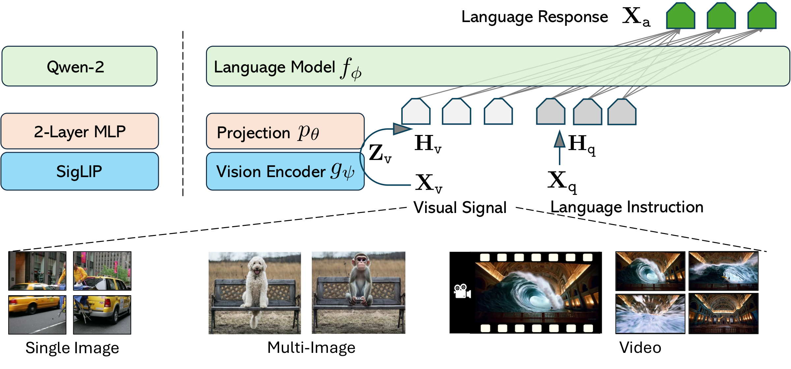
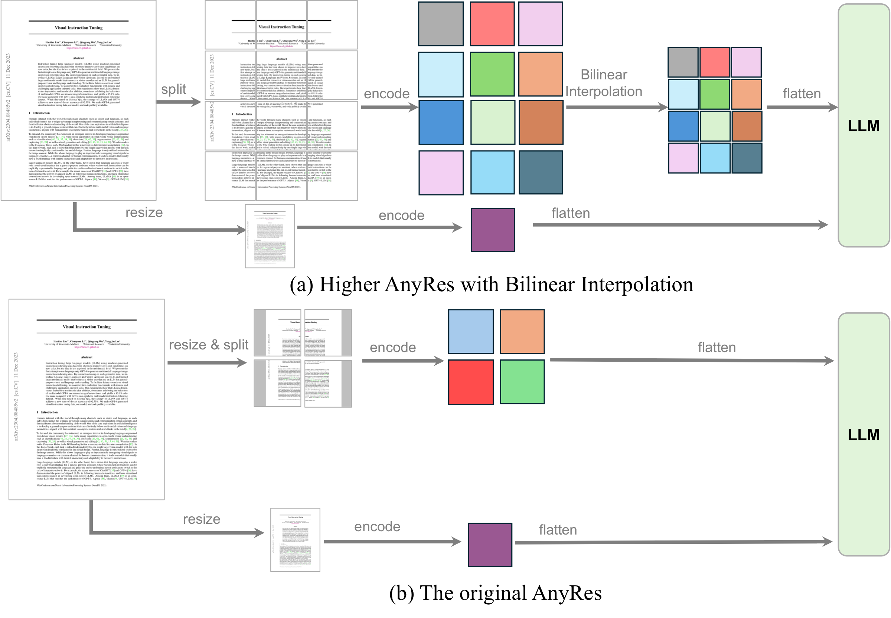
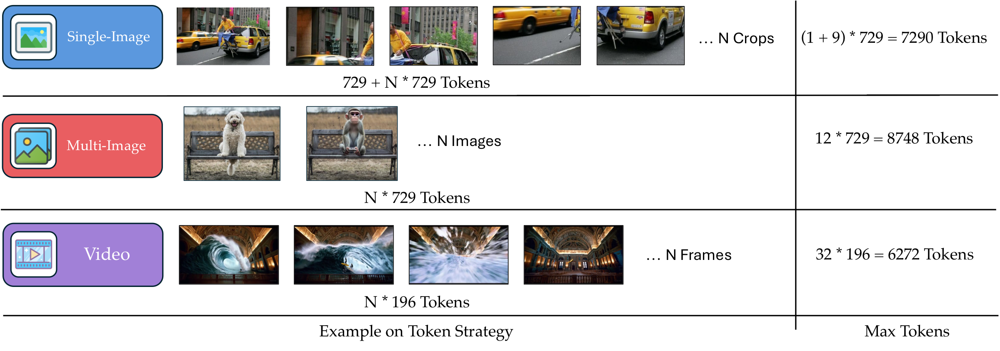
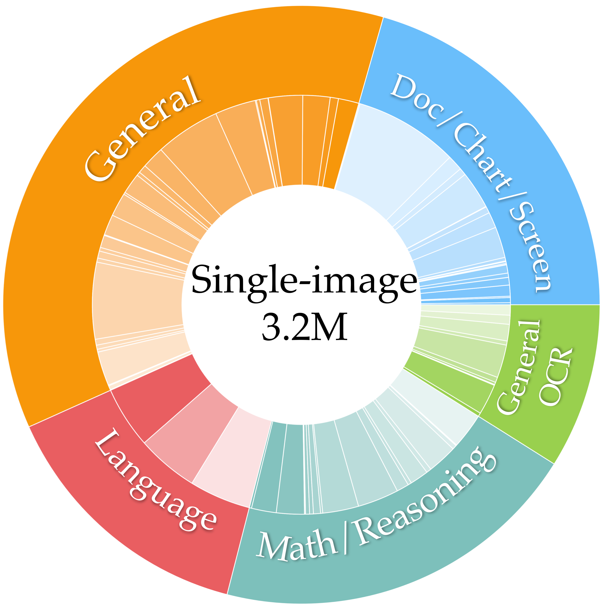
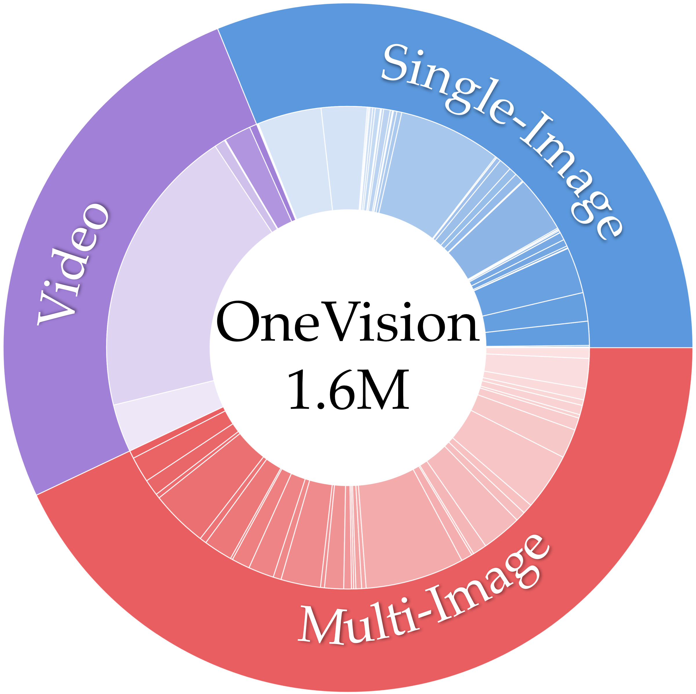
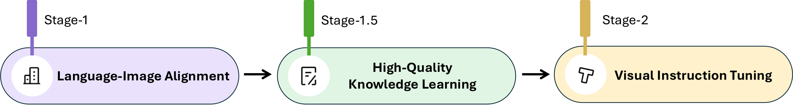

[`https://llava-vl.github.io/blog/llava-onevision`](https://llava-vl.github.io/blog/2024-08-05-llava-onevision)

# Introduction

It is a core aspiration in AI to build general-purpose assistants with Large Multimodal Models (LMM) . LLaVA-OneVision is an open model, continuing to advance the line of research in building large vision-and-language assistant (LLaVA)  that can follow diverse instructions to complete a variety of computer vision tasks in the wild. As a cost-efficient recipe, it is typically developed by connecting vision encoders with large language models (LLM) using a simple connection module.

The first LLaVA model  demonstrates impressive multimodal chat abilities, sometimes exhibiting the behaviors similar to GPT-4V on previously unseen images and instructions for the first time. LLaVA-1.5  significantly expands and improves the capabilities by incorporating more academic-related instruction data, achieving SoTA performance on a dozens of benchmarks with a data-efficient recipe. LLaVA-NeXT  inherits this property, further pushing performance boundaries through three key techniques: AnyRes for handling high-resolution images, expanding high-quality instruction data, and utilizing the best open LLM available at the time.

LLaVA-NeXT provides an extendable and scalable prototype, which facilitates several parallel explorations, reported in the LLaVA-NeXT blog series :

<https://llava-vl.github.io/blog/>
- The *Video* blog  shows that the image-only-trained LLaVA-NeXT model is surprisingly strong on video tasks with zero-shot modality transfer, due to the design of AnyRes to digest any vision signals as a sequence of images.

- The *Stronger* blog  demonstrates the LLM model scaling succuss of this cost-efficient strategy. By simply scaling up the LLM, it achieves performance comparable to GPT-4V on selected benchmarks.

- The *Ablation* blog  summarizes our empirical exploration except the visual instruction data itself, including the choice of architectures (scaling of LLM & vision encoder), visual representations (resolution & \#tokens), as well as training strategies (trainable modules & high-quality data) in the pursuit of data scaling success.

- The *Interleave* blog  describes the strategies to extend and improve the capability in new scenarios including multi-image, multi-frame (video) and multi-view (3D), while maintaining the single-image performance.

These explorations, conducted within a fixed compute budget, aimed to offer useful insights along the way as we navigate the project, rather than push performance limits. During the process, we have also been accumulating and curating a large collection of the high-quality datasets from January to June. By consolidating these insights and execute the experiments with “yolo run” on newly accumulated larger datasets, we introduce LLaVA-OneVision. We implement the new model with the available compute, without extensively de-risking individual components. This leaves room for further improvements in capabilities through additional data and model scaling following our recipe, Please see the detailed development timeline in Section 9. In particular, our paper makes the following contributions:

- *Large multimodal models*. We develop LLaVA-OneVision, a family of open large multimodal models (LMMs) that improves the performance boundaries of open LMMs in three important vision settings, including single-image, multi-image, and video scenarios.

- *Emerging Capabilities with Task Transfer*. Our design in modeling and data representations allow task transfer across different scenarios, suggesting a simple approach to yield new emgerging capabilities. In particular, LLaVA-OneVision demonstrate strong video understanding through task transfer from images.

- *Open-source*. To pave the way towards building a general-purpose visual assistant, we release the following assets to the public: the generated multimodal instruction data, the codebase, the model checkpoints, and a visual chat demo.

# Related Work

The SoTA proprietary LMMs, such as GPT-4V , GPT-4o , Gemini  and Claude-3.5 , exhibit excellent performance in versertile vision scenarios, including single-image, multi-image and video settings. In the open research community, existing works typically develop models tailored to each individual scenario separately. Specifically, most focus on pushing the performance limits in single-image scenarios , only a few recent papers have begun to explore multi-image scenarios . While video LMMs excel in video understanding, they often do so at the expense of image performance . It is rare to have a single open model that reports excellent performance in all three scenarios. LLaVA-OneVision aims to fill this gap by demonstrating state-of-the-art performance across a broad range of tasks, and showcasing interesting emerging capabilities through cross-scenario task transfer and composition.

To the best of our knowledge, LLaVA-NeXT-Interleave  is the first attempt to report good performance in all three scenarios, LLaVA-OneVision inherits its training recipe and data for improved performance. Other versatial open LMMs with potentials to excel include VILA , InternLM-XComposer-2.5 . Unfortunately, their results are not fully evaluated and reported; we compare with them in the experiments. In addition to building systems with versatial capabilities, LLaVA-OneVision is benefited from large-scale high-quality data training, including model-synthesized knowledge and the new collection of diverse instruction tuning data. For the former, we inherit all the knowledge learning data in . For the latter, our are motivated by FLAN . The data collection process is con-current with Idefics2  and Cambrian-1 , but we focus on a smaller but more carefully curated collection of datasets. A similar conclusion is observed: a large amount of visual instruction tuning data can significantly improve performance. For comprehensive investigations on design choices of LMMs, we refer to several recent studies .

# Modeling

## Network Architecture

The model architecture inherits the minimalism design of LLaVA series, whose primary goals are $`(i)`$ effectively leverage the pre-trained capabilities of both the LLM and visual model, as well as $`(ii)`$ facilitate strong scaling behavior in terms of both data and model. The network archtecture is illustrated in Figure 1.

- *LLM*. We choose Qwen-2  as our LLM $`f_{\boldsymbol{\phi}}(\cdot)`$ parameterized by $`\boldsymbol{\phi}`$, as it offers various model size and exhibits strong language capabilities to date among publicly available checkpoints.

- *Vision Encoder*. We consider the SigLIP  as the visual encoder $`g_{\boldsymbol{\psi}}(\cdot)`$ parameterized by $`\boldsymbol{\psi}`$, encoding an input image $`{{\bf X}}_{\texttt{v}}`$ into its visual feature $`{\bf Z}_{\texttt{v}} = g({{\bf X}}_{\texttt{v}})`$. The grid features before and after the last Transformer layer are considered in our experiments.

- *Projector*. We consider a 2-layer MLP  $`p_{\boldsymbol{\theta}}(\cdot)`$ parameterized by $`\boldsymbol{\theta}`$, to project image features into the word embedding space, yielding a sequence of visual tokens $`{\bf H}_{\texttt{v}} = p({\bf Z}_{\texttt{v}})`$.

The model choice is based on our empirical insights in  that stronger LLM typically supercharge stronger multimodal capabilities in the wild, while SigLIP yields higher LMM performance among open vision encoders.

For a sequence of length $`L`$, we compute the probability of the target answers $`{{\bf X}}_{\texttt{a}}`$ by:
``` math
\begin{equation}
    p( {{\bf X}}_{\texttt{a}} |  {{\bf X}}_{\texttt{v}}, {{\bf X}}_{\texttt{q}}) =
    \prod_{i=1}^{L} p (  {\color{mygreen} \boldsymbol{x}_i}
| {{\bf X}}_{\texttt{v}}, {{\bf X}}_{\texttt{q}, <i}, {{\bf X}}_{\texttt{a}, <i}),
    \label{eq:auto_regressive}
\end{equation}
```
where $`{{\bf X}}_{\texttt{q}, <i}`$ and $`{{\bf X}}_{\texttt{a}, <i}`$ are the instruction and answer tokens in all turns before the current prediction token $`{\color{mygreen} \boldsymbol{x}_i}`$, respectively. For the conditionals in Equation `(1)`, we explicitly add $`{{\bf X}}_{\texttt{v}}`$ to emphasize the fact that the visual signal is grounded for all answers. As explained in Section 3.2, the form of visual signal $`{{\bf X}}_{\texttt{v}}`$ is general. The visual input fed into the vision encoder depends on the corresponding scenarios: the invidiual image crop in the single-image sequence, the invidiual image in a multi-image sequence and the invidiual frame in the video sequence, respectively.


**Figure 1.** LLaVA-OneVision network architecture. Left: The current model instantiation; Right: the general form of LLaVA architecture in , but is extended to support more visual signals.

## Visual Representations

The representation of visual signals is key to the success of the visual encoding. It relates to two factors, *the resolution in the raw pixel space* and *the number of tokens in the feature space*, leading to the visual input representation configuration (resolution, \#token). The scaling of both factors leads to improved performance, especially on tasks that require visual details. To strike a balance of performance and cost, we observe that the scaling of resolution is more effective than that of token numbers, and recommend an AnyRes strategy with pooling. The comparison is illustrated in Figure 2.


**Figure 2.** The visual representations. Top: The new Higher AnyRes scheme with Bilinear Interpolation to deal with images of higher resolution; Bottom: the original AnyRes in .


**Figure 3.** The visual representation strategy to allocate tokens for each scenario in LLaVA-OneVision. The maximum number of visual tokens across different scenarios is designed to be similar, ensuring balanced visual representations to accommodate cross-scenario capability transfer. Note that 729 is the #tokens for SigLIP to encode a visual input of resolustion 384×384.

For AnyRes with a configuration of width $`a`$, height $`b`$, it divides the image into $`a \times b`$ crops, each with the shape $`(a,b)`$. Each crop has the same resolution suitable for the vision encoder. Assuming there are $`T`$ tokens per crop, the total number of visual tokens is $`L = (a \times b + 1) \times T`$, where the base image is resized before being fed into the vision encoder. We consider a threshold $`\tau`$, and reduce the \#token per crop, using bilinear interpolation if needed:
``` math
\begin{equation}
    T_{\text{new}} = 
    \begin{cases} 
    \frac{\tau}{(a \times b + 1)} & \text{if } L > \tau \\
    T & \text{if } L \leq \tau 
    \end{cases}
    \label{eq:image_encoding}
\end{equation}
```

A set of spatial configurations $`(a,b)`$ is defined to specify various methods for cropping images, thereby accommodating images of different resolutions and aspect ratios. Among them, the configuration that requires a minimum number of crops is selected. Please see our detailed ablations of visual representation in .

The proposed Higher AnyRes strategy can serve as a flexible visual representation framework, adaptable for multi-image and video representation. The optimal configuration for performance and cost can be adjusted accordingly. We illustratie the configuration in Figure 3, describe the detailed in Section 11.1 and provide high-level encoding strategies as below:

- *Single-image*. We consider a large maximum spatial configuration $`(a, b)`$ for single-image representation to maintain the original image resolution without resizing. Additionally, we purposefully allocate a large number of visual tokens per image, resulting in a long sequence to effectively represent the visual signal. This is based on the observation that there is a larger number of high-quality training samples with diverse instructions for images compared to videos. By representing an image with a long sequence that mimics video representation, we facilitate a smoother capability transfer from image to video understanding .

- *Multi-image*. Only the base image resolution is considered and fed into the vision encoder to obtain feature maps, eliminating the need for multi-crop of high resolution image and thus saving computational resources .

- *Video*. Each frame of the video is resized to the base image resolution and processed by the vision encoder to generate feature maps. Bilinear interpolation is employed to reduce the number of tokens, allowing the consideration of a larger number of frames by reducing tokens per frame. Empirical evidence suggests this provides a better trade-off between performance and computational cost .

These representation configurations are designed for capability transfer with a fixed compute budget in our experiments. With increased computational resources, the number of tokens per image or frame can be increased during both training and inference stages to boost performance.

# Data

In the realm of multimodal training from LLM, the axiom “quality over quantity” is especially true. This principle is paramount due to the extensive knowledge stored within pre-trained LLMs and Vision Transformers (ViTs). While it is essential to accumulate balanced, diverse, and high-quality instruction data by the end of the LMM’s training lifecycle, an often-overlooked aspect is the continuous exposure of the model to new, high-quality data for further knowledge acquisition whenever it is available. In this section, we discuss the data sources and strategies for high-quality knowledge learning and visual instruction tuning.

## High-Quality Knowledge

The web-scale public image-text data is often of low-quality, rendering the data scaling of multimodal pre-training less efficient. Instead, we recommend to focus on high-quality knowledge learning, given a limited compute budget. This approach acknowledges that the pre-trained LLMs and ViTs already possess a substantial knowledge base, and the goal is to refine and enhance this knowledge with carefully curated data. By prioritizing the quality of data, we can maximize compute efficiency.

We consider data from three major categories for high-quality knowledge learning:

- *Re-Captioned Detailed Description Data*. LLaVA-NeXT-34B  is known for its strong detailed caption ability among open-source LMMs. We used the model to generate new captions for the images from the following datasets: COCO118K, BLIP558K, and CC3M. We combined them to form the Re-Captioned Detailed Description Data, totaling 3.5M samples. This can be viewed as an simple attempt of self-improvement AI, where the training data is generated by an early version of the model itself.

- *Document / OCR Data*. We utilized the Text Reading subset from the UReader dataset, totaling 100K, which is easily accessible through PDF rendering. We used this text reading data along with the SynDOG EN/CN, to form the Document / OCR Data, totaling 1.1M samples.

- *Chinese and Language Data*. We used the original ShareGPT4V  images and utilized GPT-4V provided by the Azure API to generate 92K detailed Chinese caption data, aiming to improve the model’s capability in Chinese. Since we used a large portion of detailed caption data, we also aim to balance the model’s language understanding ability. We collected 143K samples from the Evo-Instruct dataset .

It is interesting to note that almost all (accounting for 99.8%) of the high-quality knowledge data is synthetic. This is due to the high cost and copyright constraints associated with collecting large-scale, high-quality data in the wild. In contrast, synthetic data can be easily scaled. We believe that learning from large-scale synthetic data is becoming a trend as AI models continue to grow more powerful.

## Visual Instruction Tuning Data

Visual instruction tuning  refers to the capability of an LMM to understand and act upon visual instructions. These instructions can be in the form of language, combined with visual media such as images and videos, which the LMM processes and follows to perform a task or provide a response. This involves integrating visual understanding with natural language processing to interpret the instructions and execute the required responses.

#### Data Collection and Curation.

As demosntrated in previous works , visual instruction tuning data is crutial for LMM capaiblity. Therefore, maintaining a high-quality dataset collection is crucial and beneficial to the community. We started to collect a large pool of instruction tuning datasets from various original sources, with an unbalanced data ratio among categories. Additionally, we utilize a few new subsets from the Cauldron  and Cambrian  dataset collections.

We categorize the data based on a three-level hierachy: vision, instruction, and response.

- *Vision Input*. Three vision scenarios are considered, depding which visual input is considered in the multimodal sequence, including single-image, multi-image, video.

- *Language Instruction*. The instructions, which often appears as questions, define the tasks to perform to deal with the visual input. We classify the data into five major categories: *General QA*, *General OCR*, *Doc/Chart/Screen*, *Math Reasoning*, and *Language*. These instructions define the skill sets that a trained LMM could cover. We use task categorization to help maintain and balance the skill distribution.

- *Language Response*. The answer not only responds the user request, but also specifies the model behavior. It can be broadly categorized into free-form and fixed-form.

Free-form data is typically annotated by advanced models like GPT-4V/o and Gemini, while fixed-form data is derived from academic datasets, e.g. VQAv2, GQA, Visual Genome. For free-form data, we keep the original answers. However, for fixed-form data, we manually review the content and make necessary corrections to the question and answer formats. We adhere to the LLaVA-1.5 prompting strategy for multiple-choice data, short answer data, and specific task data (e.g., OCR). This step is crucial for guiding the model’s behavior to correctly balance QA performance, conversational ability, and reasoning skills in more complicated tasks, as well as preventing potential conflicts from different data sources. We list the full details about each dataset in our collection, and their categorization and formatting prompt in Appendix 13.3.

We divide the instruction data into two separate groups: one for single-image scenario and the other for all vision scenarios. This division is based on insights from our earlier studies , which highlight the relationship between image and video models: a stronger image model can better transfer to multi-image and video tasks. Additionally, the quantity and quality of training datasets available for single images are significantly higher than those for videos and multi-image tasks.

**Single-Image Data.** Since single-image data is crucial for multimodal capabilities, we explicitly compile a large single-image data collection for model learning. We select from collected data sources to form a balanced collection, resulting in a total of 3.2 million samples. The overall distribution of single-image data is shown in Figure 4, with detailed information and the roadmap of data collection presented in Appendix 13.1.


**Figure 4.** **Single-Image 3.2M.** A High-Quality Single-Image Dataset Collection. Left: Data Distribution within Each Category. The outer circle shows the distribution of all data categories and the inner circle shows the distribution of data subsets. Right: The detailed quantities of datasets.

Key category totals in the source:
- `General (36.1%)`
- `Doc/Chart/Screen (20.6%)`
- `Math/Reasoning (20.1%)`
- `General OCR (8.9%)`
- `Language (14.3%)`

Representative datasets listed in the source legend include `Vision FLAN (186.1K)`, `LLaVA-158K (158.0K)`, `ShareGPT4V (91.0K)`, `UReader QA (252.9K)`, `MAVIS Data Engine (100.0K)`, `OCR-VQA (80.0K)`, and `Magpie Pro` variants (`150.0K` each).

**OneVision Data.** In addition to the single-image stage training, we further fine-tune the model using a mixture of video, image, and multi-image data. We introduce a total of 1.6 million mixed data samples, comprising 560K multi-image data from , 350K videos collected in this project, and 800K single-image samples. Notably, in this stage, we do not introduce new single-image data but instead sample high-quality and balanced portions from the previous single-image data, as described in . The data distribution and details are presented in Figure 5, with additional information available in Appendix 13.2.


**Figure 5.** **OneVision 1.6M.** A high-quality single-image, multi-image and video dataset collection. Left: Data Distribution within each category. The outer circle shows the distribution of all data categories and the inner circle shows the distribution of data subsets. Right: The detailed quantities of datasets. “MI” means it is the multi-image version dataset proposed by DEMON .

Key category totals in the source:
- `Single-Image (31.2%)`
- `Multi-Image (43.0%)`
- `Video (25.9%)`

Representative datasets listed in the source legend include `Magpie Pro (90.0K)`, `Vision FLAN (filtered) (55.8K)`, `Cauldron (40.2K)`, `UReader (39.9K)`, `NLVR (86.4K)`, `ScanNet (49.9K)`, `VIST (26.0K)`, `ShareGPT4Video (255.0K)`, `Youcook2 (41.9K)`, and `Charades (23.6K)`.

# Training Strategies

To enable LLM for multimodal capabilities, we identify three critical functionalities, and systematically divide them into three distinct learning stages for the purpose of ablation studies. As with most existing research, prior LLaVA models mainly explore the single-image instruction tuning. However, other parts are less frequently investigated and therefore constitute the primary focus of this section.

We train the model via a curriculum learning principle, where training objectives and examples of increasing difficulty are observed in a stage-wise manner. With a fixed compute budget, this strategy helps decompose the training process and produces immediate checkpoints that can be re-used in more experiment trails.

- *Stage-1: Language-Image Alignment*. The goal is to well align the visual features into the word embedding space of LLMs.

- *Stage-1.5: High-Quality Knowledge Learning*. To strike a balance between compute-efficiency and injecting new knowledge into LMMs, we recommend to consider the high-quality knowledge for LMM learning. The training configuration mirrors the settings used in Stage-2, ensuring consistency and allowing the model to integrate new information seamlessly.

- *Stage-2: Visual Instruction Tuning*. To teach LMM to solve a diverse set of visual task with preferred responces, we organize the instruction data into different groups, described in Section 4.2. The model is scheduled to train on these groups in order.

Specifically, the visual instruction tuning process consists of two phases: $`(i)`$ *Single-Image Training*: The model is first trained on 3.2 million single-image instructions, resulting in a model with strong performance in following a diverse set of instructions to complete visual tasks using a single image. $`(ii)`$ *OneVision Training*: The model is then trained on a mixture of video, single-image, and multi-image data. In this phase, the model expands its capabilities from single-image scenarios to diverse scenarios. It learns to follow instructions to complete tasks in each new scenario and transfer the learned knowledge across different scenarios, resulting in new emergent capabilities. Note that the proposed OneVision training in the post-training stage is probably the simplest and most cost-efficient way to empower the LMMs with the multi-image and video understanding capabilities.

The training strategy is summarized in Table 1. We progressively train the model to deal with long sequence training. The maximum image resolution and the number of visual tokens gradually increase as training progresses. In Stage-1, the base image representation is considered with 729 tokens. In Stages 1.5 and 2, AnyRes is considered with up to 5 times and 10 times more visual tokens, respectively. Regarding trainable modules, Stage-1 updates only the projector, while the subsequent stages update the full model. It is also noted that the learning rate for the vision encoder is 5 times smaller than that for the LLM.



<a id="tab:training_strategy"></a>

**Table 1.** **Detailed configuration for each training stage of the LLaVA-OneVision model.** The table outlines the progression of vision parameters, dataset characteristics, model specifications, and training hyperparameters across different stages of the curriculum learning process. The source notes that the global batch size is 512 for the 0.5B model and 256 for the 7B and 72B models.

| Group | Item | Stage-1 | Stage-1.5 | Stage-2 Single-Image | Stage-2 OneVision |
| --- | --- | --- | --- | --- | --- |
| Vision | Resolution | 384 | `384 x {2x2, 1x{2,3}, {2,3}x1}` | `384 x {{1x1}, ..., {6x6}}` | `384 x {{1x1}, ..., {6x6}}` |
| Vision | #Tokens | 729 | Max `729 x 5` | Max `729 x 10` | Max `729 x 10` |
| Data | Dataset | LCS | Image (high-quality knowledge) | Image (instruction data) | (Multi)-Image and Video (instruction data) |
| Data | #Samples | 558K | 4M | 3.2M | 1.6M |
| Model | Trainable | Projector | Full Model | Full Model | Full Model |
| Model | 0.5B LLM | 1.8M | 0.8B | 0.8B | 0.8B |
| Model | 7.6B LLM | 20.0M | 8.0B | 8.0B | 8.0B |
| Model | 72.7B LLM | 72.0M | 73.2B | 73.2B | 73.2B |
| Training | Batch Size | 512 | 256/512 | 256/512 | 256/512 |
| Training | LR: vision encoder | `1e-3` | `2e-6` | `2e-6` | `2e-6` |
| Training | LR: projector and LLM | `1e-3` | `1e-5` | `1e-5` | `1e-5` |
| Training | Epoch | 1 | 1 | 1 | 1 |

# Experimental Results

We conduct standardized and reproducible evaluations for LLaVA-OneVision models on all benchmarks using LMMs-Eval . For fair comparison with other leading LMMs, we primarily report results from original papers. When results are unavailable, we onboard the models in LMMs-Eval and evaluate them using consistent settings. All our results are reported with greedy decoding and 0-shot settings unless otherwise specified.

To reveal the generality and effectiveness of the designed paradigm, we comprehensively evaluate our LLaVA-OneVision models across different modalities in Table 2, including single-image, multi-image, and video benchmarks. Detailed results for each modality are presented in Table 3, Table 4, and Table 5, respectively. We denote the the model checkpoint trained after the single-image stage and one-vision stage as *LLaVA-OV (SI)* or *LLaVA-OV*, respectively

Three model sizes are provided (0.5B, 7B and 72B), to accomodate applications with different performance-throughput trade-off, ranging from edge device to cloud serving. The GPT-4V and GPT-4o results are presented as references. Our largest model LLaVA-OneVision-72B yields superior performance between GPT-4V and GPT-4o on most benchmarks. It suggests that the proposed recipe is effecitve, revealing a promising path for further scaling. However, a relatively larger gap remains in complex tasks such as visual chat scenarios, we leave it as future research in stronger LLMs, larger training data and better preference learning.

**Table 2.** **Overview of benchmark performance across single-image, multi-image, and video modalities.**

| Capability | Benchmark | LLaVA-OneVision-0.5B | LLaVA-OneVision-7B | LLaVA-OneVision-72B | GPT-4V | GPT-4o |
| --- | --- | --- | --- | --- | --- | --- |
| Single-Image | AI2D | 57.1% | 81.4% | 85.6% | 78.2% | 94.2% |
| Single-Image | ChartQA | 61.4% | 80.0% | 83.7% | 78.5% | 85.7% |
| Single-Image | DocVQA (test) | 70.0% | 87.5% | 91.3% | 88.4% | 92.8% |
| Single-Image | InfoVQA (test) | 41.8% | 68.8% | 74.9% | - | - |
| Single-Image | MathVerse (vision-mini) | 17.9% | 26.2% | 39.1% | 32.8% | 50.2% |
| Single-Image | MathVista (testmini) | 34.8% | 63.2% | 67.5% | 49.9% | 63.8% |
| Single-Image | MMBench (en-dev) | 52.1% | 80.8% | 85.9% | 75.0% | - |
| Single-Image | MME (cog./perp.) | 240/1238 | 418/1580 | 579/1682 | 517/1409 | - |
| Single-Image | MMStar | 37.5% | 61.7% | 66.1% | 57.1% | - |
| Single-Image | MMMU (val) | 31.4% | 48.8% | 56.8% | 56.8% | 69.1% |
| Single-Image | MMVet | 29.1% | 57.5% | 63.7% | 49.9% | 76.2% |
| Single-Image | SeedBench (image) | 65.5% | 75.4% | 78.0% | 49.9% | 76.2% |
| Single-Image | ScienceQA | 67.2% | 96.0% | 90.3% | 75.7% | - |
| Single-Image | ImageDC | 83.3% | 88.2% | 91.2% | 91.5% | - |
| Single-Image | RealworldQA | 55.6% | 66.3% | 71.9% | 61.4% | - |
| Single-Image | Vibe-Eval | 33.8% | 51.7% | 50.7% | 57.9% | 63.1% |
| Single-Image | MM-LiveBench (2406) | 49.9% | 77.1% | 81.5% | - | 92.4% |
| Single-Image | LLaVA-Wilder (small) | 55.0% | 67.8% | 72.0% | 81.0% | 85.9% |
| Multi-Image | LLaVA-Interleave | 33.3% | 64.2% | 79.9% | 60.3% | - |
| Multi-Image | MuirBench | 25.5% | 41.8% | 54.8% | 62.3% | - |
| Multi-Image | Mantis | 39.6% | 64.2% | 77.6% | 62.7% | - |
| Multi-Image | BLINK | 52.1% | 48.2% | 55.4% | 51.1% | - |
| Multi-Image | Text-rich VQA | 65.0% | 80.1% | 83.7% | 54.5% | - |
| Video | ActivityNetQA | 50.5% | 56.6% | 62.3% | 57.0% | - |
| Video | EgoSchema | 26.8% | 60.1% | 62.0% | - | - |
| Video | PerceptionTest | 49.2% | 57.1% | 66.9% | - | - |
| Video | SeedBench (video) | 44.2% | 56.9% | 62.1% | 60.5% | - |
| Video | LongVideoBench (val) | 45.8% | 56.3% | 63.2% | 60.7% | 66.7% |
| Video | MLVU | 50.3% | 64.7% | 68.0% | 49.2% | 64.6% |
| Video | MVBench | 45.5% | 56.7% | 59.4% | 43.5% | - |
| Video | VideoChatGPT | 3.12 | 3.49 | 3.62 | 4.06 | - |
| Video | VideoMME | 44.0% | 58.2% | 66.2% | 59.9% | 71.9% |

<a id="tab:image-bench"></a>

**Table 3.** **LLaVA-OneVision performance on single-image benchmarks.** The source presents this as two wide matrices; here it is split into two Markdown tables for readability. GPT-4V reports 4-shot results on `ChartQA`. Unless otherwise noted, results are 0-shot accuracy.

Part A: OCR, document, reasoning, and core vision benchmarks.

| Model | AI2D | ChartQA | DocVQA | InfoVQA | MathVerse | MathVista | MMBench | MME | MMMU |
| --- | --- | --- | --- | --- | --- | --- | --- | --- | --- |
| Qwen-VL-Max | 79.3 | 79.8 | - / 93.1 | - | 23.0 | 51.0 | 77.6 | 2281 | 51.4 |
| Gemini-1.5-Pro | 94.4 | 87.2 | - / 93.1 | - / 81.0 | - | 63.9 | - | - | 62.2 |
| Claude 3.5 Sonnet | 94.7 | 90.8 | - / 95.2 | 49.7 | - | 67.7 | - | - | 68.3 |
| GPT-4V | 78.2 | 78.5* | - / 88.4 | - | 32.8 | 49.9 | 75.0 | 517 / 1409 | 56.8 |
| GPT-4o | 94.2 | 85.7 | - / 92.8 | - | 50.2 | 63.8 | - | - | 69.1 |
| Cambrian-34B | 79.7 | 73.8 | - / 75.5 | - | - | 53.2 | 81.4 | - | 49.7 |
| VILA-34B | - | - | - | - | - | - | 82.4 | 1762 | 51.9 |
| IXC-2.5-7B | 81.5 | 82.2 | - / 90.9 | - / 70.0 | 20.0 | 59.6 | 82.2 | 2229 | 42.9 |
| InternVL-2-8B | 83.8 | 83.3 | - / 91.6 | - / 74.8 | 27.5 | 58.3 | 81.7 | 2210 | 49.3 |
| InternVL-2-26B | 84.5 | 84.9 | - / 92.9 | - / 75.9 | 31.3 | 59.4 | 83.4 | 2260 | 48.3 |
| LLaVA-OV-0.5B (SI) | 54.2 | 61.0 | 75.0 / 71.2 | 44.8 / 41.3 | 17.3 | 34.6 | 43.8 | 272 / 1217 | 31.2 |
| LLaVA-OV-0.5B | 57.1 | 61.4 | 73.7 / 70.0 | 46.3 / 41.8 | 17.9 | 34.8 | 52.1 | 240 / 1238 | 31.4 |
| LLaVA-OV-7B (SI) | 81.6 | 78.8 | 89.3 / 86.9 | 69.9 / 65.3 | 26.9 | 56.1 | 81.7 | 483 / 1626 | 47.3 |
| LLaVA-OV-7B | 81.4 | 80.0 | 90.2 / 87.5 | 70.7 / 68.8 | 26.2 | 63.2 | 80.8 | 418 / 1580 | 48.8 |
| LLaVA-OV-72B (SI) | 85.1 | 84.9 | 93.5 / 91.8 | 77.7 / 74.6 | 37.7 | 66.5 | 86.6 | 563 / 1706 | 57.4 |
| LLaVA-OV-72B | 85.6 | 83.7 | 93.1 / 91.3 | 79.2 / 74.9 | 39.1 | 67.5 | 85.9 | 579 / 1682 | 56.8 |

Part B: real-world understanding, chat, and related benchmarks.

| Model | MMVet | MMStar | S-Bench | S-QA | ImageDC | MMLBench | RealWorldQA | Vibe-Eval | LLaVA-W | L-Wilder |
| --- | --- | --- | --- | --- | --- | --- | --- | --- | --- | --- |
| Qwen-VL-Max | - | - | - | - | - | - | - | - | - | - |
| Gemini-1.5-Pro | - | - | - | - | - | 85.9 | 70.4 | 60.4 | - | - |
| Claude 3.5 Sonnet | 75.4 | - | - | - | - | 92.3 | 59.9 | 66.2 | 102.9 | 83.1 |
| GPT-4V | 49.9 | 57.1 | 49.9 | 75.7 | 91.5 | - | 61.4 | 57.9 | 98.0 | 81.0 |
| GPT-4o | 76.2 | - | 76.2 | - | 92.5 | 92.4 | 58.6 | 63.1 | 106.1 | 85.9 |
| Cambrian-34B | - | - | - | 85.6 | - | - | 67.8 | - | - | - |
| VILA-34B | 53.0 | - | 75.8 | - | - | - | - | 81.3 | - | - |
| IXC-2.5-7B | 51.7 | 59.9 | 75.4 | - | 87.5 | - | 67.8 | 45.2 | 78.1 | 61.4 |
| InternVL-2-8B | 60.0 | 59.4 | 76.0 | 97.0 | 87.1 | 73.4 | 64.4 | 46.7 | 84.5 | 62.5 |
| InternVL-2-26B | 65.4 | 60.4 | 76.8 | 97.5 | 91.0 | 77.2 | 66.8 | 51.5 | 99.6 | 70.2 |
| LLaVA-OV-0.5B (SI) | 26.9 | 36.3 | 63.4 | 67.8 | 83.0 | 43.2 | 53.7 | 34.9 | 71.2 | 51.5 |
| LLaVA-OV-0.5B | 29.1 | 37.5 | 65.5 | 67.2 | 83.3 | 49.9 | 55.6 | 33.8 | 74.2 | 55.0 |
| LLaVA-OV-7B (SI) | 58.8 | 60.9 | 74.8 | 96.6 | 85.7 | 75.8 | 65.5 | 47.2 | 86.9 | 69.1 |
| LLaVA-OV-7B | 57.5 | 61.7 | 75.4 | 96.0 | 88.9 | 77.1 | 66.3 | 51.7 | 90.7 | 67.8 |
| LLaVA-OV-72B (SI) | 60.0 | 65.2 | 77.6 | 91.3 | 91.5 | 84.4 | 73.8 | 46.7 | 93.7 | 72.9 |
| LLaVA-OV-72B | 63.7 | 66.1 | 78.0 | 90.3 | 91.2 | 81.5 | 71.9 | 50.7 | 93.5 | 72.0 |

## Single-Image Benchmarks

To validate the performance for single-image tasks in real-world scenories, we consider a comprehensive set of image benchmarks in Table 3. It can be categorized into three classes:

*(1) Chart, Diagram, and Document Understanding*. As the main visual formats for structured OCR data, we evaluate the results on AI2D , ChartQA , DocVQA , and InfoVQA  benchmarks. Though current open-source models such as InternVL  and Cambrian  achieve performance comparable to commercial models, LLaVA-OneVision goes a step further, surpassing GPT-4V  and approaching the performance level of GPT-4o .

*(2) Perception and Multi-discipline Reasoning*. Including visual perception scenarios, we reveal the potentials of our model for more complex and challenging reasoning tasks. Specifically, we adopt the perception benchmarks including MME , MMBench , and MMVet , and reasoning benchmarks such as MathVerse , MathVista , and MMMU . The results of LLaVA-OneVision significantly outperforms GPT-4V on various benchmarks, and comparable to GPT-4o on MathVista. This further confirms the superiority of our framework in visual perception and reasoning tasks.

*(3) Real-world Understanding and Visual Chat*. We consider the evaluation of LMMs as general-purpose assistant in the wild as the most important metrics, beyond the lab environments. To validate the capabilities in real-world scenarios, we utilize several widely-adopted benchmarks, including RealworldQA , Vibe-Eval , MM-LiveBench , and LLaVA-Bench-Wilder . While our model still has room for improvement compared to GPT-4V and GPT-4o, it achieves competitive performance with open-source models of similar parameter size. Notably, our model performs well on MM-LiveBench , a benchmark for real-world internet content with constantly updated content, demonstrating the model’s broad world knowledge and strong generalization abilities.

## Multi-Image Benchmarks

We further evaluate LLaVA-OneVision in multi-image interleaved settings, where users may ask questions between multiples images. In particular, we perform comprehensive assessment on the diverse subtasks of LLaVA-Interleave Bench , such as Spot the Difference , Image Edit Instruction (IEI) , Visual Storytelling (VST) , Text-rich VQA (TR-VQA) , Multi-image VQA (MI-VQA) , Raven Puzzle , Q-Bench (QB) , and NLVR2 ). We also utilize several multi-view benchmarks for evaluation, which depict 3D environments with multiple viewpoints, including 3D Dialogue (3D-Chat) and Task Decomposition (3D-TD) from 3D-LLM , ScanQA , ALFRED , and nuScenes VQA . We refer to these datasets as in-domain evaluations, since our training data includes the training split of them.

Moreover, we conduct evaluations on different out-domain tasks, which reveals the generalization capability of our approach. They include the multi-image split of math QA benchmark MathVerse  and science QA benchmark SciVerse , multi-image perception benchmark BLINK , MMMU-(multi-image)  that contains all multi-image QA in MMMU, and MuirBench  spanning 12 diverse multi-image tasks.

As shown in Table 4, LLaVA-OneVision (SI) consistently outperforms existing multi-image LMMs in all benchmarks. After additional tuning on multi-image and video data, LLaVA-OneVision shows a marked improvement over GPT-4V in specific areas, with significant margins. This highlights its strong performance in complex tasks such as multi-image reasoning, identifying differences, and understanding 3D environments. In addition, we observe a consistent performance enhancement on after the one-vision training stage, which is more evident on multi-view benchmarks that are absent in single-image data. This demonstrates the significance of our one-vision paradigm for empowering LMMs with comprehensive visual capbalities.

**Table 4.** **Detailed results on multi-image benchmarks.** All results are accuracy. `LLaVA-N-Image-7B` denotes `LLaVA-NeXT-Vicuna-7B (2024-01)`. `IEI` means Image Edit Instruction, `MI-VQA` means Multi-image VQA, `TR-VQA` means Text-rich VQA, and `VST` means Visual Story Telling. For `MathVerse` and `SciVerse`, the source reports the multi-image splits.

| Model | IEI | MI-VQA | NLVR2 | Puzzle | Q-Bench | Spot-Diff | TR-VQA | VST | 3D-Chat | 3D-TD | ScanQA | ALFRED | nuScenes | BLINK | Mantis | MathVerse | MuirBench | SciVerse |
| --- | --- | --- | --- | --- | --- | --- | --- | --- | --- | --- | --- | --- | --- | --- | --- | --- | --- | --- |
| GPT-4V | 11.0 | 52.0 | 88.8 | 17.1 | 76.5 | 12.5 | 54.5 | 10.9 | 31.2 | 35.4 | 32.6 | 10.3 | 63.7 | 51.1 | 62.7 | 60.3 | 62.3 | 66.9 |
| LLaVA-N-Image-7B | 13.2 | 39.4 | 68.0 | 9.0 | 51.0 | 12.9 | 59.6 | 10.1 | - | - | - | - | - | 41.8 | 46.1 | 13.5 | - | 12.2 |
| VPG-C-7B | 15.2 | 46.8 | 73.2 | 2.4 | 57.6 | 27.8 | 38.9 | 21.5 | - | - | - | - | - | 43.1 | 52.4 | 24.3 | - | 23.1 |
| Mantis-7B | 11.2 | 52.5 | 87.4 | 25.7 | 69.9 | 17.6 | 45.2 | 12.5 | 2.60 | 14.7 | 16.1 | 14.0 | 46.2 | 46.4 | 59.5 | 27.2 | 36.1 | 29.3 |
| LLaVA-N-Inter-7B | 24.3 | 87.5 | 88.8 | 48.7 | 74.2 | 37.1 | 76.1 | 33.1 | - | - | - | - | - | 52.6 | 62.7 | 32.8 | 38.9 | 31.6 |
| LLaVA-N-Inter-14B | 24.5 | 95.0 | 91.1 | 59.9 | 76.7 | 40.5 | 78.6 | 33.3 | 70.6 | 52.2 | 34.5 | 62.0 | 76.7 | 52.1 | 66.4 | 33.4 | 40.7 | 32.7 |
| LLaVA-OV-0.5B (SI) | 15.6 | 44.8 | 56.1 | 30.0 | 45.8 | 8.5 | 36.7 | 7.6 | 22.1 | 22.1 | 16.9 | 25.5 | 8.2 | 37.9 | 38.2 | 20.9 | 22.7 | 26.7 |
| LLaVA-OV-0.5B | 17.1 | 48.7 | 63.4 | 35.4 | 48.8 | 36.4 | 65.0 | 29.8 | 60.0 | 48.0 | 29.4 | 62.2 | 70.5 | 52.1 | 39.6 | 60.0 | 25.5 | 29.1 |
| LLaVA-OV-7B (SI) | 20.5 | 60.3 | 75.9 | 24.6 | 56.0 | 7.9 | 52.8 | 8.4 | 24.5 | 29.9 | 22.1 | 32.0 | 70.8 | 45.6 | 54.2 | 26.3 | 32.7 | 30.0 |
| LLaVA-OV-7B | 22.2 | 90.2 | 89.4 | 53.3 | 74.5 | 39.2 | 80.1 | 31.7 | 62.8 | 52.6 | 30.1 | 61.0 | 79.8 | 48.2 | 64.2 | 67.6 | 41.8 | 79.1 |
| LLaVA-OV-72B (SI) | 22.1 | 61.2 | 78.9 | 44.2 | 61.5 | 15.6 | 67.9 | 12.1 | 30.8 | 25.4 | 21.9 | 43.5 | 75.5 | 46.0 | 56.8 | 58.6 | 33.2 | 65.8 |
| LLaVA-OV-72B | 22.5 | 95.3 | 93.8 | 63.4 | 83.2 | 43.3 | 83.7 | 34.5 | 63.2 | 53.3 | 35.8 | 66.3 | 78.8 | 55.4 | 77.6 | 91.6 | 54.8 | 94.9 |

## Video Benchmarks

Video is also a common modality to build world model, capturing the dynamic nature of the real world over time. We conduct experiments on several open-ended and multi-choice video benchmarks. These include ActivityNet-QA  that contains human-annotated action-related QA pairs derived from ActivityNet dataset, EgoSchema  and MLVU  focusing on long video understanding, PerceptionTest  designed to evaluate the perception skills, VideoMME  and NeXTQA  containing diverse video domains and durations (from minutes to hours), VideoDetailCaption  and Video-ChatGPT  for video detailed description and visua chat, respectively.

As shown in Table 5, LLaVA-OneVision achieves comparable or better results than previous open source models with much larger LLMs. The superiority of LLaVA-OneVision is particularly evident in complex benchmarks such as EgoSchema and VideoMME. Even compared to the advanced commercial model GPT-4V, LLaVA-OneVision performs competitively on the ActivityNet-QA, MLVU, and VideoMME benchmarks.

**Table 5.** **Detailed results on video benchmarks.** `VideoDC` and `VideoChatGPT` are reported on a 5-point scale; the remaining entries are accuracy. The source reports `VideoMME` as `without subtitles / with subtitles`.

| Model | ActNet-QA | EgoSchema | MLVU | MVBench | NextQA | PercepTest | SeedBench | VideoChatGPT | VideoDC | VideoMME | L-VideoBench |
| --- | --- | --- | --- | --- | --- | --- | --- | --- | --- | --- | --- |
| GPT-4V | 57.0 | - | 49.2 | 43.5 | - | - | 60.5 | 4.06 | 4.00 | 59.9 / 63.3 | 61.3 |
| GPT-4o | - | - | 64.6 | - | - | - | - | - | - | 71.9 / 77.2 | 66.7 |
| Gemini-1.5-Flash | 55.3 | 65.7 | - | - | - | - | - | - | - | 70.3 / 75.0 | 61.6 |
| Gemini-1.5-Pro | 57.5 | 72.2 | - | - | - | - | - | - | - | 75.0 / 81.3 | 64.0 |
| VILA-40B | 58.0 | 58.0 | - | - | 67.9 | 54.0 | - | 3.36 | 3.37 | 60.1 / 61.1 | - |
| PLLaVA-34B | 60.9 | - | - | 58.1 | - | - | - | 3.48 | - | - | - |
| LLaVA-N-Video-34B | 58.8 | 49.3 | - | - | 70.2 | 51.6 | - | 3.34 | 3.48 | 52.0 / 54.9 | 50.5 |
| LongVA-7B | 50.0 | - | 56.3 | - | 68.3 | - | - | 3.20 | 3.14 | 52.6 / 54.3 | - |
| IXC-2.5-7B | 52.8 | - | 37.3 | 69.1 | 71.0 | 34.4 | - | 3.46 | 3.73 | 55.8 / 58.8 | - |
| LLaVA-N-Video-32B | 54.3 | 60.9 | 65.5 | - | 77.3 | 59.4 | - | 3.59 | 3.84 | 60.2 / 63.0 | - |
| LLaVA-OV-0.5B (SI) | 49.0 | 33.1 | 47.9 | 43.3 | 53.6 | 48.6 | 43.4 | 3.08 | 3.51 | 41.7 / 40.4 | 41.9 |
| LLaVA-OV-0.5B | 50.5 | 26.8 | 50.3 | 45.5 | 57.2 | 49.2 | 44.2 | 3.12 | 3.55 | 44.0 / 43.5 | 45.8 |
| LLaVA-OV-7B (SI) | 55.1 | 52.9 | 60.2 | 51.2 | 61.6 | 54.9 | 51.1 | 3.54 | 3.51 | 55.0 / 59.1 | 54.3 |
| LLaVA-OV-7B | 56.6 | 60.1 | 64.7 | 56.7 | 79.4 | 57.1 | 56.9 | 3.51 | 3.75 | 58.2 / 61.5 | 56.4 |
| LLaVA-OV-72B (SI) | 62.1 | 58.6 | 60.9 | 57.1 | 67.2 | 62.3 | 60.9 | 3.55 | 3.66 | 64.8 / 66.9 | 58.3 |
| LLaVA-OV-72B | 62.3 | 62.0 | 68.0 | 59.4 | 80.2 | 66.9 | 62.1 | 3.62 | 3.60 | 66.2 / 69.5 | 61.3 |

Within the LLaVA-OV split, the smallest performance difference occurs in PerceptionTest, with a minimal improvement of 0.5 points when scaling the LLM from 0.5B to 7B. This contrasts with at least a 5-point improvement in other datasets. The modest gain at PerceptionTest suggests that LLaVA-OV’s perception capabilities may mainly depend on its vision module, supporting findings from recent studies such as those by Qiao et al. , which separate the roles of the image encoder and the LLM in perception and reasoning tasks. Notably, for datasets like EgoSchema that demand significant reasoning, a larger LLM substantially enhances performance.

Moreover, in comparing LLaVA-OV-7B (SI) with LLaVA-OV-7B, the smallest improvement is seen with ActivityNet-QA. This suggests that LLaVA-OV-7B (SI), which is trained only on images, can already perform well on this dataset. Delving into ActivityNet-QA, it becomes apparent that many questions can be answered by observing just a single frame from the video. For instance, the question “What’s the color of the ball?" can be answered throughout the video as the ball is visible from start to finish. This scenario does not require the model to understand the video sequence, allowing LLaVA-OV-7B (SI) to perform well.

# Emerging Capabilities with Task Transfer

In addition to reporting the LLaVA-OneVision’s capabilities across various benchmarks, we also observe the emerging behaviors of the proposed model with task transfer and composition, paving a promising way to generalize to tackle real-world computer vision tasks in the wild. We illustrate several emerging capabilities using examples as below.

#### S1: Joint understanding of diagram and chart (Transfer from single-image to multi-image)

The capability to understand tables and charts are seperately learned from single image diagram and single-image chart understanding data, and the joint understanding task of table and chart do not appear in multi-image data. As shown in Table 6, LLaVA-OneVision is capable of understanding and reasoning over the joint of diagram and chart.

#### S2: GUI for multi-modal agent (Transfer from single-image and multi-image).

Understanding GUIs and applying multimodal models to agentic tasks is of great value. In Table 7, LLaVA-OneVision recognizes the graphical user interface (GUI) screenshots of an iPhone and provides operational instructions to search for and open the TikTok app. This task requires strong OCR capabilities learned from single-image scenarios and relational reasoning skills developed from multi-image scenarios. The example highlights LLaVA-OneVision’s proficiency in GUI understanding and task execution.

#### S3: Set-of-mark Prompting (Transfer from single-image task composition).

Different from existing open LLMs, LLaVA-OneVision demonstrates excellent set-of-marks (SoM) reasoning , an emerging capability shown in Table 8. To the best of our knowledge, this is the first time that open LMMs report good emerged SoM ability, as we observe that LLaVA-OneVision is able to produce SoM reasoning for many examples in . This task is not explicitly included in our training data, it is hypothsized that the ability is composed by visual referring and OCR.

#### S4: Image-to-Video Editing Instruction (Transfer from single-image and video).

LLaVA-OneVision could generate detailed video creation prompts based on a static image in Table 9. Given an image and a target video, the model constructs a coherent and vivid narrative for the video, detailing elements such as characters, actions, background settings, and scene specifics. This task leverages both single-image analysis and video comprehension. It is hypothesized that this ability is generalized from the composition of single-image editing instruction task and video detailed description task.

#### S5: Video-to-Video Difference (Transfer from multi-image and video).

Understanding differences in images is a common ability in recent large multimodal models (LMMs), but our models extend this capability to videos. Table 10 showcases LLaVA-OneVision’s ability to analyze differences between two video sequences with the same beginning frame but different endings. The model provides a detailed comparison, describing characters, actions, and scene changes. In Table 11, LLaVA-OneVision’s describe the differences one by one between videos with a similar background but different main object in the foreground. This task leverages spot the difference in the multi-image analysis to generalize to video scenarios.

#### S6: Multi-camera Video Understanding in Self-driving (Transfer from single-image and multi-image to video).

Understanding videos in a normal aspect ratio is straightforward, what about the videos with multi-views? In Table 12, we observe that LLaVA-OneVision could analyze and interprets multi-camera video footage from self-driving cars. Given video showing four camera views, the model describes each view in detail and plans the ego car’s next move. This task combines multi-panel comprehension, video detailed description, and spatial-temporal reasoning.

#### S7: Composed Sub-video Understanding (Transfer from multi-image to video).

Besides multi-view video, we see our model generalize to vertical videos with two sub-scenes. Table 13 demonstrates LLaVA-OneVision’s ability to understand and describe the content and layout of a composed sub-video. Given a vertical video with a series of frames featuring a consistent background and a person in the foreground, the model provides a detailed analysis of visual elements, their arrangement, and the narrative context. This task requires single-image analysis, multi-image sequence comprehension, and contextual reasoning.

#### S8: Visual prompting in video (Task transfer from single-image to video).

In Table 14, LLaVA-OneVision is able to understand the highlighed area with a semi-transparent circle in the video, and clearly see the number “10” on the back of the player. The capability of understanding visual prompts and OCR is a capablity of single-image LMMs. Our model displays the capablity of understanding visual prompts in videos, without training on video data with visual prompts.

#### S9: Visual Referring in Image in Video Understanding.

The ability to refer to image query when answering questions about a video as shown in Table 15. This capbility is not seen in LLaVA-NeXT or LLaVA-Interleave, this is proabably because strong base single-image training is required for such capabilty to appear.

# Conclusions

LLaVA-OneVision is a new, open LMM that shines when transferred to a broad range of tasks in the scenarios of single-image, multi-image and videos. The model is developed by consolidating the insights in the LLaVA-NeXT blog series, and is trained by scaling the recipe with a larger dataset and stronger LLMs. Our design allows new capabilities to emerge, through training multiple scenarios together and task transfer, eg, strong visual understanding ability from image to video. Our results demonstrate that LMMs trained with this open recipe and resources achieve state-of-the-art performance across various benchmarks. We also hope that LLaVA-OneVision serves as a valuable starting point for the community to build specific applications, and develop stronger LMMs for diverse vision scenarios through further scaling.
## Example Snapshots

<a id="tab:dia_tab2"></a>
**Table 6.** Joint understanding of diagram and chart from multi-image examples.

Source example summary:
- Input: a sector-area diagram plus an insurance-rate table.
- Query: compute the insurance cost for the brown sector-shaped house.
- LLaVA-OV response: computes the sector area with `A = (theta / 360) * pi * r^2` using `theta = 40 deg` and `r = 11`, gets about `38.01`, then multiplies by `$63` per unit area to produce about `$2,386.03`.

<a id="tab:gui_tiktok"></a>
**Table 7.** Multi-image GUI understanding examples for agentic tasks.

Source example summary:
- Input: four sequential iPhone UI screenshots.
- Query: describe the three tap operations between the screens.
- LLaVA-OV response: identifies tapping the search bar and entering `TikTok`, tapping the first search result, and tapping the `Open` button on the App Store page.

<a id="tab:refer_to_marks"></a>
**Table 8.** Set-of-marks prompting examples.

Source example summary:
- Input: an indoor scene with objects labeled by numbers.
- Query: describe items `4`, `5`, and `7`.
- LLaVA-OV response: identifies a framed wall picture, a white bookshelf, and a black chair, demonstrating mark-conditioned object grounding.

<a id="tab:image_to_video_00"></a>
**Table 9.** Image-to-video editing instruction examples.

Source example summary:
- Input: a source image of mushrooms and a target video concept that turns them into penguins.
- Query: generate video creation instructions.
- LLaVA-OV response: outlines a step-by-step transformation sequence, preserving style consistency while progressively converting mushrooms into interacting penguins.

<a id="tab:video_to_video"></a>
**Table 10.** Video-to-video difference analysis examples.

Source example summary:
- Input: two videos with the same beginning but different endings.
- Query: analyze their differences.
- LLaVA-OV response: contrasts the first clip's interpersonal interaction with the second clip's solitary walking scene, describing changed actions, characters, and mood.

<a id="tab:video_to_video2"></a>
**Table 11.** Additional video-to-video difference examples.

Source example summary:
- Input: two visually similar nature videos.
- Query: explain the differences.
- LLaVA-OV response: distinguishes a striped caterpillar from a blue-and-black butterfly and enumerates appearance and pose differences item by item.

<a id="tab:multi_camera_self_driving"></a>
**Table 12.** Multi-camera self-driving video understanding examples.

Source example summary:
- Input: multi-camera driving footage with front and rear views.
- Query: describe each view and plan the ego car's next move.
- LLaVA-OV response: summarizes the traffic scene across views, notes pedestrians and nearby vehicles, and recommends continuing forward while observing traffic rules and pedestrian safety.

<a id="tab:composed_sub_video"></a>
**Table 13.** Composed sub-video understanding examples.

Source example summary:
- Input: a vertically composed video with a foreground reaction shot and a changing fantasy-drama background.
- Query: describe the video's content and layout.
- LLaVA-OV response: explains the persistent room/reaction foreground, the dramatic `House of the Dragon`-style background content, and the contrast between the two sub-scenes.

<a id="tab:visual_prompt_in_video"></a>
**Table 14.** Visual prompting examples in videos.

Source example summary:
- Input: a sports video with a player highlighted by a visual prompt.
- Query: describe the highlighted player.
- LLaVA-OV response: identifies the player in a white kit, reads the number `10`, and describes the player's central role and ball control in the play.

<a id="tab:refer_to_video"></a>
**Table 15.** Referring image examples in video understanding.

Source example summary:
- Example 1: matches a person in an image to a person in a second image and identifies the action as playing soccer.
- Example 2: identifies the person in the image as Lionel Messi, then matches him to a video and describes his soccer behavior.
- Example 3: rejects a false match between Cristiano Ronaldo's image and a different soccer video, then correctly names the person in the query image.

# Development Roadmap from LLaVA-NeXT to LLaVA-OneVision

LLaVA-OneVision is built upon techniques developed in the LLaVA-NeXT blog series from January to June 2024. The initial LLaVA-NeXT provided an extendable and scalable prototype that supported several parallel explorations under a fixed compute budget. LLaVA-OneVision consolidates those insights and executes a pragmatic "yolo run" that assembles the strongest available components without fully de-risking each one in isolation. The timeline summary is shown in Figure 6.

**Figure 6.** The development timeline from LLaVA-NeXT to LLaVA-OneVision.

1. **January: LLaVA-NeXT**
   Blog: <https://llava-vl.github.io/blog/2024-01-30-llava-next/>
   Focus: improved reasoning, OCR, and world knowledge with a cost-efficient LMM training recipe.

2. **April: LLaVA-NeXT (Video)**
   Blog: <https://llava-vl.github.io/blog/2024-04-30-llava-next-video/>
   Focus: strong zero-shot video understanding from image-trained models, plus further gains from video DPO with AI feedback.

3. **May: LLaVA-NeXT (Stronger)**
   Blog: <https://llava-vl.github.io/blog/2024-05-10-llava-next-stronger-llms/>
   Focus: stronger LLM backbones such as LLaMA3 and Qwen, showing that LLM scaling can close the gap to GPT-4V on selected benchmarks.

4. **May: LLaVA-NeXT (Ablation)**
   Blog: <https://llava-vl.github.io/blog/2024-05-25-llava-next-ablations/>
   Focus: ablations over architecture choice, visual representation, and training strategy beyond pure data scaling.

5. **June: LLaVA-NeXT (Interleave)**
   Blog: <https://llava-vl.github.io/blog/2024-06-16-llava-next-interleave/>
   Focus: extending the model to multi-image, video, and 3D scenarios with new training data and the LLaVA-Interleave Bench.
# Author Contributions

\- Bo Li contributes to maintaining the LLaVA-OneVision codebase, conducting the large-scale training of the LLaVA-OneVision models of all stages (including the stage with single-image, multi-image, and video data), based on upon our previous LLaVA-NeXT series. He contributes significantly to the single-image development such as LLaVA-NeXT-Ablations , high-quality recpationing, as well as collection and curation of the single-image data mixture.

\- Yuanhan Zhang contributes to a series of works in LLaVA-NeXT-Video , including video training and inference codebase, an effective pipeline for high-quality video data generation, and all the video training data.

\- Dong Guo contributes to collection and curation of the single-image data mixture and consistently provides technical support throughout the project.

\- Feng Li, Renrui Zhang, and Hao Zhang contribute to LLaVA-NeXT-Interleave , including the multi-image instruction data mixture, the multi-image evaluation benchmarks, and the early prototype of LLaVA-OneVision, i.e., a joint training stage with single-image, multi-image, and videos. They also contribute to the collection and curation of the single-image data mixture.

\- Kaichen Zhang maintains the training codebase and contributes to the integration of LLaVA-OneVision model into LMMs-Eval’s evaluation pipeline.

\- Yanwei Li contributes to revising the paper.

\- Ziwei Liu makes valuable suggestions throughout the projects.

\- Chunyuan Li initiates and leads the series of projects, designs the roadmap and milestones, drives the excution, as well as leads the the paper writing.

# Implmenetation Details

## Token Strategy for Mixed-Modality Data

We provide a detailed explanation of our token strategy for handling mixed-modality data within LLaVA-OneVision’s architecture, which is illustrated in Figure 3.

*For single-image data,* we employ the *AnyResMax-9* strategy, as previously outlined in blog . Using SO400M  as the Vision Encoder, each input image (or grid) is processed into 729 visual tokens. Consequently, the maximum number of visual tokens for a single image is $`729 \times (1 + 9)`$, where $`1 \times 729`$ represents the base tokens and $`9 \times 729`$ accounts for the grid tokens.

*For multi-image data,* we utilize a simple padding strategy. Each image is first resized to fit within a 384x384 frame by zero-padding, as required by SO400M, while maintaining the aspect ratio. After processing through the vision encoder, the zero-padding is removed from the tokens. Our training data includes up to 12 images per instance, resulting in a maximum of $`12 \times 729`$ multi-image tokens.

*For video data,* we adopt a strategy similar to LLaVA-NeXT-Video . Each frame is processed through the vision encoder and then subjected to $`2 \times 2`$ bilinear interpolation, resulting in 196 tokens per frame. We sample up to 32 frames per video, leading to a maximum of $`32 \times 196`$ video tokens.

As shown in Figure 3, the maximum number of tokens across different modalities is approximately equal. This design strategy aims to balance the data from various modalities, ensuring more equitable representation that is transferable from the perspective of the language model. For instance, a high-resolution image can be interpreted as a composition of multiple images, and multiple images can be understood as a shorter video.

## Language Templates and Special Tokens

We utilize the Qwen-2 series  language models with the template as OpenAI’s ChatML[^1]. During training, we adopt `<image>` as the marker for image tokens, following previous LLaVA models. This image special token is represented as $`-200`$ in the input index after tokenization. For multi-image scenarios, we use multiple `<image>` interleaved with text to denote the positions of the images. For video scenarios, we place a single `<image>` at the beginning to indicate the inclusion of a video.

One more aspect related to the handling of image tokens is ensuring that there are no extra `<image>` in the data. For instance, in some code writing tasks, there could be `<image>...</image>` related to HTML code. To avoid potential misunderstandings, we manually removed around 10 such samples from the Magpie  and Screen2Words  datasets.

# Evaluation Steers Development

## Post-Evaluation as a Development Tool

With the help of our comprehensive evaluation toolkit, LMMs-Eval , we conduct post-evaluations on a selected set of benchmarks after each training experiment concludes.

Our preference for selecting benchmarks is based on whether the targeted scenarios are sufficiently important and specific. These evaluations should not be too resource-intensive, meaning the benchmarks should not contain too many items, take too long to evaluate, or consume a large number of GPT-4V tokens (when using it as the judge model).

In our development, we evaluate on AI2D , ChartQA , DocVQA , and InfoVQA  to examine the model’s fine-grained understanding of tables, charts, and diagrams, as well as MME  for formatting control, since it requires only Yes or No answers. We also include MMBench-Dev  and MMMU-Val  for multi-discipline evaluation. Quickly obtaining evaluation results on these benchmarks will guide our next steps in model development and data curation.

## Improving Model Performance on Key Scenarios

During our development process, we gradually recognized the significance of using static evaluation benchmarks as perfprmance indicators. Our primary goal at this stage is not to overfit the model to certain datasets to achieve exceptionally high performance. Instead, we benchmark our models against GPT-4V’s performance to set our target thresholds (e.g., initially 80%, gradually increasing to 95%-100%). Once the model meets the score requirements in static evaluations, it indicates that the model has sufficient capabilities in the selected scenarios. Furthermore, we cannot blindly pursue results on benchmarks, as even the test data for AI2D may have certain issues [^2].

Ultimately, our focus is on optimizing the model’s visual chat and reasoning capabilities. In this stage, we monitored the model’s performance on benchmarks such as MathVista , LLaVA-Wilder , MM-LiveBench , and Vibe-Eval . These benchmarks require the model to engage in visual dialogue with challenging questions, and demand a diverse skill set with extensive world knowledge. This helps us create a model with strong generalization capabilities in real-world scenarios.

## Evaluation Task Information

In this section, we provide information on all the tasks used during the evaluation. Specifically, we use the default `post_prompt` and `pre_prompt` from the `LMMs-Eval` framework. These prompts are consistent with the evaluation of our previous LLaVA-NeXT . The table below details the specific tasks used in `LMMs-Eval` and their corresponding task names.

**Tasks Information**

- **Single-image:**

  - ai2d, chartqa, docvqa_val, infovqa_val, mme, realworldqa, mathvista_testmini, llava_in_the_wild, mmvet, mmbench_en_dev, ocrbench, mmmu, llava_wilder_small, vibe_eval, wildvision_0617, live_bench_2406, mathverse_testmini_vision, seedbench, scienceqa_img, mmstar, dc100_en

- **Videos:**

  - activitynetqa, videochatgpt, nextqa_mc_test, egoschema, video_dc499, videmme, videomme_w_subtitle, perceptiontest_val_mc, mlvu, mvbench

- **Multi-image:**

  - llava_interleave_bench, muirbench
By referring to the task names listed here, the audience can directly retrieve the generation arguments and specific prompt information. For instance, the details for `tasks=ai2d` are available at [lmms-eval/ai2d](https://github.com/EvolvingLMMs-Lab/lmms-eval/blob/main/lmms_eval/tasks/ai2d/ai2d.yaml). By following these settings, researchers can easily reproduce our results.

# Data Curation Roadmap of LLaVA-NeXT Series

In this section, we provide the in-depth experience and roadmap of data curation in the LLaVA-NeXT series. To achieve strong multimodal performance, we need to collect and curate high-quality data from various sources, which is crucial for the model’s generalization capabilities.

## Single-Image Data Curation

As the primary data source, our principle for single-image data has always been that quality outweighs quantity. Given limited resources, we strive to use high-quality data to maximize the performance.

The first version of the LLaVA-NeXT models (LLaVA-NeXT-Vicuna-7B/13B, Mistral-7B, Hermes-Yi-34B), comprising 760K data samples , includes 665K samples from LLaVA-1.5 , 3,247 samples from AI2D , 18,317 samples from ChartQA , 10,194 samples from DocVQA , 20,000 samples from DVQA , 40,093 samples from SynthDOG-EN , and 15,131 samples from user requests on LLaVA’s demo, re-annotated with GPT-4V. In the subsequent iteration, we added 20,000 samples from COCO Caption , forming a new 790K version. This 790K dataset supported the second release of LLaVA-NeXT models (LLaVA-NeXT-LLaMA3-8B, LLaVA-NeXT-Qwen-72B, LLaVA-NeXT-Qwen-110B).

In subsequent collections, we accumulated open-sourced datasets from the Internet and referred to the dataset collection processes of other advanced LMMs, such as Qwen-VL , DeepSeek-VL , Intern-VL , Vision-Flan , UReader , Idefics-2 (Cauldron) , and Cambrian. During the data iteration process, we strictly adhered to the initial LLaVA-1.5 strategy. For each dataset, we manually inspected and ensured its quality and QA format. We also designed specific formatting prompts to make data from different sources compatible with each other, thus avoiding conflicts.

Some data sources, such as AI2D and ChartQA, appear in different dataset collections and may be duplicated. Since Cauldron includes special formatting prompts, its data is not straightforward to re-format. Therefore, we prioritize using data from other collections that are closer to the raw format. For the Cambrian dataset, we only selected a subset of the GPT-4o re-annotated data. We also collected math-related data from the MathV and MAVIS datasets.

For the pure language data, we replaced the ShareGPT  text data that LLaVA has been using since version 1.5. Given that our largest Qwen2-72B model has achieved performance levels close to latest GPT-4 model in language tasks, we need to use higher quality language data to maintain or further enhance its language capabilities. To achieve this, we sourced the highest quality language SFT data available, the Magpie-Pro dataset .

After undergoing the aforementioned process, we have obtained approximately 4 million raw SFT data samples, ensuring their quality and accuracy. Additionally, we utilized Azure’s OpenAI GPT-4V and GPT-4o services to re-annotate our data, focusing on scenarios that were not adequately covered by the original data but are crucial. These scenarios include:

**(1) Detailed Descriptions on Charts and Diagrams:** For this scenario, we used images from the AI2D and InfoVQA training sets and employed GPT-4V to provide detailed descriptions of the images, resulting in 4,874 detailed descriptions for AI2D and 1,992 samples for InfoVQA.

**(2) Chinese Language:** We used images from the LLaVA-158K dataset and employed GPT-4o to provide detailed descriptions in Chinese, resulting in a total of 91,466 samples.

**(3) Multi-turn Dialogue:** Also with the LLaVA-158K dataset, we employed GPT-4o to create long dialogues with an average of more than 3 turns per conversation, obtaining a total of 26,048 samples.

When resources permit, we recommend a data validation process we used in early stage data sourcing. We extract approximately 100K samples from each newly added data source or collection (if the selected data source can form a collection) and add them to the 790K version of the dataset. We validate newly added data under the SO400M-Qwen-1.5-0.5B experimental setting. If the addition of new data results in a performance decline compared to the baseline, we conduct further manual inspections of the data and adjust the formatting prompt accordingly. This step requires abundant resources and must be carried out by highly professional researchers, as it cannot be substituted with average human annotators.

During the collection process, we manually labeled the datasets with two tags: {General, Language, Math/Reasoning, General OCR, Doc/Chart/Screen} and {Fixed-form, Free-form}. Based on these tags, we formed the final distribution of 3.2 million single-image data samples.

Starting with the initial distribution, we gradually increased the amount of free-form (most of them are GPT-4V/o annotated) data and observed the model’s performance on various benchmarks and try to balance among them. These benchmarks include academic datasets, such as AI2D , MME , MMMU , MathVista , and visual chat datasets, such as LLaVA-Wilder , and Vibe-Eval . Ultimately, we gradually established an optimal data distribution for single-image tasks under the 7B setting.

## OneVision Data Curation

In addition to single-image data, we incorporate multi-image and video datasets to support a wider scope of visual scenarios. We aim to balance the capability among different data modalities, and achieve an overall superior performance with one framework as LLaVA-OneVision.

For multi-image data, we adopt the diverse interleaved multimodal tasks within M4-Instruct dataset from LLaVA-NeXT-Interleave . This dataset mainly comprises general multi-image tasks, such as spotting the difference, visual story telling, image editing instruction generation, interleaved multi-image dialogue, multi-image puzzle, low-level multi-image assessment, etc. Besides, we also utilize the multi-view datasets in M4-Instruct to indicate spatial information in the 3D world, including embodied VQA (dialogue and planning) and 3D scene VQA (captioning and grounding).

For video data, we first integrate the multi-frame data from M4-Instruct, including NExT-QA  and ShareGPT4Video . Then, to enable more detailed temporal cues, we select several datasets commonly used in recent academic research for re-annotation, including Charades , ActivityNet , YouCook2 , and Ego4D . Initially, we annotated captions. Following ShareGPT-4o , we sampled video frames at 1 frame per second (FPS) and used the pre-defined instructions to prompt GPT-4o for generating video captions. Additionally, following LLaVA-Hound , we developed open-ended question-answering pairs and their corresponding multiple-choice versions using the captions created by GPT-4o. We also employed GPT-4o to generate question-answer pairs, obtaining high-quality video data for OneVision training.

## Detailed Dataset Statistics

We primarily use tables to present the statistical information of all datasets utilized in both the Single-Image and OneVision stages. The information includes the dataset category, dataset name, number of samples, and prompt type. The dataset statistics are summarized in Table 6.
## Policy Information and Reproducibility

We will open-source most of the public datasets we used. These images and data are already publicly available for academic research; we incorporated them and converted the format for our use. However, a small portion of our data sources related to user data and those obtained using the Azure OpenAI Service cannot be directly released due to company policy. We will provide the exact data YAML files used in the final reproduction scripts and will offer reproducible experimental scripts, training logs, and final version checkpoints using fully public data as our compute resources allow.

[^1]: [OpenAI Release v0.28.0/chatml.md](https://github.com/openai/openai-python/blob/release-v0.28.0/chatml.md)

[^2]: [Discussion on AI2D Evaluation](https://github.com/EvolvingLMMs-Lab/lmms-eval/issues/103)
