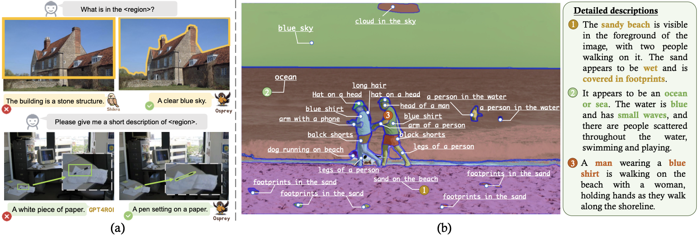
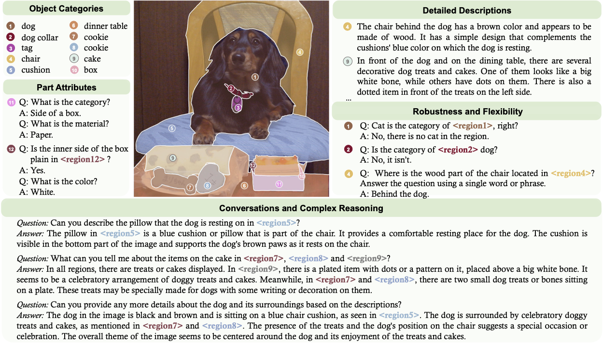
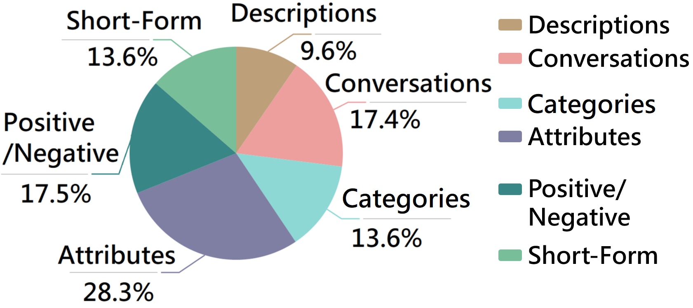
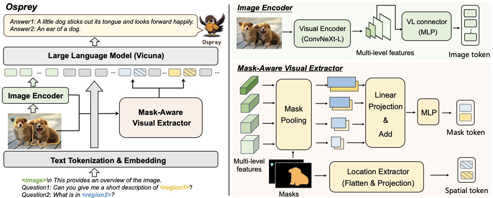
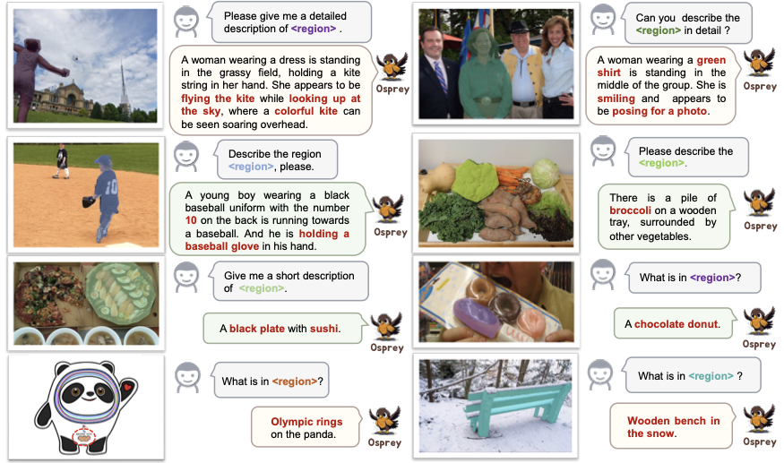
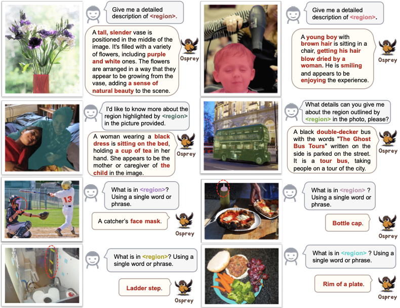
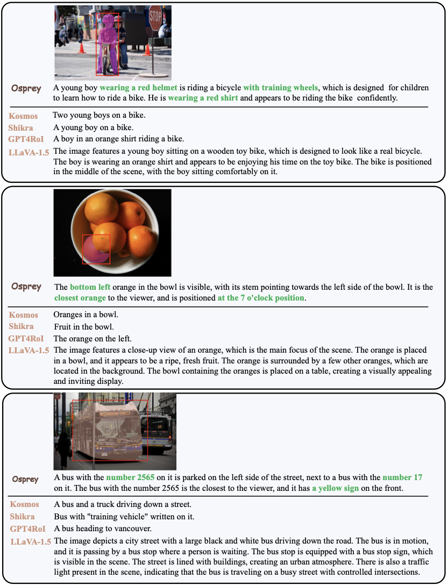

# Introduction {#sec:intro} Multimodal large language models (MLLMs) [@li2023multimodal] are key building blocks towards general-purpose visual assistants [@li2022elevater], and they have become increasingly popular in the research community. Though many recent MLLMs such as LLaVA [@llava], MiniGPT-4 [@zhu2023minigpt], Otter [@li2023otter], InstructBLIP [@Instructblip], Qwen-VL [@bai2023qwen] and LLaVA-1.5 [@liu2023improved] have demonstrated impressive results on instruction-following and visual reasoning capabilities, they mostly perform vision-language alignment on image-level using image-text pairs. The lack of region-level alignment hinders them from fine-grained image understanding tasks, such as region classification, captioning and reasoning. To enable region-level understanding in vision-language models, some recent works, *e.g.*, Kosmos-2 [@peng2023kosmos], Shikra [@chen2023shikra], PVIT [@chen2023position] and GPT4RoI [@zhang2023gpt4roi], have attempted to process bounding box-specified regions and leverage visual instruction tuning with object-level spatial features. However, directly employing the sparse bounding box as the referring input region could involve irrelevant background features and may lead to inexact region-text pair alignment for visual instruction tuning on LLM. During inference, the box-level referring input may not be able to precisely indicate the object, resulting in semantic deviation, as illustrated in Figure 1-(a). Besides, these models employ a relatively low input image resolution (*e.g.*, 224$\times$`<!-- -->`{=html}224), and struggle with understanding the details of dense object regions where a much higher resolution is required for optimal performance. Compared with coarse bounding box, using fine-grained mask as the referring input can represent objects precisely. By training with billions of high-quality masks, the recently developed SAM [@kirillov2023segment] supports using simple bounding boxes or points as prompts while demonstrating exceptional segmentation quality on zero-shot object, part or subpart. Several studies, like HQ-SAM [@ke2023segment], further enhance SAM's capability on fine-grained segmentation and generalization, making the segmentation more practical for real-world applications. However, these models cannot provide the primary semantic labels, let alone detailed semantic attributes and captions. As a result, the existing methods are limited in understanding the real-world scenes with inherent fine-grained multimodal information. {width="99.9%"}
(a) Comparisons between our mask-level Osprey and box-level understanding approaches, *e.g.*, Shikra and GPT4RoI . Osprey can achieve accurate fine-grained region understanding. (b) An example of feeding Osprey with class-agnostic masks from off-the-shelf SAM . One can see that Osprey enables the generation of semantic captions and detailed descriptions of the given image using different prompts. In this paper, we propose **Osprey**, a novel approach designed to extend the capability of MLLMs for fine-grained pixel-wise understanding. To this end, we present a mask-aware visual extractor to capture precise visual mask features with various granularity. These visual features are then interleaved with language instructions to form the input sequence to LLM. To facilitate the use of high resolution input, we leverage the convolutional CLIP backbone [@radford2021learning] as the vision encoder. Compared to ViT-based model, convolutional CLIP generalizes well to larger input resolution with efficiency and robustness. With the above designs, Osprey is capable of achieving fine-grained semantic understanding for part-level and object-level regions, providing primary object category, detailed object attributes, and more complex scene descriptions. To obtain fine-grained pixel-level alignment between vision and language features, we meticulously curate a large-scale mask-based region-text dataset, namely **Osprey-724K**, where the mask and text description of each region are carefully annotated. The majority of data are crafted from publicly available datasets with thoughtfully designed prompt templates to make them instruction-following, including object-level and part-level samples. It includes not only detailed descriptions and conversations but also enriched attributes information. Moreover, we empirically introduce spatial-aware and class-aware negative data mining and short-form response instructions, which further enhances the robustness and flexibility of Osprey's response. By taking advantage of visual instruction tuning, our proposed model enables new capabilities beyond box-level and image-level understanding. As shown in Figure 1-(b), Osprey can generate fine-grained semantics based on the class-agnostic masks from the off-the-shelf SAM [@kirillov2023segment]. Extensive experimental results on region-based recognition, classification, and complex description&reasoning tasks demonstrate the superiority of our approach. The contributions of this work can be summarized as follows. - We propose a novel approach, namely Osprey, to enable MLLM the pixel-level instruction tuning capability for fine-grained and open-world visual understanding. - We construct a large-scale instruction tuning dataset with mask-text pairs, called Osprey-724K, which contains object-level, part-level and additional instruction samples for robustness and flexibility. - Our method, as a fine-grained visual understanding approach, outperforms the previous state-of-the-art methods on a wide range of region understanding tasks. {width="98.0%"}
Example sample of the Osprey-724K dataset to illustrate the mask-based instruction-following data.

# Related Work {#sec:relatedwork} **Multimodal Large Language Models.** Large language models (LLMs), such as GPT-3 [@brown2020language], Flan-T5 [@chung2022scaling], PaLM [@chowdhery2022palm] and LLaMA [@touvron2023llama], have significantly advanced the research on Natural Language Processing (NLP). Such progresses have consequently facilitated the development of multimodal language models by expanding the training data and enlarging the model size. This scale-up has led to the breakthrough application of ChatGPT [@Chatgpt]. The great successes of LLMs and MLLMs have also inspired the research on computer vision, enabling multimodal in-context learning [@alayrac2022flamingo; @li2023blip]. Recent studies have been increasingly concentrated on how to leverage pre-trained LLMs for visual instruction tuning. Prominent examples include LLaVA [@llava], MiniGPT-4 [@zhu2023minigpt], mPLUG-Owl [@ye2023mplug], Otter [@li2023otter], InstructBLIP [@Instructblip], Qwen-VL [@bai2023qwen] and LLaVA-1.5 [@liu2023improved], *etc*. The common architecture among these models involves a pre-trained visual backbone to encode visual input, an LLM to understand user instructions and generate responses, and a vision-language cross-modal connector to align the output of vision encoder with the language model. While having demonstrated promising capabilities in the image-level multimodal tasks, these models show limited performance when specific regions are required as reference. **Region-level Image Understanding.** In the context of region-level image understanding, potential regions of interest are first located before delving into the visual understanding [@qi2023aims; @qi2023high; @li2024label; @li2024box2mask]. The Segment Anything Model (SAM) [@kirillov2023segment], which was trained with billions of high-quality masks, has demonstrated exceptional zero-shot object/part/subpart segmentation quality with simple bounding boxes and points as prompts. As the vanilla SAM cannot provide semantic labels, various approaches, like SEEM [@zou2023segment], HIPIE [@wang2023hierarchical] and Semantic SAM [@li2023semantic], extend the model to predict the semantic category for mask recognition. The primary semantic label only, however, is often insufficient for real-world applications. Therefore, it becomes imperative to incorporate additional semantics such as color, location, and even general descriptions for scene understanding and reasoning. Besides, though some works [@lai2023lisa; @ren2023pixellm] can achieve pixel-level grounding, they cannot provide the region-based descriptions. Recent studies such as GPT4RoI [@zhang2023gpt4roi], PVIT [@chen2023position], Kosmos-2 [@peng2023kosmos], Shikra [@chen2023shikra], Ferret [@you2023ferret] and GLaMM [@rasheed2023glamm] have enabled MLLMs to achieve region-based image understanding. However, most of these methods employ the bounding box as the referring region, which could involve irrelevant image features from background and introduce inexact region-text pair alignment for visual instructions tuning on LLM. Moreover, these models only allow a small input image size, *e.g.*, 224$\times$`<!-- -->`{=html}224, which may encounter difficulties in analyzing the details of dense object regions. To address these issues, in this work we introduce a pixel-level understanding method based on LLM. Our method supports the use of input masks for region referring and accommodates larger image resolution. Additionally, we curate a comprehensive dataset comprising mask-text pairs to facilitate instruction-based learning for this task.

# Osprey-724K Dataset {#sec:dataset} In this section, we present Osprey-724K, an instruction dataset with mask-text pairs, containing around 724K multimodal dialogues to encourage MLLMs for fine-grained pixel-level image understanding. Specifically, Osprey-724K consists of *object-level* and *part-level* mask-text instruction data, which are created based on the publicly available datasets. To make the data instruction-following, we leverage GPT-4 to generate the high-quality mask-text pairs using carefully designed prompt templates. Additionally, to enhance the robustness and flexibility of the response, we introduce the negative sample mining method with short-form response formatting prompt. An example sample of Osprey-724K is shown in Figure 2, and the detailed statistics and distributions of our Osprey-724K dataset are illustrated in Table and Figure 3, respectively. 

Data distribution of Osprey-724K.

# Object-level Instructions {#object-level} For an image with $N$ object regions, we make full use of its image-level and object-level captions based on the publicly datasets with mask annotations, such as COCO [@lin2014microsoft], RefCOCO [@refcoco_data], RefCOCO+ [@refcoco_data] and RefCOCOg [@refcoco_g]. However, these captions are plain and short with few semantic context, which are insufficient to train an MLLM. To mitigate this issue, we curate a data processing pipeline to generate fine-grained region-based instruction data, including the object category, object type, object action, location, color, status, . Firstly, we employ the detailed description in LLaVA-115K [@llava] as the image-level description for the COCO images. Secondly, we leverage the language-only GPT-4 to create instruction-following data to generate the visual content of each object region with diversity. Specifically, we make full use of the bounding boxes and brief region captions, where each box encodes the object concept and its spatial location in the scene. The short captions collected from RefCOCO [@refcoco_data], RefCOCO+ [@refcoco_data] and RefCOCOg [@refcoco_g] typically describe the specific regions from various perspectives. Based on these information, we employ GPT-4 to generate two types of data, , region level *Detailed Description* and *Conversation* samples. Please refer to the *Appendix* for the detailed prompts for GPT-4. Finally, we collect 197K unique object-level mask-region instruction-following samples in total.

# Part-level Instructions To capture the part-level knowledge, we leverage the PACO-LVIS [@ramanathan2023paco] dataset, which encompasses 456 object-specific part classes distributed among 75 object categories. In specific, PACO-LVIS comprises 55 different attributes, including 29 colors, 10 patterns&markings, 13 materials and 3 levels of reflectance. By taking consideration of these information, we employ GPT-4 to construct the instruction-following data via a question-and-answer (QA) formatting dialogue. Please refer to the *Appendix* for detailed prompts. This straightforward approach enhances the diversity in part categories and attributes. In total, we obtain 306K part mask-region instruction-following samples. {width="99.9%"}
**Overview of Osprey.** The left shows the overall model architecture and the right illustrates the detailed image encoder and mask-aware visual extractor. With the input image, referring mask regions and input language, the corresponding tokenization can be carried out. The interleaved mask features and language embedding sequence are then transmitted to a large language model (LLM) to achieve the nuanced semantic understanding.

# Robustness and Flexibility **Robustness.** Previous studies have shown that MLLMs suffer from the object hallucination issue [@li2023evaluating]. That is, objects that frequently appear in visual instructions or co-occur with other objects are susceptible to being erroneously hallucinated. To bolster the robustness of MLLM for accurate region understanding, we further construct positive/negative instruction samples. In specific, we formulate queries to inquire whether a given region belongs to a particular category, and anticipate responses with "`Yes/No`\". The positive/negative samples are devised equally to ensure balance. Negative sample mining intends to find spatial-aware and class-aware negative samples. The former enables the model to identify object-specific categories spatially nearest to a given object. For the latter, negative categories are selected based on high semantic similarities to the target class name, where SentenceBert [@reimers2019sentence] is employed to calculate the semantic similarity. Empirically, one category is randomly chosen from the top-8 semantically similar candidates to enhance diversity of the negative categories. We apply this scheme to LVIS [@gupta2019lvis], a large-vocabulary dataset containing around 1,200 object categories with mask annotations. **Flexibility.** To improve the response flexibility of MLLMs based on user's instructions, we add the short-form response instructions, covering categories, colors, types, locations or quantities of a specific object region. We employ GPT-4 to generate the instruction samples using the same publicly available datasets as discussed in Sec. [3.1](#object-level), expecting that GPT-4 can produce a concise response consisting of a single word or phrase. However, we observe that conventional dialogue-based prompts do not explicitly indicate the desirable output format, potentially resulting in the overfitting of an LLM to short-form answers. This issue has been acknowledged in previous works [@Instructblip; @liu2023improved] on image-level understanding. To tackle this challenge, we adopt to append the short-form response prompt explicitly at the end of questions when soliciting brief answers.

# Method of Osprey {#sec:method}

# Model Architecture The architecture overview of Osprey is shown in Figure 4. Osprey consists of an image-level vision encoder, a pixel-level mask-aware visual extractor and a large language model (LLM). Given an image, the referring mask regions and the input language, we perform tokenization and conversion to obtain embeddings. The interleaved mask features and language embedding sequences are then sent to the LLM to obtain the fine-grained semantic understandings.

# Convolutional CLIP Vision Encoder The vision encoder in the majority of MLLMs [@llava; @zhu2023minigpt; @zhang2023gpt4roi; @chen2023shikra; @you2023ferret] is exemplified with the ViT-based CLIP model [@radford2021learning; @dosovitskiy2020image], which adopts an image resolution of 224$\times$`<!-- -->`{=html}224 or 336$\times$`<!-- -->`{=html}336. However, such a resolution makes it difficult to achieve fine-grained image understanding with pixel-level representations, especially in small regions. Increasing the input image resolution is hindered by the computational burden associated with the global attention in ViT architecture. To alleviate the above issue, we introduce the convolutional CLIP model, *e.g.*, ResNet [@he2016deep] and ConvNeXt [@liu2022convnet], as the vision encoder. The CNN-based convolutional CLIP has empirically demonstrated promising generalization capabilities across various input resolutions compared to ViT-based CLIP model, for example, in the open-vocabulary segmentation tasks [@yu2023convolutions]. Such a design allows for efficient training and fast inference without sacrificing performance. Additionally, multi-scale feature maps generated by the CNN-based CLIP vision encoder can be directly utilized for the subsequent feature extraction on each object region. In our implementation, we choose the ConvNeXt-Large CLIP model as the vision encoder and adopt the output at "res4" stage as the image-level features.

# Mask-Aware Visual Extractor {#mask-sampler} In contrast to previous region-based approaches [@zhang2023gpt4roi; @peng2023kosmos; @chen2023position; @chen2023shikra; @rasheed2023glamm] using sparse bounding boxes as the referring input, Osprey adopts the fine-grained representations using detailed mask regions. To capture pixel-level features of each object region, we propose a Mask-Aware Visual Extractor, which not only encodes the mask-level visual features but also gathers the spatial position information of each region $\mathbf{R}_{i}$. To this end, we first adopt the mask-pooling operation $\mathcal{MP}$ [@xu2023open] based on multi-level image features $\mathbf{Z}(x)$ from the output of the vision encoder $\mathbf{Z}$. For each single-level feature $\mathbf{Z}(x)_j$, we pool all the features that fall inside the mask region $\mathbf{R}_{i}$ as follows: $$\begin{equation}
{V_{ij}} = \mathcal{MP}({\mathbf{R}_{i}}, \mathbf{Z}(x)_{j}).
\end{equation}$$ Then, to encode the features across multiple levels, we pass each feature $V_{ij}$ through a linear projection layer $\mathbf{P}_j$ to generate the region-level embeddings with the same dimension, and perform summation to fuse multi-level features. We further employ an MLP layer $\sigma$ to adapt and produce the visual mask token ${t}_i$ as follows: $$\begin{equation} {t_i} = \sigma (\sum\limits_{j=1}^4 {\mathbf{P}_j ({V_{ij}})}).
\end{equation}$$ To preserve the spatial geometry of the object region, we utilize the binary mask ${\mathbf{M}^{H\times W}} \in \{ 0,1\}$ for each object region to encode the pixel-level position relationship. We first resize each $\mathbf{M}_i$ to 224$\times$`<!-- -->`{=html}224, and then flatten and project it to generate the spatial token ${s_i}$. Finally, we incorporate the visual mask token and its corresponding spatial token as the embeddings for each mask region.

# Tokenization for LLM Model As illustrated in Figure 4, we feed the image into a pre-trained visual encoder, ConvNeXt-Large CLIP model, to extract the image-level embeddings. For textual information, we tokenize the text sequence using the pre-trained LLM's tokenizer and project them into text embeddings. As for mask-based region, we define a special token as a placeholder `<region>`, which is substituted with the mask token $t$ along with spatial token $s$, denoted by `<mask>` `<position>`. When referring to an object region in the text input, the `<region>` is appended after its region name, like "`region1`\" or "`region2`\". In this way, the mask regions can be well mixed with texts to form complete sentences with the same tokenization space. In addition to the user instructions, we incorporate a prefix prompt: "`<image>`$\backslash$`n This provides an overview of the picture.`\" The `<image>` is a special token that acts as a placeholder, which would be replaced by the image-level embedding from the vision encoder. All of image-level and region-level visual tokens and text tokens are interleaved and fed into LLM to comprehend the image and user instructions with different object regions. We employ Vicuna [@chiang2023vicuna], which is a decoder-only LLM instruction-tuned on top of LLaMA [@touvron2023llama], as our LLM.

# Training The training process of our Osprey model consists of three stages, which are all supervised by minimizing a next-token prediction loss [@llava; @zhu2023minigpt; @zhang2023gpt4roi]. **Stage 1: Image-Text Alignment Pre-training.** With the use of convolutional CLIP vision encoder, *i.e.*, ConvNeXt-Large, we first train the image-level feature and language connector for image-text feature alignment. At this stage, Osprey includes a pre-trained vision encoder, a pretrained LLM and an image-level projector. Following LLaVA-1.5 [@liu2023improved], we adopt an MLP as the vision-language connector to improve the multimodal capabilities of the model. The filtered CC3M data introduced in LLaVA [@liu2023improved] are employed as the training data, and only the image-level projector is trained at this stage. The vision encoder and LLM are frozen. **Stage 2: Mask-Text Alignment Pre-training.** At this stage, we load the weights trained in Stage 1, and add the Mask-Aware Visual Extractor introduced in Sec. [4.1.2](#mask-sampler) to capture pixel-level region features. Only the Mask-Aware Visual Extractor is trained in this stage to align mask-based region features with language embeddings. We collect short text and pixel-level mask pairs from the publicly available object-level datasets (COCO [@lin2014microsoft], RefCOCO [@refcoco_data], RefCOCO+ [@refcoco_data]) and part-level datasets (Pascal Part [@chen2014detect], Part Imagenet [@he2022partimagenet]), then transform them into instruction-following data to train the model. **Stage 3: End-to-End Fine-tuning.** At this stage, we keep the vision encoder weights fixed and finetune the image-level projector, mask-based region feature extractor and LLM model of Osprey. We focus on extending the capability of Osprey to accurately follow user instructions and tackle complex pixel-level region understanding tasks. At this stage, we utilize our curated Osprey-724K dataset. Besides, Visual Genome (VG) [@krishna2017visual] and Visual Commonsense Reasoning (VCR) [@vcr_data] datasets are employed to add more multiple region understanding data. The bounding box annotations are available in VG, while mask-based ones are not. Hence, we employ HQ-SAM [@ke2023segment] to generate high-quality masks with the corresponding box prompts for the VG dataset. After this stage, Osprey is capable of understanding the complex scenarios based on the user instructions and pixel-level mask regions.

# Experiments {#sec:experiment}

# Implementation Details The AdamW [@loshchilov2016sgdr] is used as the optimizer and the cosine annealing scheduler [@loshchilov2017decoupled] is used to adjust learning rate. At the first training stage, we set the batch size to 128 and the learning rate to 1$\times$`<!-- -->`{=html}10$^{-3}$ for one epoch. At the second stage, we decrease the learning rate to 2$\times$`<!-- -->`{=html}10$^{-5}$ with a batch size of 4 and train for two epochs. At the final stage, the learning rate is further reduced to 1$\times$`<!-- -->`{=html}10$^{-5}$ with a batch size of 4 for two epochs. The maximum length of sequence in LLM is set to 2,048. All training is conducted on four NVIDIA A100 GPUs with 80GB memory. We leverage the DeepSpeed framework [@deepspeed] for efficient large-scale model training. The training of the three stages costs 7, 15, and 48 hours, respectively. The input image size is set to 512 $\times$ 512. All the training datasets are aggregated into a single dataloader to ensure the representational integrity. In the training process, the image and its corresponding mask-based instruction/response pairs are randomly selected from each dataset.

# Experimental Results To evaluate the effectiveness of our proposed Osprey, we conduct experiments to demonstrate its capabilities of pixel-level region-based recognition, classification, and complex description&reasoning across various representative tasks. Figure 5 shows some visual examples to better illustrate the effectiveness of Osprey. In Figure 6, visual results are showcased based on the mask regions obtained from the off-the-self SAM [@kirillov2023segment] in "segment everything\" mode.

# Open-Vocabulary Segmentation The primary goal of this task is to generate mask-based region recognition with the explicit category [@ding2023open_ICML; @xu2023open; @yu2023convolutions]. To this end, we utilize a prompt like "`Can you give me a short description of <region>? Using a short phrase.`" The ground-truth (GT) mask regions are adopted for model inference to assess the open-vocabulary recognition performance. Based on the sentence-based response of MLLMs, we calculate the semantic similarity between the output and vocabulary list of each dataset using Sentence-BERT [@reimers2019sentence]. The category with the highest similarity is chosen as the final result. Table compares Osprey with state-of-the-art region-based MLLM methods on Cityscapes [@cordts2016cityscapes] and ADE20K-150 [@zhou2017scene] datasets. Most of these approaches employ the GT bounding box as the input referring region. As Ferret [@you2023ferret] can support free-form input, we adopt the fine-grained mask as its input region to precisely reflect the object. Besides, we leverage the large-scale pretrained vision-language model CLIP [@radford2021learning] with ConvNeXt-L [@liu2022convnet] and CLIP-Surgery-ViT-L [@li2023clip] as vision encoder, and adopt the input mask region and mask-pooling operation [@xu2023open] to extract visual features for each object. The input image resolution of these CLIP-based methods is set to 512$\times$`<!-- -->`{=html}512, ensuring a fair comparison. On Cityscapes, our Osprey surpasses previous methods by a large margin (*e.g.*, +15.94% PQ, +7.24% AP and +13.05% mIoU against box-level GPT4RoI, +15.07% PQ, +2.23% AP and +11.38% mIoU against mask-level Ferret). On ADE20K-150, Osprey achieves highly competitive performance, obtaining 41.89% PQ, 41.24% AP and 29.63% mIoU, respectively.

# Referring Object Classification In this task, the model needs to classify the object in a specific region of an image. We use two semantic relevance metrics, *Semantic Similarity* (SS) and *Semantic IoU* (S-IOU) [@conti2023vocabulary], to evaluate the classification capability of a model. SS measures the similarity of predicted/GT labels in a semantic space, while S-IOU reflects the overlap of words. We conduct experiments on the validation set of object-level LVIS [@gupta2019lvis] and part-level PACO [@ramanathan2023paco] datasets, and use a prompt like "`What is the category of <region>? Using only one word or phrase.`" Specifically, we randomly sample 1K images with 4,004 objects from LVIS dataset, and sample 1K images with 4,263 objects from PACO dataset for evaluation. We compare our method with image-, box- and mask-level approaches [@liu2023improved; @peng2023kosmos; @chen2023shikra; @zhang2023gpt4roi; @you2023ferret], and report the results in Table As for image-level LLaVA-1.5 [@liu2023improved], we adopt the box-based cropped image region as its input. On LVIS [@gupta2019lvis], which has more than 1,200 object categories, our Osprey obtains 65.24% SS and 38.19% S-IoU, outperforming the state-of-the-art method by 1.46% and 1.62%, respectively. In particular, Osprey significantly outperforms previous MLLMs on PACO, achieving 73.06% SS and 52.72% S-IoU. It surpasses Ferret by 14.38% SS and 26.76% S-IoU, demonstrating its strong fine-grained part-level classification and understanding capability. {width="96.0%"}
Visual examples of Osprey on the input mask-based referring regions.

# Referring Description and Reasoning **Detailed Description.** We evaluate the instruction-following detailed description capabilities of each model. The input prompt for inference is selected randomly from the list in Table A13 of *Appendix*. Motivated by [@llava], we leverage GPT-4 to comprehensively measure the quality of generated responses from the model to the input referring regions. Specifically, we randomly sample 80 images from the validation set of RefCOCOs [@refcoco_data; @refcoco_g] for detailed region description. We generate the questions and obtain GPT-4's answers using the instruction generation pipeline outlined in Sec. [3.1](#object-level). GPT-4 assesses both the precision of referring understanding and the correctness of semantics. The rating score ranges from 1 to 10, with higher scores indicating better performance. To gauge the effectiveness of MLLMs, we calculate the ratio of the predicted answer score to that of GPT-4 and present it as a percentage. As shown in Table, Osprey achieves 77.54% accuracy, significantly outperforming GPT4RoI by 27.57%. It is worth mentioning that we adopt the box-cropped region as the image-level input for LLaVA-1.5, which yields an accuracy of 71.11%, more than 6% lower than Osprey. With the additional image-level data used in LLaVA-1.5, Osprey attains 83.78% accuracy and performs the best. **Ferret-Bench.** We further conduct experiments on Ferret-Bench [@you2023ferret] to evaluate the capabilities of both referring description and referring reasoning. Notably, we adopt box as the input region due to the lack of mask annotations on Ferret-Bench. Results are summarized in Table One can see that Osprey-Chat achieves the best performance in both Referring Description and Referring Reasoning tasks with accuracy of 72.2% and 67.8%, outperforming the state-of-the-art method by 3.5% and 0.5%, respectively.

Visual results of Osprey based on the class-agnostic masks from off-the-self SAM . With the pixel-level mask regions and task-specific prompts, the semantic understanding results are obtained, including (a) open-vocabulary categories, (b) short descriptions, and (c) detailed descriptions. Zoom-in for better view. **Various Input Image Sizes.** We extend to explore the influence of varying input sizes on our ConvNeXt-based CLIP vision encoder in Osprey. Table presents the experimental results on the referring object classification task. The results demonstrate that Osprey exhibits superior performance as the input size increases. Specifically, when the input size is set to 800$\times$`<!-- -->`{=html}800, Osprey attains its peak performance with 68.29% SS and 42.66% S-IoU. However, it is noteworthy that as the input size increases, the number of tokens also rises significantly, adding computational overhead to LLM. With the input size of 800$\times$`<!-- -->`{=html}800, the number of image tokens is 2,500 and 1.9 mask-text pairs are processed per second during inference, representing the slowest speed among the evaluated models. To strike a balance between performance and computational cost, we have opted for a 512$\times$`<!-- -->`{=html}512 input image size in Osprey.

# Conclusion In this paper, we presented Osprey, a novel approach to incorporate pixel-level mask region references into language instructions, significantly enhancing MLLMs for fine-grained visual understanding. By incorporating a Mask-Aware Visual Extractor and leveraging a convolutional CLIP backbone, we enabled Osprey the capability of region-based image understanding. To facilitate the fine-grained pixel-level alignment between vision and language, we deliberately curated the Osprey-724K dataset, which comprised 724K mask-based region-text pairs. Trained on the Osprey-724K dataset, our Osprey model demonstrated superior performance on various region understanding tasks, setting new state-of-the-arts. It is expected that our Osprey-724K dataset and Osprey model can facilitate the advancement of MLLMs for visual region understanding in real-world applications.

# Acknowledgments {#acknowledgments .unnumbered} This work is supported by National Natural Science Foundation of China under Grants (62376244).

# Appendix {#appendix .unnumbered}

# More Experiments

# Additional Main Results **Effectiveness of Osprey-724K.** To validate the effectiveness of Osprey-724K dataset, we retrain the GPT4ROI model [@zhang2023gpt4roi] and conduct experiments on open-vocabulary segmentation, referring object classification and detailed region description tasks. The results are presented in Table It can be seen that the re-trained GPT4RoI model with Osprey-724K significantly outperforms the original one, especially on part-level region classification and Detailed Description tasks, where we observe impressive improvement of +20.89% SS and +15.33%. These results underscore the superior quality of our Osprey-724K dataset.

# More Ablation Studies **Single-level *vs.* Multi-level Mask Features.** To explore the effects of multi-scale features in Mask-Aware Visual Extractor, we carry out experiments on open-vocabulary segmentation and referring object classification tasks. A comparison between single-level and multi-level features is performed. We utilize the output of vision encoder at "res4" stage to represent single-level features. As shown in Table, multi-level mask features in Osprey significantly outperform single-level mask features in model training. This notable improvement demonstrates the effectiveness of Osprey with multi-level Mask-Aware Visual Extractor. **Comparisons on Vision Encoders.** To investigate the impact of ViT-based and ConvNeXt-based CLIP vision encoders across varying input sizes, we meticulously conduct the experiments on open-vocabulary panoptic segmentation using ViT-Surgery-L [@li2023clip] and ConvNeXt-L [@liu2022convnet] models. All experimental results are obtained by directly employing CLIP as a mask classifier with ground truth masks. Table reports the comparison results. The experimental results reveal that the CNN-based CLIP exhibits superior generalization performance as the input size scales up. Specifically, we observe that the ViT-Surgery-L CLIP model achieves a higher PQ at a lower resolution (*i.e.*, input size 224) while facing challenges at higher resolutions. According to this phenomenon, we adopt a straightforward solution by embracing a CNN-based CLIP as the vision encoder in Osprey. **Impacts of Short-form Prompt and Positive/Negative Data.** We conduct experiments to evaluate the impacts of short-form prompt and positive/negative samples on our Osprey-724K dataset. As depicted in Table, Osprey trained with both short-form prompt and positive/negative samples attains 65.24% SS and 38.19% S-IoU on the object-level LVIS dataset, bringing an improvement of +8.83% and +12.54% over the model trained without short-form prompt data. On the part-level PACO dataset, the Osprey model trained with only short-form prompt achieves +22.80% SS and +29.43% S-IoU improvements over that without short-form prompt. Regarding the inclusion of positive/negative samples, Osprey model trained with them attains +1.69% SS and +1.49% S-IoU over the model trained without them on object-level LVIS dataset. On Part-level PACO dataset, +1.47% SS and +2.33% S-IoU performance improvements are obtained when positive/negative sample data are used. These experimental results underscore the effectiveness of incorporating short-form prompt and positive/negative data in our Osprey-724K for enhancing model performance.

# More Qualitative Results We present additional visual examples to highlight the pixel-level semantic understanding performance with the input referring mask-based regions. Figure 7 displays more visual cases involving unusual scenes, such as the "catcher's face mask", "bottle cap", "ladder step", and "rim of a plate". Osprey is capable to generate accurate semantic predictions with robust capabilities in these challenging scenarios. Furthermore, Figure 8 provides comparisons with previous region-level and image-level methods [@liu2023improved; @peng2023kosmos; @chen2023shikra; @zhang2023gpt4roi]. Our approach exhibits superior scene understanding results with fine-grained details. Please note that each box-cropped region is extracted as the input for image-level LLaVA-1.5 [@liu2023improved]. {width="99.0%"}
Visual examples of Osprey on the input mask-based referring regions.

# More Details of Osprey-724K

# Example Illustrations We provide several examples to illustrate the instruction-following data in our Osprey-724K dataset, including the object-level and short-form response instruction-following data in Table, the part-level instruction-following data in Table Those data are generated through interactions with GPT-4, and the corresponding detailed prompts for GPT-4 are given from Table to Table Besides, Table showcases positive and negative samples in robustness data.

# Details on Task Prompt Different prompt templates are used for training the Osprey model based on different instruction-following data. The question templates are randomly selected from the corresponding lists. Please refer to Table$\sim$Table for more details.

# Discussion on Types of Input Region Osprey can handle various input instructions of referring region, including point, box and scribble types, which can be considered as free-form masks. Our Mask-Aware Visual Extractor is compatible with these inputs. Compared to these coarse types, fine-grained masks can more precisely represent objects, achieving pixel-level alignment for accurate semantic understanding. Besides, some efficient SAM-based models, like EfficientSAM [@xiong2023efficientsam] and EdgeSAM [@zhou2023edgesam], have been developed to make the acquisition of masks faster with lower cost. {width="92.0%"}
Qualitative comparisons with previous region-level and image-level approaches . The same prompt is adopted to obtain the detailed descriptions, which is selected randomly from Table <a href="#tab:concise_describe_instructions" data-reference-type="ref" data-reference="tab:concise_describe_instructions">Table</a>. Our method showcases more accurate region-level semantic understanding with fine-grained details.

+:----------------------------------------------------------------------------------------------------------------------------------------------------------------------------------------------------------------------------------------------------------------------------------------------------------------------------------------------------------------------------------------------------------------------------------------------------------------------------------------------------------------------------------------------------+:-:+
| ****Context type 1: Image-level description**** | |
+-----------------------------------------------------------------------------------------------------------------------------------------------------------------------------------------------------------------------------------------------------------------------------------------------------------------------------------------------------------------------------------------------------------------------------------------------------------------------------------------------------------------------------------------------------+---+
| The image presents a lively market scene with a group of people buying fruits and bags. There are multiple | |
+-----------------------------------------------------------------------------------------------------------------------------------------------------------------------------------------------------------------------------------------------------------------------------------------------------------------------------------------------------------------------------------------------------------------------------------------------------------------------------------------------------------------------------------------------------+---+
| individuals in the market, all browsing through the fresh produce available. A significant variety of fruits are | |
+-----------------------------------------------------------------------------------------------------------------------------------------------------------------------------------------------------------------------------------------------------------------------------------------------------------------------------------------------------------------------------------------------------------------------------------------------------------------------------------------------------------------------------------------------------+---+
| showcased in the market, including bananas, oranges, and apples. Bananas can be seen in several groups, | |
+-----------------------------------------------------------------------------------------------------------------------------------------------------------------------------------------------------------------------------------------------------------------------------------------------------------------------------------------------------------------------------------------------------------------------------------------------------------------------------------------------------------------------------------------------------+---+
| with some green and yellow bananas occupying different areas of the market. Meanwhile, oranges and apples | |
+-----------------------------------------------------------------------------------------------------------------------------------------------------------------------------------------------------------------------------------------------------------------------------------------------------------------------------------------------------------------------------------------------------------------------------------------------------------------------------------------------------------------------------------------------------+---+
| are displayed in smaller sections among the fruits. In addition to fruits, handbags are also being sold at the | |
+-----------------------------------------------------------------------------------------------------------------------------------------------------------------------------------------------------------------------------------------------------------------------------------------------------------------------------------------------------------------------------------------------------------------------------------------------------------------------------------------------------------------------------------------------------+---+
| market, attracting the attention of the customers. Overall, the market bustles with activity as people gather | |
+-----------------------------------------------------------------------------------------------------------------------------------------------------------------------------------------------------------------------------------------------------------------------------------------------------------------------------------------------------------------------------------------------------------------------------------------------------------------------------------------------------------------------------------------------------+---+
| around the fresh fruits and bags, contemplating their purchases. | |
| | |
| ****Context type 2: Boxes**** | |
+-----------------------------------------------------------------------------------------------------------------------------------------------------------------------------------------------------------------------------------------------------------------------------------------------------------------------------------------------------------------------------------------------------------------------------------------------------------------------------------------------------------------------------------------------------+---+
| person: \[0.507,0.409,0.698,0.740\], person: \[0.243,0.496,0.558,0.746\], person: \[0.196,0.422,0.395,0.708\], | |
+-----------------------------------------------------------------------------------------------------------------------------------------------------------------------------------------------------------------------------------------------------------------------------------------------------------------------------------------------------------------------------------------------------------------------------------------------------------------------------------------------------------------------------------------------------+---+
| orange: \[0.761,0.537,0.820,0.569\], orange: \[0.809,0.553,0.841,0.570\], orange: \[0.841,0.552,0.868,0.571\], | |
+-----------------------------------------------------------------------------------------------------------------------------------------------------------------------------------------------------------------------------------------------------------------------------------------------------------------------------------------------------------------------------------------------------------------------------------------------------------------------------------------------------------------------------------------------------+---+
| banana: \[0.671,0.814,0.770,0.887\], banana: \[0.599,0.703,0.820,0.817\], banana: \[0.885,0.829,0.941,0.893\], | |
+-----------------------------------------------------------------------------------------------------------------------------------------------------------------------------------------------------------------------------------------------------------------------------------------------------------------------------------------------------------------------------------------------------------------------------------------------------------------------------------------------------------------------------------------------------+---+
| apple: \[0.811,0.584,0.851,0.603\], apple: \[0.873, 0.568,0.900,0.586\], apple: \[0.778,0.580,0.819,0.601\], | |
+-----------------------------------------------------------------------------------------------------------------------------------------------------------------------------------------------------------------------------------------------------------------------------------------------------------------------------------------------------------------------------------------------------------------------------------------------------------------------------------------------------------------------------------------------------+---+
| handbag: \[0.473,0.110,0.607,0.201\], handbag: \[0.491,0.202,0.611,0.267\], handbag: \[0.583,0.105,0.696,0.204\]. | |
| | |
| ****Context type 3: Mask region captions**** | |
+-----------------------------------------------------------------------------------------------------------------------------------------------------------------------------------------------------------------------------------------------------------------------------------------------------------------------------------------------------------------------------------------------------------------------------------------------------------------------------------------------------------------------------------------------------+---+
| [**`<region1>`**] (person: \[0.507,0.409,0.698,0.740\]): | |
+-----------------------------------------------------------------------------------------------------------------------------------------------------------------------------------------------------------------------------------------------------------------------------------------------------------------------------------------------------------------------------------------------------------------------------------------------------------------------------------------------------------------------------------------------------+---+
| gray shirt wearing glasses. [//] woman with gray shirt standing next to man. [//] woman in gray shirt facing camera on right. [//] | |
+-----------------------------------------------------------------------------------------------------------------------------------------------------------------------------------------------------------------------------------------------------------------------------------------------------------------------------------------------------------------------------------------------------------------------------------------------------------------------------------------------------------------------------------------------------+---+
| the woman in the grey shirt with a watch on her wrist. [//] a short haired woman in jeans shopping. | |
+-----------------------------------------------------------------------------------------------------------------------------------------------------------------------------------------------------------------------------------------------------------------------------------------------------------------------------------------------------------------------------------------------------------------------------------------------------------------------------------------------------------------------------------------------------+---+
| [**`<region2>`**] (person: \[0.243,0.469,0.558,0.746\]): | |
+-----------------------------------------------------------------------------------------------------------------------------------------------------------------------------------------------------------------------------------------------------------------------------------------------------------------------------------------------------------------------------------------------------------------------------------------------------------------------------------------------------------------------------------------------------+---+
| the lady with the blue shirt. [//] the back of an older woman with her hair in a barrette with a blue jacket on. [//] | |
+-----------------------------------------------------------------------------------------------------------------------------------------------------------------------------------------------------------------------------------------------------------------------------------------------------------------------------------------------------------------------------------------------------------------------------------------------------------------------------------------------------------------------------------------------------+---+
| navy blue shirt. [//] woman back in blue. [//] a woman is wearing blue sweater. | |
+-----------------------------------------------------------------------------------------------------------------------------------------------------------------------------------------------------------------------------------------------------------------------------------------------------------------------------------------------------------------------------------------------------------------------------------------------------------------------------------------------------------------------------------------------------+---+
| [**`<region3>`**] (person: \[0.196,0.422,0.395,0.708\]): | |
+-----------------------------------------------------------------------------------------------------------------------------------------------------------------------------------------------------------------------------------------------------------------------------------------------------------------------------------------------------------------------------------------------------------------------------------------------------------------------------------------------------------------------------------------------------+---+
| a woman in glasses shops in an open air fruit market. [//] a woman in a gray coat and scarf. | |
+-----------------------------------------------------------------------------------------------------------------------------------------------------------------------------------------------------------------------------------------------------------------------------------------------------------------------------------------------------------------------------------------------------------------------------------------------------------------------------------------------------------------------------------------------------+---+
| ****Response type 1: mask region description**** | |
+-----------------------------------------------------------------------------------------------------------------------------------------------------------------------------------------------------------------------------------------------------------------------------------------------------------------------------------------------------------------------------------------------------------------------------------------------------------------------------------------------------------------------------------------------------+---+
| [**`<region1>`**]: In another part of the market, a short-haired woman in a gray shirt and jeans is shopping. She seems to be looking directly at camera. A noticeable detail is the watch worn on her wrist. This lady, who is also wearing glasses, is standing next to a man. | |
+-----------------------------------------------------------------------------------------------------------------------------------------------------------------------------------------------------------------------------------------------------------------------------------------------------------------------------------------------------------------------------------------------------------------------------------------------------------------------------------------------------------------------------------------------------+---+
| [**`<region2>`**] : An older woman is visible, her back facing us. She's donning a navy blue sweater. Her hair, neatly fastened with a barrette, adds a note of detail to her appearance. | |
+-----------------------------------------------------------------------------------------------------------------------------------------------------------------------------------------------------------------------------------------------------------------------------------------------------------------------------------------------------------------------------------------------------------------------------------------------------------------------------------------------------------------------------------------------------+---+
| [**`<region3>`**]: Another woman, clad in a gray coat and scarf, is seen shopping in the open-air fruit market. This woman, similarly wearing glasses, appears to be engrossed in the selection of fresh produce. | |
+-----------------------------------------------------------------------------------------------------------------------------------------------------------------------------------------------------------------------------------------------------------------------------------------------------------------------------------------------------------------------------------------------------------------------------------------------------------------------------------------------------------------------------------------------------+---+
| ****Response type 2: conversation**** | |
+-----------------------------------------------------------------------------------------------------------------------------------------------------------------------------------------------------------------------------------------------------------------------------------------------------------------------------------------------------------------------------------------------------------------------------------------------------------------------------------------------------------------------------------------------------+---+
| Question 1: Can you describe the woman in [**`<region1>`**] and what she is doing? | |
+-----------------------------------------------------------------------------------------------------------------------------------------------------------------------------------------------------------------------------------------------------------------------------------------------------------------------------------------------------------------------------------------------------------------------------------------------------------------------------------------------------------------------------------------------------+---+
| Answer 1: The woman in [**`<region1>`**] is wearing a gray shirt, jeans, and glasses. She has short hair and a watch on her wrist. She is shopping in the lively market, browsing through the fresh produce, such as fruits and bags. | |
+-----------------------------------------------------------------------------------------------------------------------------------------------------------------------------------------------------------------------------------------------------------------------------------------------------------------------------------------------------------------------------------------------------------------------------------------------------------------------------------------------------------------------------------------------------+---+
| Question 2: What can you tell me about the woman in [**`<region2>`**]? | |
+-----------------------------------------------------------------------------------------------------------------------------------------------------------------------------------------------------------------------------------------------------------------------------------------------------------------------------------------------------------------------------------------------------------------------------------------------------------------------------------------------------------------------------------------------------+---+
| Answer 2: The woman in [**`<region2>`**] is wearing a navy blue shirt or sweater. She has her back towards the camera, with her hair styled in a barrette. She appears to be an older woman, also browsing through the market, looking at the various items for sale. | |
+-----------------------------------------------------------------------------------------------------------------------------------------------------------------------------------------------------------------------------------------------------------------------------------------------------------------------------------------------------------------------------------------------------------------------------------------------------------------------------------------------------------------------------------------------------+---+
| Question 3: How would you compare the person in [**`<region1>`**] and the person in [**`<region2>`**]? | |
+-----------------------------------------------------------------------------------------------------------------------------------------------------------------------------------------------------------------------------------------------------------------------------------------------------------------------------------------------------------------------------------------------------------------------------------------------------------------------------------------------------------------------------------------------------+---+
| Answer 3: The person in [**`<region2>`**] is positioned on the left side of the image, facing away from the camera. On the other hand, the person in [**`<region1>`**] is located more towards the center-right of the image, facing the camera. Both individuals are wearing different colored shirts, with the person in [**`<region2>`**] wearing a blue shirt and the person in [**`<region1>`**] wearing a gray shirt. | |
+-----------------------------------------------------------------------------------------------------------------------------------------------------------------------------------------------------------------------------------------------------------------------------------------------------------------------------------------------------------------------------------------------------------------------------------------------------------------------------------------------------------------------------------------------------+---+
| Question 4: Is there anything notable about the person in [**`<region3>`**] ? | |
+-----------------------------------------------------------------------------------------------------------------------------------------------------------------------------------------------------------------------------------------------------------------------------------------------------------------------------------------------------------------------------------------------------------------------------------------------------------------------------------------------------------------------------------------------------+---+
| Answer 4: The person in [**`<region3>`**] is described as a woman wearing a gray coat and scarf. They are wearing glasses and seem to be shopping in the open-air fruit market, providing an indication of the bustling activity taking place in the scene. | |
+-----------------------------------------------------------------------------------------------------------------------------------------------------------------------------------------------------------------------------------------------------------------------------------------------------------------------------------------------------------------------------------------------------------------------------------------------------------------------------------------------------------------------------------------------------+---+
| Question 5: Based on the image, how would you describe the overall atmosphere of the market? | |
+-----------------------------------------------------------------------------------------------------------------------------------------------------------------------------------------------------------------------------------------------------------------------------------------------------------------------------------------------------------------------------------------------------------------------------------------------------------------------------------------------------------------------------------------------------+---+
| Answer 5: The market has a bustling and lively atmosphere. There's a sense of excitement and energy as people gather around the fresh fruits and bags for sale. The variety of items available, as well as the interactions among customers, contribute to the vibrant ambience of the market scene. | |
+-----------------------------------------------------------------------------------------------------------------------------------------------------------------------------------------------------------------------------------------------------------------------------------------------------------------------------------------------------------------------------------------------------------------------------------------------------------------------------------------------------------------------------------------------------+---+
| ****Response type 3: short-form response**** | |
+-----------------------------------------------------------------------------------------------------------------------------------------------------------------------------------------------------------------------------------------------------------------------------------------------------------------------------------------------------------------------------------------------------------------------------------------------------------------------------------------------------------------------------------------------------+---+
| Question 1: What color is the shirt of the woman in [**`<region1>`**]? | |
+-----------------------------------------------------------------------------------------------------------------------------------------------------------------------------------------------------------------------------------------------------------------------------------------------------------------------------------------------------------------------------------------------------------------------------------------------------------------------------------------------------------------------------------------------------+---+
| Answer 1: Gray. | |
+-----------------------------------------------------------------------------------------------------------------------------------------------------------------------------------------------------------------------------------------------------------------------------------------------------------------------------------------------------------------------------------------------------------------------------------------------------------------------------------------------------------------------------------------------------+---+
| Question 2: What accessories does the woman in [**`<region1>`**] wear? | |
+-----------------------------------------------------------------------------------------------------------------------------------------------------------------------------------------------------------------------------------------------------------------------------------------------------------------------------------------------------------------------------------------------------------------------------------------------------------------------------------------------------------------------------------------------------+---+
| Answer 2: Glasses. | |
+-----------------------------------------------------------------------------------------------------------------------------------------------------------------------------------------------------------------------------------------------------------------------------------------------------------------------------------------------------------------------------------------------------------------------------------------------------------------------------------------------------------------------------------------------------+---+
| Question 3: What color is the woman's sweater in [**`<region2>`**] | |
+-----------------------------------------------------------------------------------------------------------------------------------------------------------------------------------------------------------------------------------------------------------------------------------------------------------------------------------------------------------------------------------------------------------------------------------------------------------------------------------------------------------------------------------------------------+---+
| Answer 3: Blue. | |
+-----------------------------------------------------------------------------------------------------------------------------------------------------------------------------------------------------------------------------------------------------------------------------------------------------------------------------------------------------------------------------------------------------------------------------------------------------------------------------------------------------------------------------------------------------+---+
| Question 4: What is the woman in [**`<region2>`**] wearing on her head? | |
+-----------------------------------------------------------------------------------------------------------------------------------------------------------------------------------------------------------------------------------------------------------------------------------------------------------------------------------------------------------------------------------------------------------------------------------------------------------------------------------------------------------------------------------------------------+---+
| Answer 4: Barrette. | |
+-----------------------------------------------------------------------------------------------------------------------------------------------------------------------------------------------------------------------------------------------------------------------------------------------------------------------------------------------------------------------------------------------------------------------------------------------------------------------------------------------------------------------------------------------------+---+
| Question 5: How is the woman in [**`<region3>`**] dressed? | |
+-----------------------------------------------------------------------------------------------------------------------------------------------------------------------------------------------------------------------------------------------------------------------------------------------------------------------------------------------------------------------------------------------------------------------------------------------------------------------------------------------------------------------------------------------------+---+
| Answer 5: In a gray coat and scarf. | |
+-----------------------------------------------------------------------------------------------------------------------------------------------------------------------------------------------------------------------------------------------------------------------------------------------------------------------------------------------------------------------------------------------------------------------------------------------------------------------------------------------------------------------------------------------------+---+
| Question 6: What type of market is shown in the image? | |
+-----------------------------------------------------------------------------------------------------------------------------------------------------------------------------------------------------------------------------------------------------------------------------------------------------------------------------------------------------------------------------------------------------------------------------------------------------------------------------------------------------------------------------------------------------+---+
| Answer 6: Fruit market. | |
+-----------------------------------------------------------------------------------------------------------------------------------------------------------------------------------------------------------------------------------------------------------------------------------------------------------------------------------------------------------------------------------------------------------------------------------------------------------------------------------------------------------------------------------------------------+---+

- \"Can you provide me with a detailed description of the region in the picture marked by `<region>`?\" - \"I'm curious about the region represented by `<region>` in the picture. Could you describe it in detail?\" - \"What can you tell me about the region indicated by `<region>` in the image?\" - \"I'd like to know more about the area in the photo labeled `<region>`. Can you give me a detailed description?\" - \"Could you describe the region shown as `<region>` in the picture in great detail?\" - \"What details can you give me about the region outlined by `<region>` in the photo?\" - \"Please provide me with a comprehensive description of the region marked with `<region>` in the image.\" - \"Can you give me a detailed account of the region labeled as `<region>` in the picture?\" - \"I'm interested in learning more about the region represented by `<region>` in the photo. Can you describe it in detail?\" - \"What is the region outlined by region in the picture like? Could you give me a detailed description?\" - \"Can you provide me with a detailed description of the region in the picture marked by `<region>`, please?\" - \"I'm curious about the region represented by `<region>` in the picture. Could you describe it in detail, please?\" - \"What can you tell me about the region indicated by `<region>` in the image, exactly?\" - \"I'd like to know more about the area in the photo labeled `<region>`, please. Can you give me a detailed description?\" - \"Could you describe the region shown as `<region>` in the picture in great detail please?\" - \"What details can you give me about the region outlined by `<region>` in the photo, please?\" - \"Please provide me with a comprehensive description of the region marked with `<region>` in the image, please.\" - \"Can you give me a detailed account of the region labeled as `<region>` in the picture, please?\" - \"I'm interested in learning more about the region represented by `<region>` in the photo. Can you describe it in detail, please?\" - \"What is the region outlined by `<region>` in the picture like, please? Could you give me a detailed description?\" - \"Please describe the region `<region>` in the image in detail.\" - \"Can you offer a thorough analysis of the region `<region>` in the image?\" - \"Could you elaborate on the region highlighted by `<region>` in the picture provided?\" - \"Please share more information about the zone emphasized with `<region>` in the photo.\" - \"What insights can you give ablout the area denoted by `<region>` in the image presented?\" - \"Can you share a comprehensive rundown of the region denoted by `<region>` in the presented image?\" - \"I'd like to know more about the region highlighted by `<region>` in the picture provided.\" - \"Work through the important details of the area `<region>` in the image.\" - \"Illustrate the area represtented by `<region>` through a descriptive explanation.\" - \"Examine the region `<region>` closely and share its details.\"

- \"Please give me a short description of region `<region>`.\" - \"Can you give me a short description of `<region>`? \" - \"Can you provide me with a short description of the region in the picture marked by `<region>`?\" - \"I'm curious about the region represented by `<region>` in the picture. Could you describe it in few words?\" - \"What can you tell me about the region indicated by `<region>` in the image in few words?\" - \"I'd like to know more about the area in the photo labeled `<region>`. Can you give me a concise description?\" - \"Could you describe the region shown as `<region>` in the picture concisely?\" - \"What can you give me about the region outlined by `<region>` in the photo?\" - \"Please provide me with a brief description of the region marked with `<region>` in the image.\" - \"Can you give me a brief introduction of the region labeled as `<region>` in the picture?\" - \"I'm interested in knowing the region represented by `<region>` in the photo. Can you describe it in several words?\" - \"What is the region outlined by `<region>` in the picture like? Could you give me a streamlined description?\" - \"Can you provide me with a brief description of the region in the picture marked by `<region>` please?\" - \"I'm curious about the region represented by `<region>` in the picture. Could you describe it in few words please?\" - \"What can you tell me about the region indicated by `<region>` in the image?\" - \"I'd like to know more about the area in the photo labeled `<region>` please. Can you give me a simple description?\" - \"Could you describe the region shown as `<region>` in the picture in several words?\" - \"What attributes can you give me about the region outlined by `<region>` in the photo please?\" - \"Please provide me with a simple description of the region marked with `<region>` in the image please.\" - \"I'm interested in learning more about the region represented by `<region>` in the photo. Can you describe it in few words please?\" - \"What is the region outlined by `<region>` in the picture like please? Could you give me a simple and clear description?\" - \"Please describe the region `<region>` in the image concisely.\" - \"Can you offer a simple analysis of the region `<region>` in the image?\" - \"Could tell me something about the region highlighted by `<region>` in the picture briefly?\" - \"Please share some information about the zone emphasized with `<region>` in the photo.\" - \"What insights can you give ablout the area denoted by `<region>` in the image presented?\" - \"Can you share a simple rundown of the region denoted by `<region>` in the presented image?\" - \"I'd like to know some arrtributes about the region highlighted by `<region>` in the picture provided.\" - \"Work through the important arrtributes of the area `<region>` in the image.\" - \"Illustrate the area represtented by `<region>` with some important arrtributes.\"

- \"`<category>` is the category of `<region>`, right?\" - \"Is the category of `<region>` `<category>`?\" - \"Dose this area `<region>` belong to category `<category>`?\" - \"Is `<category>` the appropriate classification for this area `<region>`?\" - \"Does category `<category>` accurately describe this region `<region>`?\" - \"The category of `<region>` is `<category>`, right?\" - \"Is this area `<region>` classified under category `<category>`?\" - \"Is it correct to say this area `<region>` falls into category `<category>`?\" - \"Is the classification of this region `<region>` aligned with category `<category>`?\"

# Caption Normalization Notes

**Figure 1.** Osprey qualitative examples for fine-grained region understanding.

**Figure 2.** Example instruction samples from the Osprey-724K dataset.

**Figure 3.** Distribution overview of Osprey-724K data composition.

**Figure 4.** Osprey model framework with mask-aware visual extraction.

**Figure 5.** Region-level qualitative comparisons on referring understanding.

**Figure 6.** Additional qualitative visualization with SAM-style mask prompts.

**Figure 7.** More visual grounding and region understanding examples.

**Figure 8.** Side-by-side comparison with prior region/image-level baselines.
