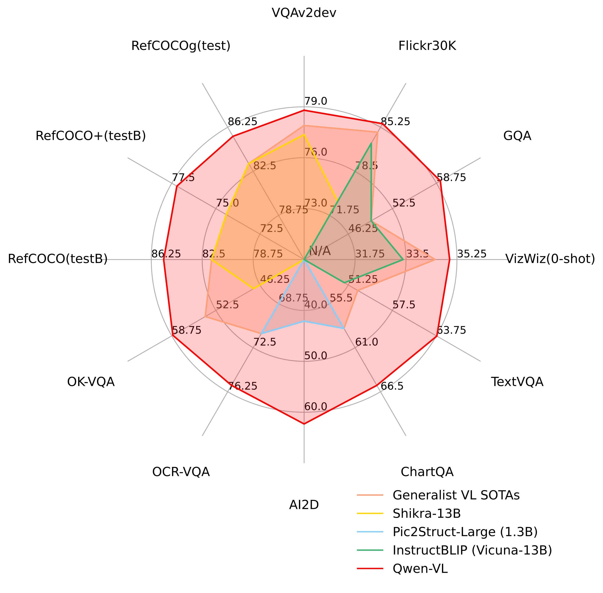
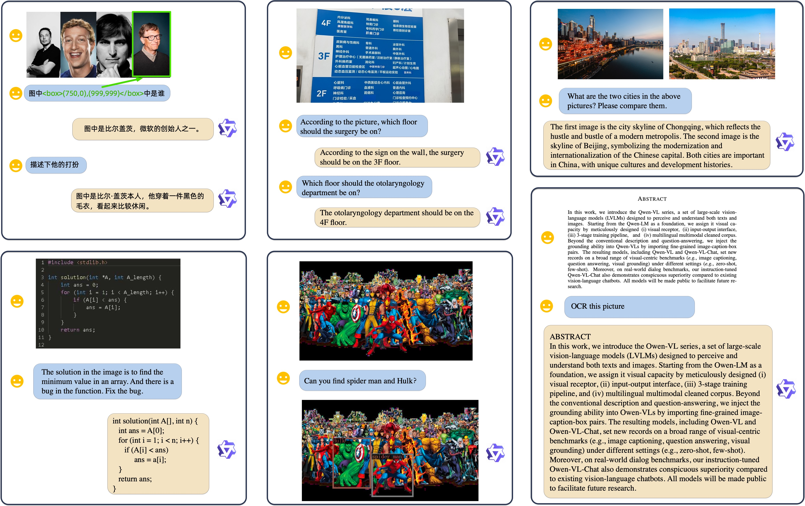
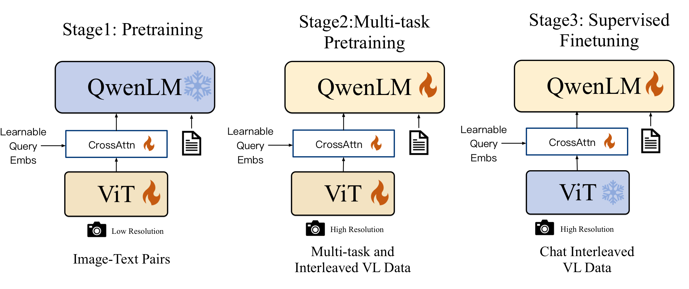
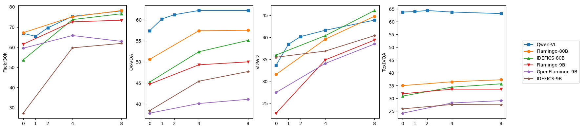
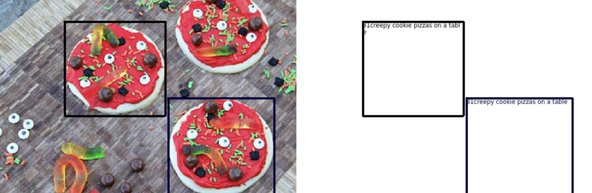
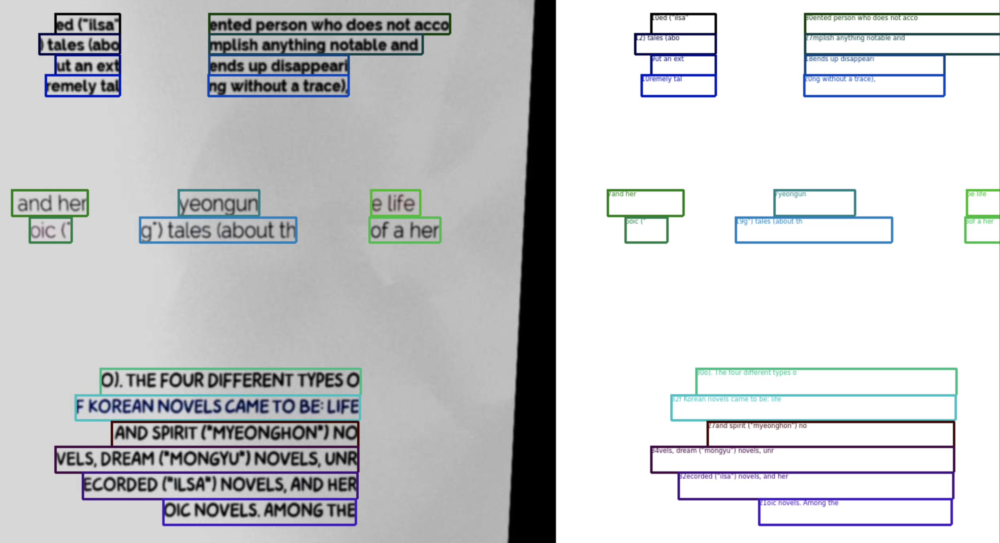
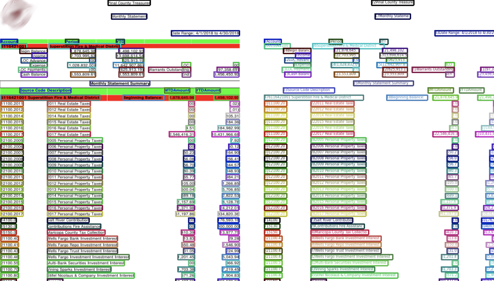
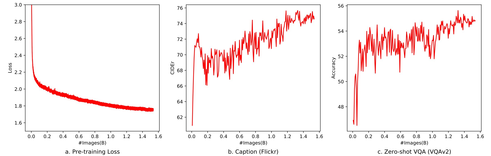
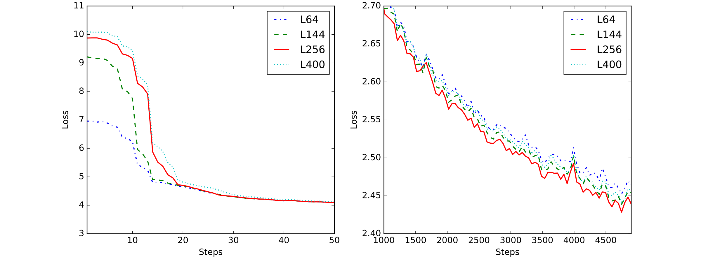
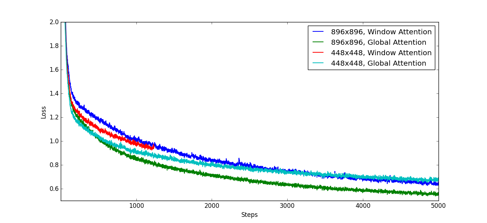

# Abstract

In this work, we introduce the Qwen-VL series, a set of large-scale vision-language models (LVLMs) designed to perceive and understand both texts and images. Starting from Qwen-LM as a foundation, we endow it with visual capacity through four ingredients: `(i)` a visual receptor, `(ii)` an input-output interface, `(iii)` a 3-stage training pipeline, and `(iv)` a multilingual multimodal cleaned corpus. Beyond conventional image description and question answering, we implement the grounding and text-reading ability of Qwen-VLs by aligning image-caption-box tuples. The resulting models, including Qwen-VL and Qwen-VL-Chat, set new records for generalist models under similar model scales on a broad range of visual-centric benchmarks, including image captioning, question answering, and visual grounding, in both zero-shot and few-shot settings. Moreover, on real-world dialog benchmarks, the instruction-tuned Qwen-VL-Chat also demonstrates superiority over existing vision-language chatbots. All models are public to facilitate future research.


Qwen-VL achieves state-of-the-art performance on a broad range of tasks compared with other generalist models.


**Figure 2.** **Some qualitative examples generated by Qwen-VL-Chat.** Qwen-VL-Chat supports multiple image inputs, multi-round dialogue, multilingual conversation, text reading, localization, and fine-grained recognition and understanding.

# Introduction

Recently, Large Language Models (LLMs) have attracted wide attention due to their powerful capabilities in text generation and comprehension. These models can be further aligned with user intent through instruction tuning, showcasing strong interactive capabilities and the potential to enhance productivity as intelligent assistants. However, native large language models only live in the pure-text world, lacking the ability to handle other common modalities such as images, speech, and videos, which greatly restricts their application scope. Motivated by this, a group of Large Vision Language Models (LVLMs) have been developed to enhance large language models with the ability to perceive and understand visual signals. These large-scale vision-language models demonstrate promising potential in solving real-world vision-centric problems.

Nevertheless, although many works have explored the limitations and potential of LVLMs, current open-source LVLMs still suffer from inadequate training and optimization and thus lag far behind proprietary models, which hinders further exploration and application in the open-source community. Moreover, because real-world visual scenarios are complicated, fine-grained visual understanding plays a crucial role if LVLMs are to assist people effectively and precisely. Yet only a few attempts have been made toward this direction, and the majority of open-source LVLMs still perceive images in a coarse-grained manner, lacking the ability to execute fine-grained perception such as object grounding or text reading.

In this paper, we present the newest members of the open-sourced Qwen family: the Qwen-VL series. Qwen-VLs are highly performant and versatile vision-language foundation models based on the Qwen-7B language model. We empower the LLM backbone with visual capacity by introducing a new visual receptor that includes a language-aligned visual encoder and a position-aware adapter. The overall model architecture and the input-output interface are intentionally concise, and we design a 3-stage training pipeline to optimize the whole model on a vast collection of image-text corpora.

Our pre-trained checkpoint, termed Qwen-VL, is capable of perceiving and understanding visual inputs, generating desired responses according to given prompts, and accomplishing various vision-language tasks such as image captioning, question answering, text-oriented question answering, and visual grounding. Qwen-VL-Chat is the instruction-tuned vision-language chatbot based on Qwen-VL. As shown in Figure 2, Qwen-VL-Chat is able to interact with users and perceive the input images following the intention of users.

Specifically, the features of the Qwen-VL series models include:

- Leading performance: Qwen-VLs achieve top-tier accuracy on a wide range of vision-centric understanding benchmarks compared with counterparts of similar scale. This strong performance covers not only conventional benchmarks such as captioning, question answering, and grounding, but also recently introduced dialogue benchmarks.

- Multi-lingual: Similar to Qwen-LM, Qwen-VLs are trained upon multilingual image-text data with a considerable amount of corpus being in English and Chinese. In this way, Qwen-VLs naturally support English, Chinese, and multilingual instructions.

- Multi-image: In the training phase, we allow arbitrary interleaved image-text data as Qwen-VL’s inputs. This feature allows our Qwen-Chat-VL to compare, understand, and analyze the context when multiple images are given.

- Fine-grained visual understanding: Thanks to the higher-resolution input size and fine-grained corpus we used in training, Qwen-VLs exhibit highly competitive fine-grained visual understanding ability. Compared to existing vision-language generalists, our Qwen-VLs possess much better grounding, text-reading, text-oriented question answering, and fine-grained dialog performance.

# Methodology

## Model Architecture

The overall network architecture of Qwen-VL consists of three components, and the details of model parameters are shown in Table 1:

**Large Language Model**: Qwen-VL adopts a large language model as its foundation component. The model is initialized with pre-trained weights from Qwen-7B.

**Visual Encoder**: The visual encoder of Qwen-VL uses the Vision Transformer (ViT) architecture, initialized with pre-trained weights from OpenCLIP's ViT-bigG. During both training and inference, input images are resized to a specific resolution. The visual encoder processes images by splitting them into patches with a stride of 14, generating a set of image features.

**Position-aware Vision-Language Adapter**: To alleviate the efficiency issues arising from long image feature sequences, Qwen-VL introduces a vision-language adapter that compresses the image features. This adapter comprises a single-layer cross-attention module initialized randomly. The module uses a group of trainable vectors (embeddings) as query vectors and the image features from the visual encoder as keys for cross-attention operations. This mechanism compresses the visual feature sequence to a fixed length of 256. The ablation about the number of queries is shown in Appendix `11.2`. Additionally, considering the significance of positional information for fine-grained image comprehension, 2D absolute positional encodings are incorporated into the cross-attention mechanism's query-key pairs to mitigate the potential loss of positional details during compression. The compressed image feature sequence of length 256 is subsequently fed into the large language model.

<a id="tab:model_parameter"></a>
**Table 1.** **Details of Qwen-VL model parameters.**

| Vision Encoder | VL Adapter | LLM | Total |
| --- | --- | --- | --- |
| 1.9B | 0.08B | 7.7B | 9.6B |


**Figure 3.** **The training pipeline of the Qwen-VL series.**

## Inputs and Outputs

**Image Input**: Images are processed through the visual encoder and adapter, yielding fixed-length sequences of image features. To differentiate image feature input from text feature input, two special tokens, `` and `</img>`, are appended to the beginning and end of the image feature sequence, respectively, signifying the start and end of image content.

**Bounding Box Input and Output**: To enhance the model's capacity for fine-grained visual understanding and grounding, Qwen-VL is trained with data in the form of region descriptions, questions, and detections. Unlike conventional tasks involving only image-text descriptions or questions, this setting requires the model to accurately understand and generate region descriptions in a designated format. For any given bounding box, a normalization process is applied within the range `[0, 1000)`, and the box is transformed into a string of the form `(X_top left, Y_top left), (X_bottom right, Y_bottom right)`. The string is tokenized as text and does not require an additional positional vocabulary. To distinguish detection strings from regular text strings, two special tokens, `<box>` and `</box>`, are added at the beginning and end of the bounding box string. Additionally, to associate bounding boxes with their corresponding descriptive words or sentences, another set of special tokens, `<ref>` and `</ref>`, is introduced to mark the referred content.

# Training

As illustrated in Figure 3, the training process of the Qwen-VL model consists of three stages: two stages of pre-training and a final stage of instruction fine-tuning training.

## Pre-training

In the first stage of pre-training, we mainly utilize a large-scale, weakly labeled, web-crawled set of image-text pairs. Our pre-training dataset is composed of several publicly accessible sources and some in-house data. We made an effort to clean the dataset of certain patterns. As summarized in Table 2, the original dataset contains a total of 5 billion image-text pairs, and after cleaning, 1.4 billion data remain, with 77.3% English (text) data and 22.7% Chinese (text) data.

<a id="tab:pretraining_data"></a>
**Table 2.** **Details of Qwen-VL pre-training data.** LAION-en and LAION-zh are the English and Chinese language subsets of LAION-5B. LAION-COCO is a synthetic dataset generated from LAION-en. DataComp and Coyo are collections of image-text pairs. CC12M, CC3M, SBU, and COCO Caption are academic caption datasets.

| Language | Dataset | Original | Cleaned | Remaining % |
| --- | --- | --- | --- | --- |
| English | LAION-en | 2B | 280M | 14% |
| English | LAION-COCO | 600M | 300M | 50% |
| English | DataComp | 1.4B | 300M | 21% |
| English | Coyo | 700M | 200M | 28% |
| English | CC12M | 12M | 8M | 66% |
| English | CC3M | 3M | 3M | 100% |
| English | SBU | 1M | 0.8M | 80% |
| English | COCO Caption | 0.6M | 0.6M | 100% |
| Chinese | LAION-zh | 108M | 105M | 97% |
| Chinese | In-house Data | 220M | 220M | 100% |
|  | Total | 5B | 1.4B | 28% |

We freeze the large language model and only optimize the vision encoder and VL adapter in this stage. The input images are resized to `224 x 224`. The training objective is to minimize the cross-entropy of the text tokens. The maximum learning rate is `2e-4`, and the training process uses a batch size of 30720 for image-text pairs. The entire first stage of pre-training lasts for 50,000 steps, consuming approximately 1.5 billion image-text samples. More hyperparameters are detailed in the Hyperparameters appendix, and the convergence curve of this stage is shown in Figure 6.

## Multi-task Pre-training

In the second stage of multi-task pre-training, we introduce high-quality and fine-grained vision-language annotation data with a larger input resolution and interleaved image-text data. As summarized in Table 3, we train Qwen-VL on 7 tasks simultaneously. For text generation, we use an in-house collected corpus to maintain the LLM's ability. Captioning data follow Table 2 but use far fewer samples and exclude LAION-COCO. We use a mixture of publicly available datasets for the VQA task, including GQA, VGQA, VQAv2, DVQA, OCR-VQA, and DocVQA. We follow Kosmos-2 in using the GRIT dataset for the grounding task with minor modifications. For the reference grounding and grounded captioning duality tasks, we construct training samples from GRIT, Visual Genome, RefCOCO, RefCOCO+, and RefCOCOg. To improve text-oriented tasks, we collect PDF and HTML-format data from Common Crawl[^1] and generate synthetic OCR data in English and Chinese with natural scenery backgrounds. Finally, we construct interleaved image-text data by packing same-task samples into sequences of length 2048.

<a id="tab:multitask_data"></a>
**Table 3.** **Details of Qwen-VL multi-task pre-training data.**

| Task | # Samples | Dataset |
| --- | --- | --- |
| Captioning | 19.7M | LAION-en and zh, DataComp, Coyo, CC12M and CC3M, SBU, COCO, In-house Data |
| VQA | 3.6M | GQA, VGQA, VQAv2, DVQA, OCR-VQA, DocVQA, TextVQA, ChartQA, AI2D |
| Grounding | 3.5M | GRIT |
| Ref Grounding | 8.7M | GRIT, Visual Genome, RefCOCO, RefCOCO+, RefCOCOg |
| Grounded Cap. | 8.7M | GRIT, Visual Genome, RefCOCO, RefCOCO+, RefCOCOg |
| OCR | 24.8M | SynthDoG-en and zh, Common Crawl PDF and HTML |
| Pure-text Autoregression | 7.8M | In-house Data |

Note: in the source, the `Grounding` task denotes generating noun- or phrase-grounded captions following the GRIT/Kosmos-2 setup.

We increase the input resolution of the visual encoder from `224 x 224` to `448 x 448`, reducing the information loss caused by image down-sampling. We also ablate window attention and global attention for higher-resolution vision transformers in the additional experimental details appendix. In this stage, we unlock the large language model and train the whole model. The training objective is the same as in the first pre-training stage.

## Supervised Fine-tuning

During this stage, we finetune the Qwen-VL pre-trained model through instruction tuning to enhance its instruction-following and dialogue capabilities, resulting in the interactive Qwen-VL-Chat model. The multimodal instruction-tuning data primarily come from caption data or dialogue data generated through LLM self-instruction, which often address only single-image dialogue and reasoning and remain limited to image-content comprehension. We therefore construct an additional set of dialogue data through manual annotation, model generation, and strategy concatenation to incorporate localization and multi-image comprehension abilities into Qwen-VL. We confirm that the model effectively transfers these capabilities to a wider range of languages and question types. Additionally, we mix multimodal and pure-text dialogue data during training to ensure the model's general dialogue capability. The instruction-tuning data amount to 350k samples. In this stage, we freeze the visual encoder and optimize the language model and adapter module. A representative data format for this stage is shown below.

# Evaluation

In this section, we conduct an overall evaluation on various multi-modal tasks to comprehensively assess our models’ visual understanding ability. In the following, Qwen-VL denotes the model after the multi-task training, and Qwen-VL-Chat denotes the model after supervised fine-tuning (SFT) stage.

Table 23 provides a detailed summary of the used evaluation benchmarks and corresponding metrics.

## Image Caption and General Visual Question Answering

Image caption and general visual question answering (VQA) are two conventional tasks for vision-language models. Specifically, image caption requires the model to generate a description for a given image and general VQA requires the model to generate an answer for a given image-question pair.

<a id="tab:caption_vqa"></a>
**Table 17.** **Results on Image Captioning and General VQA.**

| Model Type | Model | Nocaps (0-shot) | Flickr30K (0-shot) | VQAv2 | OKVQA | GQA | SciQA-Img (0-shot) | VizWiz (0-shot) |
| --- | --- | --- | --- | --- | --- | --- | --- | --- |
| Generalist Models | Flamingo-9B | - | 61.5 | 51.8 | 44.7 | - | - | 28.8 |
| Generalist Models | Flamingo-80B | - | 67.2 | 56.3 | 50.6 | - | - | 31.6 |
| Generalist Models | Unified-IO-XL | 100.0 | - | 77.9 | 54.0 | - | - | - |
| Generalist Models | Kosmos-1 | - | 67.1 | 51.0 | - | - | - | 29.2 |
| Generalist Models | Kosmos-2 | - | 80.5 | 51.1 | - | - | - | - |
| Generalist Models | BLIP-2 (Vicuna-13B) | 103.9 | 71.6 | 65.0 | 45.9 | 32.3 | 61.0 | 19.6 |
| Generalist Models | InstructBLIP (Vicuna-13B) | **121.9** | 82.8 | - | - | 49.5 | 63.1 | 33.4 |
| Generalist Models | Shikra (Vicuna-13B) | - | 73.9 | 77.36 | 47.16 | - | - | - |
| Generalist Models | **Qwen-VL (Qwen-7B)** | 121.4 | **85.8** | **79.5** | **58.6** | **59.3** | 67.1 | 35.2 |
| Generalist Models | **Qwen-VL-Chat** | 120.2 | 81.0 | 78.2 | 56.6 | 57.5 | **68.2** | **38.9** |
| Specialist SOTAs | - | 127.0 (PALI-17B) | 84.5 (InstructBLIP-FlanT5-XL) | 86.1 (PALI-X-55B) | 66.1 (PALI-X-55B) | 72.1 (CFR) | 92.53 (LLaVA + GPT-4) | 70.9 (PALI-X-55B) |

For the image caption task, we choose Nocaps and Flickr30K as benchmarks and report CIDEr score as the metric. We use greedy search for caption generation with the prompt *"Describe the image in English:"*.

For general VQA, we use five benchmarks: VQAv2, OKVQA, GQA, ScienceQA (Image Set), and VizWiz VQA. For VQAv2, OKVQA, GQA, and VizWiz VQA, we employ open-ended answer generation with greedy decoding and the prompt *"{question} Answer:"*, without any constraint on the model's output space. However, for ScienceQA, we constrain the model's output to the candidate options, choose the option with the highest confidence as the model prediction, and report Top-1 accuracy.

The overall performance on image caption and general VQA tasks are reported in Table 17. As the results shown, our Qwen-VL and Qwen-VL-Chat both achieve obviously better results compared to previous generalist models in terms of both two tasks. Specifically, on zero-shot image caption task, Qwen-VL achieves state-of-the-art performance (*i.e*., 85.8 CIDEr score) on the Flickr30K karpathy-test split, even outperforms previous generalist models with much more parameters (*e.g*., Flamingo-80B with 80B parameters).

On general VQA benchmarks, our models also exhibit distinct advantages compared to others. On VQAv2, OKVQA and GQA benchmarks, Qwen-VL achieves 79.5, 58.6 and 59.3 accuracy respectively, which surpasses recent proposed LVLMs by a large margin. It’s worth noting that Qwen-VL also shows strong zero-shot performance on ScienceQA and VizWiz datasets.

## Text-oriented Visual Question Answering

Text-oriented visual understanding has a broad application prospect in real-world scenarios. We assess our models’ ability toward text-oriented visual question answering on several benchmarks including TextVQA , DocVQA , ChartQA , AI2Diagram , and OCR-VQA . Similarly, the results are shown in Table 19. Compared to previous generalist models and recent LVLMs, our models show better performance on most benchmarks, frequently by a large margin.

<a id="tab:text_vqa"></a>
**Table 19.** **Results on Text-oriented VQA.**

| Model Type | Model | TextVQA | DocVQA | ChartQA | AI2D | OCR-VQA |
| --- | --- | --- | --- | --- | --- | --- |
| Generalist Models | BLIP-2 (Vicuna-13B) | 42.4 | - | - | - | - |
| Generalist Models | InstructBLIP (Vicuna-13B) | 50.7 | - | - | - | - |
| Generalist Models | mPLUG-DocOwl (LLaMA-7B) | 52.6 | 62.2 | 57.4 | - | - |
| Generalist Models | Pix2Struct-Large (1.3B) | - | **76.6** | 58.6 | 42.1 | 71.3 |
| Generalist Models | **Qwen-VL (Qwen-7B)** | **63.8** | 65.1 | 65.7 | **62.3** | **75.7** |
| Generalist Models | **Qwen-VL-Chat** | 61.5 | 62.6 | **66.3** | 57.7 | 70.5 |
| Specialist SOTAs | PALI-X-55B (single-task finetuning, without OCR pipeline) | 71.44 | 80.0 | 70.0 | 81.2 | 75.0 |

## Refer Expression Comprehension

We show our models’ fine-grained image understanding and localization ability by evaluating on a sort of refer expression comprehension benchmarks such as RefCOCO , RefCOCOg , RefCOCO+  and GRIT . Specifically, the refer expression comprehension task requires the model to localize the target object under the guidance of a description. The results are shown in Table 20. Compared to previous generalist models or recent LVLMs, our models obtain top-tier results on all benchmarks.

<a id="tab:grounding"></a>
**Table 20.** **Results on Referring Expression Comprehension task.**

| Model Type | Model | RefCOCO val | test-A | test-B | RefCOCO+ val | test-A | test-B | RefCOCOg val | test | GRIT refexp |
| --- | --- | --- | --- | --- | --- | --- | --- | --- | --- | --- |
| Generalist Models | GPV-2 | - | - | - | - | - | - | - | - | 51.50 |
| Generalist Models | OFA-L* | 79.96 | 83.67 | 76.39 | 68.29 | 76.00 | 61.75 | 67.57 | 67.58 | 61.70 |
| Generalist Models | Unified-IO | - | - | - | - | - | - | - | - | **78.61** |
| Generalist Models | VisionLLM-H |  | 86.70 | - | - | - | - | - | - | - |
| Generalist Models | Shikra-7B | 87.01 | 90.61 | 80.24 | 81.60 | 87.36 | 72.12 | 82.27 | 82.19 | 69.34 |
| Generalist Models | Shikra-13B | 87.83 | 91.11 | 81.81 | 82.89 | 87.79 | 74.41 | 82.64 | 83.16 | 69.03 |
| Generalist Models | **Qwen-VL-7B** | **89.36** | 92.26 | **85.34** | **83.12** | 88.25 | **77.21** | 85.58 | 85.48 | 78.22 |
| Generalist Models | **Qwen-VL-7B-Chat** | 88.55 | **92.27** | 84.51 | 82.82 | **88.59** | 76.79 | **85.96** | **86.32** | - |
| Specialist SOTAs | G-DINO-L | 90.56 | 93.19 | 88.24 | 82.75 | 88.95 | 75.92 | 86.13 | 87.02 | - |
| Specialist SOTAs | UNINEXT-H | 92.64 | 94.33 | 91.46 | 85.24 | 89.63 | 79.79 | 88.73 | 89.37 | - |
| Specialist SOTAs | ONE-PEACE | 92.58 | 94.18 | 89.26 | 88.77 | 92.21 | 83.23 | 89.22 | 89.27 | - |

## Few-shot Learning on Vision-Language Tasks

Our model also exhibits satisfactory in-context learning (*a.k.a.*, few-shot learning) ability. As shown in Figure 4, Qwen-VL achieves better performance through in-context few-shot learning on OKVQA , Vizwiz , TextVQA , and Flickr30k  when compared with models with similar number of parameters (Flamingo-9B, OpenFlamingo-9B and IDEFICS-9B). Qwen-VL’s performance is even comparable with much larger models (Flamingo-80B and IDEFICS-80B). Note that we adopt naïve random sample to construct the few-shot exemplars, sophisticated few-shot exemplar construction methods such as RICES  are not used despite better results would be achieved.


**Figure 4.** **Few-shot learning results of Qwen-VL in comparison with other models.**

## Instruction Following in Real-world User Behavior

In addition to previous conventional vision-language evaluations, to evaluate our Qwen-VL-Chat model’s capacity under real-world user behavior, we further conduct the evaluations on the TouchStone , SEED-Bench , and MME . TouchStone is an open-ended vision-language instruction-following benchmark. We compare the instruction-following ability of Qwen-VL-Chat with other instruction-tuned LVLMs in both English and Chinese on the TouchStone benchmark. SEED-Bench consists of 19K multiple-choice questions with accurate human annotations for evaluating Multimodal LLMs, covering 12 evaluation dimensions including both the spatial and temporal understanding. MME measures both perception and cognition abilities on a total of 14 subtasks.

The results on three benchmarks are shown in Table 21. Qwen-VL-Chat has achieved obvious advantages over other LVLMs on all three datasets, indicating that our model performs better in understanding and answering diverse user instructions. In SEED-Bench, we have found that our model’s visual capabilities can be effectively transferred to video tasks by simply sampling four frames. In terms of the overall scores presented in TouchStone, our model demonstrates a clear advantage compared to other LVLMs, especially in terms of its Chinese capabilities. In terms of the broad categories of abilities, our model exhibits a more pronounced advantage in understanding and recognition, particularly in areas such as text recognition and chart analysis. For more detailed information, please refer to the TouchStone dataset.

<a id="tab:intruction_following"></a>
**Table 21.** **Results on Instruction-following benchmarks.**

| Model | TouchStone En | TouchStone Cn | SEED-Bench All | Img | Video | MME Perception | MME Cognition |
| --- | --- | --- | --- | --- | --- | --- | --- |
| VisualGLM | - | 247.1 | - | - | - | 705.31 | 181.79 |
| PandaGPT | 488.5 | - | - | - | - | 642.59 | 228.57 |
| MiniGPT4 | 531.7 | - | 42.8 | 47.4 | 29.9 | 581.67 | 144.29 |
| InstructBLIP | 552.4 | - | 53.4 | 58.8 | 38.1 | 1212.82 | 291.79 |
| LLaMA-AdapterV2 | 590.1 | - | 32.7 | 35.2 | 25.8 | 972.67 | 248.93 |
| LLaVA | 602.7 | - | 33.5 | 37.0 | 23.8 | 502.82 | 214.64 |
| mPLUG-Owl | 605.4 | - | 34.0 | 37.9 | 23.0 | 967.34 | 276.07 |
| **Qwen-VL** | - | - | 56.3 | 62.3 | **39.1** | - | - |
| **Qwen-VL-Chat** | **645.2** | **401.2** | **58.2** | **65.4** | 37.8 | **1487.58** | **360.71** |

# Related Work

In recent years, researchers have shown considerable interest in vision-language learning , especially in the development of multi-task generalist models . CoCa  proposes an encoder-decoder structure to address image-text retrieval and vision-language generation tasks simultaneously. OFA  transforms specific vision-language tasks into sequence-to-sequence tasks using customized task instructions. Unified I/O  further introduces more tasks like segmentation and depth estimation into a unified framework. Another category of research focuses on building vision-language representation models . CLIP  leverages contrastive learning and large amounts of data to align images and language in a semantic space, resulting in strong generalization capabilities across a wide range of downstream tasks. BEIT-3  employs a mixture-of-experts (MOE) structure and unified masked token prediction objective, achieving state-of-the-art results on various visual-language tasks. In addition to vision-language learning, ImageBind  and ONE-PEACE  align more modalities such as speech into a unified semantic space, thus creating more general representation models.

Despite achieving significant progress, previous vision-language models still have several limitations such as poor robustness in instruction following, limited generalization capabilities in unseen tasks, and a lack of in-context abilities. With the rapid development of large language models (LLMs) , researchers have started building more powerful large vision-language models (LVLMs) based on LLMs . BLIP-2  proposes Q-Former to align the frozen vision foundation models and LLMs. Meanwhile, LLAVA  and Mini-GPT4  introduce visual instruction tuning to enhance instruction following capabilities in LVLMs. Additionally, mPLUG-DocOwl  incorporates document understanding capabilities into LVLMs by introducing digital documents data. Kosmos2 , Shikra , and BuboGPT  further enhance LVLMs with visual grounding abilities, enabling region description and localization. In this work, we integrate image captioning, visual question answering, OCR, document understanding, and visual grounding capabilities into Qwen-VL. The resulting model achieves outstanding performance on these diverse style tasks.

# Conclusion and Future Work

We release the Qwen-VL series, a set of large-scale multilingual vision-language models that aims to facilitate multimodal research. Qwen-VL outperforms similar models across various benchmarks, supporting multilingual conversations, multi-image interleaved conversations, grounding in Chinese, and fine-grained recognition. Moving forward, we are dedicated to further enhancing Qwen-VL’s capabilities in several key dimensions:

- Integrating Qwen-VL with more modalities, such as speech and video.

- Augmenting Qwen-VL by scaling up the model size, training data and higher resolution, enabling it to handle more complex and intricate relationships within multimodal data.

- Expanding Qwen-VL’s prowess in multi-modal generation, specifically in generating high-fidelity images and fluent speech.

# Dataset details

## Image-text pairs

We use web-crawled image-text pairs dataset for pre-training, which includes LAION-en , LAION-zh , LAION-COCO , DataComp  and Coyo . We clean these noisy data by several steps:

1.  Removing pairs with too large aspect ratio of the image

2.  Removing pairs with too small image

3.  Removing pairs with a harsh CLIP score (dataset-specific)

4.  Removing pairs with text containing non-English or non-Chinese characters

5.  Removing pairs with text containing emoji characters

6.  Removing pairs with text length too short or too long

7.  Cleaning the text’s HTML-tagged part

8.  Cleaning the text with certain unregular patterns

For academic caption datasets, we remove pairs whose text contains the special tags in CC12M  and SBU . If there is more than one text matching the same image, we select the longest one.

## VQA

For the VQAv2  dataset, we select the answer annotation based on the maximum confidence. For other VQA datasets, we didn’t do anything special.

## Grounding

For the GRIT  dataset, we found that there are many recursive grounding box labels in one caption. We use the greedy algorithm to clean the caption to make sure each image contains the most box labels with no recursive box labels. For other grounding datasets, we simply concatenate the noun/phrase with respective bounding box coordinates.

## OCR

We generated the synthetic OCR dataset using Synthdog. Specifically, we use the COCO train2017 and unlabeled2017 splits as the natural scenery background. Then we selected 41 English fonts and 11 Chinese fonts to generate text. We use the default hyperparameters from Synthdog. We track the generated text locations in the image, convert them to quadrilateral coordinates, and also use these coordinates as training labels. The visualization example is illustrated in the second row of Figure 5.




**Figure 5.** **Visualization of the grounding and OCR data used for training Qwen-VL.**

For all the PDF data we collected, we follow the steps below to pre-process the data using PyMuPDF  to get the rendering results of each page in a PDF file as well as all the text annotations with their bounding boxes.

1.  Extracting all texts and their bounding boxes for each page.

2.  Rendering each page and save them as an image file.

3.  Removing too small image.

4.  Removing images with too many or too few characters.

5.  Removing images containing Unicode characters in the “Latin Extended-A” and “Latin Extended-B” blocks.

6.  Removing images containing Unicode characters in the “Private Use Area (PUA)” block.

For all HTML web pages we collected, we pre-process them in a similar approach to all the PDF data we collected, but we use Puppeteer  instead of PyMuPDF to render these HTML pages and get the ground truth annotation. We follow the steps below to pre-process the data.

1.  Extracting all texts for each webpage.

2.  Rendering each page and save them as an image file.

3.  Removing too small image.

4.  Removing images with too many or too few characters.

5.  Removing images containing Unicode characters in the “Private Use Area (PUA)” block.

# Data Format Details of Training

## Data Format of Multi-Task Pre-training

We visualize the multi-task pre-training data format in the code block below. In the source paper, the black-colored text denotes the prefix sequence without loss and the blue-colored text denotes the ground-truth labels with loss.

<a id="mt_format"></a>
```text
cc3m/01581435.jpg</img> Generate the caption in English: the beautiful flowers for design. <eos>
VG_100K_2/1.jpg</img> Does the bandage have a different color than the wrist band? Answer: No, both the bandage and the wrist band are white. <eos>
ocr_vqa/1.jpg</img> What is the title of this book? Answer: Asi Se Dice!, Volume 2: Workbook And Audio Activities (Glencoe Spanish) (Spanish Edition) <eos>
coyo700m/1.jpg</img> Generate the caption in English with grounding: Beautiful shot of <ref>bees</ref><box>(661,612),(833,812)</box><box>(120,555),(265,770)</box> gathering nectars from <ref>an apricot flower</ref><box>(224,13),(399,313)</box> <eos>
VG_100K_2/3.jpg</img> <ref>the ear on a giraffe</ref><box>(176,106),(232,160)</box> <eos>
VG_100K_2/4.jpg</img> <ref>This</ref><box>(360,542),(476,705)</box> is Yellow cross country ski racing gloves <eos>
synthdog/1.jpg</img> OCR with grounding: <ref>It is managed</ref> <quad>(568,121), (625,131), (624,182), (567,172)</quad> ... <eos>
```
## Data Format of Supervised Fine-tuning

To better accommodate multi-image dialogue and multiple image inputs, we add the string `"Picture id:"` before different images, where `id` corresponds to the order of image input in the dialogue. In terms of dialogue format, we construct the instruction-tuning dataset using the ChatML format, where each interaction is marked with the two special tokens `<im_start>` and `<im_end>` to facilitate dialogue termination.

```text
<im_start>user
Picture 1: vg/VG_100K_2/649.jpg</img> What is the sign in the picture?
<im_end>

<im_start>assistant
The sign is a road closure with an orange rhombus.
<im_end>

<im_start>user
How is the weather in the picture?
<im_end>

<im_start>assistant
The shape of the road closure sign is an orange rhombus.
<im_end>
```
During training, we ensure consistency between prediction and training distributions by supervising only answers and special tokens, rather than role names or question prompts.

# Hyperparameters

We report the detailed training hyperparameter settings of Qwen-VL in Table 22.

<a id="tab:hyperparam"></a>
**Table 22.** **Training hyperparameters of Qwen-VL.**

| Configuration | Pre-training | Multi-task Pre-training | Supervised Fine-tuning |
| --- | --- | --- | --- |
| ViT init. | Open-CLIP-bigG | Qwen-VL 1st-stage | Qwen-VL 2nd-stage |
| LLM init. | Qwen-7B | Qwen-7B | Qwen-VL 2nd-stage |
| VL Adapter init. | random | Qwen-VL 1st-stage | Qwen-VL 2nd-stage |
| Image resolution | `224^2` | `448^2` | `448^2` |
| ViT sequence length | 256 | 1024 | 1024 |
| LLM sequence length | 512 | 2048 | 2048 |
| Learnable query numbers | 256 | 256 | 256 |
| Optimizer | AdamW | AdamW | AdamW |
| Optimizer hyperparameter | `beta1=0.9, beta2=0.98, eps=1e-6` | `beta1=0.9, beta2=0.98, eps=1e-6` | `beta1=0.9, beta2=0.98, eps=1e-6` |
| Peak learning rate | `2e-4` | `5e-5` | `1e-5` |
| Minimum learning rate | `1e-6` | `1e-5` | `1e-6` |
| ViT learning rate decay | 0.95 | 0.95 | 0 |
| ViT Drop path rate | 0 | 0 | 0 |
| Learning rate schedule | cosine decay | cosine decay | cosine decay |
| Weight decay | 0.05 | 0.05 | 0.05 |
| Gradient clip | 1.0 | 1.0 | 1.0 |
| Training steps | 50k | 19k | 8k |
| Warm-up steps | 500 | 400 | 3k |
| Global batch size | 30720 | 4096 | 128 |
| Gradient Acc. | 6 | 8 | 8 |
| Numerical precision | `bfloat16` | `bfloat16` | `bfloat16` |
| Optimizer sharding | yes | yes | yes |
| Activation checkpointing | no | no | no |
| Model parallelism | no | 2 | 2 |
| Pipeline parallelism | no | no | no |

In the first pre-training stage, the model is trained using AdamW with `beta1=0.9`, `beta2=0.98`, and `eps=1e-6`. We use a cosine learning-rate schedule and set the maximum learning rate to `2e-4` and the minimum to `1e-6`, with a linear warm-up of 500 steps. We use a weight decay of `5e-2` and gradient clipping of `1.0`. For the ViT image encoder, we apply a layer-wise learning-rate decay strategy with a decay factor of `0.95`. The training process uses a batch size of 30720 for image-text pairs, and the entire first stage of pre-training lasts for 50,000 steps, consuming approximately 1.5 billion image-text samples and 500 billion image-text tokens.

In the second multi-task training stage, we increase the input resolution of the visual encoder from `224 x 224` to `448 x 448`, reducing the information loss caused by image down-sampling. We unlock the large language model and train the whole model. The training objective is the same as in the pre-training stage. We again use AdamW with `beta1=0.9`, `beta2=0.98`, and `eps=1e-6`. We train for 19,000 steps with 400 warm-up steps and a cosine learning-rate schedule. Specifically, we use model-parallel techniques for both the ViT and the LLM.

# Summary of the evaluation benchmarks

We provide a detailed summary of the used evaluation benchmarks and corresponding metrics in Table 23.

<a id="tab:benchmark"></a>
**Table 23.** **Summary of the evaluation benchmarks.**

| Task | Dataset | Description | Split | Metric |
| --- | --- | --- | --- | --- |
| Image Caption | Nocaps | Captioning of natural images | val | CIDEr (up) |
| Image Caption | Flickr30K | Captioning of natural images | karpathy-test | CIDEr (up) |
| General VQA | VQAv2 | VQA on natural images | test-dev | VQA Score (up) |
| General VQA | OKVQA | VQA on natural images requiring outside knowledge | val | VQA Score (up) |
| General VQA | GQA | VQA on scene understanding and reasoning | test-balanced | EM (up) |
| General VQA | ScienceQA-Img | Multi-choice VQA on a diverse set of science topics | test | Accuracy (up) |
| General VQA | VizWiz | VQA on photos taken by people who are blind | test-dev | VQA Score (up) |
| Text-oriented VQA | TextVQA | VQA on natural images containing text | val | VQA Score (up) |
| Text-oriented VQA | DocVQA | VQA on images of scanned documents | test | ANLS (up) |
| Text-oriented VQA | ChartQA | VQA on images of charts | test | Relaxed EM (up) |
| Text-oriented VQA | OCRVQA | VQA on images of book covers | test | EM (up) |
| Text-oriented VQA | AI2Diagram | VQA on images of scientific diagrams | test | EM (up) |
| Refer Expression Comprehension | RefCOCO | Refer grounding on natural images | val and testA and testB | Accuracy (up) |
| Refer Expression Comprehension | RefCOCO+ | Refer grounding on natural images | val and testA and testB | Accuracy (up) |
| Refer Expression Comprehension | RefCOCOg | Refer grounding on natural images | val and test | Accuracy (up) |
| Refer Expression Comprehension | GRiT | Refer grounding on natural images | test | Accuracy (up) |
| Instruction Following | TouchStone | Open-ended VL instruction-following benchmark | English and Chinese | GPT-4 Score (up) |
| Instruction Following | MME | Open-ended VL benchmark by yes/no questions | Perception and Cognition | Accuracy (up) |
| Instruction Following | Seed-Bench | Open-ended VL benchmark by multi-choice VQA | Image and Video | Accuracy (up) |

# Additional experimental details

## Convergence of the Pre-training Stage

In Figure 6, we show the convergence of the pre-training stage. The whole model is trained using BFloat16 mixed precision, the batch size is 30720, and the learning rate is `2e-4`. All images are trained only once, that is, for one epoch. The training loss decreases steadily as the number of training images increases. Note that the first pre-training stage contains no VQA data, yet the zero-shot VQA score still increases amid fluctuations.


**Figure 6.** **Visualization of the convergence of the pre-training stage.**

## Number of Learnable Queries in the Vision-Language Adapter

The vision-language adapter uses cross-attention to compress the visual feature sequence with a set of learnable queries. Too few queries can lead to the loss of visual information, while too many queries may increase convergence difficulty and computational cost.


**Figure 7.** **Visualization of the training loss when using different compressed feature lengths of the vision-language adapter.** The left depicts the initial training loss within 50 steps, and the right depicts the loss in convergence from 1k to 5k steps. In the legend, `L64` denotes that the adapter uses 64 queries to compress the visual feature sequence to a fixed length of 64, and so on. The loss curves are smoothed to avoid shading caused by fluctuations.

We conduct an ablation experiment on the number of learnable queries in the vision-language adapter. We use ViT-L/14 as the visual encoder and `224 x 224` images as input, so the sequence length of the ViT output is `(224/14)^2 = 256`. As shown in the left part of Figure 7, fewer queries lead to lower initial loss at the beginning of training. However, after convergence, both too many and too few queries slow convergence, as shown in the right part of Figure 7. Because the second training stage uses `448 x 448` resolution, where the ViT output sequence length becomes `(448/14)^2 = 1024`, too few queries would discard more information. We therefore choose 256 queries for the vision-language adapter in Qwen-VL.

## Window Attention vs Global Attention for Vision Transformer

Using a high-resolution Vision Transformer significantly increases computational cost. One possible way to reduce this cost is to use Window Attention in the Vision Transformer, that is, to perform attention only within a `224 x 224` window in most ViT layers and to perform full attention over the `448 x 448` or `896 x 896` image only in a small number of layers, for example 1 out of every 4 layers.

To this end, we conduct ablation experiments comparing Global Attention and Window Attention in the ViT, analyzing the trade-off between computational efficiency and convergence.


**Figure 8.** **Visualization of the loss when using Window Attention vs Global Attention.**

<a id="tab:ablation_attention"></a>
**Table 24.** **Training speed of Window Attention vs Global Attention for different input image resolutions.**

| Model input resolution and attention type | Training speed |
| --- | --- |
| `448x448`, Global Attention | ~10s / iter |
| `448x448`, Window Attention | ~9s / iter |
| `896x896`, Global Attention | ~60s / iter |
| `896x896`, Window Attention | ~25s / iter |

As shown in Figure 8 and Table 24, the model loss is significantly higher when Window Attention is used instead of Vanilla Attention, while the training speeds at `448 x 448` are similar. Therefore, we choose Vanilla Attention rather than Window Attention for the Vision Transformer in Qwen-VL.

We also do not use the `896 x 896` setting because its training speed is too slow in practice. Although it reaches a loss value similar to the `448 x 448` model at 5000 steps, it takes almost 2.5 times longer to train.

## Performance on Pure-text Tasks

In order to study the effect of multi-modal training on pure-text ability, we show the performance of pure-text tasks of Qwen-VL compared to open-source LLM in Table 25.

Qwen-VL uses an intermediate checkpoint of Qwen-7B as the LLM initialization. The reason why we did not use the final released checkpoint of Qwen-7B is that Qwen-VL and Qwen-7B were developed at a very similar period. Because Qwen-VL has a good initialization on LLM by Qwen-7B, it is comparable to many text-only LLMs on pure-text tasks.

<a id="tab:pure_text"></a>
**Table 25.** **Performance on pure-text benchmarks of Qwen-VL compared to open-source LLMs.** Due to the introduction of pure-text data in the multi-task training and SFT stage, Qwen-VL does not compromise pure-text ability.

| Model | MMLU | CMMLU | C-Eval |
| --- | --- | --- | --- |
| LLaMA-7B | 35.1 | 26.8 | - |
| LLaMA2-7B | 46.8 | 31.8 | 32.5 |
| Baichuan-7B | 42.3 | 44.4 | 42.8 |
| Baichuan2-7B | 54.2 | 57.1 | 54.0 |
| ChatGLM2-6B | 47.9 | 48.8 | 51.7 |
| InternLM-7B | 51.0 | 51.8 | 52.8 |
| Qwen-7B (final released) | 58.2 | 62.2 | 63.5 |
| Qwen-7B (intermediate, used as Qwen-VL's LLM initialization) | 49.9 | - | 48.5 |
| Qwen-VL | 50.7 | 49.5 | 51.1 |

Furthermore, in the multi-task training and SFT stages, Qwen-VL not only utilizes visual and language-related data but also incorporates pure-text data for training. The purpose of this is to prevent the catastrophic forgetting of text comprehension by leveraging the information from pure-text data. The results in Table 25 indicate that the Qwen-VL model does not exhibit any degradation in terms of its pure text capability and even demonstrates improvement after multi-task training.

[^1]: <https://digitalcorpora.org/corpora/file-corpora/cc-main-2021-31-pdf-untruncated>

